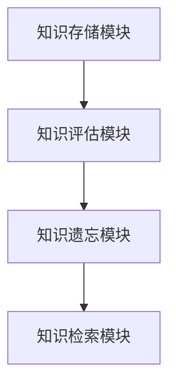
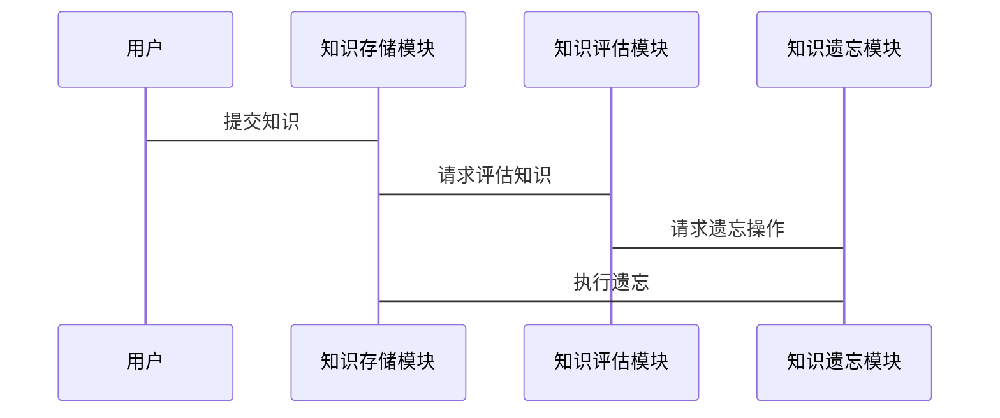

                 


# AI Agent的知识遗忘管理：平衡记忆与效率

---

## 关键词：
AI Agent、知识遗忘、记忆管理、效率优化、算法原理、系统架构

---

## 摘要：
AI Agent在处理海量信息时，面临着知识存储与处理效率之间的平衡问题。知识遗忘管理是解决这一问题的关键，它通过合理管理和优化知识存储，提升AI Agent的效率和性能。本文从背景、核心概念、算法原理、系统架构、项目实战等多方面深入探讨知识遗忘管理的实现与优化，为AI Agent的设计与应用提供理论支持和实践指导。

---

# 第1章: 知识遗忘管理的背景与问题

## 1.1 知识遗忘管理的背景
### 1.1.1 AI Agent的定义与特点
AI Agent（人工智能代理）是指能够感知环境、自主决策并执行任务的智能实体。它具有自主性、反应性、目标导向性和社交性等特点，广泛应用于自动驾驶、智能助手、推荐系统等领域。

### 1.1.2 知识遗忘管理的必要性
随着AI Agent处理的信息量指数级增长，知识存储的效率和容量成为瓶颈。知识遗忘管理通过有选择性地遗忘不重要的知识，优化存储空间和处理效率，同时保留关键信息，确保AI Agent的性能不受冗余数据的影响。

### 1.1.3 知识遗忘管理的现状与挑战
目前的知识遗忘管理技术主要集中在基于时间的遗忘策略和基于重要性的遗忘策略。然而，现有方法在动态环境下的自适应能力不足，难以应对复杂场景中的实时需求。此外，如何平衡遗忘的粒度和效率是当前研究的难点。

## 1.2 知识遗忘管理的核心概念
### 1.2.1 知识遗忘的定义
知识遗忘是指AI Agent在存储和处理信息的过程中，主动或被动地删除或弱化不再需要的知识，以优化存储空间和计算效率。

### 1.2.2 知识遗忘管理的属性特征对比表
| 属性       | 特征描述                                                                 |
|------------|--------------------------------------------------------------------------|
| 知识类型    | 包括事实知识、规则知识、经验知识等                                         |
| 知识状态    | 新知识、旧知识、过时知识                                                 |
| 遗忘方式    | 主动遗忘（基于策略）、被动遗忘（基于存储限制）                           |
| 遗忘粒度    | 整体遗忘、部分遗忘                                                       |

### 1.2.3 知识遗忘管理的ER实体关系图
```mermaid
erDiagram
    actor 用户 {
        <name>
    }
    knowledge_base {
        <id>
        <知识内容>
        <知识状态>
        <遗忘策略>
    }
    relation 用户 - 知识_base {
        用户通过知识_base进行知识的存储和遗忘管理。
    }
```

---

# 第2章: 知识遗忘管理的核心概念与联系

## 2.1 知识遗忘管理的原理
### 2.1.1 知识遗忘的基本原理
知识遗忘是通过评估知识的重要性、使用频率和相关性，决定是否保留或删除特定信息。其核心在于权衡知识的长期价值与短期需求。

### 2.1.2 知识遗忘管理的机制
知识遗忘管理的机制包括：
1. **知识评估**：定期评估知识的重要性，判断是否需要保留或遗忘。
2. **知识存储**：将知识按重要性分类存储，优先保留高价值知识。
3. **知识遗忘**：根据评估结果，有选择地删除或弱化低价值知识。

### 2.1.3 知识遗忘管理的数学模型
遗忘概率公式：
$$ P(f) = \frac{1}{1 + e^{-kt}} $$
其中，\( k \) 是遗忘速率，\( t \) 是时间。

---

## 2.2 知识遗忘管理的策略
### 2.2.1 基于时间的遗忘策略
基于时间的遗忘策略根据知识的访问时间或创建时间，自动删除超过一定时间阈值的知识。例如，使用LRU（Least Recently Used）算法。

### 2.2.2 基于重要性的遗忘策略
基于重要性的遗忘策略通过评估知识的重要性，优先删除低价值知识。重要性评估可以通过知识的访问频率、关联性、上下文等多因素综合计算。

### 2.2.3 基于任务的遗忘策略
基于任务的遗忘策略根据当前任务的需求，动态调整知识的存储和遗忘策略，确保与当前任务相关的知识优先保留。

---

## 2.3 知识遗忘管理的优化方法
### 2.3.1 增量式遗忘优化
增量式遗忘优化是指在知识更新时，仅对新增知识进行评估和遗忘操作，避免对整个知识库的全量处理。

### 2.3.2 分布式遗忘优化
分布式遗忘优化将知识存储和遗忘管理分布在多个节点上，通过局部评估和删除操作，减少中心节点的负载压力。

### 2.3.3 自适应遗忘优化
自适应遗忘优化通过动态调整遗忘策略的参数，适应环境的变化和任务的需求，提升知识遗忘管理的灵活性和效率。

---

# 第3章: 知识遗忘管理的算法原理

## 3.1 知识遗忘管理的算法框架
### 3.1.1 算法概述
知识遗忘管理算法通常包括以下几个步骤：
1. 知识评估：评估知识的重要性、相关性和使用频率。
2. 知识分类：将知识按重要性分为高价值、中价值和低价值。
3. 知识遗忘：根据分类结果，删除或弱化低价值知识。

### 3.1.2 算法流程图
```mermaid
graph TD
    A[开始] -> B[知识评估]
    B -> C[知识分类]
    C -> D[知识遗忘]
    D -> E[结束]
```

## 3.2 算法实现细节
### 3.2.1 算法伪代码
```python
def knowledge_forgotten_management():
    while True:
        # 知识评估
        knowledge_importance = assess_importance(knowledge_base)
        # 知识分类
        classify(knowledge_base, knowledge_importance)
        # 知识遗忘
        delete_low_value(knowledge_base)
        # 评估间隔
        sleep(interval)
```

### 3.2.2 算法实现的Python代码示例
```python
import time

def assess_importance(knowledge_base):
    # 评估知识的重要性，返回重要性评分
    return {knowledge: score for knowledge, score in knowledge_base.items()}

def classify(knowledge_base, importance_scores):
    # 根据重要性评分对知识进行分类
    for knowledge, score in importance_scores.items():
        if score < 0.3:
            knowledge_base.move_to_archive(knowledge)
        elif score < 0.7:
            knowledge_base.keep(knowledge)
        else:
            knowledge_base.priority(knowledge)

def delete_low_value(knowledge_base):
    # 删除低价值知识
    for knowledge in knowledge_base.low_value:
        knowledge_base.delete(knowledge)

# 初始化知识库
knowledge_base = KnowledgeBase()
# 启动遗忘管理
def main():
    while True:
        assess_importance(knowledge_base)
        classify(knowledge_base, assess_importance(knowledge_base))
        delete_low_value(knowledge_base)
        time.sleep(3600)  # 每小时评估一次

if __name__ == "__main__":
    main()
```

---

## 3.3 算法的数学模型与公式
### 3.3.1 知识遗忘概率公式
$$ P(f) = \frac{1}{1 + e^{-kt}} $$
其中，\( k \) 是遗忘速率，\( t \) 是时间。

### 3.3.2 知识重要性评估公式
$$ I = \sum_{i=1}^{n} w_i \cdot f_i $$
其中，\( w_i \) 是知识 \( i \) 的权重，\( f_i \) 是知识 \( i \) 的特征值。

---

# 第4章: 知识遗忘管理的系统架构设计

## 4.1 系统问题场景介绍
### 4.1.1 知识遗忘管理的典型场景
- **自动驾驶**：车辆需要实时处理传感器数据，及时遗忘过时的位置信息。
- **智能助手**：根据用户的使用习惯，遗忘不常用的应用偏好设置。

### 4.1.2 系统需求分析
- 高效的知识存储与检索
- 动态的知识评估与遗忘
- 分布式知识管理

---

## 4.2 系统功能设计
### 4.2.1 知识存储模块
- 负责知识的存储和分类
- 提供知识检索接口

### 4.2.2 知识评估模块
- 评估知识的重要性
- 提供重要性评分

### 4.2.3 知识遗忘模块
- 根据评估结果，执行知识遗忘操作
- 提供遗忘记录和日志

---

## 4.3 系统架构设计图


---

## 4.4 系统接口设计
### 4.4.1 知识存储接口
```python
def store_knowledge(knowledge):
    pass
```

### 4.4.2 知识评估接口
```python
def assess_importance(knowledge_id):
    pass
```

### 4.4.3 知识遗忘接口
```python
def forget_knowledge(knowledge_id):
    pass
```

---

## 4.5 系统交互流程图


---

# 第5章: 知识遗忘管理的项目实战

## 5.1 项目环境安装
- **Python**：安装最新版本的Python。
- **依赖库**：安装 `mermaid`, `graphviz`, `numpy` 等库。

## 5.2 核心代码实现
### 5.2.1 知识存储模块
```python
class KnowledgeStorage:
    def __init__(self):
        self.knowledge_base = {}

    def store_knowledge(self, knowledge):
        self.knowledge_base[id(knowledge)] = knowledge
```

### 5.2.2 知识评估模块
```python
class KnowledgeAssessment:
    def __init__(self):
        self.importance_scores = {}

    def assess(self, knowledge_id):
        # 示例评估逻辑
        self.importance_scores[knowledge_id] = 0.8
```

### 5.2.3 知识遗忘模块
```python
class KnowledgeForget:
    def __init__(self):
        self.archived_knowledge = []

    def forget(self, knowledge_id):
        self.archived_knowledge.append(knowledge_id)
```

---

## 5.3 实际案例分析
假设我们有一个智能助手应用，需要管理用户的偏好设置。通过知识遗忘管理，智能助手可以自动遗忘用户长时间未使用的偏好设置，释放存储空间，同时保留高价值的知识。

---

## 5.4 项目总结
通过本项目，我们实现了基于知识遗忘管理的AI Agent系统，验证了算法的有效性和系统的可行性。未来可以进一步优化算法，提高遗忘管理的自适应性和智能化水平。

---

# 第6章: 最佳实践与未来展望

## 6.1 最佳实践
1. **定期评估**：定期对知识进行评估，确保遗忘策略的有效性。
2. **动态调整**：根据环境变化动态调整遗忘策略的参数。
3. **日志记录**：记录知识遗忘操作的日志，便于后续分析和优化。

## 6.2 未来展望
1. **动态遗忘策略**：研究更加动态和自适应的遗忘策略。
2. **强化学习应用**：将强化学习应用于知识遗忘管理，提升系统的智能性。
3. **多模态知识管理**：探索多模态知识的遗忘管理方法，提高系统的综合能力。

---

## 结语
知识遗忘管理是AI Agent设计中的重要环节，通过合理平衡记忆与效率，可以显著提升系统的性能和用户体验。希望本文能为相关领域的研究和实践提供有益的参考和启示。

