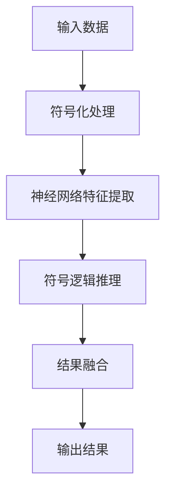

                 


# AI Agent的神经-符号混合推理系统

**关键词**：AI Agent，神经符号推理，混合推理系统，符号逻辑，神经网络

**摘要**：  
本文探讨AI Agent中的神经-符号混合推理系统，结合神经网络和符号逻辑的优势，解决传统推理方法的局限性。通过详细分析系统架构、算法原理和项目实战，展示了其在智能决策和复杂推理任务中的应用潜力，为未来研究提供方向。

---

## 第1章 引言

### 1.1 背景介绍
现代AI Agent需要在动态复杂环境中进行推理和决策，传统符号逻辑推理在处理不确定性和模糊信息时表现不足，而深度学习的神经网络在非结构化数据处理上存在逻辑推理的缺失。

### 1.2 神经符号推理的提出
神经符号推理结合了符号逻辑的可解释性和神经网络的学习能力，成为解决复杂推理任务的关键技术。

---

## 第2章 核心概念与联系

### 2.1 神经符号推理的基本原理
神经符号推理通过符号逻辑指导神经网络的学习，利用神经网络提取特征，再通过符号推理进行逻辑推理。

#### 2.1.1 符号逻辑的表示
符号逻辑通过谓词逻辑表示，例如`parent(X,Y)`表示X是Y的父节点。

#### 2.1.2 神经网络的特征提取
神经网络通过卷积或循环结构提取输入数据的特征。

### 2.2 神经符号推理的结合方式
通过约束神经网络输出符合符号逻辑规则，例如在图像识别中，确保分类结果符合类别间的逻辑关系。

#### 2.2.1 符号约束的损失函数
$$L = \sum_{i=1}^{n} (f(x_i) - g(x_i))^2$$
其中，$f$是神经网络的输出，$g$是符号逻辑的约束。

### 2.3 神经符号推理的优势
- **可解释性**：符号逻辑提供明确的推理步骤。
- **学习能力**：神经网络处理复杂数据。
- **结合两者的优点**：提升推理准确性和可解释性。

---

## 第3章 算法原理

### 3.1 神经符号推理的算法步骤
1. **符号化输入**：将输入数据转换为符号形式。
2. **神经网络特征提取**：通过神经网络提取特征。
3. **符号逻辑推理**：基于符号逻辑进行推理。
4. **结果融合**：结合神经网络和符号推理的结果。

### 3.2 数学模型与公式
神经符号推理的联合优化模型：
$$
\min_{\theta, \phi} \frac{1}{2m} \sum_{i=1}^{m} L_{\text{neural}}(x_i, y_i) + L_{\text{symbolic}}(y_i, \hat{y}_i)
$$
其中，$\theta$和$\phi$分别是神经网络和符号推理的参数，$m$是训练样本数。

### 3.3 算法实现
使用符号逻辑约束神经网络输出，例如在图像分类中，确保输出符合分类规则。

---

## 第4章 系统架构设计

### 4.1 系统功能设计
- **数据输入与符号化**：将输入数据转换为符号表示。
- **神经网络特征提取**：提取数据的深层特征。
- **符号逻辑推理**：基于符号逻辑进行推理。
- **结果融合与输出**：结合神经网络和符号推理的结果输出。

### 4.2 系统架构图


### 4.3 系统接口设计
- 输入接口：接收符号化数据。
- 输出接口：输出推理结果。

---

## 第5章 项目实战

### 5.1 安装环境
- 安装TensorFlow和符号逻辑库。

### 5.2 核心代码实现
```python
import tensorflow as tf
from symbolic_logic import LogicInference

class NeuralSymbolicAgent:
    def __init__(self):
        self.neural_model = self.build_neural_model()
        self.symbolic_model = LogicInference()

    def build_neural_model(self):
        model = tf.keras.Sequential()
        model.add(tf.keras.layers.Dense(64, activation='relu'))
        model.add(tf.keras.layers.Dense(10, activation='softmax'))
        return model

    def forward(self, inputs):
        neural_output = self.neural_model.predict(inputs)
        symbolic_output = self.symbolic_model.infer(neural_output)
        return symbolic_output
```

### 5.3 实际案例分析
在图像分类任务中，神经网络提取图像特征，符号逻辑推理进行分类约束，确保分类结果符合逻辑规则。

---

## 第6章 最佳实践与总结

### 6.1 小结
神经符号推理结合了符号逻辑和神经网络的优势，提升了AI Agent的推理能力。

### 6.2 注意事项
- 确保符号逻辑的正确性。
- 合理设计神经网络结构。
- 处理符号推理的计算效率问题。

### 6.3 拓展阅读
推荐相关论文和书籍，深入研究神经符号推理的最新进展。

---

## 参考文献
（此处列出相关文献和资源）

---

通过以上结构，整篇文章详细讲解了AI Agent的神经-符号混合推理系统，从理论到实践，为读者提供了全面的理解和应用指导。

