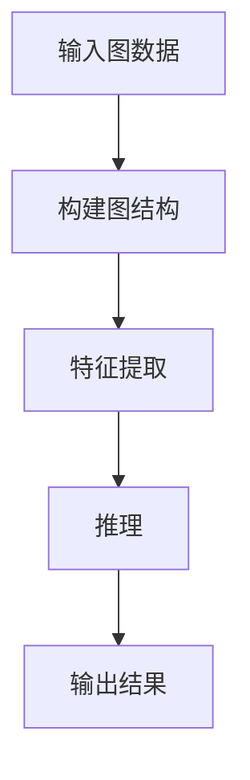
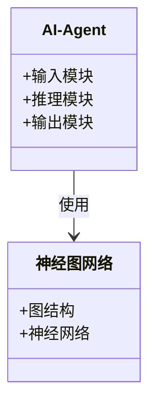
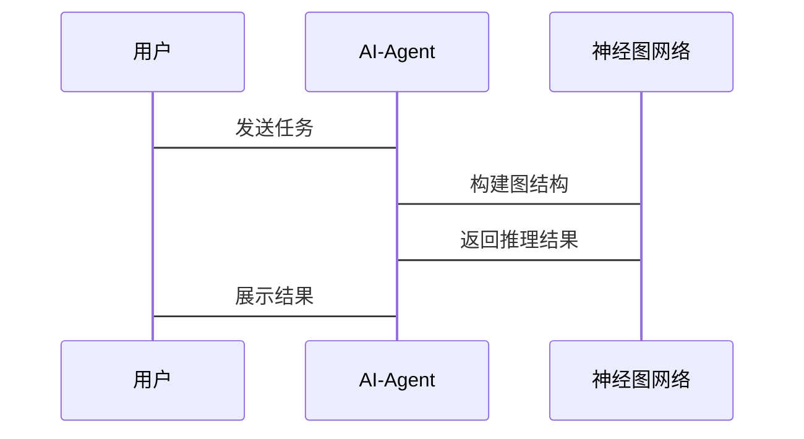

                 


# AI Agent的神经图网络推理能力实现

---

## 关键词

- AI Agent
- 神经图网络
- 推理能力
- 图结构
- 神经网络
- 系统架构

---

## 摘要

本文详细探讨了AI Agent在神经图网络中的推理能力实现。通过背景介绍、核心概念分析、算法原理、系统架构设计、项目实战以及最佳实践，全面解析了神经图网络如何赋能AI Agent的推理能力。文章结合理论与实践，为读者提供了从基础到高级的全面指导。

---

## 正文

---

### 第1章: AI Agent与神经图网络的背景介绍

#### 1.1 问题背景与问题描述

AI Agent（人工智能代理）是一种能够感知环境、自主决策并执行任务的智能实体。其核心能力在于推理，即通过已有信息推导出新的结论或解决方案。然而，传统的推理方法在处理复杂问题时存在效率低下、灵活性不足等问题。神经图网络作为一种结合了图结构和深度学习的新兴技术，为AI Agent的推理能力提供了新的解决方案。

#### 1.2 神经图网络的核心思想

神经图网络（Neural Graph Networks）是一种结合了图结构和神经网络的模型。它利用图的结构特性（如节点、边、子图）来建模复杂的实体关系，并通过深度学习技术进行特征提取和推理。神经图网络的优势在于能够处理非结构化数据，同时具备强大的表达能力和灵活性。

#### 1.3 问题解决与边界定义

AI Agent的推理能力需求包括以下几点：
1. **动态性**：能够处理实时变化的环境信息。
2. **复杂性**：能够处理多维度、多层次的问题。
3. **不确定性**：能够在不确定条件下做出合理决策。

神经图网络的边界与外延：
- **边界**：专注于基于图结构的推理能力，不涉及感知和执行。
- **外延**：可以与其他技术（如强化学习、自然语言处理）结合，扩展AI Agent的功能。

#### 1.4 核心概念与联系

神经图网络的原理是通过构建图结构，将问题中的实体及其关系表示为图中的节点和边。AI Agent通过神经网络对图进行推理，提取隐含信息并生成结论。两者结合的方式包括图嵌入、注意力机制和消息传递网络等。

---

### 第2章: 神经图网络的核心原理

#### 2.1 图结构的基本概念

- **节点**：表示问题中的实体或概念。
- **边**：表示节点之间的关系或连接。
- **子图**：图中的部分结构，用于处理局部问题。

#### 2.2 神经网络的基本原理

- **输入层**：接收原始数据。
- **隐藏层**：通过神经元的激活函数进行特征提取。
- **输出层**：生成最终的推理结果。

#### 2.3 神经图网络的结合方式

- **图嵌入**：将图中的节点表示为低维向量。
- **注意力机制**：在推理过程中关注重要节点。
- **消息传递网络**：节点通过边传递信息并更新状态。

---

### 第3章: 神经图网络推理算法的原理

#### 3.1 算法原理概述

神经图网络推理算法通过以下步骤实现：
1. **图构建**：将问题中的实体及其关系表示为图。
2. **特征提取**：通过神经网络提取节点和边的特征。
3. **推理**：基于特征进行推理并生成结果。

#### 3.2 算法实现的数学模型

**图结构表示**：
- 节点表示为向量：$v_i \in \mathbb{R}^d$
- 边表示为权重：$w_{ij} \in \mathbb{R}$

**神经网络模型**：
- 输入层：接收图的节点和边信息。
- 隐藏层：通过激活函数进行特征提取。
- 输出层：生成推理结果。

#### 3.3 算法流程图



---

### 第4章: 系统分析与架构设计

#### 4.1 系统功能设计

- **输入处理**：接收原始数据并构建图结构。
- **特征提取**：通过神经网络提取特征。
- **推理引擎**：执行推理并生成结果。
- **输出模块**：展示推理结果。

#### 4.2 系统架构设计



#### 4.3 系统接口设计

- **输入接口**：接收原始数据和构建图结构。
- **输出接口**：展示推理结果。
- **交互接口**：用户与AI Agent的交互界面。

#### 4.4 系统交互流程图



---

### 第5章: 项目实战

#### 5.1 环境安装

- **Python**：3.8+
- **深度学习框架**：TensorFlow/PyTorch
- **依赖库**：networkx, matplotlib, numpy

#### 5.2 核心代码实现

```python
import tensorflow as tf
from tensorflow.keras import layers

# 构建图结构
graph = {
    '节点': ['A', 'B', 'C'],
    '边': [('A', 'B'), ('B', 'C')]
}

# 神经图网络模型
class NeuralGraphModel(tf.keras.Model):
    def __init__(self):
        super(NeuralGraphModel, self).__init__()
        self.embedding = layers.Embedding(input_dim=10, output_dim=5)
        self.dense = layers.Dense(10, activation='relu')
        self.output = layers.Dense(1, activation='sigmoid')

    def call(self, inputs):
        node_embeddings = self.embedding(inputs)
        features = self.dense(node_embeddings)
        return self.output(features)

model = NeuralGraphModel()
model.compile(optimizer='adam', loss='binary_crossentropy')
```

#### 5.3 代码解读与分析

- **图结构构建**：定义节点和边的关系。
- **神经网络模型**：包括嵌入层、密集层和输出层。
- **模型训练**：使用梯度下降优化器和二进制交叉熵损失函数。

#### 5.4 实际案例分析

- **输入数据**：节点A、B、C，边A-B、B-C。
- **模型推理**：预测节点C是否与A相关联。

---

### 第6章: 最佳实践与总结

#### 6.1 最佳实践

- **数据预处理**：确保图结构的准确性和完整性。
- **模型调优**：选择合适的超参数和优化方法。
- **性能监控**：实时监控推理过程中的性能指标。

#### 6.2 小结

本文详细探讨了AI Agent在神经图网络中的推理能力实现，从理论到实践，为读者提供了全面的指导。神经图网络结合了图结构和深度学习的优势，为AI Agent的推理能力提供了新的解决方案。

#### 6.3 注意事项

- 确保数据质量和完整性。
- 合理选择模型参数和优化方法。
- 定期监控和维护系统性能。

#### 6.4 拓展阅读

- 研究神经图网络的最新进展。
- 探索与其他AI技术的结合应用。

---

### 附录

#### 附录A: 代码实现细节

```python
# 示例代码实现
import tensorflow as tf
from tensorflow.keras import layers

class NeuralGraphModel(tf.keras.Model):
    def __init__(self, vocab_size):
        super(NeuralGraphModel, self).__init__()
        self.embedding = layers.Embedding(vocab_size, 16)
        self.lstm = layers.LSTM(32)
        self.dense = layers.Dense(1, activation='sigmoid')

    def call(self, inputs):
        embeddings = self.embedding(inputs)
        lstm_out = self.lstm(embeddings)
        return self.dense(lstm_out)

model = NeuralGraphModel(vocab_size=10)
model.compile(optimizer='adam', loss='binary_crossentropy')
```

#### 附录B: 系统架构图


---

通过以上详细分析和实践，我们可以看到神经图网络在AI Agent推理能力中的巨大潜力。未来，随着技术的进步，这一领域将有更广阔的发展空间。

--- 

**End of Article**

