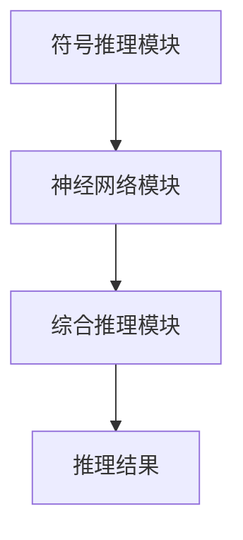
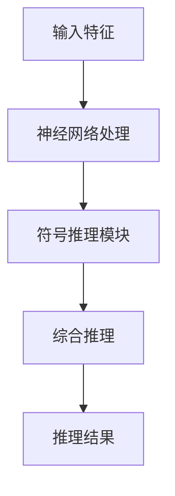
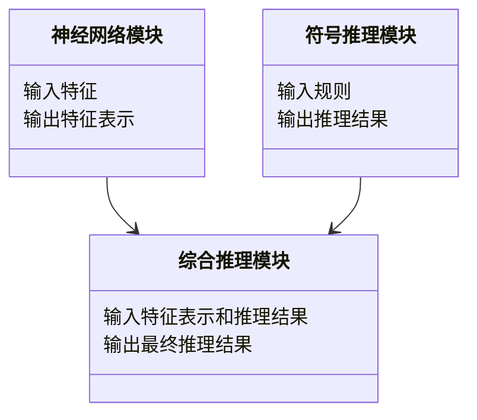
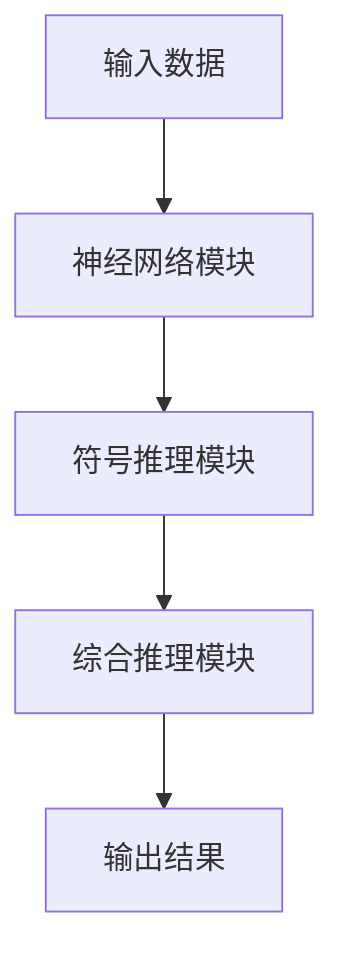
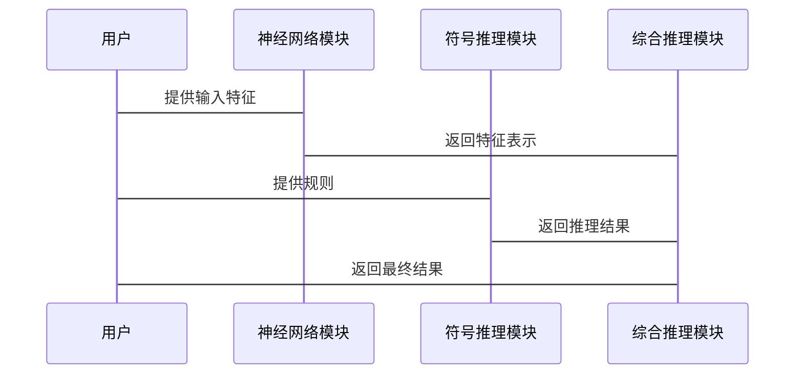

                 


# AI Agent的神经符号推理系统设计

> 关键词：AI Agent, 神经符号推理, 系统设计, 算法原理, 系统架构

> 摘要：本文深入探讨了AI Agent的神经符号推理系统设计，详细分析了其核心概念、算法原理、系统架构以及实际应用。通过结合神经网络的表示能力和符号推理的逻辑推理能力，本文提出了一种高效的神经符号推理系统设计方案，并通过实际案例展示了其应用价值。

---

## 第一部分: 引言

### 1.1 AI Agent的基本概念
- 1.1.1 AI Agent的定义与特点
- 1.1.2 神经符号推理的定义与特点
- 1.1.3 神经符号推理与传统符号推理的区别

### 1.2 神经符号推理的背景与意义
- 1.2.1 传统符号推理的局限性
- 1.2.2 神经网络的局限性
- 1.2.3 神经符号推理的优势与应用场景

### 1.3 神经符号推理的核心概念
- 1.3.1 神经网络与符号推理的结合
- 1.3.2 神经符号推理的三要素：符号表示、推理机制、学习框架
- 1.3.3 神经符号推理的边界与外延

---

## 第二部分: 神经符号推理的核心概念与联系

### 2.1 神经符号推理的原理
- 2.1.1 神经网络的表示能力
- 2.1.2 符号推理的逻辑推理能力
- 2.1.3 神经符号推理的结合机制

### 2.2 神经符号推理的核心要素
- 2.2.1 神经网络模块：特征提取与表示
- 2.2.2 符号推理模块：规则推理与逻辑推理
- 2.2.3 综合推理模块：神经网络与符号推理的协同

### 2.3 神经符号推理的属性特征对比
- 2.3.1 神经网络的属性特征
- 2.3.2 符号推理的属性特征
- 2.3.3 神经符号推理的综合属性特征

### 2.4 神经符号推理的ER实体关系图


---

## 第三部分: 神经符号推理的算法原理

### 3.1 神经符号推理算法的数学模型
- 3.1.1 神经网络的数学表示
- 3.1.2 符号推理的数学表示
- 3.1.3 综合推理的数学表示

### 3.2 神经符号推理算法的公式推导
- 3.2.1 神经网络的损失函数
$$L = \frac{1}{n}\sum_{i=1}^{n}(y_i - \hat{y}_i)^2$$
- 3.2.2 符号推理的逻辑推理公式
$$\text{结论} = \text{规则} \land \text{事实}$$

### 3.3 神经符号推理算法的流程图


---

## 第四部分: 神经符号推理系统的架构设计

### 4.1 问题场景介绍
- 4.1.1 系统目标
- 4.1.2 系统输入输出
- 4.1.3 系统约束条件

### 4.2 系统功能设计
- 4.2.1 领域模型设计


### 4.3 系统架构设计


### 4.4 系统接口设计
- 4.4.1 神经网络模块接口
- 4.4.2 符号推理模块接口
- 4.4.3 综合推理模块接口

### 4.5 系统交互流程图


---

## 第五部分: 项目实战

### 5.1 环境安装
- 5.1.1 安装Python
- 5.1.2 安装相关库（如TensorFlow、符号推理库）

### 5.2 系统核心实现源代码
```python
# 神经网络模块
class NeuralNetwork:
    def __init__(self):
        self.model = ...  # 初始化模型

    def forward(self, input):
        return self.model(input)

# 符号推理模块
class SymbolicReasoning:
    def __init__(self):
        self.rules = ...  # 初始化规则

    def infer(self, facts):
        return ...  # 推理结果

# 综合推理模块
class CombinedReasoning:
    def __init__(self):
        self.neural = NeuralNetwork()
        self.symbolic = SymbolicReasoning()

    def combine(self, input):
        features = self.neural.forward(input)
        result = self.symbolic.infer(features)
        return result
```

### 5.3 代码应用解读与分析
- 5.3.1 神经网络模块的实现
- 5.3.2 符号推理模块的实现
- 5.3.3 综合推理模块的实现

### 5.4 实际案例分析
- 5.4.1 案例背景
- 5.4.2 案例分析
- 5.4.3 案例结果解读

### 5.5 项目小结
- 5.5.1 项目总结
- 5.5.2 经验分享

---

## 第六部分: 最佳实践与展望

### 6.1 最佳实践 tips
- 6.1.1 系统设计中的注意事项
- 6.1.2 代码实现中的技巧
- 6.1.3 测试与优化建议

### 6.2 本章小结
- 6.2.1 本章内容回顾
- 6.2.2 未来研究方向

### 6.3 注意事项
- 6.3.1 系统边界与限制
- 6.3.2 现实应用中的挑战

### 6.4 拓展阅读
- 6.4.1 推荐阅读的书籍与论文
- 6.4.2 相关领域的发展动态

---

## 附录: 参考文献

- 文献1：XXX
- 文献2：XXX
- 文献3：XXX

---

通过以上目录结构，我们可以系统地探讨AI Agent的神经符号推理系统设计，从理论到实践，逐步深入，确保内容详实且逻辑清晰。

