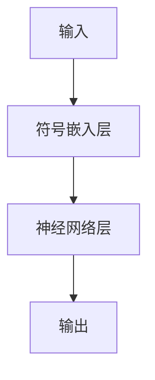
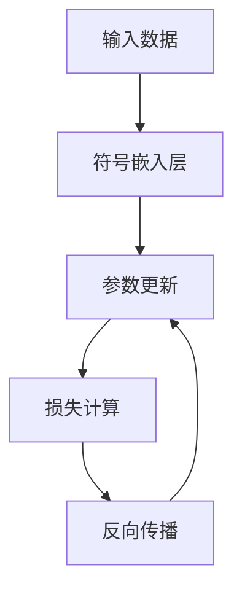
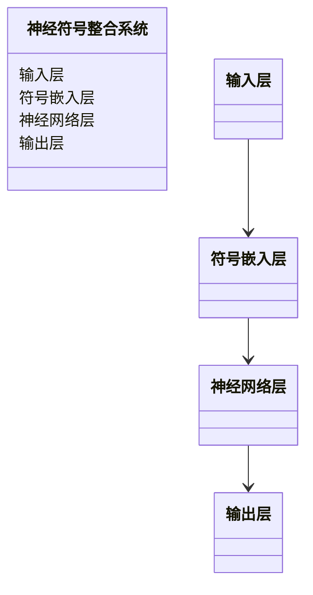

                 


# AI Agent的神经符号整合学习方法

> 关键词：神经符号整合、AI Agent、符号推理、神经网络、机器学习

> 摘要：神经符号整合学习方法结合了神经网络的强大表征能力和符号推理的可解释性与逻辑推理能力，为AI Agent提供了一种更高效、更智能的学习方式。本文将从背景介绍、核心概念、算法原理、系统架构、项目实战等方面，全面解析神经符号整合学习方法的实现与应用。

---

## 第一部分: 神经符号整合学习的背景与概念

### 第1章: 神经符号整合学习的背景

#### 1.1 问题背景
AI Agent需要在复杂环境中进行感知、决策和行动，传统方法在处理需要符号推理和神经网络结合的任务时显得力不从心。神经符号整合学习通过结合神经网络的非线性表达能力和符号推理的逻辑推理能力，为AI Agent提供了一种更高效、更智能的学习方式。

#### 1.2 核心概念
- **符号推理**：基于逻辑规则的推理方法，具有可解释性强、推理能力强的特点。
- **神经网络**：强大的非线性表达能力，能够处理复杂的模式识别任务。
- **神经符号整合**：将符号推理与神经网络结合，互补各自的优缺点。

#### 1.3 神经符号整合的必要性
- 神经网络在处理符号推理任务时缺乏可解释性和逻辑推理能力。
- 符号推理在处理复杂感知任务时缺乏灵活性和鲁棒性。
- 神经符号整合能够结合两者的优点，提升AI Agent的智能水平。

### 第2章: AI Agent的基本概念

#### 2.1 AI Agent的定义
AI Agent是一种智能实体，能够感知环境、自主决策并执行任务，具有自主性、反应性、目标导向性和社会性等特点。

#### 2.2 AI Agent的应用场景
- 智能助手：如 Siri、Alexa 等，能够执行语音交互、信息查询等任务。
- 智能机器人：在制造业、物流等领域，AI Agent可以执行复杂的操作。
- 自动驾驶：通过感知环境、决策和执行任务，实现自动驾驶功能。

#### 2.3 神经符号整合在AI Agent中的作用
- 提供强大的感知能力，通过神经网络处理多模态数据。
- 提供高效的推理能力，通过符号推理进行逻辑推理。
- 提供可解释的决策过程，结合神经网络和符号推理的优势。

---

## 第二部分: 神经符号整合学习的核心概念

### 第3章: 符号表示与神经网络的结合

#### 3.1 符号表示的基本形式
- **符号表示**：使用符号（如谓词逻辑）表示知识和规则，具有明确的语义和逻辑结构。
- **符号函数**：将符号知识嵌入到神经网络中，作为神经网络的输入或约束条件。
- **符号增强**：通过符号知识增强神经网络的表达能力，提升模型的推理能力。

#### 3.2 神经网络的符号增强
- **符号嵌入**：将符号知识嵌入到神经网络中，如将规则转化为权重或神经元的激活条件。
- **符号驱动的神经网络**：通过符号知识驱动神经网络的推理过程，如符号驱动的注意力机制。
- **符号与神经网络的交互**：神经网络和符号推理模块之间的交互，如符号推理模块为神经网络提供推理结果，神经网络为符号推理模块提供感知信息。

#### 3.3 符号与神经网络的交互机制
- **符号驱动神经网络**：符号推理模块生成符号表达式，作为神经网络的输入。
- **神经驱动符号推理**：神经网络提取特征，符号推理模块基于特征进行推理。
- **双向交互**：神经网络和符号推理模块之间互相传递信息，实现协同推理。

### 第4章: 神经符号模型的优缺点

#### 4.1 神经符号模型的优缺点对比

| **特性**          | **符号推理**         | **神经网络**         | **神经符号整合**      |
|--------------------|---------------------|---------------------|-----------------------|
| **可解释性**       | 高                  | 低                  | 中高                 |
| **推理能力**       | 强                  | 弱                  | 强                   |
| **表达能力**       | 有限                | 强大                | 结合两者，表达能力强 |
| **计算效率**       | 高                  | 低                  | 取决于实现方式        |
| **灵活性**          | 低                  | 高                  | 高                   |

#### 4.2 神经符号模型的优势
- **高效性**：结合神经网络的高效计算能力和符号推理的推理能力，实现高效的推理和决策。
- **可解释性**：符号推理部分提供了明确的推理步骤，使得模型的决策过程更加透明。
- **灵活性**：能够处理多种类型的数据和任务，适用于复杂的现实场景。

#### 4.3 神经符号模型的缺点
- **实现复杂性**：神经符号整合的实现较为复杂，需要结合符号推理和神经网络的知识。
- **计算成本**：神经符号模型的计算成本较高，尤其是在大规模数据处理时。
- **应用场景限制**：在某些特定任务（如纯符号推理任务）中，神经符号模型可能不如传统符号推理或神经网络高效。

---

## 第三部分: 神经符号整合学习的算法原理

### 第5章: 符号增强的神经网络

#### 5.1 符号函数的嵌入
- **符号函数**：将符号知识转化为函数，嵌入到神经网络中，如逻辑约束、规则驱动的激活条件。
- **符号嵌入方法**：将符号知识映射到低维向量空间，作为神经网络的输入或权重。
- **符号增强神经网络的结构**：在神经网络中嵌入符号函数，形成符号增强的神经网络结构。

#### 5.2 神经符号模型的训练流程
1. **符号知识预处理**：将符号知识转化为神经网络可处理的形式，如符号函数、符号向量。
2. **符号增强神经网络构建**：在神经网络中嵌入符号知识，形成符号增强的神经网络。
3. **联合优化**：通过符号和神经网络的联合优化，提升模型的表达能力和推理能力。

#### 5.3 神经符号模型的数学基础
- **符号函数的数学表达**：如逻辑函数、规则函数等。
- **神经网络的损失函数**：如交叉熵损失函数。
- **符号网络的优化目标**：最小化神经网络的损失函数，同时满足符号推理的约束条件。

### 第6章: 神经符号模型的实现

#### 6.1 符号增强的神经网络结构


#### 6.2 符号增强神经网络的训练流程


#### 6.3 神经符号模型的优化
- **符号推理优化**：通过符号推理优化神经网络的权重和激活函数。
- **神经网络优化**：通过神经网络优化符号推理的推理过程和规则。

---

## 第四部分: 神经符号整合学习的系统架构

### 第7章: 神经符号整合系统的架构设计

#### 7.1 系统架构图


#### 7.2 系统功能设计
- **输入处理**：接收多模态输入数据，如图像、文本、语音等。
- **符号嵌入**：将符号知识嵌入到输入数据中，形成符号增强的输入向量。
- **神经网络推理**：通过神经网络对符号增强的输入向量进行处理，生成输出结果。
- **符号推理**：通过符号推理模块对神经网络的输出进行解释和推理，生成最终的决策结果。

#### 7.3 系统接口设计
- **输入接口**：接收多种类型的数据输入，如图像、文本等。
- **符号嵌入接口**：将符号知识嵌入到输入数据中，形成符号增强的输入向量。
- **神经网络接口**：将符号增强的输入向量输入到神经网络中，生成输出结果。
- **符号推理接口**：对神经网络的输出进行符号推理，生成最终的决策结果。

---

## 第五部分: 项目实战

### 第8章: 项目实战

#### 8.1 环境安装
- 安装Python、TensorFlow、Keras等工具。
- 安装符号推理库，如逻辑推理库、规则引擎等。

#### 8.2 系统核心代码实现

```python
import tensorflow as tf
from tensorflow import keras
import numpy as np

# 符号嵌入层
class SymbolEmbeddingLayer(keras.layers.Layer):
    def __init__(self, rule_base):
        super(SymbolEmbeddingLayer, self).__init__()
        self.rule_base = rule_base

    def call(self, inputs):
        # 假设 inputs 是符号表达式
        embedded = self.rule_base.embed(inputs)
        return embedded

# 符号增强的神经网络模型
def build_symbol_enhanced_model():
    inputs = keras.Input(shape=(input_dim,))
    symbol_embedding = SymbolEmbeddingLayer(rule_base)(inputs)
    x = keras.layers.Dense(64, activation='relu')(symbol_embedding)
    outputs = keras.layers.Dense(1, activation='sigmoid')(x)
    model = keras.Model(inputs=inputs, outputs=outputs)
    return model
```

#### 8.3 代码应用解读与分析
- **符号嵌入层**：将符号知识嵌入到输入数据中，形成符号增强的输入向量。
- **神经网络模型**：构建符号增强的神经网络模型，包含符号嵌入层和神经网络层。
- **模型训练**：使用符号增强的神经网络模型进行训练，优化模型的参数，提升模型的表达能力和推理能力。

#### 8.4 案例分析
- **案例场景**：如图像分类任务，结合符号推理规则，提升分类的准确率和可解释性。
- **符号推理规则**：如颜色、形状等规则，嵌入到神经网络中，提升模型的分类能力。
- **结果分析**：通过符号增强的神经网络模型，实现更高的分类准确率和更可解释的分类结果。

#### 8.5 项目总结
- **项目小结**：神经符号整合学习方法能够有效提升AI Agent的智能水平，结合神经网络和符号推理的优势，实现更高效的推理和决策。
- **注意事项**：符号嵌入和神经网络的结合需要仔细设计，确保符号知识的有效性和神经网络的表达能力。

---

## 第六部分: 总结与展望

### 第9章: 总结

#### 9.1 核心内容回顾
- 神经符号整合学习方法结合了神经网络和符号推理的优点，为AI Agent提供了一种更高效、更智能的学习方式。
- 神经符号整合学习方法在符号表示、神经网络嵌入、符号推理等方面进行了深入研究，为AI Agent的应用提供了理论基础和实现方法。

#### 9.2 神经符号整合学习的未来发展方向
- **符号推理的自动化**：通过自动化符号推理，提升神经符号模型的推理能力和效率。
- **神经符号模型的优化**：进一步优化神经符号模型的结构和参数，提升模型的表达能力和计算效率。
- **多模态数据的处理**：研究如何在神经符号模型中处理多模态数据，提升模型的泛化能力和适应性。

### 第10章: 最佳实践 tips

#### 10.1 实践 tips
- 在符号嵌入层中，选择合适的符号嵌入方法，确保符号知识的有效性和可解释性。
- 在神经网络设计中，结合符号推理的规则和约束，优化神经网络的结构和参数。
- 在实际应用中，通过实验验证神经符号整合学习方法的有效性和优势，不断优化模型的性能。

#### 10.2 小结
神经符号整合学习方法为AI Agent提供了一种更高效、更智能的学习方式，结合神经网络的非线性表达能力和符号推理的逻辑推理能力，能够处理复杂任务，提升模型的智能水平和可解释性。

#### 10.3 注意事项
- 符号嵌入和神经网络的结合需要仔细设计，确保符号知识的有效性和神经网络的表达能力。
- 在实际应用中，需要根据具体任务需求，选择合适的符号嵌入方法和神经网络结构，确保模型的高效性和准确性。

#### 10.4 拓展阅读
- 推荐阅读相关的学术论文和书籍，深入理解神经符号整合学习的理论和方法。
- 关注最新的研究进展，了解神经符号整合学习的最新技术和应用。

---

通过以上结构和内容，我们可以全面、深入地了解和掌握AI Agent的神经符号整合学习方法，为实现更智能、更高效的AI系统提供理论基础和实践指导。

