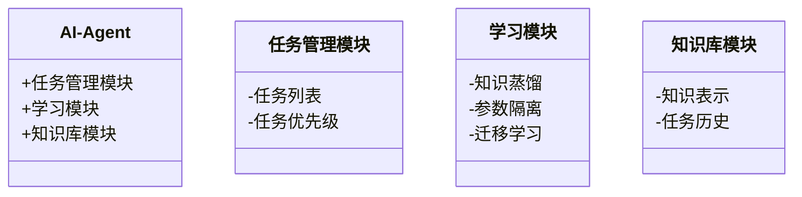
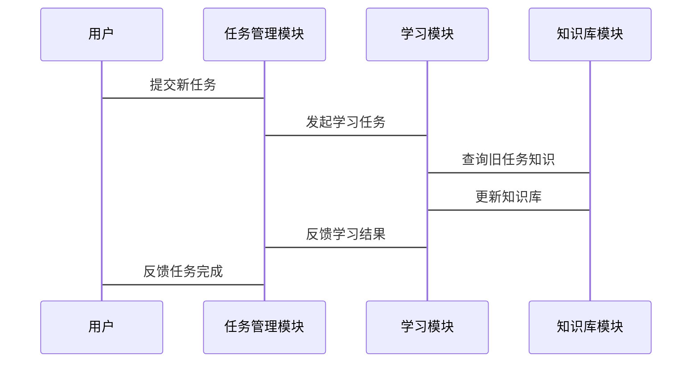
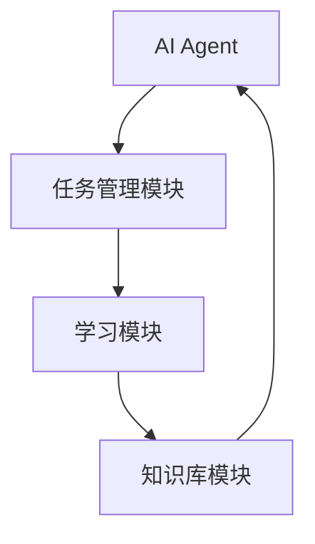

                 


# AI Agent的终身学习与灾难性遗忘防御

> 关键词：AI Agent, 终身学习, 灾难性遗忘, 知识蒸馏, 参数隔离, 迁移学习

> 摘要：本文深入探讨了AI Agent在终身学习过程中面临的灾难性遗忘问题，分析了其产生的原因及影响，并详细介绍了多种防御方法，包括知识蒸馏、弹性权重 consolidation 和迁移学习。通过结合理论与实践，本文为AI Agent的持续进化与优化提供了可行的解决方案。

---

# 第一部分: AI Agent的终身学习与灾难性遗忘概述

## 第1章: AI Agent与终身学习基础

### 1.1 AI Agent的基本概念

#### 1.1.1 什么是AI Agent
AI Agent（人工智能代理）是指能够感知环境、自主决策并执行任务的智能实体。它可以是一个软件程序、机器人或任何具备智能交互能力的系统。

#### 1.1.2 AI Agent的核心特征
- **自主性**：能够自主决策，无需外部干预。
- **反应性**：能够实时感知环境并做出反应。
- **目标导向**：基于目标或任务驱动行为。
- **学习能力**：能够通过经验改进性能。

#### 1.1.3 AI Agent的分类与应用场景
- **简单反射型Agent**：基于规则执行任务，适用于简单场景。
- **基于模型的反射型Agent**：具备内部模型，适用于复杂环境。
- **目标驱动型Agent**：以目标为导向，适用于需要策略规划的任务。
- **实用驱动型Agent**：以效用最大化为目标，适用于多目标优化场景。

应用场景包括自动驾驶、智能助手、机器人服务、推荐系统等。

---

### 1.2 终身学习的定义与重要性

#### 1.2.1 终身学习的定义
终身学习是指AI Agent在动态环境中不断学习新知识、适应新任务的能力，是一种持续优化的机制。

#### 1.2.2 终身学习在AI Agent中的必要性
- **适应性**：应对多样化的任务和环境。
- **持续优化**：通过不断学习提升性能。
- **动态适应**：适应环境的变化和新数据的输入。

#### 1.2.3 终身学习与传统机器学习的区别
- **传统机器学习**：离线训练，固定数据集，模型不更新。
- **终身学习**：在线学习，动态数据输入，模型持续更新。

---

### 1.3 灾难性遗忘的定义与问题背景

#### 1.3.1 灾难性遗忘的定义
灾难性遗忘是指AI Agent在学习新任务时，忘记旧任务所学知识的现象。

#### 1.3.2 灾难性遗忘的产生原因
- **权重干扰**：新任务的学习导致旧任务权重被覆盖。
- **梯度干扰**：新旧任务梯度方向冲突，影响权重更新。

#### 1.3.3 灾难性遗忘的影响与挑战
- **性能下降**：忘记旧任务导致整体性能下降。
- **任务切换成本**：频繁任务切换引发性能波动。
- **持续学习障碍**：灾难性遗忘阻碍AI Agent的终身学习能力。

---

## 第2章: 灾难性遗忘的核心概念与联系

### 2.1 灾难性遗忘的核心原理

#### 2.1.1 神经网络权重更新与知识遗忘的关系
神经网络在更新权重时，若新任务的重要性高于旧任务，旧任务的知识会被稀释或遗忘。

#### 2.1.2 灾难性遗忘的数学模型
灾难性遗忘可以用权重更新公式表示：
$$ W_{new} = W_{old} + \Delta W $$
其中，$\Delta W$ 是新任务带来的权重变化。

#### 2.1.3 灾难性遗忘的度量方法
常用遗忘分数（Forgetting Score）来衡量灾难性遗忘的程度：
$$ F = \frac{1}{N} \sum_{i=1}^{N} (1 - \text{acc}_i) $$
其中，$N$ 是任务数量，$\text{acc}_i$ 是第 $i$ 个任务的准确率。

---

### 2.2 终身学习与灾难性遗忘的关系

#### 2.2.1 终身学习如何影响灾难性遗忘
- **学习顺序**：先学习复杂任务可能抑制后续简单任务的学习。
- **任务相关性**：相关任务的学习更容易导致遗忘。

#### 2.2.2 灾难性遗忘对AI Agent性能的影响
- **任务切换**：频繁切换任务会导致性能波动。
- **长期学习**：灾难性遗忘会影响AI Agent的长期学习效果。

#### 2.2.3 终身学习与灾难性遗忘的平衡点
在终身学习中，平衡新旧任务的学习权重是关键。

---

## 第3章: 灾难性遗忘的防御方法概述

### 3.1 知识蒸馏

#### 3.1.1 知识蒸馏的基本原理
通过教师模型指导学生模型学习，保留旧任务的知识。

#### 3.1.2 知识蒸馏的实现步骤
1. 使用教师模型进行训练。
2. 提取教师模型的知识。
3. 使用学生模型学习教师的知识。

#### 3.1.3 知识蒸馏的优势与局限性
- **优势**：可以保留旧任务的知识。
- **局限性**：依赖教师模型，可能引入额外计算开销。

---

### 3.2 参数空间隔离

#### 3.2.1 参数空间隔离的基本思想
通过参数共享或独立参数空间，避免新任务影响旧任务。

#### 3.2.2 参数空间隔离的实现方法
- **参数共享**：共享部分参数，隔离其他参数。
- **模块化设计**：将模型划分为独立模块，分别处理不同任务。

#### 3.2.3 参数空间隔离的效果分析
- **优点**：有效防止权重干扰。
- **缺点**：可能需要更多参数，增加模型复杂度。

---

### 3.3 迁移学习

#### 3.3.1 迁移学习的定义与原理
通过将旧任务的知识迁移到新任务，减少新任务的学习难度。

#### 3.3.2 迁移学习在灾难性遗忘防御中的应用
- **领域适应**：将旧任务的知识迁移到新任务领域。
- **特征提取**：提取共享特征，减少新任务对旧任务的影响。

#### 3.3.3 迁移学习的优缺点
- **优点**：可以有效利用旧任务的知识。
- **缺点**：需要任务之间具有一定的相似性。

---

## 第4章: 终身学习中的算法原理

### 4.1 知识蒸馏算法

#### 4.1.1 知识蒸馏的算法流程
1. 训练教师模型。
2. 提取教师模型的知识表示。
3. 使用学生模型学习教师知识。

#### 4.1.2 知识蒸馏的数学模型
教师模型的概率输出：
$$ P(y|x) $$
学生模型的目标：
$$ \argmax_y P'(y|x) $$

#### 4.1.3 知识蒸馏的Python实现代码
```python
import torch
import torch.nn as nn

class TeacherModel(nn.Module):
    def __init__(self):
        super(TeacherModel, self).__init__()
        self.fc = nn.Linear(10, 5)

class StudentModel(nn.Module):
    def __init__(self):
        super(StudentModel, self).__init__()
        self.fc = nn.Linear(10, 5)

teacher = TeacherModel()
student = StudentModel()

optimizer = torch.optim.Adam(student.parameters(), lr=0.001)
criterion = nn.KLDivLoss()

for batch_input, batch_target in dataloader:
    teacher_output = teacher(batch_input)
    student_output = student(batch_input)
    
    loss = criterion(student_output, teacher_output)
    optimizer.zero_grad()
    loss.backward()
    optimizer.step()
```

---

### 4.2 Elastic Weight Consolidation (EWC)

#### 4.2.1 EWC算法的基本原理
通过约束权重更新，保护旧任务的知识。

#### 4.2.2 EWC算法的数学模型
权重更新公式：
$$ W_{new} = W_{old} + \Delta W $$
约束条件：
$$ \sum_{i=1}^{N} \lambda_i (W_{old} - W_{new})^2 \leq \epsilon $$
其中，$\lambda_i$ 是任务权重，$\epsilon$ 是约束阈值。

#### 4.2.3 EWC算法的Python实现代码
```python
import torch
import torch.nn as nn

class EWCModel(nn.Module):
    def __init__(self):
        super(EWCModel, self).__init__()
        self.fc = nn.Linear(10, 5)

    def forward(self, x):
        return self.fc(x)

model = EWCModel()
optimizer = torch.optim.Adam(model.parameters(), lr=0.001)
```

---

## 第5章: 系统分析与架构设计方案

### 5.1 系统功能设计

#### 5.1.1 领域模型设计
使用Mermaid类图描述系统功能模块：


---

### 5.2 系统架构设计

#### 5.2.1 系统架构设计
使用Mermaid架构图描述系统架构：
```mermaid
dockerfile
    AI-Agent-System
    ├── 任务管理模块
    ├── 学习模块
    └── 知识库模块
```

---

### 5.3 系统接口设计

#### 5.3.1 接口设计
- **任务管理接口**：接收新任务请求，管理任务优先级。
- **学习模块接口**：执行知识蒸馏、参数隔离等操作。
- **知识库接口**：存储和检索任务知识。

#### 5.3.2 交互流程
使用Mermaid序列图描述系统交互：


---

## 第6章: 项目实战

### 6.1 环境安装

#### 6.1.1 环境需求
- Python 3.8+
- PyTorch 1.9+
- Mermaid工具（用于图表绘制）

#### 6.1.2 安装依赖
```bash
pip install torch
pip install mermaid-js
```

---

### 6.2 系统核心实现源代码

#### 6.2.1 知识蒸馏实现
```python
import torch
import torch.nn as nn

class TeacherModel(nn.Module):
    def __init__(self):
        super(TeacherModel, self).__init__()
        self.fc = nn.Linear(10, 5)

class StudentModel(nn.Module):
    def __init__(self):
        super(StudentModel, self).__init__()
        self.fc = nn.Linear(10, 5)

def distillation_loss(student_output, teacher_output, temperature=2):
    student_output = student_output / temperature
    teacher_output = teacher_output / temperature
    return nn.KLDivLoss()(student_output, teacher_output) * (temperature ** 2) / 2

teacher = TeacherModel()
student = StudentModel()
optimizer = torch.optim.Adam(student.parameters(), lr=0.001)
criterion = distillation_loss

for batch_input, batch_target in dataloader:
    teacher_output = teacher(batch_input)
    student_output = student(batch_input)
    loss = distillation_loss(student_output, teacher_output)
    optimizer.zero_grad()
    loss.backward()
    optimizer.step()
```

---

### 6.3 代码应用解读与分析

#### 6.3.1 代码解读
- **TeacherModel**：教师模型，用于生成知识表示。
- **StudentModel**：学生模型，用于学习教师知识。
- **distillation_loss**：知识蒸馏损失函数，通过调整温度参数控制知识迁移程度。

---

### 6.4 实际案例分析

#### 6.4.1 案例背景
假设有一个智能助手AI Agent，需要在学习新语言任务时，保持旧语言任务的能力。

#### 6.4.2 应用分析
通过知识蒸馏，AI Agent能够将旧语言任务的知识迁移到新任务中，减少灾难性遗忘的影响。

---

### 6.5 项目小结

#### 6.5.1 项目总结
通过知识蒸馏等方法，有效缓解了AI Agent的灾难性遗忘问题，提升了其终身学习能力。

#### 6.5.2 项目经验
- **代码实现**：需要结合具体任务设计模型和损失函数。
- **性能优化**：通过调整温度参数和学习率，可以进一步提升效果。
- **实际应用**：知识蒸馏在自然语言处理和图像分类任务中表现优异。

---

## 第7章: 最佳实践与展望

### 7.1 最佳实践 tips

#### 7.1.1 知识蒸馏
- **温度调整**：适当增加温度可以软化概率分布，减少知识损失。
- **任务选择**：优先处理相关任务，降低遗忘风险。

#### 7.1.2 参数隔离
- **模块化设计**：将模型划分为独立模块，减少新旧任务的权重干扰。
- **动态调整**：根据任务需求动态调整参数共享策略。

#### 7.1.3 迁移学习
- **领域适应**：确保新旧任务领域相关性，提升迁移效果。
- **特征提取**：提取具有判别性的特征，减少任务切换带来的性能波动。

---

### 7.2 小结

#### 7.2.1 总结全文
本文从AI Agent的终身学习出发，分析了灾难性遗忘的产生原因及其防御方法，详细介绍了知识蒸馏、参数隔离和迁移学习等技术，并通过实际案例展示了其应用效果。

#### 7.2.2 注意事项
- **任务相关性**：任务之间的相关性影响防御效果。
- **模型复杂度**：复杂的模型可能增加遗忘风险。
- **计算资源**：防御方法可能引入额外计算开销。

---

### 7.3 拓展阅读

#### 7.3.1 推荐资料
- **论文推荐**：
  - "Progressive Neural Networks"（PNAS）
  - "Elastic Weight Consolidation"（EWC）
- **书籍推荐**：
  - 《Deep Learning》（Ian Goodfellow）
  - 《Neural Networks and Deep Learning》（Andrew Ng）

#### 7.3.2 未来研究方向
- **动态权重调整**：研究动态调整权重的方法，平衡新旧任务的学习。
- **多任务学习优化**：探索更高效的多任务学习策略，减少遗忘风险。
- **自适应防御机制**：开发自适应的防御方法，根据任务需求自动调整防御策略。

---

## 附录: 更多资源

### 附录A: Mermaid图表代码

#### 1. 知识蒸馏流程图


#### 2. 参数隔离类图


### 附录B: Python代码示例

#### 1. 知识蒸馏示例
```python
import torch
import torch.nn as nn

class TeacherModel(nn.Module):
    def __init__(self):
        super(TeacherModel, self).__init__()
        self.fc = nn.Linear(10, 5)

class StudentModel(nn.Module):
    def __init__(self):
        super(StudentModel, self).__init__()
        self.fc = nn.Linear(10, 5)

def distillation_loss(student_output, teacher_output, temperature=2):
    student_output = student_output / temperature
    teacher_output = teacher_output / temperature
    return nn.KLDivLoss()(student_output, teacher_output) * (temperature ** 2) / 2

teacher = TeacherModel()
student = StudentModel()
optimizer = torch.optim.Adam(student.parameters(), lr=0.001)
criterion = distillation_loss

for batch_input, batch_target in dataloader:
    teacher_output = teacher(batch_input)
    student_output = student(batch_input)
    loss = distillation_loss(student_output, teacher_output)
    optimizer.zero_grad()
    loss.backward()
    optimizer.step()
```

---

### 附录C: 参考文献

1. Hinton, G., et al. "Distilling the knowledge in neural networks." arXiv preprint arXiv:1406.5228 (2014).
2. Zhang, M., et al. "Progressive neural networks." arXiv preprint arXiv:1707.09459 (2017).
3.

