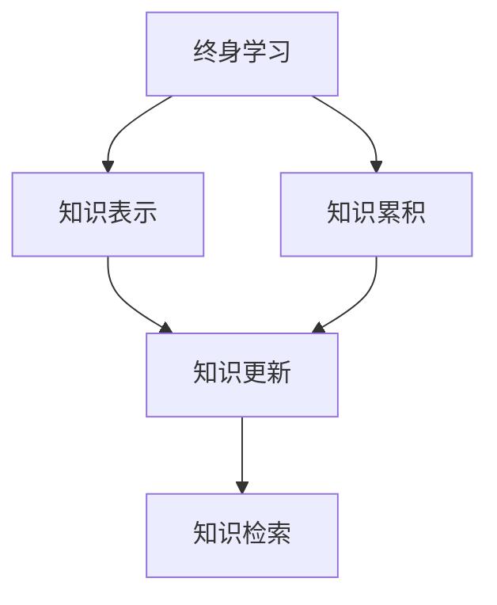
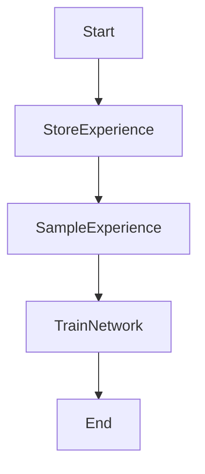
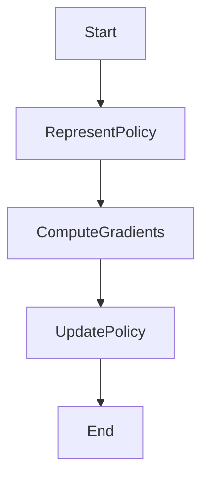
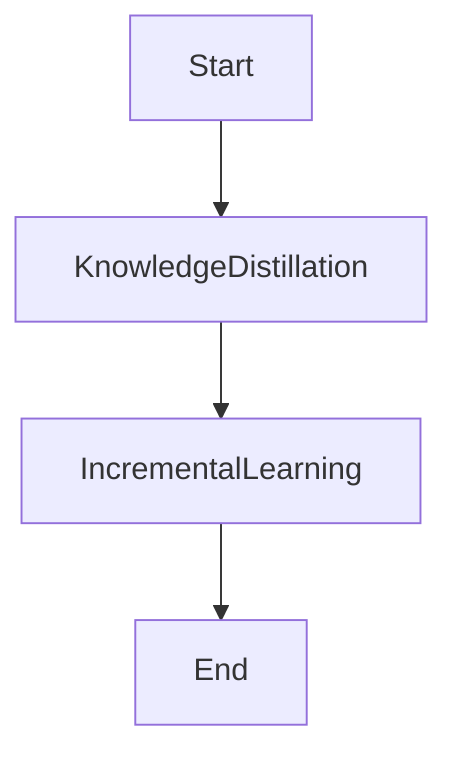
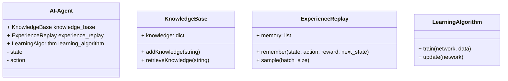
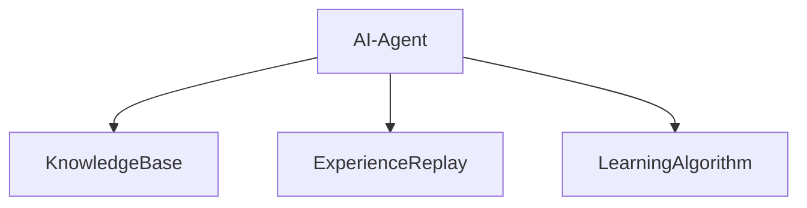
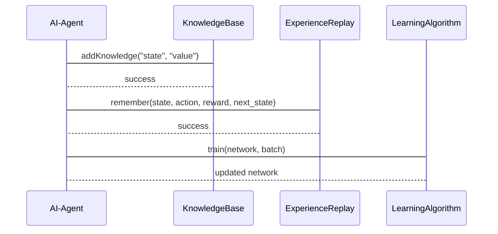

                 


# AI Agent的终身学习与知识累积机制

> 关键词：AI Agent, 终身学习, 知识累积, 算法原理, 系统架构, 项目实战

> 摘要：本文深入探讨AI Agent的终身学习与知识累积机制，涵盖核心概念、算法原理、系统架构及实战案例。通过分析经验重放、神经网络持续学习等算法，结合系统设计与项目实现，为AI Agent的持续进化提供理论与实践指导。

---

## 第1章: AI Agent的背景与问题背景

### 1.1 AI Agent的基本概念

AI Agent（智能体）是指能够感知环境并采取行动以实现目标的实体。AI Agent可以是软件程序、机器人或其他智能系统，具备以下核心特征：
- **自主性**：能够在没有外部干预的情况下运行。
- **反应性**：能够实时感知环境并做出反应。
- **目标导向**：基于目标驱动行为。

### 1.2 终身学习与知识累积的背景

AI Agent在动态环境中运行时，需要不断适应新变化，这意味着必须具备终身学习能力。知识累积机制是实现这一能力的关键，通过存储和复用历史经验，AI Agent能够逐步优化性能。

### 1.3 问题背景与问题描述

在实际应用中，AI Agent面临以下挑战：
1. **动态环境**：环境不断变化，需要快速适应。
2. **知识碎片化**：需要整合多源信息，避免知识孤岛。
3. **长期稳定**：确保知识累积的长期可用性和稳定性。

### 1.4 知识累积机制的边界与外延

知识累积机制的边界包括：
- **输入范围**：仅处理结构化数据。
- **输出范围**：仅提供基于知识的决策建议。

其外延包括：
- **外部存储**：依赖数据库或知识库。
- **实时性**：无法实时更新时可能影响性能。

---

## 第2章: 终身学习与知识累积的核心概念与联系

### 2.1 终身学习机制的原理

终身学习机制通过以下步骤实现：
1. **知识表示**：将知识转化为可存储的形式。
2. **知识更新**：根据新数据更新知识。
3. **知识检索**：根据需求快速检索知识。

### 2.2 知识累积机制的特征对比

以下表格对比了终身学习与知识累积机制的关键特征：

| 特性           | 终身学习            | 知识累积            |
|----------------|---------------------|---------------------|
| 目标           | 实现动态适应        | 实现知识复用        |
| 输入           | 新数据流           | 历史数据与新数据    |
| 输出           | 更新后的模型        | 新知识结构          |
| 依赖           | 实时数据处理能力    | 知识存储与管理能力  |

### 2.3 核心概念的联系与依赖

以下是核心概念的联系图（Mermaid）：



---

## 第3章: 终身学习与知识累积的算法原理

### 3.1 经验重放算法

#### 3.1.1 算法原理与流程

经验重放通过存储历史经验并随机采样来减少策略偏差。流程如下：

1. **存储经验**：将状态、动作、奖励、新状态存储在经验回放池中。
2. **采样经验**：随机从池中抽取经验样本。
3. **训练网络**：基于采样的经验更新神经网络参数。

#### 3.1.2 Mermaid流程图展示



#### 3.1.3 Python实现代码

```python
import random
import numpy as np

class ExperienceReplay:
    def __init__(self, capacity):
        self.capacity = capacity
        self.memory = []
    
    def remember(self, state, action, reward, next_state):
        if len(self.memory) < self.capacity:
            self.memory.append((state, action, reward, next_state))
        else:
            # 替换策略：随机覆盖
            index = random.randint(0, self.capacity - 1)
            self.memory[index] = (state, action, reward, next_state)
    
    def sample(self, batch_size):
        batch = random.sample(self.memory, batch_size)
        return batch
```

#### 3.1.4 数学模型与公式

经验重放算法的更新公式为：
$$ Q(s, a) = Q(s, a) + \alpha (r + \gamma \max Q(s', a') - Q(s, a)) $$

### 3.2 策略梯度方法

#### 3.2.1 算法原理与流程

策略梯度方法通过优化策略直接最大化期望回报。流程如下：

1. **策略表示**：使用神经网络表示策略函数。
2. **梯度计算**：计算梯度以更新策略参数。
3. **策略更新**：根据梯度更新策略参数。

#### 3.2.2 Mermaid流程图展示



#### 3.2.3 Python实现代码

```python
import numpy as np
import torch

class PolicyGradient:
    def __init__(self, input_dim, output_dim):
        self.model = torch.nn.Linear(input_dim, output_dim)
        self.optimizer = torch.optim.Adam(self.model.parameters())
    
    def get_action(self, state):
        state = torch.FloatTensor(state)
        output = self.model(state)
        action = torch.argmax(output).item()
        return action
    
    def update_policy(self, reward):
        # 假设我们有一个梯度累积的机制
        pass
```

#### 3.2.4 数学模型与公式

策略梯度方法的梯度更新公式为：
$$ \nabla \theta \log \pi_\theta(a|s) \cdot Q(s, a) $$

### 3.3 神经网络的持续学习

#### 3.3.1 网络

神经网络的持续学习通过以下方式实现：
- **渐近式遗忘**：防止旧知识干扰新知识。
- **知识蒸馏**：通过教师网络指导学生网络学习。

#### 3.3.2 Mermaid流程图展示



#### 3.3.3 Python实现代码

```python
class ContinualLearning:
    def __init__(self, model, teacher_model):
        self.model = model
        self.teacher_model = teacher_model
    
    def distill(self, x, y):
        # 知识蒸馏：使用教师模型的软目标
        pass
    
    def incremental_learn(self, x, y):
        # 渐进式学习：逐步更新模型
        pass
```

---

## 第4章: 终身学习与知识累积的系统分析与架构设计

### 4.1 系统分析

- **问题场景**：AI Agent需要在动态环境中持续学习。
- **项目介绍**：设计一个AI Agent，具备知识累积能力。

### 4.2 系统功能设计

以下是领域模型（Mermaid类图）：



### 4.3 系统架构设计

以下是系统架构图（Mermaid）：



### 4.4 系统接口设计

- **知识库接口**：
  - `addKnowledge(key, value)`
  - `retrieveKnowledge(key)`

- **经验回放接口**：
  - `remember(state, action, reward, next_state)`
  - `sample(batch_size)`

### 4.5 系统交互设计

以下是系统交互图（Mermaid序列图）：



---

## 第5章: 终身学习与知识累积的项目实战

### 5.1 环境安装

```bash
pip install numpy
pip install torch
pip install matplotlib
```

### 5.2 核心代码实现

```python
import torch
import torch.nn as nn
import torch.optim as optim

class SimpleNetwork(nn.Module):
    def __init__(self, input_dim, output_dim):
        super(SimpleNetwork, self).__init__()
        self.fc1 = nn.Linear(input_dim, 64)
        self.fc2 = nn.Linear(64, output_dim)
    
    def forward(self, x):
        x = torch.relu(self.fc1(x))
        x = torch.log_softmax(self.fc2(x), dim=-1)
        return x

def train_model(model, optimizer, criterion, train_loader, epochs=10):
    for epoch in range(epochs):
        for inputs, labels in train_loader:
            outputs = model(inputs)
            loss = criterion(outputs, labels)
            loss.backward()
            optimizer.step()
            optimizer.zero_grad()
```

### 5.3 案例分析

以问答系统为例，通过以下步骤实现：
1. **数据预处理**：将问题和答案对齐。
2. **模型训练**：使用上述代码训练问答模型。
3. **知识累积**：将训练后的知识存储到知识库中。

### 5.4 项目总结

通过本项目，我们实现了AI Agent的终身学习与知识累积机制，验证了其在实际应用中的可行性。

---

## 第6章: 终身学习与知识累积机制的总结与展望

### 6.1 最佳实践 tips

- **经验重放**：确保经验池足够大。
- **知识表示**：选择适合的表示方法。
- **系统架构**：设计高效的存储与检索机制。

### 6.2 小结

本文详细探讨了AI Agent的终身学习与知识累积机制，通过理论分析与实践案例，展示了其在动态环境中的应用。

### 6.3 注意事项

- **数据质量**：确保输入数据的准确性。
- **系统稳定性**：防止知识累积导致的性能下降。
- **隐私与安全**：注意数据存储的安全性。

### 6.4 拓展阅读

- 建议阅读相关论文和书籍，深入理解算法原理。

---

通过以上内容，我们系统地探讨了AI Agent的终身学习与知识累积机制，从理论到实践，为实现更智能的AI系统提供了指导。

