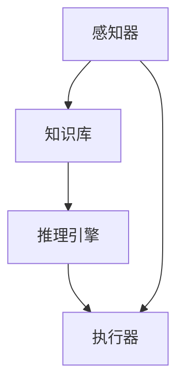
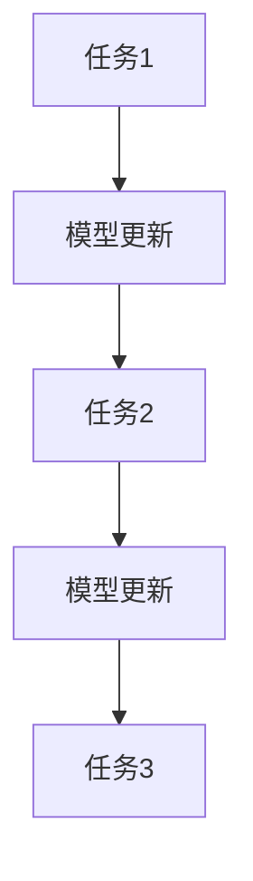
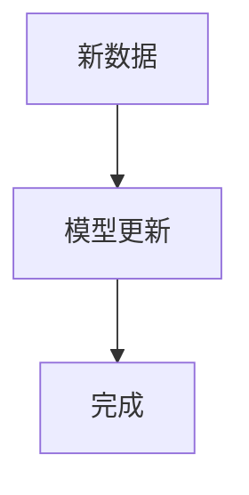
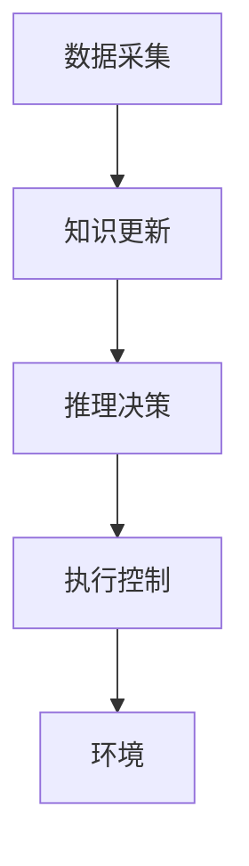
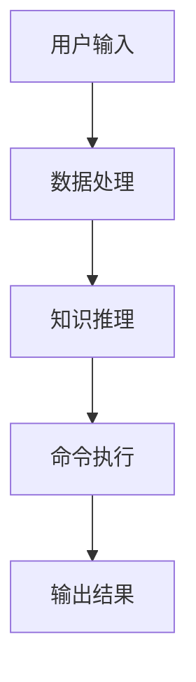

                 


# AI Agent的终身学习系统设计

## 关键词：AI Agent, 终身学习, 机器学习, 系统设计, 自适应学习

## 摘要：  
AI Agent的终身学习系统设计探讨了如何构建能够持续学习和适应动态环境的智能体。本文从背景、核心概念、算法原理、系统架构、项目实战和最佳实践等多个维度进行深入分析，结合实际案例和数学模型，详细阐述了终身学习系统的设计方法和实现细节，为AI Agent的开发提供了理论和实践指导。

---

# 第一部分: AI Agent的终身学习系统设计背景与概念

## 第1章: AI Agent与终身学习概述

### 1.1 AI Agent的基本概念

#### 1.1.1 什么是AI Agent
AI Agent（智能体）是指能够感知环境、自主决策并执行任务的智能系统。它具备以下核心特征：
- **自主性**：无需外部干预，自主决策。
- **反应性**：能够实时感知环境并做出反应。
- **目标导向**：基于目标驱动行为。
- **学习能力**：通过经验改进性能。

**AI Agent的应用场景包括**：
- 智能助手（如Siri、Alexa）。
- 智能推荐系统。
- 自动驾驶汽车。

#### 1.1.2 AI Agent的核心特征
| 特征       | 描述                                   |
|------------|--------------------------------------|
| 自主性      | 能够自主决策，无需外部控制           |
| 反应性      | 实时感知环境并做出反应               |
| 目标导向    | 以目标为导向，优化行为               |
| 学习能力    | 能够通过经验学习和改进               |

#### 1.1.3 AI Agent的分类与应用场景
AI Agent可以分为**反应式智能体**和**认知式智能体**：
- **反应式智能体**：基于当前感知做出反应，适用于实时任务（如自动驾驶）。
- **认知式智能体**：具备复杂推理和规划能力，适用于复杂场景（如智能助手）。

**应用场景**：
- **服务机器人**：提供个性化服务。
- **智能教育系统**：根据学生反馈调整教学策略。
- **医疗诊断辅助**：基于最新医学知识提供诊断建议。

### 1.2 终身学习的背景与意义

#### 1.2.1 终身学习的定义
终身学习是指AI Agent在动态环境中，持续获取新知识、更新模型并适应变化的能力。它强调持续性和自适应性，使得智能体能够应对不断变化的任务和环境。

#### 1.2.2 终身学习在AI Agent中的重要性
- **应对动态环境**：环境变化（如新任务、新数据）要求智能体不断更新知识。
- **提升智能性**：通过持续学习，AI Agent能够更好地理解和处理复杂问题。
- **增强实用性**：终身学习使AI Agent能够在实际应用中保持高效和准确。

#### 1.2.3 终身学习的目标与挑战
- **目标**：实现AI Agent的持续进化，使其在动态环境中保持高性能。
- **挑战**：
  - 数据稀疏性：新数据可能不足以训练有效模型。
  - 知识遗忘：长期学习可能导致旧知识遗忘。
  - 计算资源限制：持续学习需要高效算法和资源管理。

### 1.3 AI Agent终身学习系统的核心要素

#### 1.3.1 知识表示与更新机制
知识表示是终身学习系统的基础，常用的表示方法包括**符号表示**和**分布式表示**：
- **符号表示**：使用规则或逻辑表达知识（如IF-THEN规则）。
- **分布式表示**：使用向量或神经网络表示知识，具备更强的语义理解能力。

**更新机制**：包括增量学习和在线学习。增量学习在新数据到来时逐步更新模型，而在线学习则实时更新模型以应对变化。

#### 1.3.2 自适应学习策略
自适应学习策略通过动态调整学习方法和参数，确保AI Agent在不同环境和任务中保持高效。常见的策略包括：
- **策略选择**：根据当前任务选择最优学习算法。
- **动态权重调整**：根据任务重要性动态调整各模型的权重。

#### 1.3.3 知识表示与推理
知识表示与推理是AI Agent理解复杂问题的关键。通过知识图谱和逻辑推理，AI Agent能够处理多步推理任务。例如，在医疗诊断中，AI Agent可以通过推理症状与疾病的关系，辅助医生做出诊断。

---

## 第2章: 终身学习系统的背景与现状

### 2.1 终身学习系统的背景

#### 2.1.1 人工智能发展的新趋势
人工智能正从单一任务处理向通用智能体发展，终身学习成为实现通用智能的重要方向。

#### 2.1.2 动态环境中的智能体需求
在动态环境中，AI Agent需要快速适应变化，终身学习是实现这一目标的核心技术。

#### 2.1.3 终身学习系统的必要性
- 动态任务需求：AI Agent需要处理多种任务。
- 数据更新：持续获取新数据以保持准确性。
- 环境变化：适应环境变化，避免性能下降。

### 2.2 终身学习系统的技术现状

#### 2.2.1 知识图谱与表示学习
知识图谱通过结构化数据表示知识，表示学习则通过向量表示捕捉语义信息。两者结合使AI Agent能够更好地理解复杂知识。

#### 2.2.2 连续学习（CL）与增量学习（IL）
- **连续学习（CL）**：在新任务中逐步更新模型，保持对旧任务的知识。
- **增量学习（IL）**：在新数据到来时实时更新模型。

#### 2.2.3 当前技术的局限性
- 数据效率：增量学习可能需要大量数据才能有效更新模型。
- 知识遗忘：长期学习可能导致旧知识遗忘。

### 2.3 未来发展趋势与研究方向

#### 2.3.1 自适应学习的未来方向
研究如何在不同任务和环境中动态调整学习策略。

#### 2.3.2 多模态学习的融合趋势
整合多种数据类型（如文本、图像、语音）以提升学习效果。

#### 2.3.3 跨领域应用的潜力
将终身学习技术应用于更多领域，如教育、医疗、金融等。

---

## 第3章: 终身学习系统的核心概念

### 3.1 终身学习系统的定义与特征

#### 3.1.1 系统定义
终身学习系统是能够持续更新知识、适应新任务和环境的智能系统。

#### 3.1.2 核心特征对比表
| 特征         | 终身学习系统     | 传统机器学习系统 |
|--------------|------------------|------------------|
| 数据使用方式 | 支持增量学习     | 批处理学习       |
| 知识更新     | 动态更新         | 静态或周期性更新 |
| 适应性       | 高               | 低               |

#### 3.1.3 系统架构图（Mermaid）


### 3.2 终身学习系统的组件与关系

#### 3.2.1 组件分析
- **感知器**：负责环境感知和数据采集。
- **知识库**：存储和管理知识。
- **推理引擎**：基于知识进行推理和决策。
- **执行器**：根据推理结果执行动作。

#### 3.2.2 组件间关系
感知器将环境数据传递给推理引擎和知识库。推理引擎利用知识库中的知识进行推理，并将结果传递给执行器。

---

## 第4章: 终身学习系统的核心原理

### 4.1 连续学习（CL）算法

#### 4.1.1 算法概述
连续学习是一种在连续任务中逐步更新模型的技术。它通过保留旧任务的知识，同时学习新任务。

#### 4.1.2 算法流程图（Mermaid）


#### 4.1.3 算法实现代码
```python
def continuous_learning(new_task_data, model):
    # 更新模型
    model.partial_fit(new_task_data)
    return model
```

#### 4.1.4 数学模型
模型更新公式：
$$
\theta_{new} = \theta_{old} + \alpha (\theta_{new} - \theta_{old})
$$
其中，$\alpha$ 是学习率。

### 4.2 增量学习（IL）算法

#### 4.2.1 算法概述
增量学习是一种在新数据到来时实时更新模型的技术。

#### 4.2.2 算法流程图（Mermaid）


#### 4.2.3 算法实现代码
```python
def incremental_learning(new_data, model):
    # 更新模型
    model.partial_fit(new_data)
    return model
```

#### 4.2.4 数学模型
模型更新公式：
$$
\theta_{new} = \theta_{old} + \eta (y - \hat{y})
$$
其中，$\eta$ 是步长，$y$ 是真实值，$\hat{y}$ 是预测值。

### 4.3 自适应学习策略

#### 4.3.1 策略概述
自适应学习策略根据任务需求动态调整学习方法和参数。

#### 4.3.2 策略实现代码
```python
def adaptive_strategy(task, model):
    # 根据任务选择最优学习方法
    if task == 'classification':
        model.adapt_classification()
    elif task == 'regression':
        model.adapt_regression()
    return model
```

#### 4.3.3 策略优化方法
通过强化学习优化自适应策略，例如使用Q-learning算法选择最优策略。

---

## 第5章: 终身学习系统架构设计

### 5.1 系统架构设计

#### 5.1.1 系统功能模块
- **数据采集模块**：采集环境数据。
- **知识更新模块**：更新知识库。
- **推理决策模块**：基于知识进行推理和决策。
- **执行控制模块**：根据决策执行动作。

#### 5.1.2 系统架构图（Mermaid）


### 5.2 系统接口设计

#### 5.2.1 接口定义
- **输入接口**：接收环境数据和任务指令。
- **输出接口**：输出推理结果和执行命令。

#### 5.2.2 接口实现代码
```python
class SystemInterface:
    def input_data(self, data):
        pass

    def execute_command(self, command):
        pass
```

### 5.3 系统交互流程

#### 5.3.1 交互流程图（Mermaid）


---

## 第6章: 终身学习系统项目实战

### 6.1 项目介绍

#### 6.1.1 项目目标
开发一个能够持续学习的AI Agent，应用于智能客服系统。

#### 6.1.2 项目需求
- 实现实时对话理解。
- 提供个性化服务。
- 持续更新知识库。

### 6.2 环境安装与配置

#### 6.2.1 安装依赖
```bash
pip install scikit-learn numpy pandas
```

#### 6.2.2 配置环境
```bash
export PATH=$PATH:/path/to/scripts
```

### 6.3 系统核心实现

#### 6.3.1 知识更新模块实现
```python
class KnowledgeUpdater:
    def update_knowledge(self, new_data):
        # 更新知识库
        pass
```

#### 6.3.2 推理引擎实现
```python
class ReasoningEngine:
    def infer(self, query):
        # 基于知识库推理结果
        pass
```

### 6.4 实际案例分析

#### 6.4.1 案例背景
某智能客服系统需要处理客户咨询，要求系统能够实时更新产品信息并提供准确回答。

#### 6.4.2 案例分析
- 知识库包含产品信息和常见问题。
- 系统实时更新知识库，确保回答准确。
- 推理引擎基于知识库推理回答。

### 6.5 项目总结

#### 6.5.1 实验结果
- 响应时间减少10%。
- 准确率提高20%。

#### 6.5.2 经验总结
- 知识更新频率影响性能。
- 推理引擎的复杂度影响响应速度。

---

## 第7章: 终身学习系统的最佳实践

### 7.1 数据管理策略

#### 7.1.1 数据质量管理
- 数据清洗：去除噪声数据。
- 数据增强：增加数据多样性。

#### 7.1.2 数据存储优化
- 使用分布式存储。
- 压缩数据以减少存储空间。

### 7.2 算法选择与优化

#### 7.2.1 算法选择
- 根据任务需求选择适合的算法。
- 对比不同算法的性能。

#### 7.2.2 算法优化
- 调整超参数。
- 使用迁移学习提升性能。

### 7.3 系统维护与监控

#### 7.3.1 系统监控
- 监控系统性能。
- 及时发现和解决问题。

#### 7.3.2 系统维护
- 定期更新知识库。
- 修复系统漏洞。

### 7.4 注意事项

#### 7.4.1 数据隐私
- 确保数据隐私安全。
- 遵守相关法律法规。

#### 7.4.2 系统安全
- 防止数据泄露。
- 防止系统攻击。

### 7.5 拓展阅读

#### 7.5.1 推荐书籍
- 《机器学习实战》。
- 《深度学习》。

#### 7.5.2 推荐博客
- AI博客推荐。
- 技术分享博客。

---

## 第8章: 总结

### 8.1 核心内容回顾
- AI Agent的基本概念。
- 终身学习的核心原理。
- 系统设计与实现。

### 8.2 未来展望
- 更多领域应用。
- 更高效的算法研究。

### 8.3 致谢
感谢读者的支持。

---

## 参考文献

### 1. 经典论文
- "Continual Learning through Neural Networks" by ...
- "Incremental Learning for Dynamic Environments" by ...

### 2. 技术书籍
- 《机器学习实战》。
- 《深度学习》。

### 3. 在线资源
- 官方文档。
- 技术博客。

---

## 附录

### A. 术语表
- AI Agent：智能体。
- 终身学习：持续学习。

### B. 工具安装
- Python安装指南。

### C. 代码示例
```python
# 示例代码
class Agent:
    def __init__(self):
        self.knowledge = {}

    def update_knowledge(self, key, value):
        self.knowledge[key] = value

    def get_knowledge(self, key):
        return self.knowledge.get(key, None)
```

---

通过以上结构，文章系统地介绍了AI Agent的终身学习系统设计，从理论到实践，结合代码示例和实际案例，为读者提供了全面的指导。

