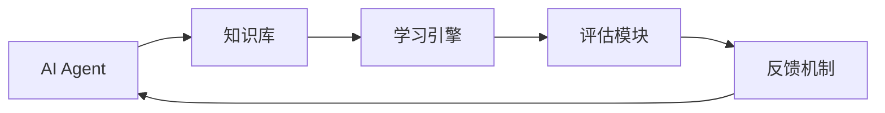
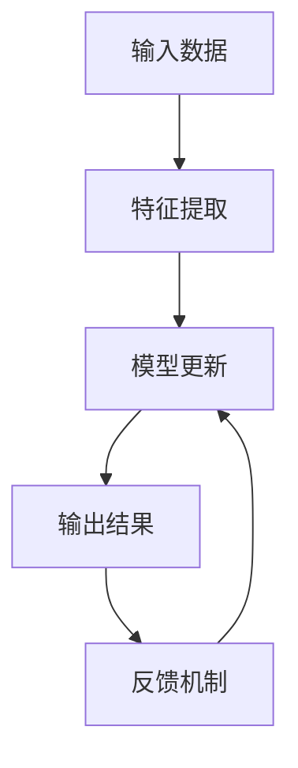
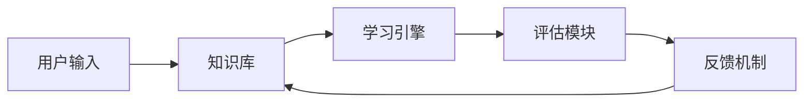

                 


```markdown
# AI Agent的终身学习系统：持续适应新知识和技能

**关键词**：AI Agent，终身学习，机器学习，自适应系统，智能系统

**摘要**：AI Agent的终身学习系统是一种能够持续适应新知识和技能的智能系统，通过在线学习和自适应机制，AI Agent可以在动态环境中不断优化自身能力。本文将详细探讨AI Agent的终身学习系统的核心概念、算法原理、系统架构以及实际应用，帮助读者全面理解这一前沿技术。

---

## 第一部分：AI Agent与终身学习的背景介绍

### 第1章：AI Agent与终身学习的背景

#### 1.1 问题背景与定义

- **1.1.1 传统AI系统的局限性**
  - 传统AI系统依赖于预训练数据，无法适应新知识和动态变化的环境。
  - 在面对新任务或未知问题时，传统AI系统的表现受限，缺乏灵活性。

- **1.1.2 终身学习的定义与特点**
  - 终身学习是指AI系统在运行过程中持续学习和更新知识的能力。
  - 其特点包括在线性、自适应性和持续性，能够实时更新模型以应对新挑战。

- **1.1.3 AI Agent的定义与角色**
  - AI Agent是具有感知和行动能力的智能实体，能够与环境交互并执行任务。
  - 在终身学习系统中，AI Agent充当学习主体，负责知识的获取、更新和应用。

#### 1.2 终身学习的核心概念

- **1.2.1 在线学习与离线学习的对比**
  - 在线学习：实时更新模型，适用于动态环境。
  - 离线学习：批量处理数据，适用于静态环境。

- **1.2.2 知识表示与更新机制**
  - 知识表示：通过图结构或向量表示知识，便于模型理解和更新。
  - 更新机制：包括增量式学习和迁移学习，确保模型持续优化。

- **1.2.3 多任务学习与迁移学习的关系**
  - 多任务学习：同时学习多个任务，共享知识。
  - 迁移学习：将已知任务的知识应用于新任务。

#### 1.3 应用场景与技术优势

- **1.3.1 智能助手的持续进化**
  - AI Agent通过终身学习提升对话理解和任务执行能力。
  - 实际案例：智能音箱在使用中逐步优化语音识别和响应速度。

- **1.3.2 自动驾驶中的动态适应**
  - 终身学习帮助自动驾驶系统实时更新道路规则和驾驶策略。
  - 案例：特斯拉通过OTA更新改进自动驾驶算法。

- **1.3.3 企业级系统的灵活性提升**
  - AI Agent在企业中应用终身学习，优化流程和决策。
  - 案例：企业CRM系统通过持续学习提高客户预测和推荐准确性。

#### 1.4 挑战与未来趋势

- **1.4.1 数据依赖性与模型泛化能力的平衡**
  - 数据质量影响学习效果，需平衡数据量和模型泛化能力。

- **1.4.2 算法效率与计算资源的优化**
  - 高效算法设计和资源优化是终身学习系统的关键挑战。

- **1.4.3 人机协作的新型模式**
  - 未来趋势包括人机协作学习和自适应人机界面设计。

---

## 第二部分：终身学习的核心概念与联系

### 第2章：终身学习的核心概念

#### 2.1 核心概念原理

- **2.1.1 在线学习的数学模型**
  - 在线学习模型：$f_t(x) = \theta_t \cdot x + b_t$，其中$\theta_t$和$b_t$随时间更新。

- **2.1.2 知识表示的图结构**
  - 使用图神经网络表示知识，节点表示为$z_i$，边权重为$w_{ij}$。

- **2.1.3 元学习的层次结构**
  - 元学习框架：在任务层面和元层面进行优化，提升模型适应新任务的能力。

#### 2.2 核心概念对比表

| 概念         | 在线学习         | 离线学习         |
|--------------|-----------------|-----------------|
| 数据处理方式 | 实时更新数据     | 批处理数据       |
| 适用场景     | 动态环境         | 静态环境         |
| 模型更新     | 连续更新         | 批量更新         |

#### 2.3 实体关系图



---

## 第三部分：终身学习系统的算法原理

### 第3章：终身学习系统的算法原理

#### 3.1 算法流程



#### 3.2 核心代码实现

```python
def lifelong_learning_algorithm(data_stream):
    model = initialize_model()
    for batch in data_stream:
        features, labels = process_batch(batch)
        model_update(model, features, labels)
        if feedback_needed:
            feedback = receive_feedback()
            model.update_with_feedback(feedback)
    return model
```

#### 3.3 数学公式与模型更新

- **模型更新公式**：
  $$ \theta_{t+1} = \theta_t + \eta (y_t - f_\theta(x_t)) $$
  其中，$\theta_t$是参数，$\eta$是学习率，$y_t$是真实值，$f_\theta(x_t)$是预测值。

- **反馈机制公式**：
  $$ r_t = \rho (r_{t-1} + \alpha \cdot reward_t) $$
  其中，$\rho$是反馈权重，$\alpha$是反馈因子，$reward_t$是当前奖励。

---

## 第四部分：终身学习系统的架构设计

### 第4章：系统架构分析与设计

#### 4.1 问题场景介绍

- **问题场景**：AI Agent需要在动态环境中实时更新模型，应对新任务和数据。

#### 4.2 系统功能设计

- **功能模块**：
  - 知识库模块：存储和更新知识表示。
  - 学习引擎模块：执行在线学习和模型更新。
  - 评估模块：监控模型性能并提供反馈。

#### 4.3 系统架构设计



#### 4.4 接口设计与交互

- **接口设计**：
  - API 1：获取当前模型参数。
  - API 2：更新模型参数。
  - API 3：接收反馈并调整模型。

- **交互流程**：
  1. 用户输入数据，传递给知识库模块。
  2. 知识库模块提取特征，传递给学习引擎。
  3. 学习引擎更新模型，返回结果。
  4. 评估模块监控结果，提供反馈。
  5. 反馈传递给知识库模块，更新知识表示。

---

## 第五部分：项目实战与应用案例

### 第5章：项目实战

#### 5.1 环境安装与配置

```bash
pip install numpy scikit-learn tensorflow
```

#### 5.2 核心代码实现

```python
import numpy as np
from sklearn.linear_model import SGDClassifier

def online_learning(X, y):
    model = SGDClassifier()
    for X_i, y_i in zip(X, y):
        model.partial_fit(X_i.reshape(1, -1), y_i)
    return model

# 示例数据
X = np.array([[1, 2], [3, 4], [5, 6]])
y = np.array([0, 1, 0])

model = online_learning(X, y)
print(model.predict(X))  # 输出预测结果
```

#### 5.3 应用案例分析

- **案例分析**：智能客服系统通过终身学习优化客户支持。
  - 实时更新FAQ库，提高回答准确性。
  - 根据用户反馈不断优化回答策略。

---

## 第六部分：总结与展望

### 第6章：总结与展望

#### 6.1 核心内容回顾

- AI Agent的终身学习系统通过持续学习和自适应机制，实现动态环境中的高效运作。
- 核心概念包括在线学习、知识表示和元学习，确保系统灵活性和适应性。

#### 6.2 最佳实践 tips

- 定期更新模型，确保数据新鲜性。
- 设计高效的反馈机制，优化学习效果。
- 结合迁移学习和多任务学习，提升系统性能。

#### 6.3 小结

- AI Agent的终身学习系统是人工智能领域的前沿技术，具有广泛的应用前景。
- 通过不断优化算法和系统架构，未来将实现更高效、更智能的自适应系统。

#### 6.4 展望

- 结合边缘计算和分布式学习，提升系统的实时性和安全性。
- 深化人机协作，打造更自然的交互界面。
- 探索更高效的算法，降低计算资源消耗。

---

**总结**：AI Agent的终身学习系统通过持续学习和自适应机制，能够应对动态环境中的各种挑战，为人工智能技术的发展注入新的活力。随着技术的不断进步，AI Agent将在更多领域展现出强大的应用潜力，成为未来智能系统的核心驱动力。

```

