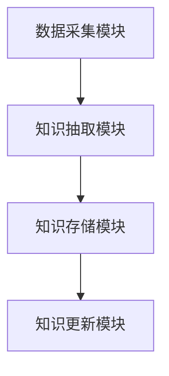
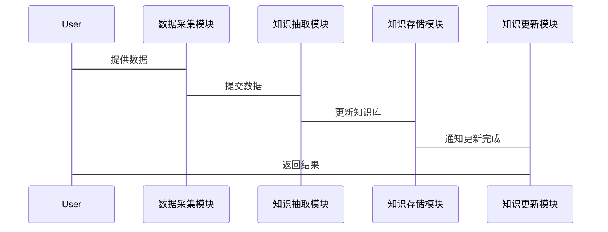

                 


# AI Agent的终身学习：持续更新和扩展知识库

## 关键词：AI Agent，终身学习，知识库，持续学习，机器学习，知识更新

## 摘要：AI Agent的终身学习是指AI代理在运行过程中不断吸收新的知识和信息，以适应环境的变化和任务的需求。本文将详细探讨AI Agent如何实现知识库的持续更新和扩展，从基本概念、算法原理到系统架构设计，再到实际项目案例，为读者提供全面的理论和实践指导。

---

## 第1章: AI Agent与终身学习概述

### 1.1 AI Agent的基本概念

#### 1.1.1 AI Agent的定义
AI Agent（人工智能代理）是一种能够感知环境、自主决策并执行任务的智能实体。它通过传感器获取信息，利用推理能力做出决策，并通过执行器与环境交互。

#### 1.1.2 AI Agent的核心特征
- **自主性**：能够自主决策，无需外部干预。
- **反应性**：能够实时感知环境并做出反应。
- **学习能力**：能够通过经验或数据改进性能。
- **社交能力**：能够与其他Agent或人类进行交互。

#### 1.1.3 终身学习的定义与特点
终身学习是指AI Agent在其整个生命周期内，持续从环境中获取新知识、技能和经验，并将其整合到现有知识库中，以适应变化和提升性能。其特点包括：
- **持续性**：学习过程不终止，适应性强。
- **自适应性**：能够根据新信息调整行为。
- **多样性**：能够处理多种类型和来源的知识。

### 1.2 终身学习的重要性

#### 1.2.1 AI Agent面临的知识更新挑战
- **数据爆炸**：知识更新速度加快，数据量剧增。
- **环境动态变化**：环境中的信息和任务需求不断变化。
- **任务多样性**：需要处理多种复杂任务，知识需求多样化。

#### 1.2.2 终身学习在AI Agent中的作用
- **提升适应性**：能够快速响应环境变化。
- **增强决策能力**：通过持续学习，提升决策的准确性和效率。
- **扩展知识覆盖**：通过整合新知识，覆盖更多领域和任务。

#### 1.2.3 终身学习与传统机器学习的对比
| 特性             | 传统机器学习          | 终身学习              |
|------------------|----------------------|-----------------------|
| 数据来源         | 静态数据集           | 动态数据流            |
| 学习目标         | 离线训练模型          | 在线更新模型            |
| 知识更新         | 需要重新训练整个模型  | 部分知识更新，增量学习  |
| 适应性           | 较低                 | 较高                 |

### 1.3 本书的核心目标
- **构建AI Agent的知识更新框架**：提出一套系统化的知识更新方法论。
- **实现知识库的持续扩展与优化**：通过算法和策略，确保知识库的高效更新。
- **提供可落地的终身学习解决方案**：结合理论与实践，提供实际可操作的方案。

### 1.4 本章小结
本章介绍了AI Agent的基本概念和终身学习的核心理念，分析了终身学习的重要性，并提出了本书的核心目标。下一章将深入探讨AI Agent的知识表示与更新机制。

---

## 第2章: AI Agent的知识表示与更新机制

### 2.1 知识表示方法

#### 2.1.1 符号表示法
符号表示法通过符号逻辑（如逻辑推理）来表示知识。例如，可以表示为 `如果A则B`（`A → B`），适用于规则性知识的表达。

#### 2.1.2 向量表示法
向量表示法通过高维向量来表示知识，如词嵌入（Word Embedding）和图嵌入。例如，单词`"king"`可以表示为一个高维向量`[0.2, 0.5, ..., 0.8]`。

#### 2.1.3 图结构表示法
图结构表示法通过图中的节点和边来表示知识关系。例如，知识图谱中的实体和关系可以用图结构表示为：
```
Person(Alice) - knows -> Person(Bob)
```

### 2.2 知识更新的驱动因素

#### 2.2.1 数据驱动
通过实时数据流更新知识库。例如，社交媒体上的最新动态可以实时更新到知识库中。

#### 2.2.2 任务驱动
根据当前任务需求更新知识库。例如，当AI Agent需要执行一个新的任务时，可以针对性地补充相关知识。

#### 2.2.3 用户反馈驱动
通过用户反馈不断优化知识库。例如，用户对AI Agent的决策结果进行评分，系统根据反馈调整知识权重。

### 2.3 知识库的扩展策略

#### 2.3.1 增量学习
增量学习是指在已有知识的基础上，逐步添加新知识。例如，可以使用增量SVM算法在线更新分类模型。

#### 2.3.2 对比学习
对比学习通过比较不同样本的差异来更新知识库。例如，使用对比学习算法可以提高图像识别模型的鲁棒性。

#### 2.3.3 迁移学习
迁移学习是指将已有的知识迁移到新任务中。例如，将图像分类任务中的知识迁移到目标检测任务中。

### 2.4 本章小结
本章详细介绍了AI Agent的知识表示方法和知识更新的驱动因素，并提出了知识库的扩展策略。下一章将重点探讨终身学习的算法原理。

---

## 第3章: AI Agent的终身学习框架

### 3.1 终身学习的基本框架

#### 3.1.1 输入模块
输入模块负责接收外部数据，包括传感器输入、用户反馈等。例如，AI Agent可以通过摄像头获取图像数据，通过麦克风获取语音数据。

#### 3.1.2 知识表示模块
知识表示模块负责将输入数据转化为知识库中的表示形式。例如，将自然语言文本转化为向量表示或符号表示。

#### 3.1.3 学习策略模块
学习策略模块负责制定学习策略，例如使用强化学习算法优化学习过程。

### 3.2 知识库的组织与管理

#### 3.2.1 知识节点的定义
知识节点是知识库中的基本单位，可以是实体、概念或事件。例如，知识节点可以表示为`Person(Alice)`或`Event(Meeting)`。

#### 3.2.2 知识关系的构建
知识关系定义了知识节点之间的关联。例如，可以定义关系`knows`表示“知道”，如`Alice knows Bob`。

#### 3.2.3 知识版本控制
为了确保知识库的准确性和一致性，需要进行版本控制。例如，可以记录每次更新的版本号和修改日志。

### 3.3 学习策略的优化

#### 3.3.1 基于强化学习的策略优化
强化学习通过奖励机制优化策略。例如，可以使用Q-learning算法更新策略，公式如下：
$$ Q(s, a) = Q(s, a) + \alpha (r + \max Q(s', a') - Q(s, a)) $$

#### 3.3.2 基于元学习的策略更新
元学习通过学习如何学习来优化策略。例如，使用Meta-LSTM网络进行跨任务学习。

#### 3.3.3 多目标学习的平衡
多目标学习需要在多个目标之间找到平衡。例如，可以使用加权损失函数：
$$ L = \sum_{i=1}^n w_i (y_i - \hat{y_i})^2 $$

### 3.4 本章小结
本章提出了AI Agent的终身学习框架，并详细探讨了知识库的组织与管理策略。下一章将深入分析终身学习的算法原理。

---

## 第4章: AI Agent的持续学习算法原理

### 4.1 增量学习算法

#### 4.1.1 增量SVM算法
增量SVM算法是一种在线支持向量机算法，适用于增量数据的分类任务。代码示例如下：
```python
class IncrementalSVM:
    def __init__(self, C=1.0):
        self.C = C
        self.w = np.zeros(d)
        self.b = 0.0
        self.support_vectors = []
        self.alpha = []

    def update(self, x, y):
        # 更新权重和偏置
        self.w += (y * (x - self.w * x.dot(self.w) - self.b)) / (1 + x.dot(self.w) + self.b)
        self.b += y - self.w.dot(x)
```

#### 4.1.2 增量随机森林算法
增量随机森林算法适用于增量数据的分类和回归任务。代码示例如下：
```python
from sklearn.ensemble import IncrementalRandomForest

model = IncrementalRandomForest(n_estimators=100)
model.partial_fit(X_train, y_train)
```

#### 4.1.3 增量神经网络
增量神经网络适用于增量数据的回归和分类任务。代码示例如下：
```python
model = torch.nn.Sequential(
    torch.nn.Linear(d, h),
    torch.nn.ReLU(),
    torch.nn.Linear(h, 1)
)
criterion = torch.nn.MSELoss()
optimizer = torch.optim.Adam(model.parameters())
optimizer.zero_grad()
loss.backward()
optimizer.step()
```

### 4.2 对比学习算法

#### 4.2.1 对比学习的基本原理
对比学习通过比较正样本和负样本的相似性来更新模型。例如，可以使用以下损失函数：
$$ L = \frac{1}{N} \sum_{i=1}^N \log(\text{exp}(sim(x_i, x_j) - \lambda) + 1) $$

#### 4.2.2 对比学习的损失函数
常用的对比学习损失函数包括：
- 信息NCE损失
- 税收损失
- 二元交叉熵损失

### 4.3 迁移学习算法

#### 4.3.1 迁移学习的定义与特点
迁移学习是一种将已有的知识迁移到新任务中的方法。例如，可以将图像分类任务中的知识迁移到图像分割任务中。

#### 4.3.2 迁移学习的实现方法
常用的迁移学习方法包括：
- 特征提取
- 参数迁移
- �域适应

### 4.4 算法的数学模型与公式

#### 4.4.1 增量学习的数学模型
增量学习的数学模型可以表示为：
$$ w_{t+1} = w_t + \eta (y_t - y_t^{pred}) x_t $$

#### 4.4.2 对比学习的损失函数
对比学习的损失函数可以表示为：
$$ L = \frac{1}{N} \sum_{i=1}^N \log(\text{exp}(sim(x_i, x_j) - \lambda) + 1) $$

#### 4.4.3 迁移学习的数学公式
迁移学习的数学公式可以表示为：
$$ f_{target} = g_{source}(x) + \delta $$

### 4.5 本章小结
本章详细介绍了终身学习中的增量学习、对比学习和迁移学习算法，并给出了具体的数学模型和公式。下一章将探讨知识库的系统架构设计。

---

## 第5章: AI Agent的知识库系统架构

### 5.1 知识库的系统组成

#### 5.1.1 数据采集模块
数据采集模块负责从外部获取数据，包括传感器数据、用户输入等。例如，可以通过摄像头采集图像数据，通过麦克风采集语音数据。

#### 5.1.2 知识抽取模块
知识抽取模块负责从数据中提取知识。例如，可以从文本中提取实体、关系和事件。

#### 5.1.3 知识存储模块
知识存储模块负责存储知识库中的数据，可以采用数据库或知识图谱的形式。例如，可以使用Neo4j存储图结构数据。

### 5.2 知识库的管理流程

#### 5.2.1 数据预处理
数据预处理包括数据清洗、特征提取和数据转换。例如，可以使用正则表达式清洗文本数据，提取关键词。

#### 5.2.2 知识建模
知识建模包括将知识表示为符号、向量或图结构。例如，可以将文本表示为词嵌入向量。

#### 5.2.3 知识索引
知识索引包括建立索引结构，以便快速查询和更新。例如，可以使用倒排索引实现快速搜索。

### 5.3 知识库的扩展与优化

#### 5.3.1 知识冲突的处理
知识冲突是指知识库中存在矛盾或不一致的知识。例如，可以通过冲突检测算法（如冲突检测树）检测冲突，并通过冲突解决算法（如投票法）进行处理。

#### 5.3.2 知识冗余的优化
知识冗余是指知识库中存在重复或冗余的知识。例如，可以通过聚类算法进行知识去重。

#### 5.3.3 知识覆盖的扩展
知识覆盖是指知识库覆盖的领域和任务范围。例如，可以通过主动学习方法扩展知识覆盖范围。

### 5.4 本章小结
本章详细介绍了AI Agent的知识库系统架构，并探讨了知识库的管理流程和扩展优化策略。下一章将通过实际项目案例进一步探讨终身学习的应用。

---

## 第6章: 项目实战——AI Agent的知识库更新系统

### 6.1 项目背景与目标
本项目旨在开发一个AI Agent的知识库更新系统，能够实时从多源数据中获取新知识，并将其整合到知识库中。

### 6.2 系统功能设计

#### 6.2.1 数据采集模块
- 实时采集多源数据，包括文本、图像和语音。
- 支持多种数据格式，如JSON、CSV和XML。

#### 6.2.2 知识抽取模块
- 提供多种知识抽取方法，如基于规则的抽取和基于模型的抽取。
- 支持实体识别、关系抽取和事件抽取。

#### 6.2.3 知识更新模块
- 提供增量学习、对比学习和迁移学习等多种更新策略。
- 支持版本控制和知识冲突处理。

### 6.3 系统架构设计

#### 6.3.1 系统组成
- 数据采集模块
- 知识抽取模块
- 知识存储模块
- 知识更新模块

#### 6.3.2 实体关系图


#### 6.3.3 系统交互流程


### 6.4 系统核心实现

#### 6.4.1 数据采集模块实现
```python
import requests

def fetch_data(url):
    response = requests.get(url)
    return response.json()
```

#### 6.4.2 知识抽取模块实现
```python
from spacy.lang.zh import Chinese

nlp = Chinese()
doc = nlp("今天天气很好，适合出去玩。")
for token in doc:
    print(token.text)
```

#### 6.4.3 知识更新模块实现
```python
from sklearn.svm import SVC

model = SVC()
model.fit(X_train, y_train)
model.partial_fit(X_new, y_new)
```

### 6.5 项目小结
本章通过一个实际项目案例，详细展示了AI Agent的知识库更新系统的功能设计和实现过程。通过本章的学习，读者可以掌握如何将理论应用于实际。

---

## 第7章: 最佳实践与总结

### 7.1 最佳实践

#### 7.1.1 知识表示的选择
选择适合的knowledge representation方法，如符号表示法和向量表示法。

#### 7.1.2 知识更新的策略
根据任务需求选择合适的知识更新策略，如增量学习和对比学习。

#### 7.1.3 系统架构的设计
设计高效的系统架构，确保系统的可扩展性和可维护性。

### 7.2 小结
AI Agent的终身学习是一项复杂的系统工程，需要结合知识表示、算法选择和系统架构设计等多个方面。

### 7.3 注意事项

- 确保数据的质量和安全性。
- 定期进行系统维护和优化。
- 注意知识冲突和冗余的处理。

### 7.4 拓展阅读
- 《迁移学习实战》
- 《对比学习原理与应用》
- 《知识图谱构建与应用》

---

## 结语
AI Agent的终身学习是人工智能领域的重要研究方向，通过持续更新和扩展知识库，AI Agent能够更好地适应环境变化和满足多样化的任务需求。希望本文能够为读者提供有价值的理论和实践指导，帮助他们在AI Agent的终身学习领域取得更大的突破。

--- 

**全文完**

