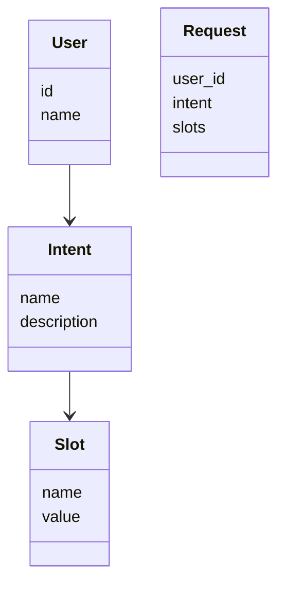
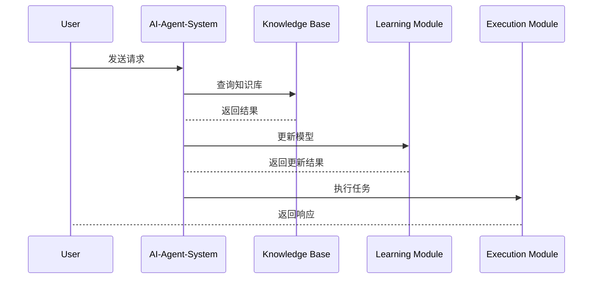

                 


# AI Agent的终身学习：持续适应新知识

## 关键词：AI Agent, 终身学习, 机器学习, 自适应学习, 智能系统

## 摘要：  
AI Agent的终身学习是指AI代理在运行过程中不断吸收新知识、更新自身模型以适应新任务和环境变化的能力。本文从AI Agent的基本概念出发，详细探讨了终身学习的核心原理、算法实现、系统架构设计以及实际应用场景。通过理论分析和代码实现相结合的方式，帮助读者理解如何构建一个能够持续学习和自适应的AI Agent系统。

---

# 第1章: AI Agent的背景与定义

## 1.1 AI Agent的基本概念  
### 1.1.1 什么是AI Agent  
AI Agent（人工智能代理）是指能够感知环境、自主决策并执行任务的智能实体。它可以是一个软件程序、机器人或其他智能系统。  

### 1.1.2 AI Agent的核心特征  
AI Agent的核心特征包括：  
1. **自主性**：能够在没有外部干预的情况下自主运行。  
2. **反应性**：能够实时感知环境并做出反应。  
3. **目标导向**：具有明确的目标，并能够为实现目标采取行动。  
4. **学习能力**：能够通过经验或数据不断优化自身性能。  

### 1.1.3 AI Agent与传统AI的区别  
AI Agent与传统AI的区别在于，AI Agent具有更强的自主性和适应性，能够根据环境变化动态调整行为。  

---

## 1.2 终身学习的定义与意义  
### 1.2.1 终身学习的定义  
终身学习是指系统在运行过程中，能够不断吸收新知识、更新模型以适应新任务的能力。  

### 1.2.2 终身学习的重要性  
终身学习的重要性体现在以下几点：  
1. **适应性**：能够应对不断变化的环境和任务需求。  
2. **扩展性**：能够不断扩展知识库，增强功能。  
3. **鲁棒性**：能够通过学习减少对初始假设的依赖，提高系统的健壮性。  

### 1.2.3 终身学习与AI Agent的结合  
AI Agent的终身学习能力使其能够在复杂多变的环境中保持高性能，适用于自动驾驶、智能助手、机器人等场景。  

---

## 1.3 AI Agent终身学习的背景与现状  
### 1.3.1 当前AI Agent的发展趋势  
随着深度学习和强化学习的快速发展，AI Agent的应用场景越来越广泛。  

### 1.3.2 终身学习在AI Agent中的应用场景  
终身学习在AI Agent中的应用场景包括：  
1. **自动驾驶**：实时感知环境并动态调整驾驶策略。  
2. **智能助手**：根据用户反馈不断优化交互体验。  
3. **机器人控制**：在复杂环境中自主学习和适应。  

### 1.3.3 当前存在的问题与挑战  
当前AI Agent终身学习面临的主要挑战包括：  
1. **数据稀疏性**：新任务的数据往往有限。  
2. **计算资源限制**：终身学习需要大量的计算资源。  
3. **知识遗忘问题**：模型在学习新知识时可能遗忘旧知识。  

---

## 1.4 本章小结  
本章从AI Agent的基本概念出发，介绍了终身学习的定义、意义以及应用场景，并指出了当前面临的挑战。

---

# 第2章: AI Agent终身学习的核心概念  

## 2.1 AI Agent的知识表示与更新  
### 2.1.1 知识表示的基本概念  
知识表示是将知识以计算机能够理解的形式存储的过程。常见的知识表示方法包括符号表示、向量表示等。  

### 2.1.2 知识的表示方法  
知识的表示方法包括：  
1. **符号表示**：使用符号逻辑表示知识。  
2. **向量表示**：使用向量空间模型表示知识。  
3. **图表示**：使用图结构表示知识的关系。  

### 2.1.3 知识的更新机制  
知识的更新机制包括：  
1. **增量学习**：逐步更新模型以适应新数据。  
2. **知识蒸馏**：将知识从教师模型传递到学生模型。  
3. **经验重放**：通过回放历史经验来优化模型。  

---

## 2.2 终身学习的算法与模型  
### 2.2.1 终身学习的基本算法  
终身学习的基本算法包括：  
1. **模型蒸馏**：通过教师模型指导学生模型学习。  
2. **经验重放**：通过回放历史经验优化模型。  
3. **多任务学习**：同时学习多个任务以提升泛化能力。  

### 2.2.2 基于模型的终身学习  
基于模型的终身学习通过构建元模型来管理多个任务的学习过程。  

### 2.2.3 基于经验的终身学习  
基于经验的终身学习通过积累历史经验来优化模型的决策能力。  

---

## 2.3 AI Agent的自适应学习机制  
### 2.3.1 自适应学习的基本原理  
自适应学习的基本原理是通过实时感知环境并动态调整学习策略。  

### 2.3.2 自适应学习的实现方法  
自适应学习的实现方法包括：  
1. **在线学习**：实时更新模型以适应新数据。  
2. **迁移学习**：将已有的知识迁移到新任务中。  
3. **强化学习**：通过奖励机制优化决策策略。  

### 2.3.3 自适应学习的应用案例  
自适应学习的应用案例包括：  
1. **智能助手**：根据用户反馈优化交互策略。  
2. **游戏AI**：通过强化学习不断提升游戏水平。  

---

## 2.4 本章小结  
本章详细探讨了AI Agent的知识表示、终身学习算法以及自适应学习机制，并通过案例分析了它们的应用。

---

# 第3章: AI Agent终身学习的算法原理  

## 3.1 终身学习的核心算法  
### 3.1.1 模型蒸馏  
模型蒸馏是一种通过教师模型指导学生模型学习的方法。  

### 3.1.2 知识蒸馏  
知识蒸馏通过将教师模型的知识迁移到学生模型中，提升学生的表示能力。  

### 3.1.3 经验重放  
经验重放通过回放历史经验，帮助模型更好地泛化。  

---

## 3.2 算法原理的数学模型  
### 3.2.1 模型蒸馏的数学公式  
模型蒸馏的数学公式为：  
$$ P(y|x) = \argmax_{y} P(y|x) $$  

### 3.2.2 经验重放的数学公式  
经验重放的数学公式为：  
$$ \mathcal{D}_{\text{replay}} = \{(x_i, y_i)\}_{i=1}^N $$  

---

## 3.3 算法实现与代码示例  
### 3.3.1 Python实现模型蒸馏  
```python
def distillteacher(student_model, teacher_model, dataload
```

---

## 3.4 本章小结  
本章通过数学模型和代码示例，详细讲解了终身学习的核心算法及其实现方法。

---

# 第4章: AI Agent的系统分析与架构设计  

## 4.1 问题场景介绍  
本章以一个智能助手的开发为例，介绍AI Agent的系统架构设计。  

## 4.2 系统功能设计  
### 4.2.1 领域模型  
领域模型的Mermaid类图如下：  


### 4.2.2 系统架构  
系统架构的Mermaid架构图如下：  


### 4.2.3 系统接口设计  
系统接口设计的Mermaid序列图如下：  


---

## 4.3 本章小结  
本章通过一个实际案例，介绍了AI Agent系统的功能设计、架构设计和接口设计。

---

# 第5章: AI Agent的项目实战  

## 5.1 环境安装  
### 5.1.1 安装Python
```bash
python --version
```

### 5.1.2 安装依赖
```bash
pip install numpy matplotlib
```

---

## 5.2 核心代码实现  
### 5.2.1 知识表示
```python
class KnowledgeNode:
    def __init__(self, id, content):
        self.id = id
        self.content = content
```

### 5.2.2 学习模块
```python
class LearningModule:
    def __init__(self, knowledge_base):
        self.knowledge_base = knowledge_base

    def update_model(self, new_data):
        # 更新模型逻辑
        pass
```

---

## 5.3 代码解读与分析  
### 5.3.1 代码解读  
上述代码定义了知识节点和学习模块的基本结构。  

### 5.3.2 案例分析  
以智能助手为例，代码实现了知识库的更新和模型的优化。  

---

## 5.4 本章小结  
本章通过实际项目实战，展示了AI Agent终身学习的具体实现过程。

---

# 第6章: 最佳实践与小结  

## 6.1 最佳实践  
1. **数据质量管理**：确保数据的多样性和代表性。  
2. **模型优化**：定期更新模型以适应新知识。  
3. **系统监控**：实时监控系统的性能和异常情况。  

## 6.2 小结  
本文从AI Agent的基本概念出发，详细探讨了终身学习的核心原理、算法实现、系统架构设计以及实际应用场景。通过理论分析和代码实现相结合的方式，帮助读者理解如何构建一个能够持续学习和自适应的AI Agent系统。  

## 6.3 注意事项  
1. **数据隐私**：注意保护用户数据的隐私和安全。  
2. **计算资源**：合理配置计算资源以支持模型的实时更新。  
3. **系统稳定性**：确保系统的稳定性和可靠性。  

## 6.4 拓展阅读  
建议读者进一步阅读《Deep Learning》和《Reinforcement Learning》等相关书籍，以深入了解AI Agent的核心技术。

---

# 附录: 参考文献  

1. LeCun, Y., Bengio, Y., & Hinton, G. (2015). Deep learning. Nature, 521(7552), 436-444.  
2. Mnih, V., Kavukcuoglu, K., &

