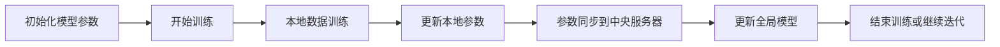
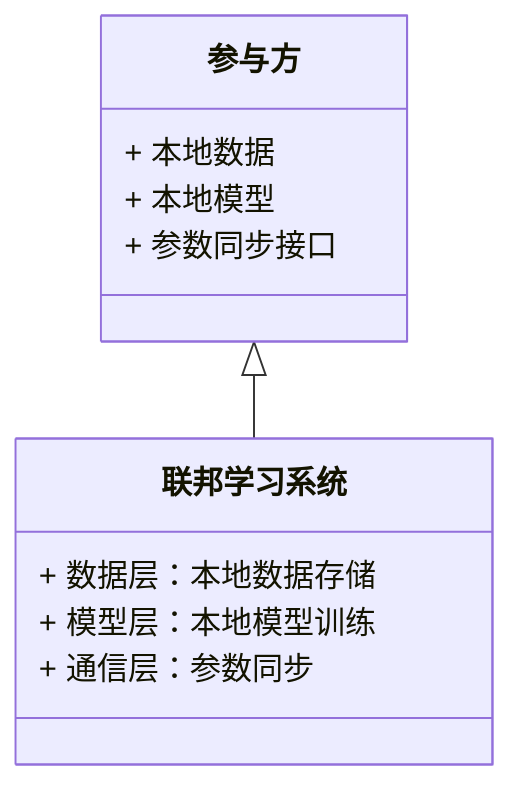

                 


# AI Agent的联邦学习：保护隐私的分布式LLM训练

## 关键词：AI Agent、联邦学习、分布式LLM、隐私保护、数据安全、算法实现

## 摘要：本文深入探讨了AI Agent在联邦学习中的应用，重点分析了保护隐私的分布式大型语言模型（LLM）训练技术。通过系统性地介绍联邦学习的核心概念、算法原理、系统架构及项目实战，本文旨在为读者提供一个全面理解AI Agent如何在保护隐私的前提下实现分布式LLM训练的框架。

---

## 第1章 AI Agent与联邦学习的背景与基础

### 1.1 AI Agent的基本概念
AI Agent，即人工智能代理，是指能够感知环境、自主决策并执行任务的智能实体。它具备以下核心特征：
- **自主性**：能够在没有外部干预的情况下自主运行。
- **反应性**：能够实时感知环境变化并做出反应。
- **目标导向**：基于预设目标或学习目标进行决策和行动。

AI Agent的应用场景广泛，包括智能助手、推荐系统、自动驾驶等。

### 1.2 联邦学习的基本概念
联邦学习（Federated Learning）是一种分布式机器学习技术，旨在在不将数据集中到单一位置的情况下，通过多设备或机构协作训练模型。其核心思想是“数据不动，模型动”，即数据保持在本地，仅模型参数在参与方之间进行同步。

### 1.3 保护隐私的分布式LLM训练
分布式LLM训练通过将模型参数分散在多个计算节点上进行训练，避免了将所有数据集中到一个地方，从而降低了数据泄露的风险。然而，如何在分布式环境下保护隐私是关键挑战。

### 1.4 本章小结
本章介绍了AI Agent和联邦学习的基本概念，强调了在分布式LLM训练中保护隐私的重要性，并为后续内容奠定了基础。

---

## 第2章 联邦学习的核心概念与原理

### 2.1 数据联邦与模型联邦
- **数据联邦**：指数据分布在不同的参与方，每个参与方仅拥有本地数据，通过某种机制进行数据协作。
- **模型联邦**：指模型参数分布在不同的参与方，通过模型参数的同步实现模型更新。

### 2.2 联邦学习中的隐私保护机制
- **同态加密**：允许在加密数据上进行计算，结果仍保持加密状态。
- **差分隐私**：通过在数据中添加噪声，确保个体数据无法被推断。
- **混淆化技术**：通过数据变换或扰动，降低数据被逆向分析的风险。

### 2.3 联邦学习的通信协议
- **数据交换协议**：定义了参与方之间如何安全地交换数据。
- **通信机制**：包括同步和异步通信，确保模型参数的高效更新。

### 2.4 本章小结
本章详细介绍了联邦学习的核心概念，特别是隐私保护机制和通信协议，为后续的算法实现奠定了理论基础。

---

## 第3章 联邦学习的算法与技术实现

### 3.1 联邦学习的算法流程
- **初始化**：各参与方初始化本地模型参数。
- **迭代训练**：各参与方在本地数据上训练模型，更新本地参数。
- **参数同步**：将本地参数上传到中央服务器或与其他参与方进行同步。
- **模型更新**：基于所有参与方的参数更新全局模型。



### 3.2 联邦学习的数学模型与公式
假设我们有一个全局模型参数$\theta$，各参与方$i$的本地模型参数为$\theta_i$。联邦学习的优化目标是：
$$
\min_{\theta} \sum_{i=1}^n \mathcal{L}_i(\theta_i) \quad \text{subject to} \quad \theta = \frac{1}{n}\sum_{i=1}^n \theta_i
$$
其中，$\mathcal{L}_i$是参与方$i$的损失函数，$n$是参与方的数量。

### 3.3 本章小结
本章通过算法流程和数学公式，详细讲解了联邦学习的实现原理，特别是参数同步和模型更新的过程。

---

## 第4章 系统架构与设计

### 4.1 问题场景介绍
我们假设有一个分布式环境，包含多个计算节点，每个节点持有本地数据，并希望通过联邦学习训练一个全局模型，同时保护数据隐私。

### 4.2 系统功能设计
- **数据层**：本地数据存储与管理。
- **模型层**：本地模型训练与参数更新。
- **通信层**：参数同步与模型更新。

### 4.3 系统架构设计


### 4.4 本章小结
本章通过系统架构设计，展示了联邦学习在分布式环境下的实现方式，特别是各模块之间的交互关系。

---

## 第5章 项目实战

### 5.1 环境搭建
- **工具安装**：安装Python、TensorFlow等必要的工具。
- **数据准备**：准备分布式数据集，确保数据隐私。

### 5.2 系统核心实现
```python
class FederatedLearning:
    def __init__(self, participants):
        self.participants = participants
        self.global_model = None

    def train(self, epochs):
        for epoch in range(epochs):
            for participant in self.participants:
                # 在本地数据上训练模型
                participant.train_local_model()
            # 同步所有参与方的参数到全局模型
            self.global_model = self._aggregate_parameters()

    def _aggregate_parameters(self):
        # 对所有参与方的参数进行平均
        avg_weights = {}
        for param in self.participants[0].model trainable_weights:
            avg_weights[param.name] = tf.reduce_mean([p.model.get_weights()[param.name] for p in self.participants])
        return avg_weights
```

### 5.3 实际案例分析
通过一个简单的案例，展示联邦学习的实际应用，例如分布式文本分类任务。

### 5.4 本章小结
本章通过项目实战，详细讲解了联邦学习的实现过程，包括环境搭建、系统设计和代码实现。

---

## 第6章 案例分析与最佳实践

### 6.1 案例分析
分析一个实际的联邦学习案例，例如分布式医疗数据分析。

### 6.2 最佳实践
- **数据安全**：确保数据在传输和存储过程中的安全性。
- **算法优化**：优化联邦学习的算法，提高训练效率。
- **隐私保护**：采用多种隐私保护技术，确保数据隐私。

### 6.3 本章小结
本章通过案例分析和最佳实践，总结了联邦学习在实际应用中的注意事项和优化方法。

---

## 第7章 总结与展望

### 7.1 本章总结
总结本文的主要内容，特别是AI Agent在联邦学习中的应用及其对分布式LLM训练的贡献。

### 7.2 未来展望
展望联邦学习的发展方向，特别是如何进一步提升隐私保护能力和模型性能。

### 7.3 本章小结
本章对全文进行了总结，并对未来的研究方向进行了展望。

---

## 附录

### 附录A: 关键术语解释
- **AI Agent**：人工智能代理。
- **联邦学习**：分布式机器学习技术。

### 附录B: 参考文献
- 省略

---

## 结语

通过本文的详细讲解，读者可以全面理解AI Agent在联邦学习中的应用，特别是如何在保护隐私的前提下实现分布式LLM训练。希望本文能为相关领域的研究和实践提供有价值的参考。

