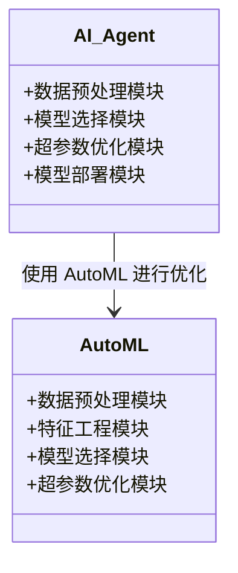
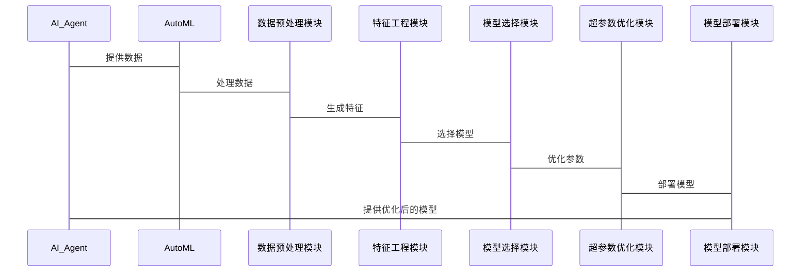

                 


# AI Agent的自动机器学习(AutoML)应用

## 关键词：AI Agent, AutoML, 机器学习, 自动化, 算法优化, 应用实践

## 摘要：  
本文探讨AI Agent如何利用AutoML技术实现自动机器学习。通过背景介绍、核心概念、算法原理、系统架构设计、项目实战和最佳实践，帮助读者全面理解AI Agent与AutoML的结合，掌握其在实际应用中的优势与挑战。文章结合理论与实践，深入分析AutoML在AI Agent中的作用，提供丰富的案例和代码示例，为读者提供有价值的指导。

---

## 第1章：AI Agent与AutoML的背景介绍

### 1.1 AI Agent的基本概念

AI Agent（人工智能代理）是指能够感知环境并采取行动以实现目标的智能实体。它能够自主决策、学习和适应，广泛应用于推荐系统、智能客服、自动驾驶等领域。

#### 1.1.1 AI Agent的定义与特点
- **定义**：AI Agent是具有智能的实体，能够感知环境、执行任务并优化行为。
- **特点**：
  - 自主性：无需人工干预，自主决策。
  - 反应性：能实时感知环境并做出反应。
  - 学习性：通过数据和经验不断优化性能。

#### 1.1.2 AI Agent的应用场景
- 智能推荐系统：根据用户行为推荐相关内容。
- 智能客服：自动处理客户咨询和问题。
- 智能助手：如Siri、Alexa等，协助用户完成任务。

#### 1.1.3 AI Agent与传统AI的区别
- **传统AI**：基于规则或特定任务设计，不具备自主性和学习能力。
- **AI Agent**：具备自主决策、学习和适应能力，能够与环境交互。

### 1.2 AutoML的基本概念

AutoML（自动机器学习）是指通过自动化工具和算法，减少手动调整模型的复杂性，使机器学习模型的开发和优化更加高效。

#### 1.2.1 AutoML的定义与特点
- **定义**：AutoML是利用自动化工具优化机器学习流程的技术，包括数据预处理、特征工程、模型选择和优化。
- **特点**：
  - 简化流程：减少人工干预，降低门槛。
  - 高效性：快速迭代模型，提升效率。
  - 智能性：利用元学习和优化算法自动选择最佳模型。

#### 1.2.2 AutoML的核心技术
- 自动数据预处理：清洗、归一化和特征工程。
- 自动模型选择：通过比较不同算法选择最优模型。
- 自动超参数优化：利用贝叶斯优化或遗传算法调整参数。

#### 1.2.3 AutoML与传统机器学习的区别
- **传统机器学习**：需要手动选择算法和调整参数，耗时且复杂。
- **AutoML**：自动化处理数据和模型选择，提升效率和性能。

### 1.3 AI Agent与AutoML的结合

AI Agent与AutoML的结合使AI Agent能够更智能地处理任务，通过自动化机器学习提升决策和执行能力。

#### 1.3.1 AI Agent在AutoML中的作用
- 数据预处理：AI Agent负责数据的收集和清洗。
- 模型优化：AI Agent通过AutoML优化模型性能。
- 自动部署：AI Agent自动部署和监控模型。

#### 1.3.2 AutoML如何提升AI Agent的能力
- 提高效率：通过自动化流程减少人工干预。
- 增强决策：利用优化算法选择最佳模型。
- 实时适应：通过持续学习提升性能。

#### 1.3.3 AI Agent与AutoML结合的应用场景
- 智能客服：通过AutoML优化分类模型，提高准确率。
- 智能推荐：利用AutoML自动调整推荐策略。
- 自动交易：通过AutoML优化交易模型，提高收益。

---

## 第2章：AutoML的核心概念与原理

### 2.1 AutoML的核心概念

AutoML通过自动化处理数据和模型选择，使机器学习更加高效和易用。

#### 2.1.1 AutoML的主要技术
- 自动数据预处理：清洗、归一化、特征工程。
- 自动特征工程：生成和选择特征。
- 自动模型选择与优化：比较不同算法，优化超参数。

#### 2.1.2 AutoML的实现流程
1. 数据输入与分析：读取数据，分析特征和标签。
2. 模型选择与优化：选择适合的算法，优化超参数。
3. 模型部署与监控：部署模型，监控性能并进行调整。

#### 2.1.3 AutoML的优势
- 提高效率：减少人工干预，快速迭代模型。
- 降低门槛：使非专家也能使用机器学习技术。
- 提高性能：通过优化算法选择最佳模型。

### 2.2 AI Agent与AutoML的协同工作原理

AI Agent通过AutoML实现自动化机器学习，提升其决策和执行能力。

#### 2.2.1 AI Agent在AutoML中的角色
- 数据预处理：AI Agent负责数据的收集和清洗。
- 模型优化：AI Agent利用AutoML优化模型性能。
- 自动部署：AI Agent自动部署和监控模型。

#### 2.2.2 AutoML如何提升AI Agent的能力
- 提高效率：通过自动化流程减少人工干预。
- 增强决策：利用优化算法选择最佳模型。
- 实时适应：通过持续学习提升性能。

#### 2.2.3 AI Agent与AutoML协同工作的流程
1. 数据收集：AI Agent收集环境数据。
2. 数据处理：AutoML对数据进行预处理和特征工程。
3. 模型选择：AutoML选择最优模型。
4. 模型优化：AutoML优化超参数。
5. 模型部署：AI Agent部署优化后的模型。
6. 监控与反馈：AI Agent监控模型性能，提供反馈。

---

## 第3章：AutoML的核心算法与数学模型

### 3.1 AutoML的核心算法

AutoML使用多种算法优化模型选择和超参数调整。

#### 3.1.1 遗传算法
遗传算法是一种基于自然选择和遗传机制的优化算法，常用于超参数优化。

##### 3.1.1.1 遗传算法的步骤
1. 初始化：生成初始种群。
2. 适应度评估：计算个体的适应度。
3. 选择：选择适应度高的个体。
4. 交叉：生成子代。
5. 变异：随机改变子代的某些特征。
6. 重复：直到满足终止条件。

##### 3.1.1.2 遗传算法的优缺点
- 优点：能够找到全局最优解。
- 缺点：计算复杂，收敛速度慢。

##### 3.1.1.3 遗传算法的Python实现
```python
import random

def fitness_func(individual):
    # 计算个体的适应度
    return sum(individual)

def create_population(pop_size, individual_size):
    return [[random.randint(0,1) for _ in range(individual_size)] for _ in range(pop_size)]

def select_parents(population, fitness):
    # 选择适应度高的个体
    sorted_pop = sorted(zip(population, fitness), key=lambda x: x[1], reverse=True)
    return sorted_pop[:2]

def crossover(parent1, parent2):
    # 单点交叉
    point = random.randint(1, len(parent1)-1)
    return parent1[:point] + parent2[point:], parent2[:point] + parent1[point:]

def mutate(individual):
    # 变异
    point = random.randint(0, len(individual)-1)
    individual[point] = 1 - individual[point]
    return individual

def genetic_algorithm(pop_size, individual_size, generations):
    population = create_population(pop_size, individual_size)
    for _ in range(generations):
        fitness = [fitness_func(individual) for individual in population]
        parents = select_parents(population, fitness)
        child1, child2 = crossover(parents[0], parents[1])
        child1 = mutate(child1)
        child2 = mutate(child2)
        population = [child1, child2] + population[:pop_size-2]
    return population[0]

# 示例
best_solution = genetic_algorithm(10, 5, 10)
print("最优解：", best_solution)
print("适应度：", fitness_func(best_solution))
```

#### 3.1.2 随机搜索
随机搜索是一种简单有效的优化方法，通过随机选择超参数进行评估。

##### 3.1.2.1 随机搜索的步骤
1. 定义搜索空间：确定超参数的取值范围。
2. 生成随机配置：随机选择超参数组合。
3. 评估配置：训练模型并计算性能指标。
4. 选择最优配置：记录最优配置。

##### 3.1.2.2 随机搜索的Python实现
```python
import random

def random_search_cv(x_train, y_train, x_test, y_test, param_space, iterations=10):
    best_score = 0
    best_params = {}
    for _ in range(iterations):
        # 随机选择超参数
        params = {param: random.choice(values) for param, values in param_space.items()}
        # 训练模型
        model = RandomForestClassifier(**params)
        model.fit(x_train, y_train)
        # 验证
        score = model.score(x_test, y_test)
        if score > best_score:
            best_score = score
            best_params = params
    return best_params, best_score

# 示例
from sklearn.ensemble import RandomForestClassifier
param_space = {
    'n_estimators': [10, 50, 100],
    'max_depth': [None, 10, 20],
    'min_samples_split': [2, 5, 10]
}
best_params, best_score = random_search_cv(X_train, y_train, X_test, y_test, param_space)
print("最优超参数：", best_params)
print("最优得分：", best_score)
```

#### 3.1.3 贝叶斯优化
贝叶斯优化是一种基于概率分布的优化方法，常用于超参数优化。

##### 3.1.3.1 贝叶斯优化的步骤
1. 定义搜索空间：确定超参数的取值范围。
2. 初始化：选择一些初始点评估。
3. 构建概率模型：基于已评估点构建概率分布。
4. 选择下一个点：选择最有潜力的点进行评估。
5. 更新模型：利用新评估点更新概率分布。
6. 重复：直到满足终止条件。

##### 3.1.3.2 贝叶斯优化的Python实现
```python
import numpy as np
from sklearn.gaussian_process import GaussianProcessRegressor

def bayesian_optimization(x_train, y_train, x_test, y_test, param_space, iterations=10):
    def objective(params):
        # 将参数转换为模型可接受的形式
        model = RandomForestClassifier(**params)
        model.fit(x_train, y_train)
        score = model.score(x_test, y_test)
        return -score  # 使用负分进行最小化

    # 初始化
    X = []
    Y = []
    for _ in range(iterations):
        # 随机选择参数
        params = {param: random.choice(values) for param, values in param_space.items()}
        # 评估
        score = -objective(params)
        X.append(list(params.values()))
        Y.append(score)
        # 构建Gaussian Process模型
        gpr = GaussianProcessRegressor()
        gpr.fit(X, Y)
        # 预测下一个点
        # 这里简化为随机选择一个未被选择的参数组合
        next_params = random.choice([p for p in param_space.values() if p not in X])
        X.append(next_params)
        Y.append(objective(next_params))
    return min(Y), X[np.argmin(Y)]

# 示例
param_space = {
    'n_estimators': [10, 50, 100],
    'max_depth': [None, 10, 20],
    'min_samples_split': [2, 5, 10]
}
best_score, best_params = bayesian_optimization(X_train, y_train, X_test, y_test, param_space)
print("最优得分：", -best_score)
print("最优超参数：", best_params)
```

---

## 第4章：AI Agent与AutoML的系统架构设计

### 4.1 项目场景介绍

#### 4.1.1 项目背景
假设我们正在开发一个智能客服系统，旨在通过AI Agent自动处理客户咨询，并通过AutoML优化分类模型，提高准确率。

### 4.2 系统功能设计

#### 4.2.1 领域模型设计
Mermaid 类图展示领域模型：



#### 4.2.2 系统架构设计
Mermaid 架构图展示系统架构：


#### 4.2.3 接口设计
Mermaid 序列图展示系统接口交互：



---

## 第5章：项目实战：AI Agent与AutoML的应用

### 5.1 电商客户流失预测

#### 5.1.1 环境安装
安装必要的库：
```bash
pip install scikit-learn numpy pandas
```

#### 5.1.2 数据准备与特征工程
```python
import pandas as pd
import numpy as np
from sklearn.model_selection import train_test_split
from sklearn.ensemble import RandomForestClassifier
from sklearn.metrics import accuracy_score

# 数据加载
df = pd.read_csv('customer_churn.csv')
# 数据分割
X = df.drop('Churn', axis=1)
y = df['Churn']
X_train, X_test, y_train, y_test = train_test_split(X, y, test_size=0.2)
```

#### 5.1.3 模型选择与优化
使用AutoML优化Random Forest模型：
```python
from sklearn.model_selection import GridSearchCV

param_grid = {
    'n_estimators': [10, 50, 100],
    'max_depth': [None, 10, 20],
    'min_samples_split': [2, 5, 10]
}

grid_search = GridSearchCV(RandomForestClassifier(), param_grid, cv=5)
grid_search.fit(X_train, y_train)
best_model = grid_search.best_estimator_
best_score = grid_search.best_score_
best_params = grid_search.best_params_
```

#### 5.1.4 模型部署与监控
部署优化后的模型，并监控性能：
```python
# 部署模型
best_model.predict(X_test)
# 监控性能
print("最优参数：", best_params)
print("最优得分：", best_score)
print("实际准确率：", accuracy_score(y_test, best_model.predict(X_test)))
```

---

## 第6章：最佳实践与总结

### 6.1 小结
- AI Agent与AutoML的结合能够显著提升机器学习模型的开发效率和性能。
- AutoML通过自动化处理数据和优化模型选择，使AI Agent更加智能化和高效。

### 6.2 注意事项
- 数据质量：确保数据清洗和特征工程的准确性。
- 模型评估：使用多种指标评估模型性能。
- 算法选择：根据任务特点选择合适的算法。

### 6.3 拓展阅读
- 书籍推荐：《Hands-On Machine Learning with Scikit-Learn, Keras, and TensorFlow》
- 工具推荐：使用AutoML工具如TPOT、Hyperopt进行实验。

---

通过以上章节，我们系统地探讨了AI Agent与AutoML的应用，从理论到实践，帮助读者全面理解并掌握相关技术。

