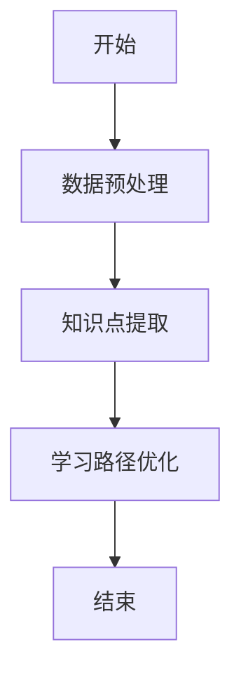
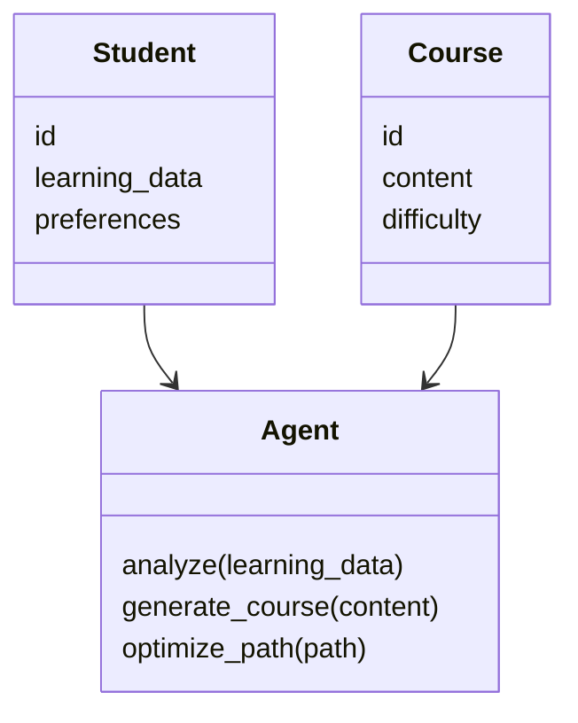
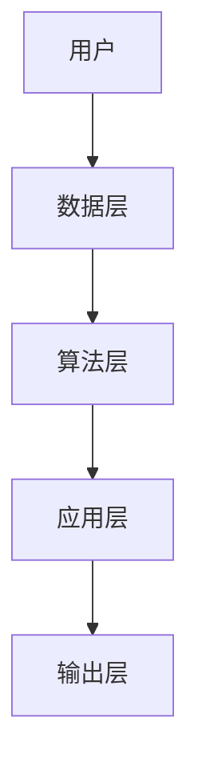
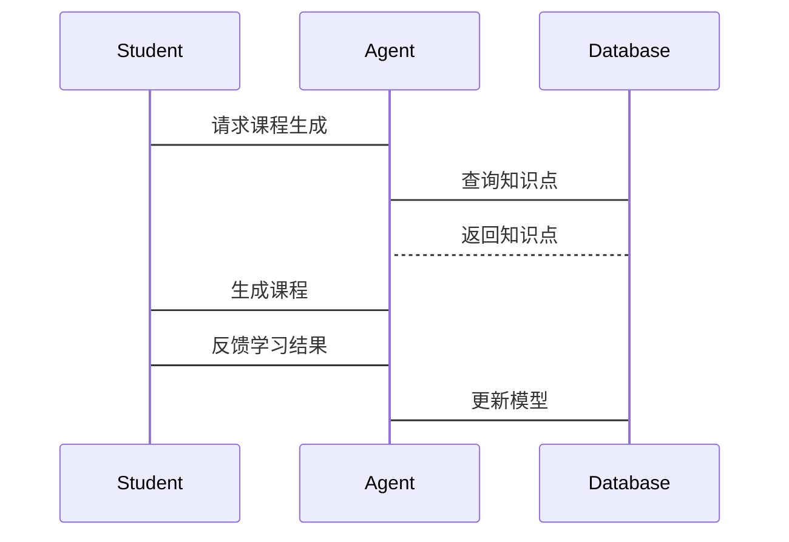

                 


# AI Agent的自动课程生成：优化学习路径

**关键词**：AI Agent，自动课程生成，个性化学习，优化学习路径，教育技术，强化学习，知识图谱

**摘要**：随着人工智能技术的快速发展，AI Agent在教育领域的应用逐渐成为焦点。本文探讨了AI Agent如何通过自动课程生成优化学习路径，结合强化学习和知识图谱等技术，为个性化学习提供高效解决方案。

---

## 第1章：AI Agent的概述

### 1.1 AI Agent的基本概念
- **1.1.1 什么是AI Agent**
  AI Agent（人工智能代理）是一种能够感知环境、自主决策并执行任务的智能实体。它可以是一个软件程序，也可以是一个物理设备，通过传感器和执行器与环境交互。
  
- **1.1.2 AI Agent的核心特征**
  - **自主性**：能够在没有外部干预的情况下自主运行。
  - **反应性**：能够实时感知环境并做出反应。
  - **目标导向**：基于明确的目标进行决策和行动。
  - **学习能力**：能够通过经验改进自身的性能。

- **1.1.3 AI Agent的应用场景**
  AI Agent广泛应用于教育、医疗、金融、交通等领域。在教育领域，AI Agent可以作为虚拟助教，为学生提供个性化的学习支持。

### 1.2 自动课程生成的背景
- **1.2.1 传统课程设计的痛点**
  传统课程设计通常依赖于教师的经验和主观判断，存在效率低、个性化不足、难以大规模定制等问题。
  
- **1.2.2 AI技术在教育中的应用**
  AI技术可以通过数据分析和机器学习，为教育领域提供智能化的解决方案，如个性化推荐、自适应学习等。

- **1.2.3 自动课程生成的定义与目标**
  自动课程生成是指通过AI技术自动生成适合学生学习目标和能力的课程内容和路径。其目标是提高学习效率，降低教师的工作负担，实现个性化教育。

### 1.3 AI Agent在教育中的作用
- **1.3.1 AI Agent如何优化学习路径**
  AI Agent可以根据学生的学习数据、知识掌握情况和学习风格，动态调整课程内容和顺序，优化学习路径。

- **1.3.2 基于AI的个性化学习**
  AI Agent能够分析学生的个体差异，提供定制化的学习计划和资源推荐，满足不同学生的学习需求。

- **1.3.3 自动课程生成的优势**
  自动课程生成可以快速响应学生的需求变化，实时更新课程内容，确保学习的高效性和针对性。

### 1.4 本章小结
本章介绍了AI Agent的基本概念、核心特征及其在教育中的应用场景，重点阐述了AI Agent在优化学习路径中的作用，为后续章节奠定了基础。

---

## 第2章：AI Agent与自动课程生成的核心概念

### 2.1 AI Agent的类型与特点
- **2.1.1 基于规则的AI Agent**
  这种类型的AI Agent通过预定义的规则和条件进行决策，适用于任务简单、规则明确的场景。

- **2.1.2 基于模型的AI Agent**
  基于模型的AI Agent利用数学模型和概率推理进行决策，适用于复杂多变的环境。

- **2.1.3 基于强化学习的AI Agent**
  基于强化学习的AI Agent通过与环境的交互获得奖励，逐步优化决策策略，适用于动态变化的任务。

### 2.2 自动课程生成的关键要素
- **2.2.1 学习目标的分解**
  将复杂的学习目标分解为多个具体的子目标，确保课程设计的系统性和完整性。

- **2.2.2 知识点的关联性**
  通过知识图谱等技术，建立知识点之间的关联关系，优化课程内容的结构。

- **2.2.3 学习路径的优化**
  根据学生的学习情况和能力，动态调整学习路径，确保学习的高效性和个性化。

### 2.3 AI Agent与自动课程生成的关系
- **2.3.1 AI Agent在课程生成中的角色**
  AI Agent作为核心组件，负责分析学生数据、生成课程内容并实时调整学习路径。

- **2.3.2 自动课程生成的流程**
  包括数据采集、知识点提取、课程设计和路径优化四个阶段。

- **2.3.3 基于AI Agent的课程优化**
  AI Agent通过强化学习等技术，不断优化课程生成算法，提高生成课程的质量和效果。

### 2.4 核心概念对比表
| 概念          | 特性                     | 描述                                   |
|---------------|--------------------------|--------------------------------------|
| AI Agent      | 智能性                   | 能够自主决策和执行任务               |
| 自动课程生成  | 数据驱动                 | 基于学习数据自动生成课程             |

### 2.5 本章小结
本章详细介绍了AI Agent的类型与特点，分析了自动课程生成的关键要素，并探讨了两者之间的关系，为后续章节提供了理论基础。

---

## 第3章：AI Agent的算法原理

### 3.1 基于强化学习的AI Agent算法
- **3.1.1 强化学习的基本原理**
  强化学习是一种通过试错机制来优化决策策略的算法。AI Agent通过与环境的交互获得奖励，逐步改进自身的决策能力。

- **3.1.2 AI Agent的奖励机制**
  奖励机制是强化学习的核心，AI Agent通过获得奖励信号来判断行动的优劣。奖励设计需要考虑任务目标和环境反馈。

- **3.1.3 算法实现步骤**
  1. 初始化AI Agent的状态和参数。
  2. 在每一步中，AI Agent根据当前状态选择一个动作。
  3. 执行动作并获得环境的反馈，包括奖励和新的状态。
  4. 更新AI Agent的策略参数，以最大化累积奖励。

### 3.2 自动课程生成的算法流程
- **3.2.1 数据预处理**
  对学生数据进行清洗、标准化和特征提取，为后续分析提供高质量的数据。

- **3.2.2 知识点提取**
  使用自然语言处理技术从课程内容中提取关键知识点，并建立知识图谱。

- **3.2.3 学习路径优化**
  基于强化学习算法，动态调整课程内容和顺序，确保学习路径的最优性。

### 3.3 算法流程图（Mermaid）


### 3.4 本章小结
本章详细介绍了AI Agent的强化学习算法及其在自动课程生成中的应用，展示了算法的实现步骤和流程图，为后续章节的系统设计提供了技术基础。

---

## 第4章：自动课程生成的数学模型

### 4.1 基于优化的数学模型
- **4.1.1 优化目标函数**
  $$ f(x) = \sum_{i=1}^{n} w_i x_i $$
  其中，\( w_i \) 是知识点 \( i \) 的权重，\( x_i \) 是知识点 \( i \) 的选择状态（0或1）。

- **4.1.2 约束条件**
  $$ \sum_{i=1}^{n} x_i = k $$
  表示选择 \( k \) 个知识点，确保课程内容的均衡性。

### 4.2 基于推荐系统的数学模型
- **4.2.1 用户特征表示**
  $$ u_i = [u_{i1}, u_{i2}, ..., u_{in}] $$
  表示用户 \( i \) 的特征向量，包括学习风格、知识水平等。

- **4.2.2 课程特征表示**
  $$ c_j = [c_{j1}, c_{j2}, ..., c_{jn}] $$
  表示课程 \( j \) 的特征向量，包括知识点覆盖范围、难度水平等。

### 4.3 本章小结
本章通过数学模型展示了自动课程生成的核心算法，包括优化目标函数和推荐系统模型，为后续章节的系统设计提供了理论支持。

---

## 第5章：系统架构与设计

### 5.1 系统功能设计（领域模型Mermaid类图）


### 5.2 系统架构设计（Mermaid架构图）


### 5.3 系统接口设计和交互流程（Mermaid序列图）


### 5.4 本章小结
本章通过系统架构设计和交互流程图，展示了AI Agent在自动课程生成中的具体实现，为后续章节的项目实战奠定了基础。

---

## 第6章：项目实战

### 6.1 环境安装与配置
- **工具安装**
  - 安装Python和相关库（如TensorFlow、Keras、Scikit-learn）。
  - 安装Mermaid和PlantUML用于绘制图表。

- **数据准备**
  - 收集学生学习数据，包括学习记录、测试成绩和反馈信息。

### 6.2 核心代码实现
- **强化学习模型实现**
  ```python
  import numpy as np
  from tensorflow.keras.models import Sequential
  from tensorflow.keras.layers import Dense

  model = Sequential()
  model.add(Dense(10, activation='relu', input_dim=5))
  model.add(Dense(1, activation='sigmoid'))
  model.compile(optimizer='adam', loss='binary_crossentropy')
  model.fit(X_train, y_train, epochs=10, batch_size=32)
  ```

### 6.3 代码解读与分析
- **强化学习模型**
  - 使用神经网络模型，通过反向传播优化权重，提高预测准确性。
  - 输入层有5个神经元，表示学生的5个特征；输出层有1个神经元，表示课程生成的决策。

### 6.4 实际案例分析
- **案例背景**
  一名学生在数学学习中存在薄弱环节，AI Agent通过分析其学习数据，生成针对性的课程内容，帮助其快速提升成绩。

### 6.5 项目小结
本章通过实际项目案例，展示了AI Agent在自动课程生成中的应用，验证了算法的有效性和可行性。

---

## 第7章：最佳实践与总结

### 7.1 小结
本文系统地探讨了AI Agent在自动课程生成中的应用，详细介绍了其算法原理、系统架构和项目实现。通过理论与实践的结合，展示了AI技术在教育领域的巨大潜力。

### 7.2 注意事项
- 数据隐私保护：在处理学生数据时，必须遵守相关法律法规，确保数据的安全性和隐私性。
- 系统稳定性：AI Agent需要具备高可用性和容错能力，确保课程生成的实时性和可靠性。

### 7.3 拓展阅读
- 《强化学习：理论与算法》
- 《知识图谱：构建与应用》
- 《教育技术的发展与创新》

### 7.4 本章小结
本文总结了AI Agent在自动课程生成中的应用，提出了未来的研究方向和实践建议，为读者提供了进一步学习和探索的资源。

---

**全文总结**
通过本文的探讨，读者可以深入了解AI Agent在自动课程生成中的核心作用，掌握其算法原理和系统设计方法。未来，随着AI技术的不断进步，AI Agent将在教育领域发挥更大的作用，为个性化学习和教育创新提供更强大的支持。

