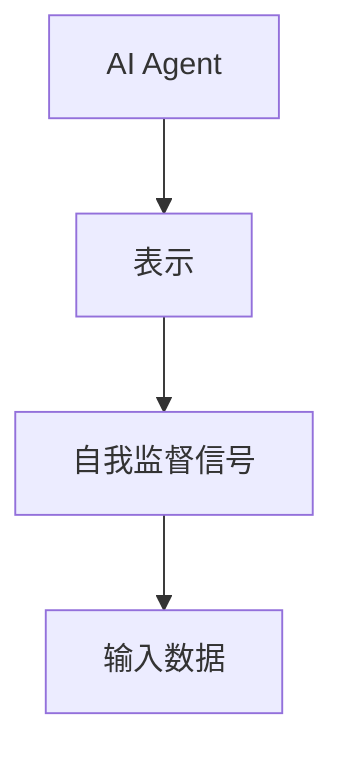
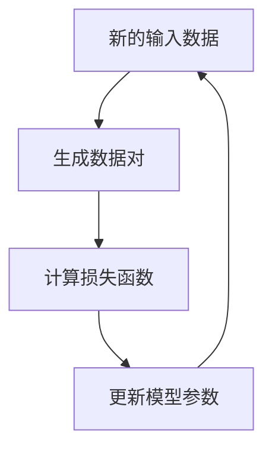
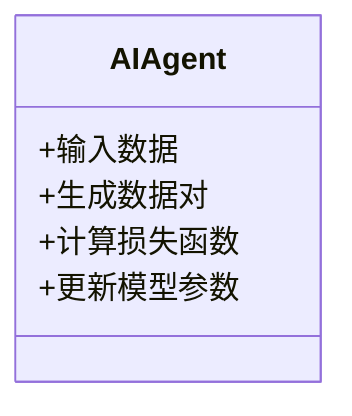
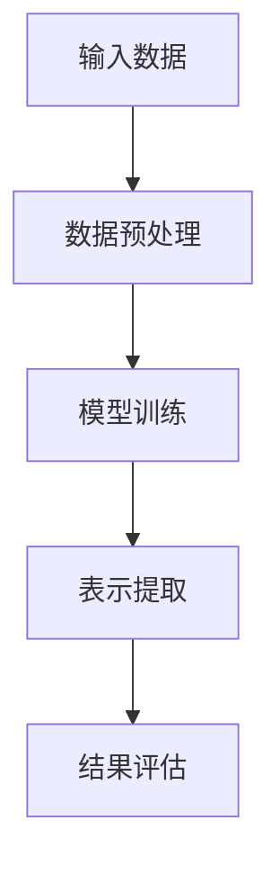
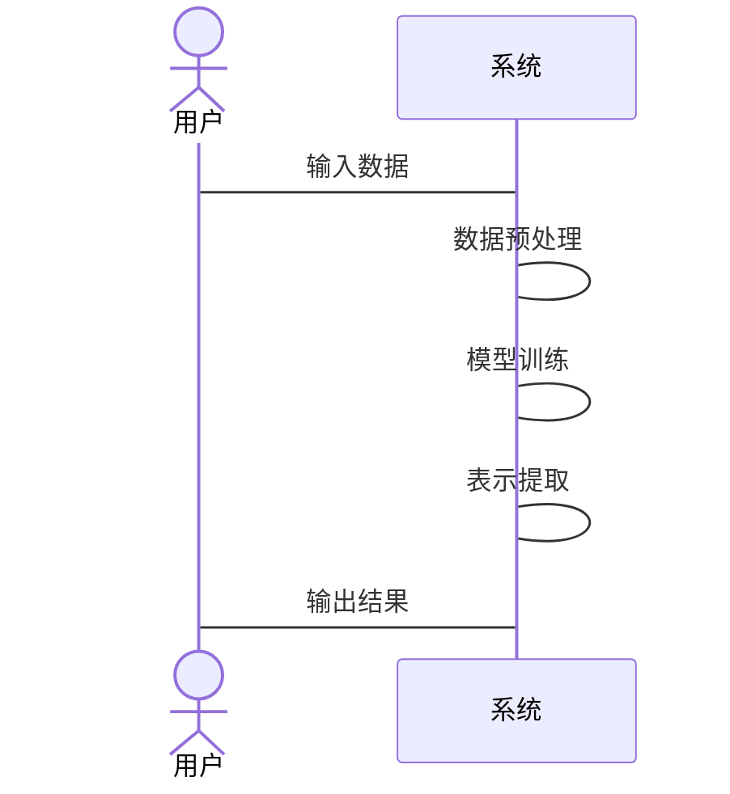

                 


# AI Agent的自我监督表示学习

> **关键词**：AI Agent, 自我监督学习, 表示学习, 对比学习, 生成对抗网络

> **摘要**：本文详细探讨了AI Agent的自我监督表示学习方法，从基本概念到算法原理，再到系统架构和项目实战，全面解析了这一技术的核心思想和实现细节。

---

# 第一部分: AI Agent的自我监督表示学习背景介绍

## 第1章: AI Agent与自我监督学习概述

### 1.1 AI Agent的基本概念

#### 1.1.1 AI Agent的定义与特点
AI Agent（人工智能代理）是指在计算机系统中，能够感知环境并采取行动以实现目标的实体。AI Agent具有以下几个核心特点：
- **自主性**：能够在没有外部干预的情况下自主决策。
- **反应性**：能够根据环境的变化做出实时响应。
- **目标导向性**：所有行为都围绕着实现特定目标展开。

#### 1.1.2 AI Agent的核心功能与应用场景
AI Agent的核心功能包括感知、推理、规划和执行。其应用场景广泛，例如智能助手、自动驾驶、推荐系统等。

#### 1.1.3 自我监督学习的背景与意义
自我监督学习是一种无监督学习方法，通过利用数据本身的结构进行学习，无需外部标注。在AI Agent中，自我监督学习能够帮助Agent从环境中直接获取信息，提升其表示学习能力。

### 1.2 自我监督表示学习的背景

#### 1.2.1 表示学习的基本概念
表示学习旨在将数据映射到一个低维空间，使得这些表示能够捕捉到数据的关键特征。

#### 1.2.2 自我监督学习的定义与特点
自我监督学习通过构建一个预测任务，利用数据本身的结构进行监督信号的生成。其特点包括数据驱动、无标签和自监督信号生成。

#### 1.2.3 自我监督表示学习的必要性
在AI Agent中，自我监督表示学习能够帮助Agent在无标签数据的情况下，学习到有效的表示，提升其在复杂环境中的适应能力。

### 1.3 问题背景与描述

#### 1.3.1 AI Agent表示学习的核心问题
AI Agent需要从环境中学习有效的表示，以便更好地理解和交互环境。

#### 1.3.2 自我监督学习在AI Agent中的应用
通过自我监督学习，AI Agent能够从环境中获取信息，学习到有用的表示，从而提升其智能水平。

#### 1.3.3 问题的边界与外延
AI Agent的自我监督表示学习问题的边界包括数据的生成、表示的学习和监督信号的设计。其外延则涉及多种无监督学习方法的应用。

### 1.4 核心概念与联系

#### 1.4.1 核心概念的原理与特点
自我监督表示学习的原理是通过构建预测任务，利用数据本身的结构生成监督信号。其特点包括数据驱动、无标签和自监督。

#### 1.4.2 概念属性特征对比表格
| 概念       | 数据驱动 | 无标签 | 自监督信号 |
|------------|----------|--------|------------|
| 自我监督学习 | 是       | 是     | 是         |
| 对比学习    | 是       | 是     | 是         |

#### 1.4.3 ER实体关系图


### 1.5 本章小结
本章介绍了AI Agent和自我监督学习的基本概念，分析了AI Agent表示学习的核心问题，并通过对比和图表展示了核心概念之间的关系。

---

## 第2章: 自我监督表示学习的原理与方法

### 2.1 自我监督学习的核心原理

#### 2.1.1 对比学习的原理
对比学习通过构建数据对，最大化正样本的相似性，最小化负样本的相似性，从而学习到有效的表示。

#### 2.1.2 生成对抗网络的原理
生成对抗网络通过生成器和判别器的对抗训练，生成逼真的数据样本，从而学习到数据的潜在分布。

#### 2.1.3 其他自我监督方法的概述
其他自我监督方法包括旋转预测、掩码预测等，每种方法都有其独特的实现方式和应用场景。

### 2.2 AI Agent中的自我监督学习

#### 2.2.1 对比学习在AI Agent中的应用
在AI Agent中，对比学习可以通过构建数据对，帮助Agent学习到更有效的表示。

#### 2.2.2 生成对抗网络在AI Agent中的应用
生成对抗网络可以帮助AI Agent生成更多的训练数据，提升其表示学习的能力。

#### 2.2.3 其他方法的简要说明
其他自我监督方法在AI Agent中的应用也值得进一步探索和研究。

### 2.3 自我监督表示学习的算法流程

#### 2.3.1 算法流程图


#### 2.3.2 对比学习的数学模型
对比学习的目标函数可以表示为：
$$ L = \frac{1}{N} \sum_{i=1}^{N} \log \frac{p(i,j)}{p(i,k)} $$
其中，\( p(i,j) \) 是正样本对的概率，\( p(i,k) \) 是负样本对的概率。

### 2.4 本章小结
本章详细介绍了自我监督表示学习的核心原理，包括对比学习和生成对抗网络的实现方法，并通过流程图和数学公式展示了算法的具体实现过程。

---

## 第3章: AI Agent自我监督表示学习的系统架构

### 3.1 系统分析与设计

#### 3.1.1 系统功能设计
系统功能包括数据预处理、模型训练、表示提取和结果评估等。

#### 3.1.2 领域模型设计


#### 3.1.3 系统架构设计


### 3.2 接口设计与交互流程

#### 3.2.1 接口设计
系统主要接口包括数据输入接口、模型训练接口和结果输出接口。

#### 3.2.2 交互流程


### 3.3 本章小结
本章详细分析了AI Agent自我监督表示学习的系统架构，包括功能设计、领域模型和系统架构图，并通过交互流程展示了系统的运行过程。

---

## 第4章: 项目实战与代码实现

### 4.1 项目环境安装

#### 4.1.1 安装Python
```bash
python --version
```

#### 4.1.2 安装深度学习框架
```bash
pip install tensorflow
```

### 4.2 核心代码实现

#### 4.2.1 数据预处理
```python
import numpy as np

def preprocess_data(data):
    # 数据预处理代码
    return processed_data
```

#### 4.2.2 模型训练
```python
import tensorflow as tf

def train_model(model, train_data, train_labels):
    # 模型训练代码
    return trained_model
```

#### 4.2.3 表示提取
```python
def extract_representations(model, test_data):
    # 表示提取代码
    return representations
```

### 4.3 代码解读与分析
本节详细解读了上述代码的实现过程，包括数据预处理、模型训练和表示提取的具体步骤。

### 4.4 实际案例分析

#### 4.4.1 案例描述
以智能客服为例，展示如何将自我监督表示学习应用于实际场景。

#### 4.4.2 案例实现
```python
# 示例代码
```

### 4.5 项目小结
本章通过项目实战，详细展示了AI Agent自我监督表示学习的实现过程，包括环境安装、代码实现和案例分析。

---

## 第5章: 最佳实践与小结

### 5.1 最佳实践

#### 5.1.1 数据质量的重要性
高质量的数据是自我监督表示学习成功的关键。

#### 5.1.2 模型调参的技巧
合理的参数调整能够显著提升模型的性能。

### 5.2 小结
本文全面介绍了AI Agent的自我监督表示学习方法，从基本概念到算法实现，再到系统架构和项目实战，为读者提供了全面的指导。

### 5.3 注意事项
在实际应用中，需要注意数据的质量、模型的调参以及系统的优化。

### 5.4 拓展阅读
推荐进一步阅读相关领域的最新研究成果，以获取更多关于自我监督表示学习的深度知识。

---

**总结**：本文系统地探讨了AI Agent的自我监督表示学习方法，从理论到实践，全面解析了这一技术的核心思想和实现细节，为读者提供了丰富的知识和实践指导。

