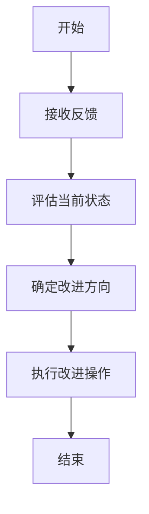
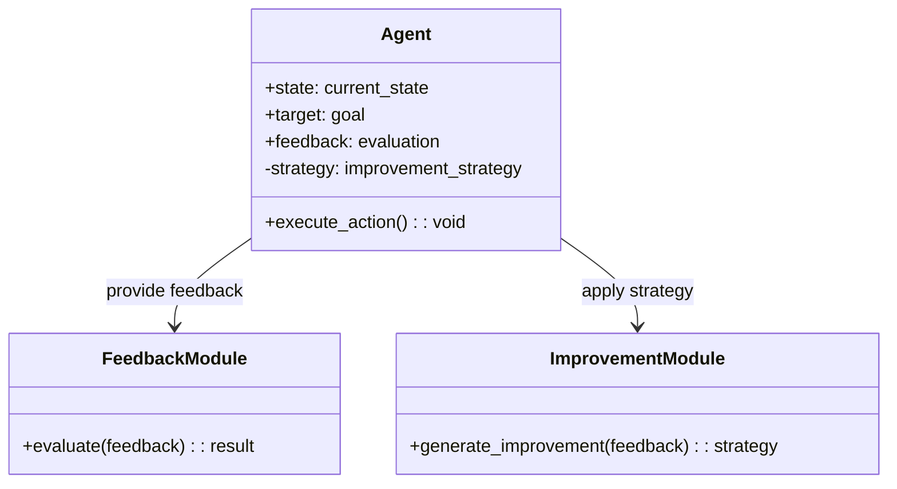

                 


# AI Agent的自我评估与改进机制

> 关键词：AI Agent、自我评估、改进机制、反馈机制、优化算法

> 摘要：本文详细探讨了AI Agent的自我评估与改进机制，从基本概念到核心算法，再到系统设计和实际应用，全面解析了这一机制的原理和实现方法。通过分析AI Agent面临的挑战，提出了一种基于反馈和优化算法的改进方法，并通过实际案例展示了如何在项目中实现这一机制。

---

## 第一部分: AI Agent的自我评估与改进机制概述

### 第1章: AI Agent的基本概念与背景

#### 1.1 AI Agent的定义与类型

AI Agent（智能体）是指在计算机系统中能够感知环境并采取行动以实现目标的实体。它可以分为以下几种类型：

- **简单反射型Agent**：基于当前输入直接做出反应，不涉及复杂推理。
- **基于模型的反射型Agent**：维护环境的状态模型，并基于模型进行推理。
- **目标驱动型Agent**：具有明确的目标，并采取行动以最大化目标的实现。
- **效用驱动型Agent**：通过最大化效用函数来优化决策。

#### 1.2 AI Agent面临的挑战

AI Agent在实际应用中面临诸多挑战，包括：

- **动态环境适应性**：环境不断变化，Agent需要快速调整策略。
- **复杂决策过程**：在多目标冲突的情况下，需要权衡和优化。
- **自我评估与改进能力**：Agent需要能够自我评估性能并主动改进。

#### 1.3 AI Agent的应用场景

AI Agent广泛应用于以下领域：

- **自动驾驶**：实时感知环境并做出驾驶决策。
- **智能助手**：如Siri、Alexa等，通过与用户的交互提供服务。
- **游戏AI**：在电子游戏中实现智能对手或队友。
- **机器人控制**：在工业或服务机器人中实现自主决策。

---

### 第2章: 自我评估与改进机制的核心概念

#### 2.1 自我评估的定义与实现

**自我评估**是指AI Agent对自身性能的测量和分析，通常包括以下几个方面：

- **任务完成度**：Agent是否成功完成指定任务。
- **效率**：完成任务所需的时间或资源。
- **准确性**：决策的正确性或预测的精确度。

**实现方法**：

- **基于反馈的评估**：通过用户反馈或系统反馈来评估性能。
- **基于日志的评估**：通过分析历史日志数据来评估性能。
- **基于对比的评估**：将当前性能与历史性能或基准进行对比。

#### 2.2 改进机制的原理与方法

**改进机制**是指在评估结果的基础上，调整AI Agent的行为或算法以提高性能。常见的改进方法包括：

- **基于反馈的改进**：根据反馈调整参数或策略。
- **基于优化算法的改进**：使用强化学习、遗传算法等优化方法。
- **基于经验的改进**：通过积累经验来优化决策模型。

**改进机制的核心要素**：

- **反馈机制**：收集和分析反馈以指导改进方向。
- **优化算法**：选择合适的算法进行参数调整。
- **动态调整能力**：根据环境变化实时调整策略。

---

## 第二部分: 自我评估与改进机制的算法原理

### 第3章: 基于反馈的改进算法

#### 3.1 反馈机制的基本原理

**反馈机制**是改进算法的核心，主要包括以下步骤：

1. **接收反馈**：从环境或用户处获取反馈信息。
2. **分析反馈**：将反馈与预期结果进行对比，找出差距。
3. **生成改进信号**：根据反馈生成调整信号，指导改进方向。
4. **执行改进**：调整算法参数或策略以优化性能。

#### 3.2 基于反馈的改进算法实现

**改进算法的实现流程**：



**代码实现示例**：

```python
def feedback_based_improvement(feedback):
    # 评估当前状态
    current_state = assess_performance()
    # 确定改进方向
    improvement_direction = determine_improvement_direction(current_state, feedback)
    # 执行改进操作
    apply_improvement(improvement_direction)
    return current_state, improvement_direction
```

---

### 第4章: 基于优化算法的改进机制

#### 4.1 强化学习在改进机制中的应用

**强化学习**是一种通过试错来优化决策的算法，适用于复杂的决策问题。其核心要素包括：

- **状态（State）**：环境的当前情况。
- **动作（Action）**：Agent的决策。
- **奖励（Reward）**：对动作的反馈，用于指导优化方向。

**数学模型**：

$$ R = r(s, a) $$

其中，$R$ 是奖励，$s$ 是状态，$a$ 是动作。

#### 4.2 遗传算法在改进机制中的应用

**遗传算法**是一种模拟生物进化过程的优化算法，适用于参数调整和策略优化。其主要步骤包括：

1. **初始化种群**：随机生成一组候选解。
2. **计算适应度**：评估每个候选解的性能。
3. **选择与交叉**：选择优秀解进行交叉，生成新解。
4. **变异与迭代**：对新解进行变异，重复迭代直到满足条件。

---

## 第三部分: 自我评估与改进机制的系统分析

### 第5章: 系统设计与架构

#### 5.1 系统功能设计

**系统功能模块**：

- **评估模块**：负责接收反馈并评估性能。
- **改进模块**：根据评估结果生成改进信号。
- **执行模块**：执行改进操作并更新状态。

**领域模型**：



#### 5.2 系统架构设计

**系统架构图**：


---

## 第四部分: 项目实战

### 第6章: 项目实现与案例分析

#### 6.1 项目环境安装

**Python环境**：Python 3.8+

**依赖库**：numpy, gym, matplotlib

```bash
pip install numpy gym matplotlib
```

#### 6.2 核心代码实现

**改进算法实现**：

```python
import numpy as np

def assess_performance(current_state):
    # 简单的评估方法，根据当前状态返回性能分数
    return np.random.uniform(0.7, 1.0)

def determine_improvement_direction(current_state, feedback):
    # 根据当前状态和反馈确定改进方向
    if feedback > assess_performance(current_state):
        return "increase"
    elif feedback < assess_performance(current_state):
        return "decrease"
    else:
        return "no_change"

def apply_improvement(improvement_direction):
    # 根据改进方向调整参数
    if improvement_direction == "increase":
        return np.random.uniform(1.0, 1.2)
    elif improvement_direction == "decrease":
        return np.random.uniform(0.8, 1.0)
    else:
        return 1.0
```

---

## 第五部分: 最佳实践与总结

### 第7章: 最佳实践与总结

#### 7.1 小结

AI Agent的自我评估与改进机制是实现智能系统自主优化的核心。通过反馈机制和优化算法，Agent能够不断调整自身行为以适应复杂环境。

#### 7.2 注意事项

- **反馈质量**：确保反馈信息准确且具有指导性。
- **算法选择**：根据具体问题选择合适的优化算法。
- **动态适应**：在动态环境中需要频繁评估和调整。

#### 7.3 拓展阅读

- **强化学习**：深入学习强化学习的原理和应用。
- **遗传算法**：研究遗传算法在优化中的应用。
- **自适应系统**：探索自适应系统的实现方法。

---

通过本文的详细讲解，读者可以全面了解AI Agent的自我评估与改进机制，并能够将其应用于实际项目中，提升系统的智能性和适应性。

