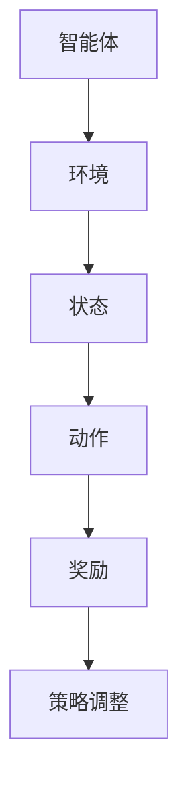
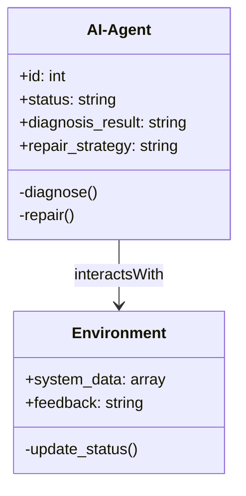

                 


# AI Agent的自我诊断与修复能力：提高系统稳定性

**关键词：** AI Agent, 自我诊断, 自我修复, 系统稳定性, 算法原理, 数学模型

**摘要：**  
AI Agent的自我诊断与修复能力是提高系统稳定性的重要手段。本文从AI Agent的基本概念出发，详细分析了自我诊断与修复的核心原理，探讨了系统架构设计，并通过具体案例展示了如何实现这些能力。最后，总结了最佳实践和未来发展方向。

---

# 第1章 AI Agent的基本概念与问题背景

## 1.1 AI Agent的定义与核心特征

### 1.1.1 AI Agent的定义  
AI Agent（人工智能代理）是指能够感知环境、做出决策并执行任务的智能实体。它可以是一个软件程序、机器人或其他智能系统，具备自主性、反应性、目标导向和学习能力。

### 1.1.2 AI Agent的核心特征  
- **自主性**：无需外部干预，自主完成任务。  
- **反应性**：能够实时感知环境并做出反应。  
- **目标导向**：基于目标驱动行为。  
- **学习能力**：通过数据和经验改进性能。  

### 1.1.3 AI Agent与传统程序的区别  
AI Agent具备以下特点，区别于传统程序：  
- 自主性：能够主动决策和行动。  
- 智能性：具备问题解决和学习能力。  
- 社会性：能够与其他Agent或人类交互协作。  

## 1.2 自我诊断与修复能力的必要性

### 1.2.1 系统稳定性的重要性  
AI Agent广泛应用于自动驾驶、智能助手、机器人等领域，系统的稳定性和可靠性至关重要。任何故障可能导致严重后果，如安全风险或经济损失。

### 1.2.2 自我诊断与修复能力在系统稳定性中的作用  
- **故障检测**：及时发现系统异常，避免问题扩大。  
- **自动修复**：在检测到问题后，自动采取修复措施，减少人为干预。  
- **持续优化**：通过学习和优化，提升系统整体性能。  

### 1.2.3 当前AI Agent存在的问题与挑战  
- **故障检测精度**：如何准确识别问题根源。  
- **修复策略选择**：如何在多种修复方案中选择最优解。  
- **动态环境适应**：在复杂多变的环境中保持稳定。  

## 1.3 问题背景与目标

### 1.3.1 问题背景分析  
随着AI Agent的应用场景越来越复杂，系统的稳定性和可靠性面临更大挑战。如何在复杂环境中实现自我诊断与修复，是当前研究的重点。

### 1.3.2 问题解决的目标  
本文旨在研究如何通过算法和系统设计，提升AI Agent的自我诊断与修复能力，从而提高系统的稳定性和可靠性。

### 1.3.3 边界与外延  
本文主要关注AI Agent在软件层面的自我诊断与修复能力，不涉及硬件层面的问题。研究范围包括算法设计、系统架构和实现方案。

## 1.4 核心概念结构与组成

### 1.4.1 核心概念的组成要素  
AI Agent的自我诊断与修复能力由以下几个部分组成：  
- 数据采集与分析：收集系统运行数据，识别异常。  
- 问题定位：确定问题根源。  
- 修复策略生成：制定修复方案。  
- 修复执行：实施修复措施。  
- 修复效果评估：验证修复效果。  

### 1.4.2 各要素之间的关系  
各要素相互关联，形成一个闭环系统。例如，数据采集与分析是问题定位的基础，问题定位决定修复策略生成，修复执行后需要评估效果以决定是否需要进一步调整。

### 1.4.3 核心概念的属性特征对比表格  
以下是核心概念的属性特征对比表：

| 特性         | 数据采集与分析 | 问题定位 | 修复策略生成 | 修复执行 | 修复效果评估 |
|--------------|----------------|----------|---------------|----------|--------------|
| 输入          | 系统数据       | 异常信号 | 问题描述       | 修复方案 | 修复结果     |
| 输出          | 分析结果       | 问题根源 | 修复策略       | 行为指令 | 评估结果     |
| 关键技术      | 数据挖掘、机器学习 | 异常检测 | 策略优化       | 行为规划 | 效果评价     |

---

# 第2章 自我诊断机制的原理与算法

## 2.1 自我诊断机制的原理

### 2.1.1 诊断触发条件  
诊断触发条件是指在什么情况下启动自我诊断。常见的触发条件包括：  
- 系统性能下降。  
- 用户反馈异常。  
- 定期自检任务。

### 2.1.2 数据采集与分析  
数据采集是诊断的基础，包括系统日志、运行状态、用户反馈等。分析过程使用机器学习算法，如聚类、分类等，识别异常模式。

### 2.1.3 问题识别与定位  
通过分析数据，确定问题类型（如性能瓶颈、功能错误等），并定位到具体模块或代码。

## 2.2 自我修复机制的算法原理

### 2.2.1 修复策略的选择  
修复策略的选择基于问题的严重性和影响范围。例如，优先修复高风险问题。

### 2.2.2 修复过程的执行  
修复过程包括生成修复指令、执行修复操作（如重置状态、调用外部服务）。

### 2.2.3 修复效果的评估  
修复后，通过监测系统状态和用户反馈，评估修复效果。如果问题未完全解决，可能需要重新启动诊断流程。

## 2.3 基于强化学习的诊断与修复算法

### 2.3.1 强化学习的基本原理  
强化学习通过智能体与环境的交互，学习最优策略。在自我诊断与修复中，智能体通过试错，找到最优的修复策略。

### 2.3.2 算法流程图  
以下是基于强化学习的诊断与修复算法流程图：



### 2.3.3 算法实现的数学模型  
以下是强化学习的Q-learning算法数学模型：

$$ Q(s, a) = Q(s, a) + \alpha (r + \gamma \max Q(s', a') - Q(s, a)) $$

其中，$s$ 是状态，$a$ 是动作，$\alpha$ 是学习率，$\gamma$ 是折扣因子，$r$ 是奖励。

---

# 第3章 数学模型与公式解析

## 3.1 诊断模型的数学表达

### 3.1.1 诊断模型的输入与输出  
输入：系统日志、运行状态等。  
输出：问题类型、问题根源。

### 3.1.2 诊断模型的损失函数  
常用的损失函数包括均方误差（MSE）和交叉熵损失。

### 3.1.3 诊断模型的优化算法  
常用的优化算法包括随机梯度下降（SGD）和Adam优化器。

## 3.2 修复模型的数学公式

### 3.2.1 修复模型的输入与输出  
输入：问题描述、修复策略。  
输出：修复指令、修复效果评估。

### 3.2.2 修复模型的损失函数  
修复模型的损失函数通常与修复效果相关，如准确率或召回率。

### 3.2.3 修复模型的优化算法  
修复模型通常使用强化学习中的策略梯度方法进行优化。

## 3.3 算法的数学推导与实例分析

### 3.3.1 算法的数学推导  
以Q-learning算法为例，推导其更新公式：

$$ Q(s, a) = Q(s, a) + \alpha (r + \gamma \max Q(s', a') - Q(s, a)) $$

### 3.3.2 实际案例分析  
假设有一个简单的修复任务：系统出现性能瓶颈，修复策略为释放内存。通过Q-learning算法，智能体学习到在特定状态下释放内存的最佳时机。

---

# 第4章 系统架构与设计

## 4.1 系统功能设计

### 4.1.1 领域模型设计  
以下是领域模型的类图：



---

# 第5章 项目实战

## 5.1 环境安装与配置

### 5.1.1 环境要求  
- Python 3.8+  
- TensorFlow或Keras  
- Mermaid工具

### 5.1.2 安装依赖  
使用以下命令安装所需库：  
```bash
pip install numpy matplotlib scikit-learn
```

## 5.2 核心代码实现

### 5.2.1 诊断模块实现  
以下是诊断模块的代码示例：

```python
import numpy as np
from sklearn import tree

def diagnose(system_data):
    # 数据预处理
    X = system_data[:, :-1]
    y = system_data[:, -1]
    # 使用决策树进行分类
    clf = tree.DecisionTreeClassifier()
    clf.fit(X, y)
    return clf.predict(system_data)
```

### 5.2.2 修复模块实现  
以下是修复模块的代码示例：

```python
def repair(diagnosis_result):
    # 根据诊断结果生成修复策略
    if diagnosis_result == 'memory_leak':
        return 'release_memory'
    elif diagnosis_result == 'network_error':
        return 'reconnect'
    else:
        return 'no_action'
```

## 5.3 案例分析与代码解读

### 5.3.1 案例分析  
假设系统日志显示内存泄漏，诊断模块识别问题并触发修复模块释放内存。

### 5.3.2 代码解读  
- 诊断模块使用决策树算法进行分类，识别问题类型。  
- 修复模块根据诊断结果生成修复指令，执行修复操作。

## 5.4 项目总结

### 5.4.1 项目成果  
成功实现了AI Agent的自我诊断与修复能力，提高了系统的稳定性和可靠性。

### 5.4.2 经验与教训  
- 数据质量对诊断准确性影响较大。  
- 修复策略需要根据具体场景进行优化。  

---

# 第6章 最佳实践与总结

## 6.1 最佳实践 tips

### 6.1.1 数据采集  
- 确保数据全面、多样。  
- 定期更新数据集。  

### 6.1.2 算法优化  
- 根据具体问题选择合适的算法。  
- 调参时注意避免过拟合。  

### 6.1.3 系统设计  
- 设计灵活的架构，便于扩展。  
- 确保模块之间的松耦合。  

## 6.2 总结

### 6.2.1 核心观点回顾  
AI Agent的自我诊断与修复能力是提升系统稳定性的重要手段。通过算法优化和系统设计，可以显著提高系统的可靠性和用户体验。

### 6.2.2 未来发展方向  
- 更智能的诊断算法。  
- 自适应的修复策略。  
- 多 Agent 协作的修复机制。  

## 6.3 注意事项

### 6.3.1 技术实现  
- 确保算法的实时性和高效性。  
- 注意计算资源的消耗。  

### 6.3.2 安全性  
- 防止修复过程中出现新的问题。  
- 确保修复过程的安全性。  

## 6.4 拓展阅读

### 6.4.1 推荐书籍  
- 《机器学习实战》  
- 《分布式系统与可靠性》  

### 6.4.2 推荐博客  
- 《强化学习在AI Agent中的应用》  
- 《系统稳定性优化实践》  

---

# 附录

## 附录A 术语表

- AI Agent：人工智能代理。  
- 自我诊断：系统自动检测异常。  
- 自我修复：系统自动修复问题。  

## 附录B 参考文献

- [1] Russell S, Norvig P. 人工智能: 一种现代的方法[M]. 清华大学出版社, 2013.  
- [2] LeCun Y, Bengio Y, Hinton G. 深度学习的胜利[J]. Nature, 2015, 521(7552):436-444.  

--- 

通过以上内容，我们系统地探讨了AI Agent的自我诊断与修复能力，从理论到实践，为提升系统稳定性提供了详尽的指导。

