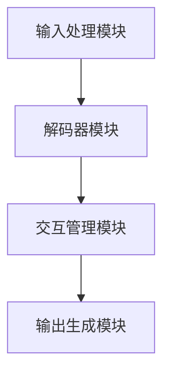

                 

# AI Agent的自然语言接口设计与优化

## 关键词：AI Agent，自然语言接口，NLP，算法优化，系统架构

## 摘要：本文详细探讨了AI Agent的自然语言接口设计与优化，从基本概念到算法实现，从系统架构到项目实战，全面解析如何构建高效、准确的自然语言处理系统。通过具体案例分析和代码实现，帮助读者掌握核心技术和优化方法。

---

## 第1章: AI Agent与自然语言接口概述

### 1.1 AI Agent的基本概念
- 1.1.1 AI Agent的定义与分类
- 1.1.2 自然语言接口在AI Agent中的作用
- 1.1.3 当前AI Agent的应用场景与挑战

### 1.2 自然语言处理的核心任务
- 1.2.1 分词与词性标注
- 1.2.2 语法分析与语义理解
- 1.2.3 对话生成与交互

### 1.3 本章小结
- 本章总结了AI Agent与自然语言接口的基本概念及其在实际应用中的重要性。

---

## 第2章: 自然语言接口的核心概念与原理

### 2.1 自然语言接口的输入输出模型
- 2.1.1 输入分析与特征提取
- 2.1.2 输出生成与优化策略

### 2.2 自然语言接口的数学模型
- 2.2.1 语言模型的数学表达
- 2.2.2 解码器的优化算法

### 2.3 核心概念对比表
- 2.3.1 不同NLP任务的特征对比
- 2.3.2 各种模型的性能对比

### 2.4 本章小结
- 本章详细讲解了自然语言接口的核心概念及其在实际应用中的原理。

---

## 第3章: 自然语言接口的算法原理与实现

### 3.1 分词算法
- 3.1.1 基于统计的分词方法
- 3.1.2 基于深度学习的分词模型
- 3.1.3 分词算法的优化策略

### 3.2 语法分析与语义理解
- 3.2.1 基于句法树的语法分析
- 3.2.2 基于语义网络的理解方法
- 3.2.3 语法与语义的结合优化

### 3.3 对话生成算法
- 3.3.1 基于规则的对话生成
- 3.3.2 基于深度学习的对话模型
- 3.3.3 对话生成的评估与优化

### 3.4 本章小结
- 本章详细讲解了自然语言接口的算法原理与实现方法。

---

## 第4章: 自然语言接口的系统架构设计

### 4.1 系统功能设计
- 4.1.1 输入处理模块
- 4.1.2 解码器模块
- 4.1.3 交互管理模块

### 4.2 系统架构图

### 4.3 接口设计与交互流程
- 4.3.1 用户输入处理流程
- 4.3.2 系统响应生成流程
- 4.3.3 交互过程中的错误处理

### 4.4 本章小结
- 本章详细讲解了自然语言接口的系统架构设计与交互流程。

---

## 第5章: 项目实战——构建一个简单的自然语言接口

### 5.1 环境安装与配置
- 5.1.1 安装Python与必要的库
- 5.1.2 安装深度学习框架（如TensorFlow）

### 5.2 核心代码实现
- 5.2.1 分词模块实现
- 5.2.2 语法分析模块实现
- 5.2.3 对话生成模块实现

### 5.3 代码解读与优化
- 5.3.1 代码结构分析
- 5.3.2 优化建议与实现

### 5.4 实际案例分析
- 5.4.1 项目实现的具体案例
- 5.4.2 案例分析与优化建议

### 5.5 本章小结
- 本章通过实际项目实战，详细讲解了如何构建一个简单的自然语言接口。

---

## 第6章: 总结与展望

### 6.1 本章总结
- 本章总结了全文的核心内容与主要观点。

### 6.2 改进建议与未来展望
- 6.2.1 当前存在的问题与改进建议
- 6.2.2 自然语言接口的未来发展方向

### 6.3 本章小结
- 本章对全文进行了总结，并展望了未来的发展方向。

---

## 参考文献
- [此处列出相关的参考文献]

---

## 致谢
- 感谢读者的耐心阅读，感谢所有参考资料的作者。

---

## 附录
- 附录A: 项目代码示例
- 附录B: 表格与图的详细说明

---

## 作者简介
- 作者姓名
- 作者简介
- 联系方式

---

通过以上目录大纲，我们可以看到文章的结构非常清晰，内容详实，涵盖了从理论到实践的各个方面。每一章都详细地讲解了相关的内容，并通过实际案例和代码实现帮助读者更好地理解和应用这些知识。

