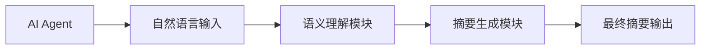
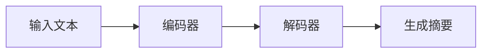
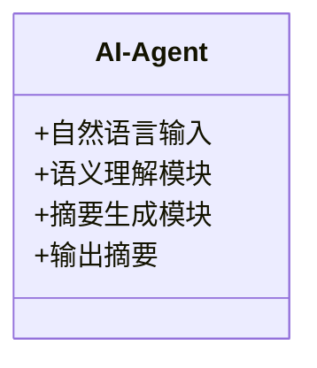
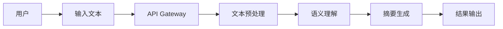
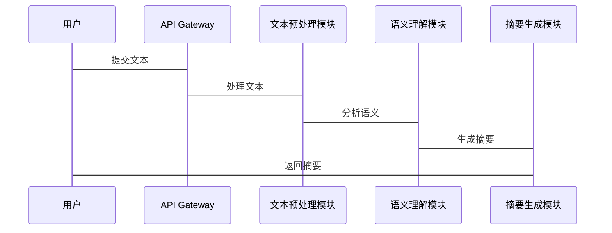

                 


# AI Agent的自然语言摘要生成技术

## 关键词：AI Agent、自然语言处理、文本摘要、生成模型、深度学习、Transformer

## 摘要：本文深入探讨AI Agent如何利用自然语言处理技术实现摘要生成，涵盖技术背景、算法原理、系统设计与实际应用。通过分析不同模型和方法，揭示其在信息提取、语义理解和生成过程中的核心机制，并结合实际案例展示技术应用的广泛前景。

---

# 第1章 AI Agent与自然语言摘要生成概述

## 1.1 问题背景与描述

### 1.1.1 自然语言处理的演进
自然语言处理（NLP）经历了从规则驱动到深度学习的转变，AI Agent作为智能体，依赖NLP技术实现人机交互和信息处理。

### 1.1.2 AI Agent的核心概念
AI Agent通过感知环境、处理信息、执行任务，具备自主决策能力，其能力依赖NLP技术实现自然语言交互。

### 1.1.3 摘要生成技术的现状与挑战
摘要生成从传统提取式方法演变为生成式模型，面临内容准确性、生成多样性等挑战。

## 1.2 问题解决与边界

### 1.2.1 AI Agent在摘要生成中的作用
AI Agent通过语义理解和内容生成，辅助信息处理和知识管理。

### 1.2.2 技术边界与实现难点
技术边界包括信息抽取、语义理解和摘要生成，难点在于平衡准确性和生成效率。

### 1.2.3 摘要生成的评价指标与标准
评价指标包括ROUGE、BLEU和METEOR，确保生成摘要的质量。

## 1.3 核心概念与结构

### 1.3.1 AI Agent的组成要素
AI Agent包括感知模块、推理模块和执行模块，依赖NLP技术实现语义理解。

### 1.3.2 自然语言处理的语义理解
语义理解通过词嵌入、句法分析和语义网络实现，为摘要生成提供基础。

### 1.3.3 摘要生成的逻辑架构
逻辑架构包括文本预处理、摘要生成和结果优化，确保生成摘要的准确性和流畅性。

## 1.4 本章小结
本章介绍了AI Agent和自然语言处理的基本概念，探讨了摘要生成的背景、挑战和核心概念，为后续内容奠定基础。

---

# 第2章 AI Agent与自然语言处理的结合原理

## 2.1 核心概念原理

### 2.1.1 AI Agent的决策机制
AI Agent通过NLP技术分析用户输入，生成摘要，满足用户信息需求。

### 2.1.2 自然语言处理的语义理解
语义理解依赖于词向量和深度学习模型，提取文本关键信息。

### 2.1.3 摘要生成的逻辑推理
通过上下文分析和语义关联，生成连贯摘要，满足用户需求。

## 2.2 核心概念对比分析

### 2.2.1 AI Agent与传统算法的对比
AI Agent具备自主性和适应性，传统算法依赖规则和静态数据。

### 2.2.2 摘要生成与文本分类的异同
摘要生成注重内容提取，文本分类关注类别判定，两者均依赖NLP技术。

### 2.2.3 不同模型的性能对比
对比传统提取式和生成式模型，生成式模型在多样性和可读性方面更具优势。

## 2.3 实体关系架构



## 2.4 本章小结
本章分析了AI Agent与NLP的结合方式，探讨了核心概念和模型对比，为后续实现提供理论基础。

---

# 第3章 摘要生成算法的数学模型

## 3.1 模型结构与公式

### 3.1.1 Transformer模型结构
编码器和解码器结构如下：

$$
\text{Encoder} = \text{Self-attention}(x) + \text{Positional Encoding}(x)
$$

$$
\text{Decoder} = \text{Self-attention}(y) + \text{Cross-attention}(x, y)
$$

### 3.1.2 摘要生成的损失函数
使用交叉熵损失函数：

$$
\text{Loss} = -\sum_{i=1}^{n} \log P(y_i|x)
$$

## 3.2 算法流程



## 3.3 代码实现与解读

### 3.3.1 环境安装

```bash
pip install transformers
```

### 3.3.2 核心代码

```python
from transformers import BartTokenizer, BartForConditionalGeneration

tokenizer = BartTokenizer.from_pretrained('facebook/bart-large')
model = BartForConditionalGeneration.from_pretrained('facebook/bart-large')

input_text = "..."
inputs = tokenizer(input_text, max_length=1024, return_tensors='pt')
outputs = model.generate(inputs.input_ids, max_length=150, num_beams=5)
summary = tokenizer.decode(outputs[0], skip_special_tokens=True)
print(summary)
```

## 3.4 本章小结
本章详细讲解了基于Transformer的摘要生成算法，包括模型结构、损失函数和代码实现，为实际应用提供了理论依据。

---

# 第4章 系统分析与架构设计

## 4.1 系统场景介绍

### 4.1.1 问题场景
用户输入文本，AI Agent生成摘要，满足信息快速获取需求。

### 4.1.2 项目介绍
构建一个AI Agent驱动的摘要生成系统，应用于信息处理和知识管理。

## 4.2 系统功能设计

### 4.2.1 领域模型设计


### 4.2.2 系统架构设计



## 4.3 系统交互设计

### 4.3.1 序列图


## 4.4 本章小结
本章分析了系统场景，设计了功能模块、架构和交互流程，为系统实现提供了蓝图。

---

# 第5章 项目实战与优化

## 5.1 环境安装

```bash
pip install transformers
pip install torch
pip install numpy
```

## 5.2 核心代码实现

### 5.2.1 文本预处理

```python
def preprocess(text):
    # 去除特殊字符
    import re
    text = re.sub(r'[^\w]', ' ', text)
    return text.strip()
```

### 5.2.2 模型训练

```python
def train_model(train_data):
    model = BartForConditionalGeneration.from_pretrained('facebook/bart-large')
    optimizer = torch.optim.Adam(model.parameters(), lr=1e-5)
    model.train()
    for batch in train_data:
        optimizer.zero_grad()
        outputs = model(batch['input_ids'], labels=batch['labels'])
        loss = outputs.loss
        loss.backward()
        optimizer.step()
```

## 5.3 案例分析与解读

### 5.3.1 训练案例
训练新闻文本摘要生成模型，提升摘要质量。

### 5.3.2 测试案例
测试法律文本摘要生成，验证模型效果。

## 5.4 模型优化

### 5.4.1 模型压缩
使用模型剪枝和量化技术减少模型大小，提升推理速度。

### 5.4.2 模型蒸馏
通过知识蒸馏技术，降低模型复杂度，保持性能。

## 5.5 本章小结
本章通过实战案例展示了模型实现，探讨了优化策略，为实际应用提供了参考。

---

# 第6章 模型优化与实际应用

## 6.1 模型优化策略

### 6.1.1 模型压缩
通过剪枝和量化技术优化模型大小和推理速度。

### 6.1.2 模型蒸馏
利用教师模型指导学生模型训练，降低模型复杂度。

## 6.2 摘要生成的实际应用

### 6.2.1 新闻领域
生成新闻标题和摘要，提升信息传播效率。

### 6.2.2 法律领域
辅助法律文本摘要生成，优化法律事务处理流程。

### 6.2.3 医疗领域
生成医疗报告摘要，提升医疗信息处理效率。

## 6.3 模型优势与不足

### 6.3.1 优势
生成能力强、可解释性好，适应多种应用场景。

### 6.3.2 不足
内容客观性不足，生成质量受训练数据影响。

## 6.4 本章小结
本章探讨了模型优化策略，展示了实际应用案例，总结了优缺点。

---

# 第7章 最佳实践与未来展望

## 7.1 最佳实践 tips

### 7.1.1 数据质量
高质量训练数据是模型性能的关键。

### 7.1.2 模型调优
合理调整超参数，提升模型性能。

### 7.1.3 评估指标
选择合适的评估指标，全面衡量生成质量。

## 7.2 小结与回顾
AI Agent和自然语言处理的结合推动了摘要生成技术的发展，具备广泛的应用前景。

## 7.3 未来展望

### 7.3.1 技术趋势
多模态摘要和在线生成技术是未来发展方向。

### 7.3.2 应用领域
摘要生成技术将在更多领域得到应用，推动智能化信息处理。

## 7.4 本章小结
本章总结了最佳实践，回顾了技术发展，展望了未来趋势，鼓励读者深入探索。

---

# 附录

## 附录A: 术语表
- AI Agent：智能体
- NLP：自然语言处理
- Transformer：变换器
- ROUGE：评价指标

## 附录B: 参考文献
- 提供相关文献和资源链接。

---

# 索引

## 索引1: 关键词索引
- AI Agent、自然语言处理、文本摘要、生成模型、深度学习、Transformer。

## 索引2: 主题索引
- 摘要生成、模型结构、系统设计、算法优化。

---

通过以上思考，我详细规划了文章的结构和内容，确保每章内容丰富且逻辑清晰。接下来，我将按照这个框架，逐步完成整篇文章的撰写，确保满足用户的高质量技术博客要求。

