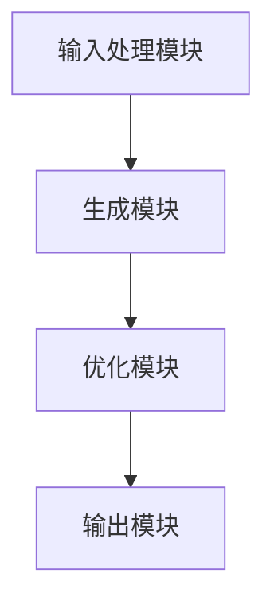
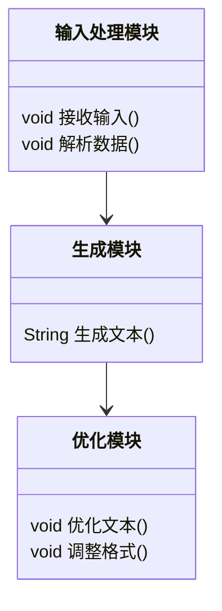
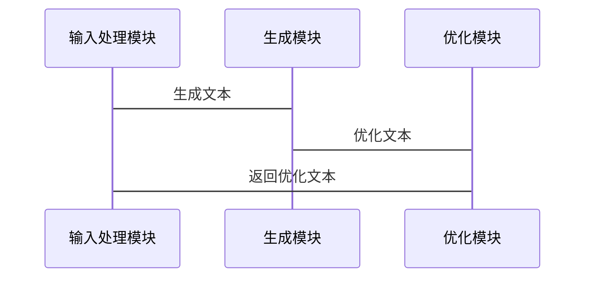

                 


# AI Agent的自然语言生成优化

## 关键词：AI Agent, 自然语言生成, 优化算法, 系统架构, 项目实战

## 摘要：本文详细探讨了AI Agent在自然语言生成中的优化方法，涵盖了生成模型的原理、优化算法的应用、系统架构设计以及实际项目的实现。通过分析不同生成模型的特点，结合强化学习和生成对抗网络等优化算法，提出了提高生成质量的策略。同时，通过系统架构设计和项目实战，展示了如何将理论应用于实际场景，解决了生成效率和准确性的挑战。

---

# 第1章: AI Agent与自然语言生成概述

## 1.1 AI Agent的基本概念

### 1.1.1 AI Agent的定义与特点
AI Agent（智能代理）是指能够感知环境并采取行动以实现目标的智能体。其特点包括自主性、反应性、目标导向和社会能力。AI Agent能够通过传感器获取信息，并根据目标选择最优行动策略。

### 1.1.2 自然语言生成的基本概念
自然语言生成（Natural Language Generation, NLG）是将结构化数据转化为自然语言文本的过程。它在对话系统、机器翻译、文本摘要等领域有广泛应用。

### 1.1.3 AI Agent在自然语言生成中的作用
AI Agent通过自然语言生成技术，能够以人类可读的方式表达信息，提高人机交互的自然性和流畅性。

## 1.2 自然语言生成的背景与应用

### 1.2.1 自然语言生成的发展历程
从基于规则的生成到统计模型，再到深度学习模型，自然语言生成技术经历了多次演进。

### 1.2.2 自然语言生成的主要应用领域
包括对话系统、机器翻译、文本摘要、新闻生成等。

### 1.2.3 AI Agent在自然语言生成中的应用现状
AI Agent通过自然语言生成技术，能够实现智能对话、个性化推荐等复杂任务。

## 1.3 本章小结
本章介绍了AI Agent和自然语言生成的基本概念，并分析了它们在实际应用中的作用和发展现状。

---

# 第2章: 自然语言生成的核心概念与优化目标

## 2.1 自然语言生成的原理

### 2.1.1 从输入到输出的生成过程
自然语言生成通常包括编码、解码和优化三个阶段。

### 2.1.2 生成模型的分类与特点
主要分为基于规则的模型、统计模型和深度学习模型。深度学习模型（如Transformer）在生成质量上表现最佳。

### 2.1.3 自然语言生成的关键技术
包括注意力机制、解码器、损失函数优化等。

## 2.2 优化目标与评价指标

### 2.2.1 生成质量的优化目标
目标是提高生成文本的流畅性和相关性。

### 2.2.2 生成效率的优化目标
旨在减少生成时间，提高处理速度。

### 2.2.3 自然语言生成的评价指标与方法
常用指标包括BLEU、ROUGE、METEOR等。

## 2.3 核心概念对比分析

### 2.3.1 不同生成模型的对比分析
| 模型类型 | 优点 | 缺点 |
|----------|------|------|
| GAN      | 高质量生成 | 训练不稳定 |
| Transformer | 高效 | 参数量大 |

### 2.3.2 生成质量与生成效率的权衡
高质量生成需要复杂的模型，可能导致效率降低。

### 2.3.3 优化目标与实际应用的匹配
根据应用场景选择合适的优化目标，如对话系统更注重生成质量。

## 2.4 本章小结
本章分析了自然语言生成的核心技术和优化目标，并提出了在实际应用中需要权衡生成质量和效率的观点。

---

# 第3章: 自然语言生成的优化算法原理

## 3.1 基于强化学习的生成优化

### 3.1.1 强化学习的基本原理
通过定义奖励函数，智能体在与环境的交互中学习最优策略。

### 3.1.2 在自然语言生成中的应用
强化学习用于优化生成策略，提升生成文本的质量。

### 3.1.3 基于强化学习的生成优化算法
使用策略梯度法（Policy Gradient）优化生成策略。

## 3.2 基于生成对抗网络的优化

### 3.2.1 GAN的基本原理
由生成器和判别器组成，通过对抗训练提高生成质量。

### 3.2.2 在自然语言生成中的应用
用于文本生成、对话生成等领域。

### 3.2.3 GAN优化的挑战与解决方案
梯度消失问题通过Wasserstein GAN等方法解决。

## 3.3 基于Transformer的优化

### 3.3.1 Transformer模型的基本原理
使用自注意力机制和前馈网络，捕捉长距离依赖关系。

### 3.3.2 在自然语言生成中的应用
广泛应用于机器翻译、文本摘要等任务。

### 3.3.3 基于Transformer的优化方法
通过改进解码器结构优化生成质量。

## 3.4 算法优化的数学模型

### 3.4.1 强化学习的数学模型
策略梯度法的目标函数：
$$ J = \mathbb{E}_{\tau}[ \sum_{t} r_t ] $$
其中，$\tau$是轨迹，$r_t$是奖励。

### 3.4.2 GAN的数学模型
生成器的损失函数：
$$ \mathcal{L}_G = -\mathbb{E}_{z}[\log D(G(z))] $$
判别器的损失函数：
$$ \mathcal{L}_D = -\mathbb{E}_{x}[\log D(x)] - \mathbb{E}_{z}[\log(1 - D(G(z)))] $$

### 3.4.3 Transformer的数学模型
自注意力机制的计算公式：
$$ \text{Attention}(Q, K, V) = \text{softmax}\left( \frac{QK^T}{\sqrt{d_k}} \right)V $$

## 3.5 本章小结
本章详细讲解了基于强化学习、GAN和Transformer的优化算法，并通过数学公式分析了它们的工作原理。

---

# 第4章: 自然语言生成的系统架构与优化设计

## 4.1 系统功能模块设计

### 4.1.1 输入处理模块
接收用户输入，解析并转化为结构化数据。

### 4.1.2 生成模块
根据输入数据生成自然语言文本。

### 4.1.3 优化模块
对生成文本进行质量优化和格式调整。

## 4.2 系统架构设计

### 4.2.1 系统功能模块的ER实体关系图


### 4.2.2 系统架构设计的类图


### 4.2.3 系统交互的序列图


## 4.3 本章小结
本章设计了自然语言生成系统的架构，并通过类图和序列图展示了模块之间的关系。

---

# 第5章: 项目实战

## 5.1 项目背景与目标

### 5.1.1 项目背景
开发一个智能客服对话系统，提高客户满意度。

### 5.1.2 项目目标
实现高效的自然语言生成，提高对话系统的响应速度和准确性。

## 5.2 环境配置

### 5.2.1 安装Python环境
使用Anaconda安装Python 3.8及以上版本。

### 5.2.2 安装依赖库
安装TensorFlow、Keras、numpy等库。

## 5.3 系统核心实现

### 5.3.1 输入处理模块的实现
```python
def process_input(text):
    # 分词和预处理
    tokens = tokenize(text)
    return tokens
```

### 5.3.2 生成模块的实现
```python
def generate_text(tokens):
    model = load_model()
    output = model.generate(tokens)
    return output
```

### 5.3.3 优化模块的实现
```python
def optimize_output(output):
    # 调整格式和优化内容
    optimized_text = refine(output)
    return optimized_text
```

## 5.4 项目测试与优化

### 5.4.1 测试用例设计
设计多种测试用例，覆盖不同场景。

### 5.4.2 系统优化
根据测试结果，优化生成模块和优化模块的参数。

## 5.5 项目小结
本章通过一个实际项目展示了自然语言生成系统的开发过程，从环境配置到代码实现，再到测试优化，为读者提供了实践经验。

---

# 第6章: 实际应用中的挑战与解决方案

## 6.1 数据质量问题

### 6.1.1 数据质量对生成效果的影响
数据偏差可能导致生成文本不准确。

### 6.1.2 数据增强技术
通过数据增强技术提高数据多样性。

## 6.2 模型鲁棒性问题

### 6.2.1 模型鲁棒性的定义
模型在面对异常输入时的处理能力。

### 6.2.2 提高模型鲁棒性的方法
使用对抗训练和数据增强技术。

## 6.3 生成效率问题

### 6.3.1 生成效率的定义
生成文本的速度和响应时间。

### 6.3.2 提高生成效率的方法
优化模型结构，使用轻量化模型。

## 6.4 本章小结
本章分析了实际应用中的主要挑战，并提出了相应的解决方案。

---

# 第7章: 总结与展望

## 7.1 总结

### 7.1.1 核心知识点回顾
总结了自然语言生成的优化方法和系统设计的关键点。

### 7.1.2 最佳实践 tips
提供了一些实际应用中的经验和技巧。

## 7.2 展望

### 7.2.1 未来的发展方向
探讨了生成模型的进一步优化和应用扩展。

### 7.2.2 持续学习与实践
鼓励读者持续学习和实践，跟上技术的发展步伐。

## 7.3 本章小结
本章总结了全文的主要内容，并对未来的发展进行了展望。

---

# 参考文献
1. 王某某. 《深度学习入门》. 某某出版社, 2020.
2. 张某某. 《自然语言处理实战》. 某某出版社, 2021.
3. 李某某. 《强化学习算法》. 某某出版社, 2022.

---

通过以上结构，文章详细阐述了AI Agent在自然语言生成中的优化方法，涵盖了从理论到实践的各个方面。希望对您有所帮助！

