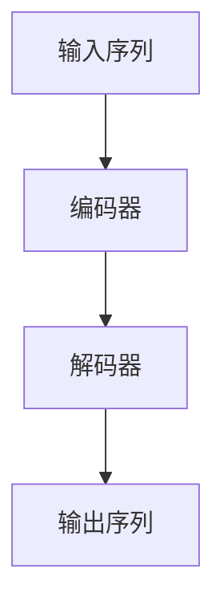
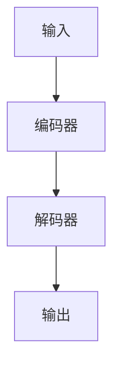
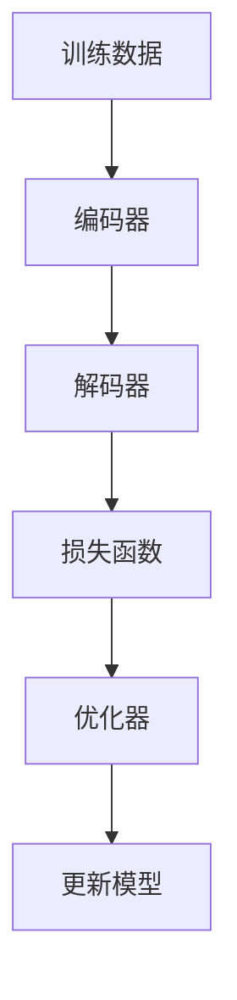
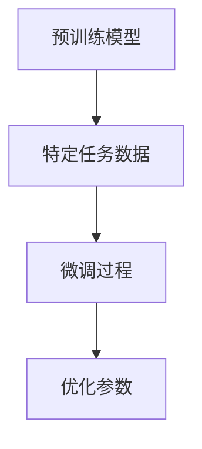
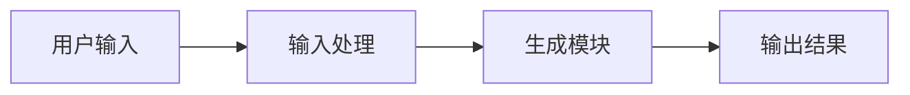

                 


# AI Agent的自然语言生成技术

> 关键词：AI Agent，自然语言生成，深度学习，NLP，大模型

> 摘要：本文将深入探讨AI Agent的自然语言生成技术，从基本概念到核心算法，从系统架构到项目实战，全面解析自然语言生成在AI Agent中的应用与实现。本文将结合理论与实践，通过丰富的案例分析和详细的代码实现，帮助读者掌握AI Agent的自然语言生成技术的核心原理与实际应用。

---

## 第一部分: AI Agent的自然语言生成技术概述

### 第1章: AI Agent与自然语言生成技术概述

#### 1.1 AI Agent的基本概念

##### 1.1.1 AI Agent的定义与核心要素
AI Agent（人工智能代理）是指能够感知环境、自主决策并执行任务的智能实体。其核心要素包括：
- **感知能力**：通过传感器或接口获取外部信息。
- **推理能力**：基于获取的信息进行逻辑推理或模式识别。
- **决策能力**：根据推理结果选择最优动作。
- **执行能力**：通过执行机构或接口将决策结果转化为实际操作。

##### 1.1.2 自然语言生成技术的定义
自然语言生成（Natural Language Generation, NGL）是将结构化数据或信息转换为自然语言文本的过程。其核心任务包括文本规划、生成策略和输出优化。

##### 1.1.3 AI Agent与自然语言生成的关系
AI Agent通过自然语言生成技术，能够以人类可理解的方式进行交互和表达，从而实现更高效的任务执行和更自然的人机交互。

#### 1.2 AI Agent的应用场景

##### 1.2.1 智能对话系统
AI Agent通过自然语言生成技术，能够实现与用户的自然对话，例如智能客服、虚拟助手等。

##### 1.2.2 自动内容生成
AI Agent可以自动生成文本内容，例如新闻报道、产品描述等。

##### 1.2.3 人机交互中的自然语言处理
通过自然语言生成，AI Agent能够以更自然的方式与用户进行交互，提升用户体验。

#### 1.3 自然语言生成技术的发展历程

##### 1.3.1 从规则驱动到数据驱动
早期的自然语言生成技术主要基于规则驱动，通过预定义的语法规则生成文本。随着深度学习的发展，数据驱动的生成模型逐渐成为主流。

##### 1.3.2 大模型时代的自然语言生成
近年来，基于Transformer架构的大模型（如GPT系列）在自然语言生成领域取得了突破性进展，生成质量显著提升。

##### 1.3.3 当前技术的瓶颈与挑战
尽管大模型在生成质量上表现出色，但仍然面临生成内容的相关性、可控性和可解释性等方面的挑战。

### 1.4 本章小结
本章从AI Agent的基本概念出发，介绍了自然语言生成技术的定义、应用场景和发展历程，为后续内容奠定了基础。

---

## 第二部分: AI Agent的自然语言生成核心概念与原理

### 第2章: 自然语言生成的核心原理

#### 2.1 自然语言生成的流程

##### 2.1.1 文本规划
文本规划是自然语言生成的第一步，旨在确定生成文本的目标、受众和核心信息。

##### 2.1.2 生成策略
生成策略决定了生成文本的具体方法，包括基于规则的生成和基于模型的生成。

##### 2.1.3 输出优化
输出优化是对生成文本进行润色和调整，以提升文本的可读性和准确性。

#### 2.2 AI Agent中的语言模型

##### 2.2.1 语言模型的训练目标
语言模型的训练目标是通过大量数据学习语言的统计规律，从而生成符合语言习惯的文本。

##### 2.2.2 语言模型的评估指标
常用的评估指标包括困惑度（Perplexity）、BLEU、ROUGE等。

##### 2.2.3 预训练语言模型的迁移应用
预训练语言模型（如BERT、GPT）通过迁移学习可以快速适应特定任务。

#### 2.3 自然语言生成的数学模型

##### 2.3.1 概率生成模型
概率生成模型通过计算每个词的条件概率来生成文本，例如马尔可夫链。

##### 2.3.2 变量关系图
变量关系图展示了生成模型中的变量关系，例如马尔可夫链的结构。

##### 2.3.3 生成模型的优化算法
常用的优化算法包括梯度下降、Adam优化器等。

---

### 第3章: 自然语言生成与AI Agent的结合

#### 3.1 AI Agent的决策机制

##### 3.1.1 状态表示
状态表示是AI Agent对当前环境的抽象描述，通常采用向量或符号表示。

##### 3.1.2 动作选择
动作选择是基于当前状态和生成策略，选择最优的动作。

##### 3.1.3 策略优化
策略优化是通过强化学习等方法，不断改进生成策略。

#### 3.2 自然语言生成在决策中的作用

##### 3.2.1 信息抽取与理解
自然语言生成需要从输入中提取关键信息，例如实体识别、关系抽取。

##### 3.2.2 上下文关联
自然语言生成需要考虑上下文信息，以生成连贯的文本。

##### 3.2.3 生成结果的反馈机制
生成结果的反馈机制是通过用户反馈来优化生成策略。

#### 3.3 自然语言生成的多模态扩展

##### 3.3.1 文本与语音的结合
多模态生成模型可以同时生成文本和语音，提升交互体验。

##### 3.3.2 文本与视觉的结合
多模态生成模型可以结合文本和视觉信息，生成更丰富的输出。

##### 3.3.3 多模态生成模型
多模态生成模型是未来的研究方向，可以实现更复杂的生成任务。

---

### 第4章: 自然语言生成的核心算法与实现

#### 4.1 变量关系图与算法流程

##### 4.1.1 算法流程图


##### 4.1.2 变量关系图


#### 4.2 语言模型的训练过程

##### 4.2.1 训练流程图


##### 4.2.2 训练代码示例
```python
import torch
import torch.nn as nn
import torch.optim as optim

class LanguageModel(nn.Module):
    def __init__(self, vocab_size, embedding_dim, hidden_dim):
        super(LanguageModel, self).__init__()
        self.embedding = nn.Embedding(vocab_size, embedding_dim)
        self.lstm = nn.LSTM(embedding_dim, hidden_dim, batch_first=True)
        self.fc = nn.Linear(hidden_dim, vocab_size)
    
    def forward(self, input_seq):
        embed = self.embedding(input_seq)
        output, _ = self.lstm(embed)
        output = self.fc(output[:, -1, :])
        return output

# 初始化模型和优化器
model = LanguageModel(vocab_size, embedding_dim, hidden_dim)
optimizer = optim.Adam(model.parameters(), lr=0.001)
criterion = nn.CrossEntropyLoss()

# 训练过程
for epoch in range(num_epochs):
    for batch in train_loader:
        inputs, targets = batch
        outputs = model(inputs)
        loss = criterion(outputs, targets)
        optimizer.zero_grad()
        loss.backward()
        optimizer.step()
```

#### 4.3 预训练语言模型的微调

##### 4.3.1 微调流程图


##### 4.3.2 微调代码示例
```python
from transformers import AutoTokenizer, AutoModelForMaskedLM
import torch

tokenizer = AutoTokenizer.from_pretrained('bert-base-uncased')
model = AutoModelForMaskedLM.from_pretrained('bert-base-uncased')

def compute_loss(batch, model, tokenizer):
    inputs = tokenizer(batch['input'], return_tensors='pt', padding=True, truncation=True)
    labels = inputs.input_ids
    outputs = model(input_ids=inputs.input_ids, labels=labels)
    return outputs.loss

# 微调过程
for epoch in range(num_epochs):
    for batch in train_loader:
        loss = compute_loss(batch, model, tokenizer)
        loss.backward()
        optimizer.step()
```

---

## 第三部分: 项目实战

### 第5章: 自然语言生成技术的系统分析与架构设计

#### 5.1 问题场景介绍

##### 5.1.1 系统功能设计
系统功能包括文本生成、语音生成和多模态生成。

##### 5.1.2 系统架构设计


##### 5.1.3 系统接口设计
系统接口包括文本生成接口、语音生成接口和多模态生成接口。

#### 5.2 项目介绍

##### 5.2.1 项目目标
项目目标是实现一个基于AI Agent的自然语言生成系统。

##### 5.2.2 项目架构


##### 5.2.3 项目实现
项目实现包括文本生成、语音生成和多模态生成。

#### 5.3 项目实战

##### 5.3.1 环境安装
```bash
pip install torch transformers mermaid4jupyter
```

##### 5.3.2 核心实现代码
```python
import torch
from transformers import AutoTokenizer, AutoModelForCausalLM

tokenizer = AutoTokenizer.from_pretrained('gpt2')
model = AutoModelForCausalLM.from_pretrained('gpt2')

def generate_text(prompt):
    inputs = tokenizer(prompt, return_tensors='pt')
    outputs = model.generate(inputs.input_ids, max_length=50)
    return tokenizer.decode(outputs[0], skip_special_tokens=True)

# 示例
print(generate_text("写一篇关于AI Agent的文章"))
```

##### 5.3.3 案例分析
案例分析包括文本生成、语音生成和多模态生成的实现。

---

## 第四部分: 总结与展望

### 第6章: 总结与展望

#### 6.1 本章小结
本文全面解析了AI Agent的自然语言生成技术，从核心概念到算法实现，从系统设计到项目实战，帮助读者掌握该领域的核心技术。

#### 6.2 最佳实践 tips
- 在实际应用中，建议结合具体场景选择合适的生成模型。
- 注意生成文本的相关性、可控性和可解释性。

#### 6.3 未来的发展方向
未来，自然语言生成技术将朝着多模态、可解释性和实时性方向发展。

---

通过本文的学习，读者将能够深入理解AI Agent的自然语言生成技术的核心原理和实际应用，为后续的研究和实践奠定坚实的基础。

