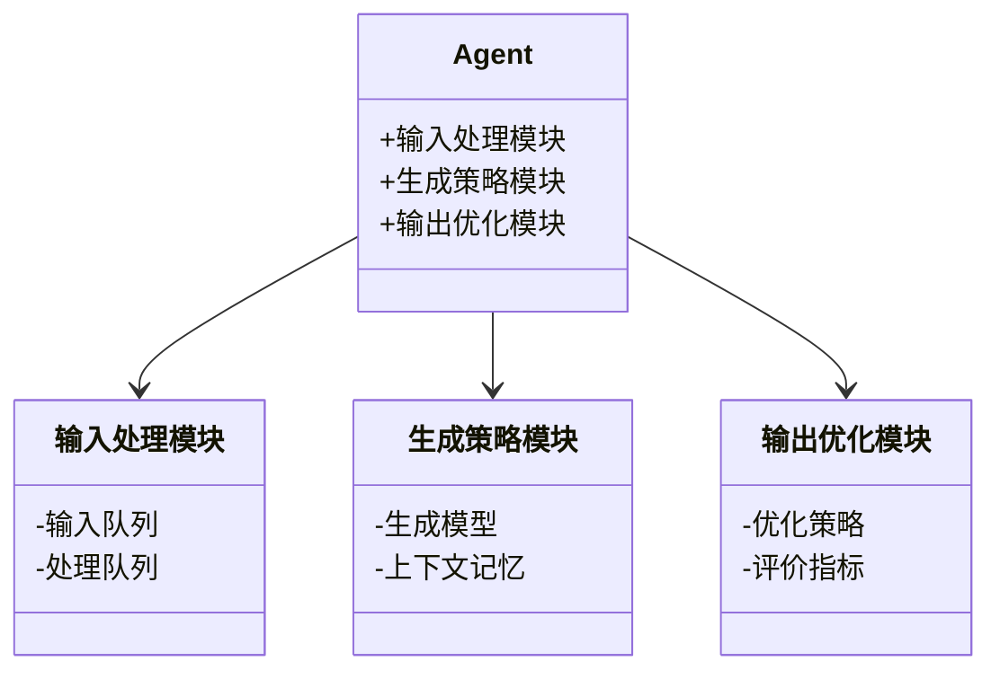
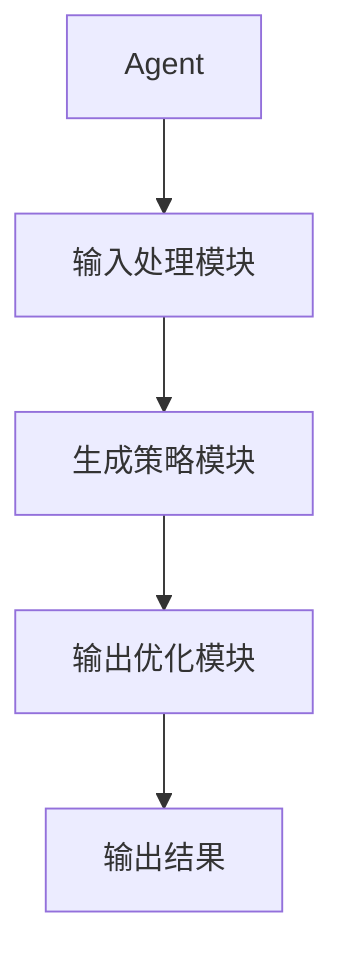
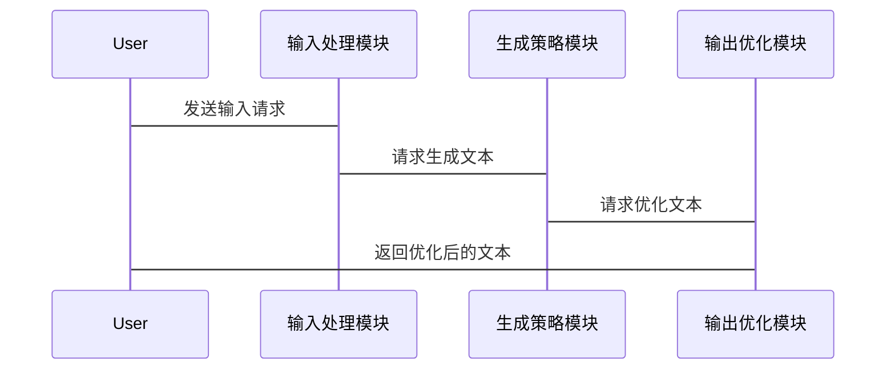

                 


# AI Agent的自然语言生成能力开发

> 关键词：AI Agent，自然语言生成，深度学习，Transformer，自然语言处理

> 摘要：AI Agent的自然语言生成能力是实现人机交互智能化的重要技术，本文从AI Agent的基本概念出发，详细探讨了自然语言生成的原理与技术发展，深入分析了AI Agent自然语言生成能力开发的核心概念与算法原理，最后通过实际案例展示了如何开发具备自然语言生成能力的AI Agent。

---

# 第1章: AI Agent与自然语言生成概述

## 1.1 AI Agent的基本概念

### 1.1.1 AI Agent的定义与特点
AI Agent（人工智能代理）是指能够感知环境并采取行动以实现目标的智能体。AI Agent具有以下特点：
- **自主性**：能够在没有外部干预的情况下自主运行。
- **反应性**：能够根据环境反馈实时调整行为。
- **目标导向性**：所有行为都以实现特定目标为导向。
- **社会性**：能够与其他Agent或人类进行交互协作。

### 1.1.2 AI Agent的核心功能与应用场景
AI Agent的核心功能包括：
- **感知环境**：通过传感器或API获取环境信息。
- **决策与推理**：基于感知信息进行推理和决策。
- **执行动作**：根据决策结果执行实际操作。
- **学习与优化**：通过经验改进自身的性能。

AI Agent的应用场景广泛，包括智能助手、聊天机器人、推荐系统、自动驾驶等。

### 1.1.3 自然语言生成在AI Agent中的重要性
自然语言生成（Natural Language Generation, NLG）是AI Agent与人类进行有效交互的关键技术。通过NLP生成自然流畅的语言，AI Agent能够更自然地与人类沟通，提升用户体验。

---

## 1.2 自然语言生成的背景与技术发展

### 1.2.1 自然语言生成的定义与技术路径
自然语言生成是指将结构化数据或信息转换为自然语言文本的过程。主要技术路径包括基于规则的生成、统计机器学习生成和深度学习生成。

### 1.2.2 自然语言生成技术的发展历程
1. **基于规则的生成**：早期的NLG系统通过编写大量规则来生成文本，这种方式效率低且难以应对复杂场景。
2. **统计机器学习生成**：通过分析大量文本数据，利用统计模型生成文本，但生成结果的多样性有限。
3. **深度学习生成**：基于Transformer架构的模型（如GPT）能够生成高质量的自然语言文本，成为当前主流。

### 1.2.3 当前主流的自然语言生成方法
当前主流的自然语言生成方法包括：
- **Seq2Seq模型**：基于编码器-解码器架构，广泛应用于机器翻译和文本摘要。
- **GPT系列模型**：基于自注意力机制的生成式模型，能够生成连贯的自然语言文本。
- **Pointer-Net**：通过指针机制生成文本，常用于文本摘要和机器翻译。

---

## 1.3 AI Agent与自然语言生成的结合

### 1.3.1 AI Agent的自然语言生成需求
AI Agent需要具备以下自然语言生成能力：
- **对话生成**：与用户进行自然语言对话。
- **文本摘要**：将长文本压缩为关键信息。
- **问题解答**：根据用户输入生成准确的答案。

### 1.3.2 自然语言生成在AI Agent中的应用场景
1. **智能助手**：如Siri、Alexa，能够通过自然语言生成与用户交互。
2. **聊天机器人**：如ChatGPT，能够生成自然流畅的对话。
3. **内容生成**：如新闻标题生成、产品描述生成。

### 1.3.3 本章小结
本章介绍了AI Agent的基本概念、自然语言生成的技术发展以及两者的结合方式，为后续内容奠定了基础。

---

# 第2章: 自然语言生成的核心概念与原理

## 2.1 自然语言生成的原理与流程

### 2.1.1 自然语言生成的基本流程
自然语言生成的基本流程包括：
1. **输入处理**：接收结构化数据或自然语言输入。
2. **内容规划**：确定生成文本的主题、语气和风格。
3. **文本生成**：将规划的内容转换为自然语言文本。
4. **输出优化**：对生成文本进行润色和调整，提升可读性和准确性。

### 2.1.2 从输入到输出的转换过程
从输入到输出的转换过程可以表示为：
$$ 输入 \xrightarrow{处理} 规划 \xrightarrow{生成} 输出 $$

### 2.1.3 自然语言生成的关键技术点
- **内容规划**：确保生成文本符合用户意图。
- **文本生成**：基于深度学习模型生成高质量文本。
- **输出优化**：通过后处理提升文本质量。

---

## 2.2 自然语言生成的核心算法与模型

### 2.2.1 基于规则的生成方法
基于规则的生成方法通过编写大量语法规则生成文本，但灵活性和可扩展性较差。

### 2.2.2 统计机器学习的生成方法
统计机器学习的生成方法通过分析大量文本数据，利用概率模型生成文本，但生成结果的多样性有限。

### 2.2.3 基于深度学习的生成模型
基于深度学习的生成模型是当前主流方法，主要包括：
- **Seq2Seq模型**：编码器将输入转换为隐含向量，解码器将隐含向量生成目标文本。
- **GPT模型**：基于自注意力机制的生成式模型，能够生成连贯的自然语言文本。

---

## 2.3 自然语言生成的评价指标

### 2.3.1 基于语言学的评价指标
- **BLEU**：基于n-gram的精确度计算。
- **ROUGE**：基于召回率的评价指标。

### 2.3.2 基于任务性能的评价指标
- **准确率**：生成文本与预期结果的匹配程度。
- **F1值**：综合考虑精确率和召回率。

### 2.3.3 基于人类评价的指标
- **人类评分**：通过人工评估生成文本的质量和流畅度。

---

## 2.4 本章小结
本章详细讲解了自然语言生成的核心概念与原理，介绍了主流的生成算法与模型，并探讨了生成结果的评价指标。

---

# 第3章: AI Agent的自然语言生成能力开发的核心概念

## 3.1 AI Agent的自然语言生成能力框架

### 3.1.1 输入处理模块
输入处理模块负责接收用户的输入并进行预处理，例如：
- **文本清洗**：去除噪声数据。
- **语义理解**：解析用户意图。

### 3.1.2 生成策略模块
生成策略模块负责根据输入生成自然语言文本，例如：
- **基于规则的生成**：适用于简单场景。
- **基于模型的生成**：适用于复杂场景。

### 3.1.3 输出优化模块
输出优化模块负责对生成文本进行优化，例如：
- **语言润色**：提升文本的流畅性和可读性。
- **上下文调整**：根据上下文调整语气和风格。

---

## 3.2 自然语言生成的上下文理解

### 3.2.1 上下文理解的重要性
上下文理解是生成高质量文本的关键，能够帮助模型更好地理解用户意图。

### 3.2.2 基于上下文的生成策略
基于上下文的生成策略包括：
- **条件生成**：根据上下文条件生成文本。
- **基于记忆的生成**：利用记忆机制处理长文本。

### 3.2.3 上下文表示的实现方法
上下文表示的实现方法包括：
- **序列编码**：将上下文序列编码为向量。
- **注意力机制**：通过自注意力机制捕捉上下文中的关键信息。

---

## 3.3 自然语言生成的多样性与准确性

### 3.3.1 多样性生成的挑战
多样性生成的挑战包括：
- **生成结果的多样性**：如何生成多种不同的表达方式。
- **生成结果的相关性**：如何确保生成内容与上下文相关。

### 3.3.2 准确性生成的实现方法
准确性生成的实现方法包括：
- **基于规则的校正**：通过预定义规则对生成文本进行校正。
- **基于模型的校正**：通过模型对生成文本进行优化。

### 3.3.3 多样性与准确性的平衡
多样性与准确性的平衡是自然语言生成中的重要问题，可以通过以下方法实现：
- **多模型集成**：结合多个生成模型的结果，取其优点。
- **多策略生成**：采用多种生成策略，确保生成结果的多样性和准确性。

---

## 3.4 本章小结
本章详细讲解了AI Agent自然语言生成能力开发的核心概念，包括生成框架、上下文理解以及多样性与准确性的平衡。

---

# 第4章: AI Agent自然语言生成能力的算法原理

## 4.1 基于Transformer的自然语言生成模型

### 4.1.1 Transformer模型的基本结构
Transformer模型的基本结构包括编码器和解码器，每个部分都包含多个层。

### 4.1.2 自注意力机制的实现原理
自注意力机制通过计算输入序列中每个位置的权重，生成注意力向量。

### 4.1.3 解码器的生成过程
解码器通过自注意力机制和交叉注意力机制生成目标文本。

---

## 4.2 基于预训练语言模型的微调

### 4.2.1 预训练语言模型的引入
预训练语言模型通过大规模数据预训练，具备强大的语义理解能力。

### 4.2.2 微调过程中的关键参数调整
微调过程中的关键参数包括学习率、批量大小和训练轮数。

### 4.2.3 微调后的模型性能提升
微调后的模型在特定任务上的性能得到显著提升。

---

## 4.3 基于强化学习的生成优化

### 4.3.1 强化学习的基本原理
强化学习通过奖励机制优化生成结果。

### 4.3.2 强化学习在生成优化中的应用
强化学习可以用于生成文本的多样性优化和质量优化。

---

## 4.4 本章小结
本章详细讲解了AI Agent自然语言生成能力的算法原理，包括基于Transformer的生成模型、预训练语言模型的微调以及强化学习的生成优化。

---

## 4.5 项目实战：基于Transformer的自然语言生成

### 4.5.1 环境安装
需要安装以下环境：
- Python 3.8+
- TensorFlow或PyTorch
- 其他依赖库

### 4.5.2 核心代码实现

```python
import tensorflow as tf
from tensorflow.keras.layers import Dense, Dropout, InputLayer
from tensorflow.keras.models import Model

def build_model(input_dim, output_dim):
    inputs = InputLayer(input_shape=(None, input_dim))
    x = Dropout(0.1)(inputs)
    x = Dense(256, activation='relu')(x)
    x = Dropout(0.1)(x)
    outputs = Dense(output_dim)(x)
    model = Model(inputs=inputs, outputs=outputs)
    return model
```

### 4.5.3 代码功能解读与分析
上述代码定义了一个简单的神经网络模型，用于自然语言生成任务。

### 4.5.4 实际案例分析
通过训练数据生成文本，分析模型的生成效果和优化方向。

### 4.5.5 项目小结
本节通过实际案例展示了如何基于Transformer模型开发自然语言生成能力。

---

## 4.6 本章小结
本章通过理论与实践相结合的方式，详细讲解了AI Agent自然语言生成能力的算法原理，并通过实际案例展示了如何开发具备自然语言生成能力的AI Agent。

---

# 第5章: 系统分析与架构设计方案

## 5.1 项目背景与目标
本项目旨在开发一个具备自然语言生成能力的AI Agent，能够与用户进行自然语言交互。

## 5.2 系统功能设计

### 5.2.1 领域模型设计
领域模型设计采用类图形式，展示了系统的各个组件及其关系。



## 5.3 系统架构设计

### 5.3.1 系统架构设计
系统架构设计采用分层架构，包括数据层、业务逻辑层和应用层。



### 5.3.2 系统接口设计
系统接口设计包括：
- 输入接口：接收用户的输入请求。
- 输出接口：输出生成的自然语言文本。
- 管理接口：管理系统的运行状态。

## 5.4 系统交互设计

### 5.4.1 系统交互流程
系统交互流程包括：
1. 用户输入请求。
2. 输入处理模块处理输入。
3. 生成策略模块生成文本。
4. 输出优化模块优化文本。
5. 输出结果。

### 5.4.2 交互流程图


---

## 5.5 本章小结
本章通过系统分析与架构设计方案，详细讲解了如何开发具备自然语言生成能力的AI Agent。

---

# 第6章: 项目实战与经验分享

## 6.1 项目实战：AI Agent的自然语言生成实现

### 6.1.1 环境安装
需要安装以下环境：
- Python 3.8+
- TensorFlow或PyTorch
- 其他依赖库

### 6.1.2 核心代码实现

```python
import tensorflow as tf
from tensorflow.keras.layers import Dense, Dropout, InputLayer
from tensorflow.keras.models import Model

def build_model(input_dim, output_dim):
    inputs = InputLayer(input_shape=(None, input_dim))
    x = Dropout(0.1)(inputs)
    x = Dense(256, activation='relu')(x)
    x = Dropout(0.1)(x)
    outputs = Dense(output_dim)(x)
    model = Model(inputs=inputs, outputs=outputs)
    return model
```

### 6.1.3 代码功能解读与分析
上述代码定义了一个简单的神经网络模型，用于自然语言生成任务。

### 6.1.4 实际案例分析
通过训练数据生成文本，分析模型的生成效果和优化方向。

### 6.1.5 项目小结
本节通过实际案例展示了如何开发具备自然语言生成能力的AI Agent。

---

## 6.2 经验分享与问题分析

### 6.2.1 开发中的常见问题
- **生成结果的质量问题**：如何提升生成文本的质量。
- **生成结果的多样性问题**：如何生成多样化的表达方式。
- **生成结果的相关性问题**：如何确保生成内容与上下文相关。

### 6.2.2 问题解决策略
- **提升生成质量**：通过优化模型参数和引入后处理机制。
- **提升生成多样性**：通过多模型集成和多策略生成。
- **提升生成相关性**：通过上下文理解和记忆机制。

### 6.2.3 经验总结
开发具备自然语言生成能力的AI Agent需要综合考虑模型性能、生成质量和用户体验。

---

## 6.3 本章小结
本章通过项目实战和经验分享，详细讲解了如何开发具备自然语言生成能力的AI Agent，并总结了开发中的常见问题和解决策略。

---

# 第7章: 总结与展望

## 7.1 总结
本文详细讲解了AI Agent自然语言生成能力的开发，从基本概念到算法原理，再到系统设计和项目实战，为读者提供了全面的技术指导。

## 7.2 展望
随着深度学习技术的不断发展，AI Agent的自然语言生成能力将更加智能化和个性化，未来的研究方向包括：
- **多模态生成**：结合图像、语音等多种模态信息进行生成。
- **实时生成**：提升生成速度和效率。
- **个性化生成**：根据用户偏好生成个性化文本。

---

# 附录: 最佳实践与技术资源

## 1. 最佳实践
- **模型优化**：通过剪枝和量化技术优化模型性能。
- **数据处理**：确保数据质量和多样性。
- **模型部署**：通过容器化和微服务化提升系统的可扩展性。

## 2. 技术资源推荐
- **框架推荐**：TensorFlow、PyTorch。
- **模型推荐**：GPT系列模型、BERT模型。
- **工具推荐**：Hugging Face Transformers库。

---

# 结语

AI Agent的自然语言生成能力是实现人机交互智能化的重要技术，随着技术的不断发展，AI Agent将能够更好地理解和生成自然语言，为人类创造更智能、更便捷的生活体验。

