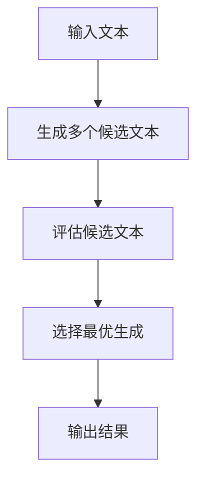
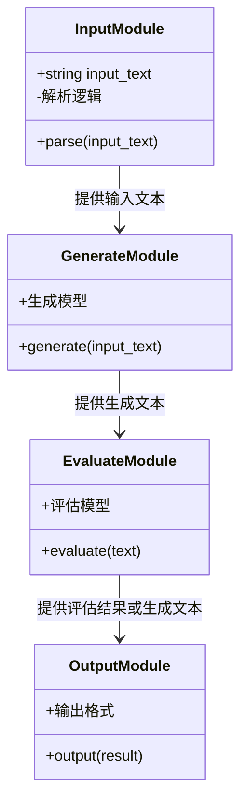

                 


---

# AI Agent的自然语言生成质量控制

> 关键词：AI Agent，自然语言生成，质量控制，算法，系统架构

> 摘要：随着AI Agent技术的快速发展，自然语言生成质量控制的重要性日益凸显。本文从AI Agent的基本概念出发，详细探讨自然语言生成质量控制的理论基础、算法实现、系统架构设计以及实际应用。通过结合具体案例和实战经验，为读者提供一份全面的技术指南，帮助他们在实际项目中实现高质量的自然语言生成。

---

## 第一部分: AI Agent与自然语言生成质量控制概述

### 第1章: AI Agent与自然语言生成概述

#### 1.1 AI Agent的基本概念

##### 1.1.1 AI Agent的定义
AI Agent（人工智能代理）是指能够感知环境并采取行动以实现特定目标的智能实体。它可以是一个软件程序，也可以是一个物理设备，通过与用户或环境交互来完成任务。

##### 1.1.2 AI Agent的核心要素
- **感知能力**：通过传感器、API或其他输入方式获取环境信息。
- **推理能力**：利用逻辑推理或机器学习模型对信息进行分析和决策。
- **行动能力**：根据推理结果执行操作，例如生成文本、发出指令或调整参数。

##### 1.1.3 自然语言生成的定义与特点
自然语言生成（Natural Language Generation, NLG）是指将结构化数据或信息转换为自然语言文本的过程。其特点包括：
- **准确性**：生成的内容必须准确反映输入数据。
- **流畅性**：生成的文本必须通顺、易于理解。
- **相关性**：生成的内容必须与用户需求或上下文相关。

#### 1.2 自然语言生成质量控制的背景

##### 1.2.1 当前自然语言生成技术的发展现状
近年来，自然语言生成技术取得了显著进展，特别是基于深度学习的模型（如GPT系列、BERT等）在生成质量上有了很大提升。然而，生成内容的质量仍存在不稳定的问题，尤其是在处理复杂任务时。

##### 1.2.2 质量控制在自然语言生成中的重要性
质量控制是确保生成文本准确、流畅和相关的关键步骤。特别是在AI Agent的应用中，高质量的自然语言生成可以提升用户体验和系统的可靠性。

##### 1.2.3 AI Agent在自然语言生成中的应用场景
- **智能客服**：生成自然流畅的对话回复。
- **内容创作**：生成新闻报道、产品描述等。
- **教育辅助**：生成个性化的学习建议。

#### 1.3 本章小结
本章介绍了AI Agent的基本概念和自然语言生成的特点，强调了质量控制的重要性，并列举了AI Agent在自然语言生成中的主要应用场景。

---

## 第二部分: 自然语言生成质量控制的理论基础

### 第2章: 自然语言生成质量评估指标

#### 2.1 质量评估的核心维度

##### 2.1.1 内容准确性
内容准确性是指生成文本是否准确反映输入数据或上下文信息。例如，在生成天气预报时，生成的文本必须准确反映天气数据。

##### 2.1.2 表达流畅性
表达流畅性是指生成文本是否通顺、易于理解。这需要生成文本符合语言学规范，避免语法错误和语义混淆。

##### 2.1.3 相关性与一致性
相关性是指生成文本与用户需求或上下文的相关性。一致性是指生成文本内部逻辑的一致性，避免前后矛盾。

#### 2.2 基于AI Agent的质量评估模型

##### 2.2.1 模型评估的数学公式
质量评估模型可以通过多个维度对生成文本进行打分，最终计算综合质量得分。例如：
$$ \text{质量得分} = 0.4 \times \text{准确性} + 0.3 \times \text{流畅性} + 0.3 \times \text{相关性} $$

其中，各维度的权重可以根据具体场景进行调整。

#### 2.3 质量评估的基准与标准

##### 2.3.1 基准测试集的构建
基准测试集是评估生成模型性能的重要工具。构建基准测试集时，需要考虑多样性和代表性，涵盖不同领域和语言风格的文本。

##### 2.3.2 行业标准与最佳实践
行业标准（如BLEU、ROUGE等）为质量评估提供了参考。同时，最佳实践包括定期更新测试集、结合人工评估和自动评估等。

#### 2.4 本章小结
本章详细介绍了自然语言生成质量评估的核心维度和评估模型，强调了基准测试和行业标准的重要性。

---

## 第三部分: AI Agent的自然语言生成质量控制算法

### 第3章: 基于AI Agent的质量控制算法原理

#### 3.1 算法原理概述

##### 3.1.1 竞争性评估算法
竞争性评估算法通过生成多个候选文本，然后从中选择最优生成。这种方法可以提高生成质量，但也需要较高的计算资源。

##### 3.1.2 基于强化学习的生成优化
强化学习（Reinforcement Learning, RL）通过奖励机制优化生成模型。生成模型根据奖励信号调整生成策略，逐步提高生成质量。

##### 3.1.3 多模型集成评估方法
多模型集成评估方法通过结合多个生成模型的结果，利用投票、加权平均等方式生成最终结果，可以有效提高生成质量。

#### 3.2 算法流程图
以下是基于竞争性评估和强化学习的算法流程图：



#### 3.3 算法实现代码

##### 竞争性评估算法实现
```python
def competitive_evaluation(input_text):
    candidates = generate_variants(input_text)  # 生成多个候选文本
    scores = evaluate_candidates(candidates)     # 评估候选文本
    selected = select_best(candidates, scores)   # 选择最优生成
    return selected
```

##### 强化学习算法实现
```python
def reinforce_learning():
    model = initialize_model()  # 初始化生成模型
    for epoch in range(num_epochs):
        for batch in batches:
            # 生成文本
            text = generate_text(model, batch)
            # 计算奖励
            reward = compute_reward(batch, text)
            # 更新模型参数
            update_model(model, text, reward)
    return model
```

#### 3.4 本章小结
本章介绍了基于AI Agent的自然语言生成质量控制算法，包括竞争性评估、强化学习和多模型集成等方法，并通过流程图和代码示例进行了详细说明。

---

## 第四部分: 系统架构与设计

### 第4章: 系统架构设计

#### 4.1 系统功能设计

##### 4.1.1 需求分析
- **输入处理**：支持多种输入格式，如文本、结构化数据等。
- **生成控制**：提供多种生成模式，如实时生成、批量生成。
- **质量评估**：支持自动评估和人工评估。

##### 4.1.2 功能模块划分
- **输入模块**：接收用户输入并解析。
- **生成模块**：基于解析结果生成文本。
- **评估模块**：对生成文本进行质量评估。
- **输出模块**：将评估结果或最终生成文本返回给用户。

##### 4.1.3 领域模型设计
领域模型设计需要考虑生成场景的具体需求。例如，在医疗领域，生成文本需要符合医疗规范和隐私要求。

#### 4.2 系统架构图
以下是系统架构设计的类图：



#### 4.3 系统接口设计

##### 4.3.1 输入接口
- **输入格式**：支持JSON、文本文件等形式。
- **API接口**：提供RESTful API，方便其他系统调用。

##### 4.3.2 输出接口
- **输出格式**：支持JSON、文本文件等形式。
- **API接口**：提供生成结果或评估结果的API。

#### 4.4 本章小结
本章详细介绍了系统的功能设计和架构设计，强调了模块化设计和接口设计的重要性。

---

## 第五部分: 项目实战与应用

### 第5章: 项目实战

#### 5.1 环境安装与配置

##### 5.1.1 安装依赖
- Python 3.8+
- PyTorch 1.9+
- transformers库
- mermaid图生成工具（可选）

##### 5.1.2 配置开发环境
- 安装Jupyter Notebook或其他IDE。
- 配置虚拟环境，安装所需依赖。

#### 5.2 系统核心实现

##### 5.2.1 生成模块实现
```python
from transformers import AutoModelForCausalLM, AutoTokenizer

model = AutoModelForCausalLM.from_pretrained('gpt2')
tokenizer = AutoTokenizer.from_pretrained('gpt2')

def generate_text(input_text):
    inputs = tokenizer(input_text, return_tensors='np')
    outputs = model.generate(**inputs, max_length=100)
    return tokenizer.decode(outputs[0], skip_special_tokens=True)
```

##### 5.2.2 评估模块实现
```python
def compute_accuracy(generated_text, reference_text):
    # 简单的文本相似度计算，实际应用中需要更复杂的算法
    return SequenceMatcher(None, generated_text, reference_text).ratio()

def evaluate_model(model, input_texts, reference_texts):
    accuracy = []
    for input_text, reference_text in zip(input_texts, reference_texts):
        generated_text = generate_text(model, input_text)
        accuracy.append(compute_accuracy(generated_text, reference_text))
    return np.mean(accuracy)
```

#### 5.3 案例分析与解读

##### 5.3.1 案例场景
假设我们正在开发一个智能客服系统，用户输入的问题需要生成自然语言回复。

##### 5.3.2 实现过程
1. 安装依赖并配置环境。
2. 使用GPT-2模型生成回复。
3. 使用预定义的评估指标对生成的文本进行质量评估。
4. 根据评估结果优化生成模型或调整评估指标。

#### 5.4 本章小结
本章通过一个实际案例，详细讲解了系统核心实现和项目实战过程，帮助读者更好地理解理论知识。

---

## 第六部分: 总结与展望

### 第6章: 总结与展望

#### 6.1 核心内容回顾
- AI Agent的基本概念和自然语言生成的特点。
- 自然语言生成质量控制的理论基础和算法实现。
- 系统架构设计和项目实战经验。

#### 6.2 最佳实践 tips

##### 6.2.1 系统设计
- 模块化设计便于维护和扩展。
- 接口设计需要考虑兼容性和扩展性。

##### 6.2.2 算法优化
- 定期更新模型和评估指标。
- 结合人工评估和自动评估。

##### 6.2.3 问题排查
- 生成文本质量不稳定时，检查模型训练数据和评估指标。
- 遇到性能瓶颈时，考虑优化算法或增加计算资源。

#### 6.3 未来展望
随着AI技术的不断进步，自然语言生成质量控制将更加智能化和自动化。未来的研究方向包括：
- 更高效的生成算法。
- 更精准的质量评估模型。
- 多模态生成与评估。

#### 6.4 小结
本章总结了全文的核心内容，并提出了未来的发展方向和最佳实践建议。

---

# 关键词总结：
AI Agent，自然语言生成，质量控制，算法，系统架构

---

这篇文章详细探讨了AI Agent在自然语言生成质量控制中的应用，从理论基础到算法实现，再到系统架构设计和实际案例分析，为读者提供了全面的技术指南。通过本文，读者可以深入了解如何在实际项目中实现高质量的自然语言生成，并为未来的研究和应用提供了重要参考。

