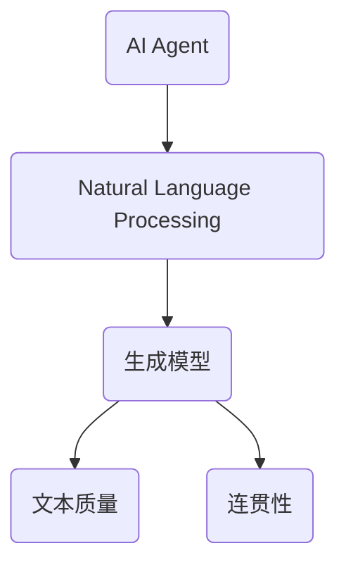
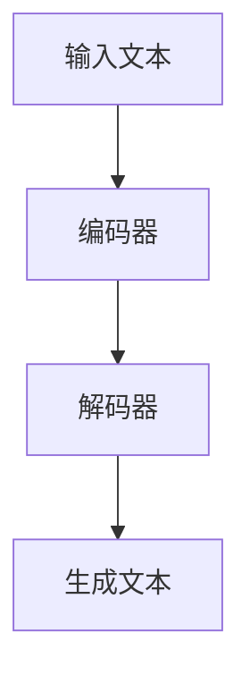
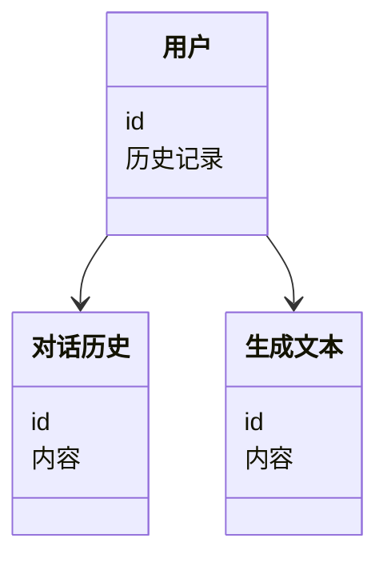
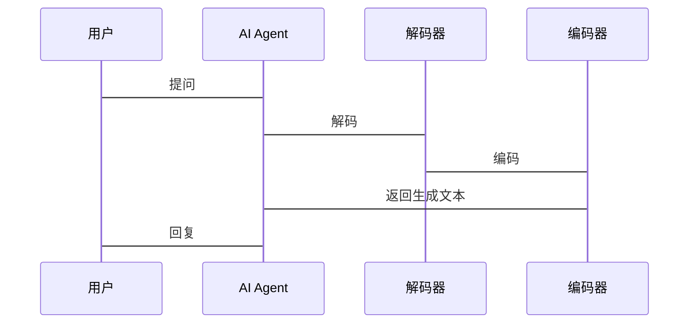

                 


# AI Agent的自然语言生成：提高文本质量和连贯性

> 关键词：AI Agent，自然语言生成，文本质量，连贯性，生成模型，NLP

> 摘要：本文探讨如何通过AI Agent提升自然语言生成的质量和连贯性。从核心概念到算法原理，从系统架构到项目实战，全面解析提高文本生成效果的方法。

---

## 第一部分: AI Agent的自然语言生成基础

### 第1章: AI Agent与自然语言生成概述

#### 1.1 问题背景与描述
自然语言生成（NLP）是AI Agent与人类交互的核心技术之一。随着AI Agent在客服、教育、医疗等领域的广泛应用，提升生成文本的质量和连贯性成为关键问题。当前的NLP模型虽然能生成连贯的文本，但常存在内容不准确、语境理解不足等问题。

#### 1.2 问题解决与边界
AI Agent通过整合上下文信息，优化生成算法，显著提升文本质量。例如，在客服系统中，AI Agent需准确理解用户需求，生成符合情境的回复。边界在于，AI Agent的生成能力依赖于数据和模型，需避免超出数据范围的生成。

#### 1.3 核心要素与概念结构
AI Agent的自然语言生成涉及生成模型、上下文理解、用户意图识别等核心要素。概念结构包括输入（用户需求）、处理（模型生成）、输出（高质量文本）。

### 第2章: 核心概念与联系

#### 2.1 AI Agent与NLP的关系
AI Agent通过NLP技术处理输入，生成符合情境的输出。NLP生成模型是AI Agent的核心组件，负责文本生成。

#### 2.2 核心概念对比表
| 比较维度 | AI Agent | NLP生成模型 |
|----------|-----------|-------------|
| 功能     | 处理输入，生成输出 | 生成文本 |
| 输入     | 用户需求 | 文本或数据 |
| 输出     | 自然语言文本 | 文本 |
| 技术基础 | NLP, ML | 深度学习 |

#### 2.3 实体关系图


### 第3章: 算法原理与数学模型

#### 3.1 生成模型的算法原理
生成模型主要基于Transformer架构，通过编码器-解码器结构处理输入，生成目标文本。

#### 3.2 数学模型与公式
- **交叉熵损失函数**：衡量生成结果与真实值的差异。
  $$L = -\sum_{i=1}^{n} \log p(y_i|x_i)$$

- **注意力机制**：计算输入序列中每个词的重要性。
  $$\text{Attention}(Q,K,V) = \text{softmax}\left(\frac{QK^T}{\sqrt{d_k}}\right)V$$

#### 3.3 算法流程图


## 第二部分: 系统分析与架构设计

### 第4章: 系统分析与架构设计

#### 4.1 问题场景
AI Agent在客服系统中生成回复，需理解用户需求，生成连贯、准确的文本。

#### 4.2 系统功能设计
- **领域模型**：定义用户、对话历史、生成文本等实体。


#### 4.3 系统架构设计
采用分层架构：
- **数据层**：存储用户数据。
- **模型层**：处理文本生成。
- **服务层**：提供API接口。
- **接口层**：与前端交互。

#### 4.4 接口设计
使用RESTful API，示例：
- 请求：`POST /generate`
- 响应：`{
    status: 200,
    message: "生成成功",
    result: "文本内容"
}`

#### 4.5 系统交互


## 第三部分: 项目实战

### 第5章: 项目实战

#### 5.1 环境安装
安装Python和必要的库：
```bash
pip install torch transformers
```

#### 5.2 核心代码实现
```python
import torch
from transformers import GPT2LMHeadModel, GPT2Tokenizer

model = GPT2LMHeadModel.from_pretrained('gpt2')
tokenizer = GPT2Tokenizer.from_pretrained('gpt2')

def generate_text(model, tokenizer, input_text):
    input_ids = tokenizer.encode(input_text, return_tensors='pt')
    outputs = model.generate(input_ids, max_length=50)
    return tokenizer.decode(outputs[0], skip_special_tokens=True)

# 示例
input_text = "如何提高学习效率？"
result = generate_text(model, tokenizer, input_text)
print(result)
```

#### 5.3 代码解读与分析
- **模型加载**：使用预训练的GPT-2模型。
- **编码器解码器交互**：将输入文本编码，通过模型生成输出。
- **结果处理**：解码生成的Tensor，返回文本。

#### 5.4 实际案例分析
分析客服系统中的应用，解释代码如何生成回复，并优化生成文本的质量。

#### 5.5 项目小结
总结项目经验，指出改进空间，如优化生成模型，增加上下文理解功能。

## 第四部分: 最佳实践

### 第6章: 最佳实践

#### 6.1 小结
AI Agent的自然语言生成需结合上下文，优化模型，提高文本质量和连贯性。

#### 6.2 注意事项
- 数据多样性
- 模型调优
- 生成结果验证

#### 6.3 拓展阅读
推荐相关书籍和论文，如《生成式AI：模型与应用》。

---

通过以上结构，文章系统地探讨了AI Agent在自然语言生成中的应用，从理论到实践，帮助读者全面理解并提升文本生成的质量和连贯性。

