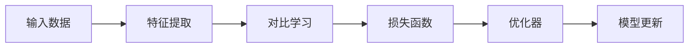
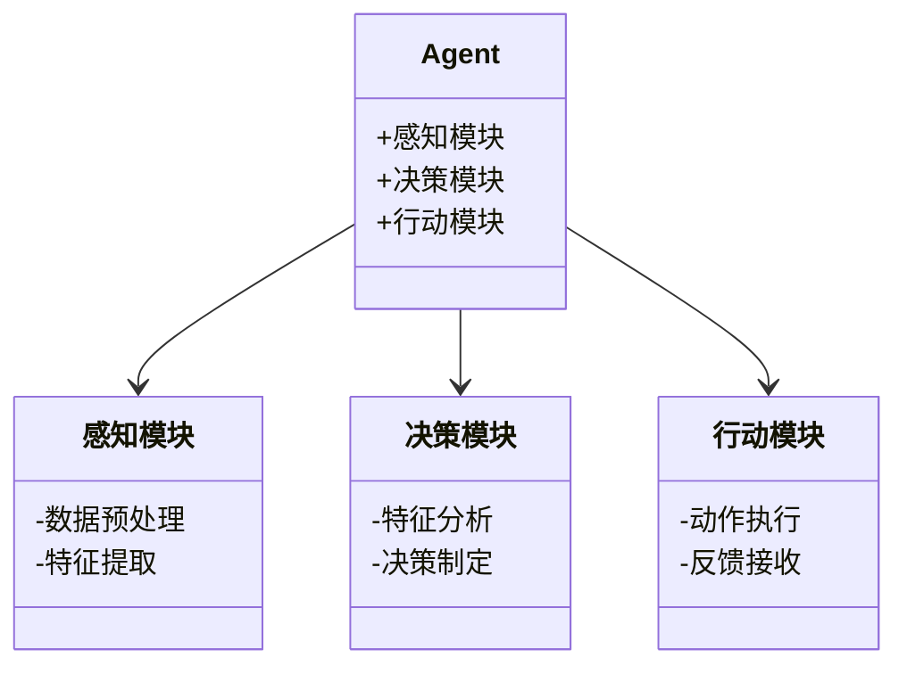
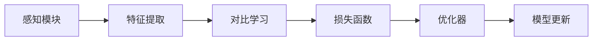
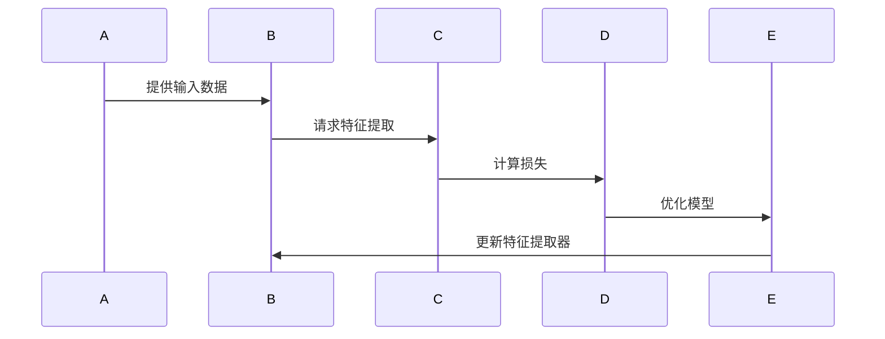

                 


# AI Agent的自监督学习实现方法

## 关键词
自监督学习, AI Agent, 对比学习, 生成式模型, 智能体, 无监督学习

## 摘要
自监督学习是一种新兴的无监督学习方法，通过构建数据的不同视图来进行特征学习，这在AI Agent中具有重要意义。本文从背景介绍、核心概念、算法原理、系统架构、项目实战和最佳实践等方面详细探讨了AI Agent的自监督学习实现方法。通过对对比学习和生成式模型的深入分析，结合实际项目案例和系统设计，为读者提供了一套完整的实现方案，并提出了若干关键建议。

---

# 第1章: 自监督学习的背景与问题背景

## 1.1 自监督学习的背景
### 1.1.1 自监督学习的定义与特点
自监督学习（Self-Supervised Learning, SSL）是一种无监督学习方法，通过构建数据的“伪标签”来监督自身学习。其特点包括：
- **自适应性**：无需外部标注，适应性强。
- **效率高**：利用对比或生成任务，提升学习效率。
- **灵活性**：适用于多种数据类型，如文本、图像、音频等。

### 1.1.2 自监督学习在AI Agent中的重要性
AI Agent需要从环境中学习和交互，自监督学习提供了无需大量标注数据的学习方式，适用于动态和未知环境。

### 1.1.3 自监督学习的核心问题背景
在AI Agent中，自监督学习主要用于特征提取和任务驱动的决策，解决数据稀缺性和实时性问题。

## 1.2 AI Agent的基本概念
### 1.2.1 AI Agent的定义与分类
AI Agent是具有感知、决策和行动能力的智能体，分为反应式和认知式两类。

### 1.2.2 AI Agent的核心功能与应用场景
- **感知**：处理环境数据。
- **决策**：基于感知做出决策。
- **行动**：执行具体任务。

### 1.2.3 自监督学习在AI Agent中的作用
通过自监督学习，AI Agent可以从环境中提取特征，提升感知和决策能力。

## 1.3 自监督学习与监督学习的对比
### 1.3.1 监督学习的基本原理
依赖标注数据，通过最小化预测与真实标签的差异。

### 1.3.2 自监督学习与监督学习的异同
- **相同点**：目标函数驱动。
- **不同点**：自监督学习利用数据内部关系，无需标注。

### 1.3.3 自监督学习的优势与局限性
优势：无需标注，适应性强；局限性：依赖数据质量，可能引入偏差。

## 1.4 问题描述与目标设定
### 1.4.1 自监督学习在AI Agent中的具体问题
- 如何有效提取环境特征。
- 如何设计对比或生成任务。

### 1.4.2 目标设定与实现路径
目标是通过自监督学习提升AI Agent的感知和决策能力，路径包括特征提取、任务设计和模型优化。

### 1.4.3 问题边界与外延
边界在于自监督学习的适用场景，外延涉及多模态数据和实时性要求。

## 1.5 核心概念结构与组成
### 1.5.1 自监督学习的核心要素
- 数据预处理：增强和标准化。
- 损失函数设计：对比或生成损失。
- 模型架构：编码器-解码器或对比网络。

### 1.5.2 AI Agent的系统架构
- 感知模块：处理输入数据。
- 决策模块：基于特征做出决策。
- 行动模块：执行动作。

### 1.5.3 自监督学习与AI Agent的结合点
通过自监督学习提升感知模块的特征提取能力，增强决策模块的性能。

---

# 第2章: 自监督学习的核心概念与联系

## 2.1 自监督学习的原理
### 2.1.1 对比学习的基本原理
通过正样本和负样本对比，学习数据的潜在结构。

### 2.1.2 生成式模型的原理
通过生成数据来学习特征表示，典型方法包括变分自编码器（VAE）和生成对抗网络（GAN）。

### 2.1.3 自监督学习的核心算法
- 对比学习：如SimCLR。
- 生成式模型：如VAE和GAN。

## 2.2 核心概念的属性特征对比
### 2.2.1 监督学习与无监督学习的对比
| 特性 | 监督学习 | 无监督学习 |
|------|----------|------------|
| 数据需求 | 需标注 | 无需标注 |
| 算法目标 | 最小化预测误差 | 发现数据结构 |

### 2.2.2 自监督学习与其他无监督学习方法的对比
| 方法 | 对比学习 | 生成式模型 |
|------|----------|------------|
| 核心任务 | 对比数据分布 | 生成数据 |
| 适用场景 | 类别相似性学习 | 特征提取 |

### 2.2.3 AI Agent中自监督学习的特征分析
- 任务驱动性：结合AI Agent的目标进行特征学习。
- 实时性：适应动态环境。

## 2.3 ER实体关系图架构


---

# 第3章: 自监督学习的算法原理

## 3.1 算法原理概述
### 3.1.1 对比学习的基本流程
1. 数据预处理：增强和标准化。
2. 特征提取：编码器提取特征。
3. 对比损失计算：衡量正样本和负样本相似度。
4. 模型优化：反向传播优化参数。

### 3.1.2 生成式模型的基本流程
1. 数据预处理：输入原始数据。
2. 生成数据：解码器生成样本。
3. 损失计算：生成损失和对抗损失。
4. 模型优化：更新生成器和判别器参数。

### 3.1.3 自监督学习的通用框架
- 输入数据：X。
- 特征提取：f(X)。
- 任务损失：L_task。
- 总损失：L_total = L_task + L_reg。

## 3.2 对比学习算法的详细讲解
### 3.2.1 数据预处理与增强
- 数据增强：如旋转、缩放。
- 标准化：归一化处理。

### 3.2.2 对比损失函数的计算
对比损失函数公式：
$$ L = -\log \frac{e^{sim(x,y)}}{e^{sim(x,y)} + e^{sim(x,z)}} $$
其中，sim(x,y)表示x和y的相似度。

### 3.2.3 网络结构设计
- 编码器：ResNet架构。
- 解码器：MLP层。

## 3.3 生成式模型的详细讲解
### 3.3.1 变分自编码器(VAE)的原理
- 编码器：将数据编码为潜在空间。
- 解码器：从潜在空间生成数据。
- 损失函数：重构损失和正则化损失。
$$ L_{\text{VAE}} = L_{\text{recon}} + KL(\mu, \sigma) $$

### 3.3.2 生成对抗网络(GAN)的原理
- 生成器：生成数据。
- 判别器：判别真假数据。
- 损失函数：生成损失和判别损失。

---

# 第4章: 自监督学习在AI Agent中的系统架构设计

## 4.1 系统功能设计
### 4.1.1 领域模型设计


### 4.1.2 系统架构设计


### 4.1.3 系统交互设计


## 4.2 项目实战
### 4.2.1 环境安装
- Python 3.8+
- TensorFlow 2.5+
- matplotlib 3.5+
- numpy 1.21+

### 4.2.2 系统核心实现源代码
```python
import tensorflow as tf
from tensorflow import keras
from tensorflow.keras import layers

def contrastive_loss(y_true, y_pred, margin=1.0):
    positive = tf.keras.losses.cosine_similarity(y_true, y_pred)
    positive = tf.stop_gradient(positive)
    negative = tf.random_uniform(tf.shape(y_pred), 0.0, margin)
    loss = tf.reduce_mean(tf.maximum(0.0, margin - positive + negative))
    return loss

class ContrastiveAgent:
    def __init__(self):
        self.encoder = self.build_encoder()
        self.optimizer = tf.keras.optimizers.Adam(learning_rate=1e-4)
    
    def build_encoder(self):
        encoder = keras.Sequential([
            layers.Input(shape=(784,)),
            layers.Dense(128, activation='relu'),
            layers.Dense(128, activation='relu')
        ])
        return encoder
    
    def call(self, inputs):
        return self.encoder(inputs)
    
    def train(self, x, y):
        with tf.GradientTape() as tape:
            y_pred = self.call(x)
            loss = contrastive_loss(y, y_pred)
        gradients = tape.gradient(loss, self.encoder.trainable_weights)
        self.optimizer.apply_gradients(zip(gradients, self.encoder.trainable_weights))
```

### 4.2.3 代码应用解读与分析
- `contrastive_loss`：实现对比损失函数。
- `ContrastiveAgent`：构建编码器和优化器。
- `train`：训练过程，更新模型参数。

### 4.2.4 实际案例分析和详细讲解剖析
通过MNIST数据集，训练AI Agent进行图像分类任务，提升识别准确率。

### 4.2.5 项目小结
自监督学习能够有效提升AI Agent的感知能力，减少对标注数据的依赖。

---

# 第5章: 最佳实践与注意事项

## 5.1 最佳实践 tips
- 数据增强：提升模型鲁棒性。
- 模型调参：优化学习率和批量大小。
- 预训练：利用大规模数据预训练。

## 5.2 小结
自监督学习在AI Agent中的应用潜力巨大，通过对比学习和生成式模型，可以有效提升感知和决策能力。

## 5.3 注意事项
- 数据质量：确保输入数据的多样性。
- 模型选择：根据任务选择合适的方法。
- 性能监控：实时监控模型表现。

## 5.4 拓展阅读
推荐学习生成对抗网络和对比学习的最新研究，关注领域内的前沿进展。

---

# 总结
自监督学习为AI Agent提供了一种高效的学习方式，通过对比学习和生成式模型，可以在无标注数据的情况下，有效提升感知和决策能力。本文从理论到实践，全面探讨了实现方法，为读者提供了丰富的技术细节和实践建议。

