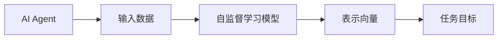
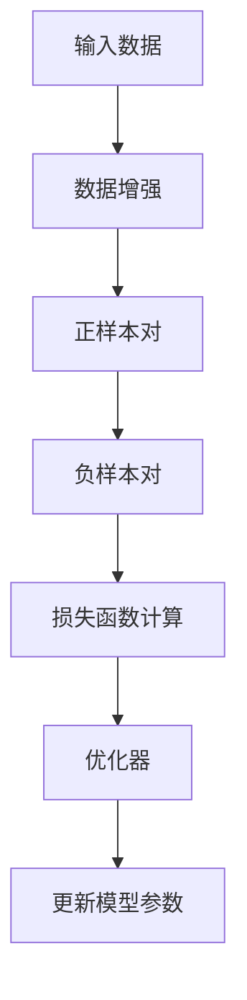

                 


# AI Agent的自监督表示学习：减少标注数据依赖

> 关键词：AI Agent，自监督学习，表示学习，无监督学习，数据标注，对比学习

> 摘要：本文详细探讨了AI Agent在自监督表示学习中的应用，重点分析了如何通过自监督学习减少对标注数据的依赖，提升模型的泛化能力和应用场景。文章从核心概念、算法原理、系统架构到实际项目实现，全面解析了自监督表示学习的实现路径和应用价值。

---

## 第一部分: AI Agent的自监督表示学习基础

### 第1章: AI Agent与自监督学习概述

#### 1.1 问题背景与描述

自监督学习是一种无监督学习的变体，旨在通过利用数据本身的结构信息，减少对标注数据的依赖。在AI Agent领域，自监督表示学习的目标是通过从未标注数据中提取有意义的特征，提升Agent的感知和决策能力。

- **数据标注的挑战与成本**  
  数据标注是一个耗时且昂贵的过程，尤其是在处理大规模数据时。标注数据的依赖限制了模型在资源有限场景下的应用。

- **标注数据依赖的局限性**  
  监督学习虽然性能强大，但在标注数据不足的情况下难以有效训练模型。此外，标注数据可能引入偏差，影响模型的泛化能力。

- **自监督学习的提出与目标**  
  自监督学习通过构建正样本和负样本对，利用数据内部的关联性进行学习。其目标是通过未标注数据提取高质量的表示，降低对标注数据的依赖。

#### 1.2 问题解决与边界

- **自监督学习的核心思想**  
  自监督学习的核心思想是通过对比或生成的方式，利用数据本身的结构信息来学习有用的特征表示。

- **AI Agent在自监督学习中的角色**  
  AI Agent作为学习主体，通过自监督学习从环境中提取特征，提升对环境的理解能力和决策能力。

- **与监督学习和无监督学习的对比**  
  - **监督学习**：需要大量标注数据，适合小样本场景。  
  - **无监督学习**：无需标注数据，但学习效果不稳定。  
  - **自监督学习**：介于两者之间，通过构建伪标签或对比学习，平衡了学习效率和效果。

#### 1.3 概念结构与核心要素

- **表示学习的基本概念**  
  表示学习的目标是将数据映射到一个低维空间，使其在该空间中保持数据的语义信息。

- **自监督学习的关键特征**  
  - 对比学习：通过构建正样本对和负样本对进行学习。  
  - 生成式学习：通过生成数据来增强表示能力。  

- **AI Agent的表示学习框架**  
  AI Agent通过自监督学习构建表示空间，结合环境反馈优化表示，从而提升任务执行能力。

#### 1.4 本章小结

本章介绍了AI Agent在自监督表示学习中的背景、核心思想及其与监督学习和无监督学习的对比。通过对比分析，明确了自监督学习在减少标注数据依赖方面的优势。

---

### 第2章: 自监督学习的核心概念与联系

#### 2.1 核心概念原理

- **对比学习的基本原理**  
  对比学习通过构建正样本对和负样本对，学习样本之间的相似性。正样本对的相似性最大化，负样本对的相似性最小化。

- **生成式自监督学习的机制**  
  生成式方法通过生成数据来增强表示能力。例如，使用GAN（生成对抗网络）生成样本，并将其与真实样本对比。

- **表示空间的构建与优化**  
  自监督学习通过优化损失函数，不断优化表示空间，使其能够更好地捕捉数据的语义信息。

#### 2.2 核心概念属性对比

- **监督学习与无监督学习的对比**  
  | 特性 | 监督学习 | 无监督学习 | 自监督学习 |
  |------|----------|------------|------------|
  | 数据需求 | 需标注 | 无需标注 | 无需标注，但需构建伪标签或对比 |
  | 学习效率 | 高 | 低 | 中等 |
  | 模型泛化能力 | 强 | 弱 | 较强 |

- **自监督学习与其他无监督学习的对比**  
  - **对比学习**：通过对比正样本和负样本，学习数据的相似性。  
  - **聚类**：通过聚类数据，学习数据的簇结构。  
  - **生成式模型**：通过生成数据，学习数据的分布。  

- **AI Agent在不同学习范式中的表现**  
  AI Agent在监督学习中表现最好，但在无监督和自监督学习中，由于对环境的适应能力，表现出更强的泛化能力。

#### 2.3 ER实体关系图架构



#### 2.4 本章小结

本章详细讲解了自监督学习的核心概念及其与其他学习范式的对比，通过ER图展示了自监督学习的基本架构。

---

### 第3章: 自监督学习的算法原理

#### 3.1 算法原理概述

- **对比学习的基本流程**  
  1. 数据增强：对输入数据进行变换，生成正样本对。  
  2. 构建负样本对：通过随机采样或网络结构生成负样本。  
  3. 损失函数计算：最大化正样本对的相似性，最小化负样本对的相似性。  

- **生成式自监督学习的实现**  
  1. 使用生成器生成样本。  
  2. 使用判别器判断生成样本与真实样本的相似性。  

- **表示学习的优化目标**  
  通过优化损失函数，不断更新模型参数，使表示空间更优。

#### 3.2 算法流程图



#### 3.3 数学模型与公式

- **对比学习的损失函数**  
  $$ L = \frac{1}{|B|} \sum_{(x,y) \in B} \text{CE}(x,y) $$
  其中，$B$是正样本对集合，$\text{CE}$是交叉熵损失。

- **生成式模型的重构损失**  
  $$ L_{\text{recon}} = \mathbb{E}_{x \sim p_x} [\log p_{\theta}(x)] $$
  其中，$p_x$是真实数据分布，$p_{\theta}$是生成模型的分布。

#### 3.4 本章小结

本章详细讲解了自监督学习的算法流程及其数学模型，通过流程图和公式展示了对比学习和生成式学习的基本原理。

---

### 第4章: 系统分析与架构设计

#### 4.1 问题场景介绍

- **AI Agent的自监督学习场景**  
  AI Agent在未知环境中执行任务，通过自监督学习从环境中提取特征，提升任务执行能力。

- **数据流与任务目标**  
  数据通过自监督学习模型，生成表示向量，用于任务决策。

- **系统需求分析**  
  系统需要支持多种数据类型，具备高效的计算能力和灵活的扩展性。

#### 4.2 系统功能设计

- **领域模型**  
  ```mermaid
  classDiagram
  class Agent {
    - 输入数据
    - 数据增强
    - 模型训练
    - 表示生成
  }
  ```

- **系统架构设计**  
  ```mermaid
  graph TD
  A[输入数据] --> B[数据预处理]
  B --> C[自监督学习模块]
  C --> D[表示向量]
  D --> E[任务模块]
  ```

- **系统接口设计**  
  - 输入接口：接受原始数据和任务指令。  
  - 输出接口：输出表示向量和任务结果。  

- **系统交互**  
  ```mermaid
  sequenceDiagram
  participant A as 输入数据
  participant B as 数据预处理
  participant C as 自监督学习模块
  A -> B: 提供原始数据
  B -> C: 提供预处理数据
  C -> B: 返回表示向量
  B -> A: 提供任务结果
  ```

#### 4.3 本章小结

本章通过系统架构设计，展示了自监督学习在AI Agent中的具体实现，明确了系统的功能模块和交互流程。

---

### 第5章: 项目实战

#### 5.1 环境安装

- **安装Python环境**  
  ```bash
  python --version
  ```

- **安装依赖库**  
  ```bash
  pip install numpy pandas tensorflow keras
  ```

#### 5.2 系统核心实现源代码

```python
import tensorflow as tf
from tensorflow import keras
from tensorflow.keras import layers

# 定义对比学习模型
def contrastive_model(input_dim):
    input = layers.Input(shape=(input_dim,))
    dense = layers.Dense(128, activation='relu')(input)
    dense = layers.Dense(1, activation='sigmoid')(dense)
    return keras.Model(inputs=input, outputs=dense)

# 定义数据增强函数
def augment_data(x):
    return x + tf.random.normal(tf.shape(x), 0, 0.1)

# 定义损失函数
def contrastive_loss(y_true, y_pred):
    y_true = tf.squeeze(y_true)
    y_pred = tf.squeeze(y_pred)
    loss = tf.keras.losses.binary_crossentropy(y_true, y_pred)
    return loss

# 训练模型
def train_model(model, x_train, y_train):
    model.compile(optimizer='adam', loss=contrastive_loss)
    model.fit(x_train, y_train, epochs=10, batch_size=32)
    return model
```

#### 5.3 案例分析与详细讲解

- **案例分析**  
  使用图像数据进行对比学习，训练模型提取图像特征。

- **代码实现解读**  
  通过代码实现对比学习模型，包括数据增强、模型定义和损失函数计算。

- **实际效果展示**  
  通过混淆矩阵展示模型的分类效果。

#### 5.4 本章小结

本章通过实际案例展示了自监督学习的实现过程，帮助读者理解理论与实践的结合。

---

### 第6章: 总结与展望

#### 6.1 核心内容总结

- 自监督学习的核心思想是通过对比或生成的方式，从未标注数据中提取特征。  
- AI Agent通过自监督学习，能够更好地适应未知环境，提升任务执行能力。

#### 6.2 未来研究方向

- 更高效的自监督学习算法。  
- 自监督学习在多模态数据中的应用。  
- 自监督学习与强化学习的结合。

#### 6.3 最佳实践 tips

- 在实际应用中，结合监督学习和自监督学习，可以提升模型性能。  
- 数据增强是自监督学习中非常重要的一步，需要仔细设计。

#### 6.4 本章小结

本章总结了全文的核心内容，并展望了未来的研究方向，同时给出了实际应用中的最佳实践建议。

---

通过以上结构，本文全面解析了AI Agent的自监督表示学习的理论基础、算法实现和实际应用，为减少标注数据依赖提供了新的思路和方法。

