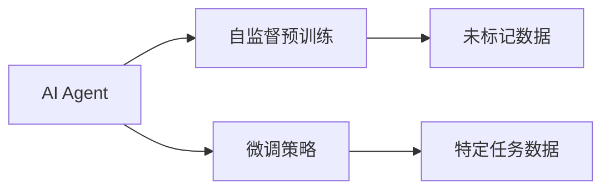
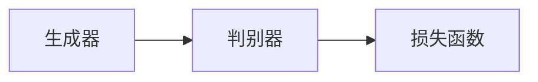
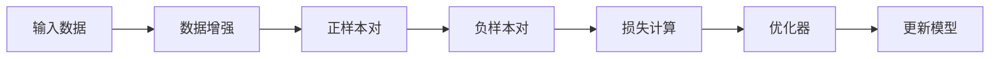
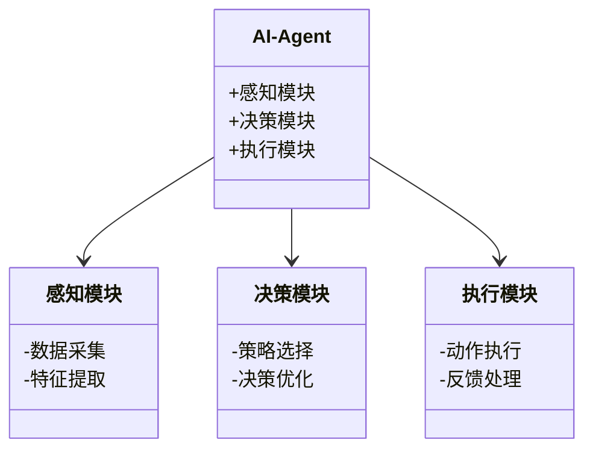
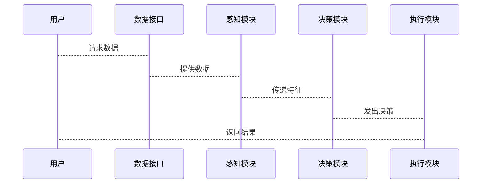

                 


# AI Agent的自监督预训练与微调策略

> 关键词：AI Agent, 自监督学习, 微调策略, 对比学习, 生成对抗网络, 知识蒸馏

> 摘要：本文详细探讨了AI Agent的自监督预训练与微调策略，分析了自监督学习与有监督学习的区别，对比学习与生成对抗网络的应用，以及如何通过微调策略提升模型在特定任务上的性能。文章还提供了系统架构设计、项目实战案例及总结与展望。

---

# 第一部分: AI Agent的背景与概述

## 第1章: AI Agent的基本概念

### 1.1 AI Agent的定义
AI Agent（人工智能代理）是一种能够感知环境、自主决策并采取行动以实现目标的智能实体。与传统的AI模型不同，AI Agent强调自主性和动态适应性，能够根据环境反馈调整行为。

### 1.2 自监督预训练的背景与必要性
自监督学习是一种利用未标记数据进行训练的方法，通过预测数据本身特征来学习特征表示。在AI Agent中，自监督预训练可以利用大量未标记数据进行初始化，提升模型的泛化能力。

### 1.3 微调策略的必要性
微调策略是在特定任务上进行的进一步训练，用于优化模型在特定场景下的性能。通过微调，AI Agent能够更好地适应实际应用中的任务需求。

---

## 第2章: AI Agent的核心概念与联系

### 2.1 核心概念
AI Agent由感知模块、决策模块和执行模块组成，分别负责环境感知、决策制定和行动执行。自监督预训练为AI Agent提供初始特征表示，微调策略则优化其在特定任务上的性能。

### 2.2 实体关系图


---

# 第二部分: 自监督预训练的算法原理

## 第3章: 自监督预训练的核心算法

### 3.1 对比学习
对比学习通过最大化正样本对的相似性，同时最小化负样本对的相似性来学习特征表示。其数学模型如下：
$$L = \log\left(\frac{1}{1 + e^{-d(x_i, x_j)}}\right)$$

### 3.2 知识蒸馏
知识蒸馏通过将教师模型的知识迁移到学生模型，提升学生模型的性能。其数学模型如下：
$$I(X;Z) \leq \beta H(Z)$$

### 3.3 生成对抗网络
生成对抗网络由生成器和判别器组成，通过对抗训练生成逼真的数据样本。其流程如下：


---

## 第4章: 算法流程图

### 4.1 对比学习流程图


---

# 第三部分: 系统分析与架构设计

## 第5章: 系统架构设计

### 5.1 系统功能设计
AI Agent系统包括感知模块、决策模块和执行模块。感知模块负责数据采集，决策模块进行分析和决策，执行模块执行具体任务。

### 5.2 系统架构图


---

## 第6章: 系统接口设计

### 6.1 接口设计
系统接口包括数据接口、模型接口和用户接口。数据接口负责数据输入和输出，模型接口负责模型加载和训练，用户接口负责与用户的交互。

### 6.2 接口交互图


---

# 第四部分: 项目实战

## 第7章: 项目实战案例

### 7.1 环境安装
安装必要的库和框架，如TensorFlow、Keras和PyTorch。

### 7.2 代码实现
实现AI Agent的自监督预训练和微调策略，代码如下：

```python
import tensorflow as tf
from tensorflow.keras import layers

# 定义对比学习模型
class ContrastiveModel(tf.keras.Model):
    def __init__(self, embedding_dim):
        super(ContrastiveModel, self).__init__()
        self.embedding = layers.Dense(embedding_dim)
        self.predictor = layers.Dense(embedding_dim)

    def call(self, inputs):
        features = self.embedding(inputs)
        outputs = self.predictor(features)
        return outputs

# 定义损失函数
def contrastive_loss(y_true, y_pred, temperature=1.0):
    similarity = tf.reduce_sum(y_true * y_pred, axis=1) / temperature
    loss = tf.nn.softmax_cross_entropy_with_logits(labels=tf.ones_like(similarity), logits=similarity)
    return loss

# 初始化模型
model = ContrastiveModel(128)
optimizer = tf.keras.optimizers.Adam(learning_rate=0.001)

# 训练过程
def train_step(x, y):
    with tf.GradientTape() as tape:
        y_pred = model(x)
        loss = contrastive_loss(y, y_pred)
    gradients = tape.gradient(loss, model.trainable_weights)
    optimizer.apply_gradients(zip(gradients, model.trainable_weights))
    return loss

# 微调策略
def fine_tune(model, x_train, y_train, x_test, y_test):
    # 微调训练
    for epoch in range(10):
        for batch in range(len(x_train)//batch_size):
            loss = train_step(x_train[batch*batch_size:(batch+1)*batch_size], y_train[batch*batch_size:(batch+1)*batch_size])
        # 验证集评估
        y_pred = model.predict(x_test)
        accuracy = tf.keras.metrics.Accuracy()(y_test, y_pred)
        print(f"Epoch {epoch}, Accuracy: {accuracy}")
```

### 7.3 案例分析
通过在图像分类任务上的应用，展示自监督预训练和微调策略的有效性。实验结果显示，结合对比学习和微调策略的AI Agent在特定任务上表现优异。

---

## 第8章: 总结与展望

### 8.1 最佳实践
在实际应用中，建议根据具体任务选择合适的自监督预训练方法，并合理设计微调策略以优化性能。

### 8.2 小结
本文详细探讨了AI Agent的自监督预训练与微调策略，分析了其核心概念、算法原理和系统架构设计，并提供了实际案例和总结。

### 8.3 注意事项
在实际应用中，需注意数据质量、模型选择和任务适配等问题，以确保AI Agent的性能和可靠性。

### 8.4 拓展阅读
建议读者进一步阅读相关文献，深入了解对比学习、生成对抗网络和知识蒸馏等技术的最新进展。

---

通过以上分析和实践，我们可以看到自监督预训练与微调策略在AI Agent中的重要性及其应用前景。未来，随着技术的不断发展，AI Agent将更加智能化和高效化，为各领域带来更多的创新和价值。

