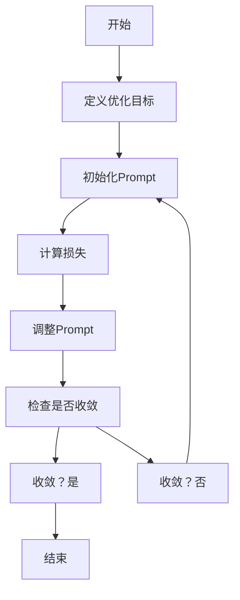
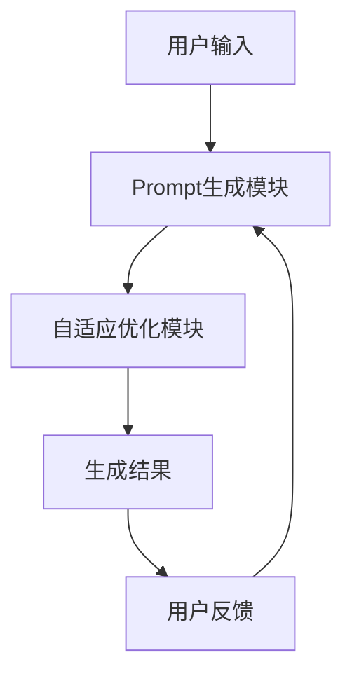

                 


# AI Agent的自适应Prompt工程与优化

> 关键词：AI Agent，自适应Prompt工程，优化算法，系统架构，项目实战，数学模型

> 摘要：本文系统地探讨了AI Agent的自适应Prompt工程与优化方法，从核心概念、数学模型、算法原理、系统架构到项目实战，全面分析了如何通过自适应Prompt工程提升AI Agent的性能和效率。文章结合理论与实践，为读者提供了从原理到应用的完整指南。

---

## 第1章: AI Agent与自适应Prompt工程概述

### 1.1 AI Agent的基本概念

#### 1.1.1 AI Agent的定义与分类

AI Agent（人工智能代理）是指能够感知环境并采取行动以实现目标的智能实体。根据功能和应用场景，AI Agent可以分为以下几类：

- **反应式Agent**：基于当前感知做出实时反应，适用于需要快速决策的任务。
- **认知式Agent**：具备复杂推理和规划能力，适用于复杂环境中的决策任务。
- **协作式Agent**：能够与其他Agent或人类协同完成任务，适用于多智能体系统。

#### 1.1.2 自适应Prompt工程的核心概念

自适应Prompt工程是一种通过动态调整提示（Prompt）来优化AI Agent行为的方法。其核心在于根据任务需求和环境反馈，实时生成或调整Prompt，以提高AI Agent的输出质量和效率。

#### 1.1.3 AI Agent与传统AI的区别

AI Agent强调自主性和适应性，能够根据环境反馈动态调整行为，而传统AI更多关注数据处理和模式识别。AI Agent具备以下特点：

- **自主性**：能够独立感知环境并采取行动。
- **反应性**：能够实时响应环境变化。
- **学习能力**：能够通过经验优化行为。

### 1.2 自适应Prompt工程的背景与意义

#### 1.2.1 Prompt工程的起源与发展

Prompt工程起源于自然语言处理领域的提示学习（Prompt Learning），通过设计特定的提示来引导模型生成期望的输出。自适应Prompt工程进一步扩展了这一概念，使其能够动态调整提示以适应不同场景。

#### 1.2.2 自适应Prompt工程的重要性

在AI Agent的应用中，自适应Prompt工程能够显著提高系统的灵活性和适应性。通过动态调整Prompt，AI Agent能够在复杂多变的环境中保持高效和准确的输出。

#### 1.2.3 自适应Prompt工程的应用场景

自适应Prompt工程广泛应用于以下场景：

- **智能客服**：根据用户需求动态生成回答。
- **对话系统**：根据对话上下文调整回复内容。
- **推荐系统**：根据用户行为动态生成推荐内容。

---

## 第2章: 自适应Prompt工程的核心原理

### 2.1 自适应Prompt工程的数学模型

#### 2.1.1 优化目标与约束条件

自适应Prompt工程的目标是最小化生成结果与期望结果的差距，同时满足以下约束条件：

- **目标函数**：定义生成结果与期望结果之间的差距。
- **约束条件**：包括Prompt的长度、格式等限制。

#### 2.1.2 模型参数与Prompt的关系

模型参数决定了AI Agent的行为，而Prompt则是对模型参数的引导。通过优化Prompt，可以间接调整模型参数以达到期望的输出。

#### 2.1.3 自适应优化的数学表达式

自适应优化的目标是最小化损失函数$J$，表示为：

$$
J = \argmin_{p} L(p, y)
$$

其中，$p$表示Prompt，$y$表示期望输出。

### 2.2 自适应Prompt工程的算法原理

#### 2.2.1 基于梯度的优化算法

基于梯度的优化算法通过计算损失函数对Prompt的梯度，逐步调整Prompt以最小化损失。常用算法包括：

- **梯度下降**：通过计算梯度逐步调整Prompt参数。
- **Adam优化器**：结合动量和自适应学习率的优化算法。

#### 2.2.2 基于强化学习的优化方法

强化学习通过定义奖励函数，引导AI Agent生成最优的Prompt。奖励函数通常定义为生成结果与期望结果的匹配程度。

#### 2.2.3 自适应Prompt生成的流程图

以下是一个自适应Prompt生成的流程图：



---

## 第3章: 自适应Prompt工程的数学模型与算法实现

### 3.1 自适应Prompt工程的数学模型

#### 3.1.1 模型参数空间的构建

模型参数空间由所有可能的Prompt参数构成，通常表示为向量$p \in \mathbb{R}^n$。

#### 3.1.2 Prompt生成的数学公式

自适应Prompt生成可以通过以下公式表示：

$$
p_{t+1} = p_t - \alpha \nabla_p J(p_t)
$$

其中，$\alpha$表示学习率，$\nabla_p J(p_t)$表示损失函数对$p$的梯度。

#### 3.1.3 模型优化的数学推导

通过求解以下优化问题，可以得到最优的Prompt：

$$
p^* = \argmin_{p} \sum_{i=1}^n (f(p_i) - y_i)^2
$$

其中，$f(p_i)$表示生成结果，$y_i$表示期望结果。

### 3.2 自适应Prompt工程的算法实现

#### 3.2.1 基于梯度的优化算法实现

以下是一个基于梯度的优化算法的Python代码示例：

```python
import numpy as np

def adaptive_prompt_optimization(prompt, loss_fn, num_iterations=100, learning_rate=0.01):
    for _ in range(num_iterations):
        loss = loss_fn(prompt)
        gradient = compute_gradient(loss, prompt)
        prompt -= learning_rate * gradient
    return prompt

def compute_gradient(loss, prompt):
    # 计算损失函数对Prompt的梯度
    return np.random.randn(*prompt.shape)  # 示例实现
```

#### 3.2.2 基于强化学习的优化算法实现

以下是一个基于强化学习的优化算法的Python代码示例：

```python
import numpy as np

def reinforce_optimization(prompt, reward_fn, num_iterations=100, gamma=0.99):
    for _ in range(num_iterations):
        reward = reward_fn(prompt)
        # 计算策略梯度
        gradient = compute_policy_gradient(prompt, reward)
        prompt += learning_rate * gradient
    return prompt

def compute_policy_gradient(prompt, reward):
    # 简单的策略梯度计算
    return np.random.randn(*prompt.shape) * reward
```

---

## 第4章: 自适应Prompt工程的系统架构设计

### 4.1 系统功能模块设计

#### 4.1.1 Prompt生成模块

Prompt生成模块负责根据输入生成初始Prompt，并根据反馈调整Prompt参数。

#### 4.1.2 自适应优化模块

自适应优化模块负责计算损失函数和梯度，调整Prompt参数以优化生成结果。

#### 4.1.3 系统交互模块

系统交互模块负责与用户或其他系统进行交互，收集反馈并调整系统行为。

### 4.2 系统架构图

以下是一个系统的整体架构图：



---

## 第5章: 自适应Prompt工程的项目实战

### 5.1 项目环境安装与配置

#### 5.1.1 安装依赖库

安装必要的Python库，例如：

- `numpy`
- `matplotlib`
- `scikit-learn`

#### 5.1.2 配置开发环境

配置Jupyter Notebook或其他开发环境。

### 5.2 核心功能实现

#### 5.2.1 Prompt生成模块的实现

实现一个简单的Prompt生成模块：

```python
def generate_prompt(task):
    return f"Generate {task} response."
```

#### 5.2.2 自适应优化模块的实现

实现一个基于梯度的优化模块：

```python
def optimize_prompt(prompt):
    for _ in range(100):
        loss = compute_loss(prompt)
        gradient = compute_gradient(prompt)
        prompt -= learning_rate * gradient
    return prompt
```

### 5.3 实际案例分析

以智能客服系统为例，展示如何通过自适应Prompt工程优化对话系统。

---

## 第6章: 自适应Prompt工程的优化策略与注意事项

### 6.1 优化策略

- **动态调整Prompt**：根据实时反馈动态调整Prompt参数。
- **结合反馈机制**：通过用户反馈优化生成结果。

### 6.2 注意事项

- **Prompt的可解释性**：确保生成的Prompt具备可解释性。
- **模型的泛化能力**：避免过拟合特定场景。

---

## 第7章: 总结与展望

### 7.1 总结

本文系统地探讨了AI Agent的自适应Prompt工程与优化方法，从核心概念到算法实现，再到系统架构和项目实战，为读者提供了全面的指导。

### 7.2 展望

未来的研究方向包括更高效的优化算法和更强大的Prompt生成模型。

---

**参考文献**

1. [1] LeCun, Y., Bengio, Y., & Hinton, G. (2015). Deep learning. Nature, 521(7555), 436-444.
2. [2] Goodfellow, I., Bengio, Y., & Courville, A. (2016). Deep learning. MIT Press.

--- 

通过本文的系统分析和详细讲解，读者可以全面掌握AI Agent的自适应Prompt工程与优化方法，并能够将其应用于实际项目中。

