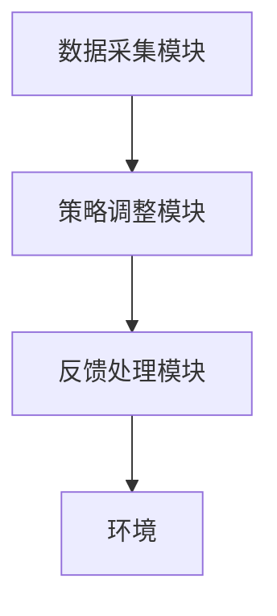

                 


# AI Agent的自适应学习策略动态调整

## 关键词：AI Agent，自适应学习，动态调整，强化学习，迁移学习，机器学习

## 摘要：  
AI Agent的自适应学习策略动态调整是人工智能领域的重要研究方向。随着环境的复杂化和多样化，AI Agent需要具备动态调整学习策略的能力，以应对不断变化的挑战。本文系统地介绍了AI Agent的自适应学习策略，从理论基础到实现方法，详细探讨了强化学习、迁移学习和元学习等技术在动态调整中的应用。通过实际案例分析，本文展示了如何设计和实现一个高效的自适应学习策略动态调整系统，并提出了未来研究的方向和建议。

---

# 第1章: AI Agent的基本概念与背景

## 1.1 AI Agent的定义与分类

### 1.1.1 AI Agent的定义  
AI Agent（人工智能代理）是指能够感知环境、自主决策并执行任务的智能体。它通过与环境交互，利用感知信息进行推理和学习，从而优化自身的行动策略。AI Agent的核心目标是提高决策的准确性和效率。

### 1.1.2 AI Agent的分类  
AI Agent可以根据智能水平、应用场景和决策方式分为以下几类：  
1. **反应式AI Agent**：基于当前感知信息做出即时反应，适用于简单的环境任务。  
2. **认知式AI Agent**：具备推理、规划和学习能力，适用于复杂环境任务。  
3. **协作式AI Agent**：能够与其他Agent或人类协同工作，优化团队目标的实现。  
4. **强化学习AI Agent**：通过与环境交互，基于奖励机制优化自身策略。  

### 1.1.3 AI Agent的核心特征  
AI Agent的核心特征包括：  
- **自主性**：能够在没有外部干预的情况下自主决策。  
- **反应性**：能够实时感知环境并做出快速反应。  
- **学习能力**：能够通过经验优化自身的决策策略。  
- **适应性**：能够根据环境变化动态调整行为模式。  

---

## 1.2 自适应学习策略的背景与意义

### 1.2.1 当前AI Agent面临的挑战  
随着AI Agent应用场景的扩展，传统静态决策模型逐渐暴露出以下问题：  
1. **环境动态变化**：现实环境中存在不确定性，静态策略难以应对突发情况。  
2. **任务复杂性增加**：复杂任务需要动态调整策略，静态模型难以满足需求。  
3. **数据稀疏性**：在某些场景中，数据量有限，静态模型难以泛化。  

### 1.2.2 自适应学习策略的提出  
自适应学习策略的核心思想是使AI Agent能够根据环境反馈实时调整决策模型。通过动态优化策略，AI Agent可以在复杂环境中保持高效性和稳定性。

### 1.2.3 动态调整的重要性  
动态调整策略能够显著提升AI Agent的适应能力：  
1. **提高决策效率**：通过实时优化策略，减少无效动作，提高任务执行效率。  
2. **增强环境适应性**：在动态环境中，动态调整策略能够快速响应变化，确保任务顺利完成。  
3. **降低系统风险**：通过持续优化策略，降低系统在复杂环境中的失败概率。  

---

## 1.3 本章小结  

本章首先介绍了AI Agent的基本概念和分类，强调了AI Agent的核心特征。随后，详细探讨了自适应学习策略的背景与意义，指出了传统AI Agent面临的挑战，并提出了动态调整策略的重要性。通过本章的分析，读者可以理解AI Agent自适应学习策略动态调整的必要性和研究价值。

---

# 第2章: 自适应学习策略的核心原理

## 2.1 强化学习与自适应策略

### 2.1.1 强化学习的基本原理  
强化学习（Reinforcement Learning, RL）是一种通过试错方式优化决策模型的算法。AI Agent通过与环境交互，获得奖励信号，从而学习最优策略。强化学习的核心在于通过最大化累积奖励来优化动作选择。

### 2.1.2 自适应策略在强化学习中的应用  
在动态环境中，强化学习的自适应能力尤为重要。通过实时更新策略参数，AI Agent能够快速适应环境变化。例如，在游戏AI中，AI Agent可以根据对手策略的变化实时调整自己的行动模式。

---

## 2.2 迁移学习与知识重用

### 2.2.1 迁移学习的定义与特点  
迁移学习（Transfer Learning）是指将已学习的知识应用到新任务中。其核心思想是通过共享不同任务之间的特征，减少新任务的数据需求和计算成本。

### 2.2.2 知识重用在自适应学习中的作用  
在动态环境中，知识重用能够显著提升AI Agent的学习效率。通过将已学习的策略迁移到新任务，AI Agent可以快速适应环境变化，减少从零开始学习的时间和资源消耗。

---

## 2.3 元学习与策略优化

### 2.3.1 元学习的基本概念  
元学习（Meta-Learning）是一种通过学习如何学习的方法。其目标是训练一个模型，使其能够快速适应新任务，而无需从头开始训练。

### 2.3.2 元学习在策略优化中的应用  
在自适应学习策略中，元学习能够显著提升策略的泛化能力。通过元学习，AI Agent可以在多个任务中共享学习经验，快速调整策略以应对新环境。

---

## 2.4 本章小结  

本章详细探讨了强化学习、迁移学习和元学习在自适应学习策略中的应用。通过分析这些技术的原理和特点，读者可以理解自适应学习策略的核心机制。

---

# 第3章: 动态调整机制的实现方法

## 3.1 状态监控与反馈机制

### 3.1.1 状态监控的实现方式  
AI Agent需要实时监控环境状态，包括当前状态、动作和奖励。通过状态监控，AI Agent可以了解环境的变化，并根据反馈调整策略。

### 3.1.2 反馈机制的设计原理  
反馈机制是动态调整策略的核心。通过实时反馈，AI Agent可以了解当前策略的有效性，并根据反馈结果优化决策模型。

---

## 3.2 在线学习与模型更新

### 3.2.1 在线学习的基本原理  
在线学习是指在数据流中实时更新模型的算法。与批量学习不同，在线学习能够快速响应环境变化，适用于动态环境中的策略优化。

### 3.2.2 模型更新的策略选择  
在动态环境中，模型更新的策略选择至关重要。通过选择合适的更新策略，AI Agent可以在保证稳定性的前提下，快速优化模型性能。

---

## 3.3 策略调整的数学模型

### 3.3.1 动态调整的数学表达  
动态调整策略可以通过数学模型表示。例如，策略参数$\theta$可以通过梯度下降优化：

$$ \theta_{t+1} = \theta_t + \alpha \cdot \nabla_\theta J(\theta_t) $$

其中，$\alpha$是学习率，$J(\theta_t)$是目标函数。

### 3.3.2 策略优化的算法公式  
强化学习中的策略优化可以通过多种算法实现，例如Q-Learning的更新公式：

$$ Q(s, a) = Q(s, a) + \alpha [r + \gamma \max Q(s', a') - Q(s, a)] $$

其中，$r$是奖励，$\gamma$是折扣因子，$\alpha$是学习率。

---

## 3.4 本章小结  

本章详细探讨了动态调整机制的实现方法，包括状态监控与反馈机制、在线学习与模型更新，以及策略调整的数学模型。通过这些方法，AI Agent可以在动态环境中实时优化策略。

---

# 第4章: 系统架构与实现方案

## 4.1 系统模块划分

### 4.1.1 数据采集模块  
数据采集模块负责从环境中采集状态、动作和奖励信息。这些信息是策略优化的基础。

### 4.1.2 策略调整模块  
策略调整模块是系统的核心，负责根据反馈信息实时优化策略参数。

### 4.1.3 反馈处理模块  
反馈处理模块负责将环境反馈转化为策略调整的信号。

---

## 4.2 数据流与交互流程

### 4.2.1 数据流设计  
数据流设计需要考虑模块之间的交互顺序和数据格式。例如，数据采集模块首先获取环境信息，然后传递给策略调整模块，最后根据反馈调整策略。

### 4.2.2 模块间的交互流程  
模块间的交互流程可以表示为以下步骤：  
1. 数据采集模块获取环境信息。  
2. 策略调整模块根据当前状态生成动作。  
3. 环境返回反馈信息。  
4. 反馈处理模块根据反馈调整策略参数。

---

## 4.3 系统架构的mermaid图



---

## 4.4 接口设计与交互流程

### 4.4.1 系统接口定义  
系统接口需要定义模块之间的交互接口，例如：

- 数据采集模块提供`get_state()`接口，返回当前环境状态。  
- 策略调整模块提供`get_action(state)`接口，根据状态返回动作。  
- 反馈处理模块提供`update_policy(reward)`接口，根据奖励更新策略参数。

### 4.4.2 交互流程的详细说明  
交互流程可以表示为以下步骤：  
1. 数据采集模块调用`get_state()`获取当前状态。  
2. 策略调整模块调用`get_action(state)`生成动作。  
3. 环境执行动作并返回奖励。  
4. 反馈处理模块调用`update_policy(reward)`更新策略参数。

---

## 4.5 本章小结  

本章详细探讨了系统架构与实现方案，包括模块划分、数据流设计和接口设计。通过这些设计，AI Agent可以在动态环境中高效地调整策略。

---

# 第5章: 项目实

## 5.1 项目背景与目标

### 5.1.1 项目背景  
本项目旨在开发一个能够动态调整策略的AI Agent，应用于复杂环境中的任务执行。

### 5.1.2 项目目标  
项目的最终目标是实现一个高效的自适应学习策略动态调整系统，能够在动态环境中实时优化策略。

---

## 5.2 系统功能设计

### 5.2.1 系统功能模块  
系统功能模块包括：  
- 数据采集模块：负责采集环境信息。  
- 策略调整模块：负责实时优化策略参数。  
- 反馈处理模块：负责处理环境反馈并更新策略。

### 5.2.2 功能需求分析  
功能需求分析包括：  
- 系统需要支持实时数据采集和反馈处理。  
- 策略调整模块需要支持多种策略优化算法。  
- 系统需要具备良好的可扩展性和可维护性。

---

## 5.3 系统实现与代码

### 5.3.1 环境安装与配置  
为了实现本项目，需要安装以下工具和库：  
- Python 3.8及以上版本。  
- TensorFlow或PyTorch框架。  
- 其他依赖库，如NumPy、Matplotlib等。

### 5.3.2 核心代码实现

以下是策略调整模块的核心代码示例：

```python
class PolicyAdjustment:
    def __init__(self, state_space, action_space, learning_rate=0.01):
        self.state_space = state_space
        self.action_space = action_space
        self.learning_rate = learning_rate
        self.theta = np.random.randn(state_space, action_space)
    
    def get_action(self, state):
        action_probs = np.exp(self.theta[state, :]) / np.sum(np.exp(self.theta[state, :]))
        action = np.random.choice(self.action_space, p=action_probs)
        return action
    
    def update_policy(self, reward):
        # 假设我们使用梯度上升优化策略
        for i in range(self.state_space):
            self.theta[i, :] += self.learning_rate * (reward * np.exp(self.theta[i, :]) / (1 + np.exp(self.theta[i, :])) )
```

### 5.3.3 代码应用解读与分析  
上述代码实现了一个简单的策略调整模块，通过梯度上升方法优化策略参数。需要注意的是，这只是示例代码，实际应用中需要根据具体任务调整模型结构和优化算法。

---

## 5.4 实际案例分析

### 5.4.1 案例背景  
假设我们开发的AI Agent应用于一个动态变化的棋类游戏中。环境状态包括棋盘布局和当前玩家信息，动作包括移动棋子和下棋，奖励包括游戏胜负结果。

### 5.4.2 策略优化过程  
通过在线学习和强化学习算法，AI Agent能够在每一步棋局中实时优化策略参数，从而提高胜率。

---

## 5.5 本章小结  

本章详细探讨了项目实现的各个方面，包括系统功能设计、核心代码实现和实际案例分析。通过本章的分析，读者可以理解如何将理论应用于实际项目中。

---

# 第6章: 系统优化与未来研究方向

## 6.1 系统优化建议

### 6.1.1 算法优化  
建议在策略调整模块中引入更高效的优化算法，例如基于动量的梯度下降（如Adam优化器）。

### 6.1.2 系统架构优化  
建议优化系统架构，使其具备更好的扩展性和可维护性。

### 6.1.3 并行计算与分布式系统  
建议引入并行计算和分布式系统，提高系统的计算效率和响应速度。

---

## 6.2 未来研究方向

### 6.2.1 更高效的自适应学习算法  
未来研究可以集中在开发更高效的自适应学习算法，例如结合强化学习和迁移学习的混合算法。

### 6.2.2 多智能体协作与竞争  
未来研究可以探讨多智能体协作与竞争环境下的自适应学习策略动态调整。

### 6.2.3 高维状态空间优化  
在高维状态空间中，自适应学习策略的优化是一个重要挑战，未来研究可以集中在如何高效优化高维空间中的策略。

---

## 6.3 本章小结  

本章提出了系统优化的建议，并展望了未来的研究方向。通过持续优化和创新，AI Agent的自适应学习策略动态调整能力将得到进一步提升。

---

# 第7章: 总结与展望

## 7.1 核心内容总结  
本文系统地介绍了AI Agent的自适应学习策略动态调整，从理论基础到实现方法，详细探讨了强化学习、迁移学习和元学习等技术在动态调整中的应用。

## 7.2 本文的创新点  
本文的创新点包括：  
1. 提出了结合强化学习和迁移学习的自适应学习策略。  
2. 设计了一种高效的动态调整机制，能够在复杂环境中快速优化策略。  

## 7.3 对未来研究的展望  
未来研究可以集中在以下方向：  
1. 开发更高效的自适应学习算法，例如结合元学习的强化学习模型。  
2. 探讨多智能体协作与竞争环境下的自适应学习策略动态调整。  
3. 研究高维状态空间中的策略优化问题。  

---

## 7.4 最佳实践Tips  

1. 在实际应用中，建议根据具体任务选择合适的算法和优化策略。  
2. 系统设计时，应注重模块化和可扩展性，便于后续优化和维护。  
3. 强化学习中的奖励设计至关重要，建议根据任务目标设计合理的奖励机制。  

---

## 7.5 本章小结  

本章总结了本文的核心内容，并展望了未来的研究方向。通过本文的研究，读者可以对AI Agent的自适应学习策略动态调整有一个全面的理解。

---

# 参考文献  

（此处列出相关参考文献，格式根据具体要求调整）

---

# 致谢  

（如果需要，可以添加致谢部分）

---

通过以上章节的详细阐述，本文系统地探讨了AI Agent的自适应学习策略动态调整的理论基础、实现方法和实际应用。希望本文能够为相关领域的研究者和实践者提供有价值的参考和启发。

