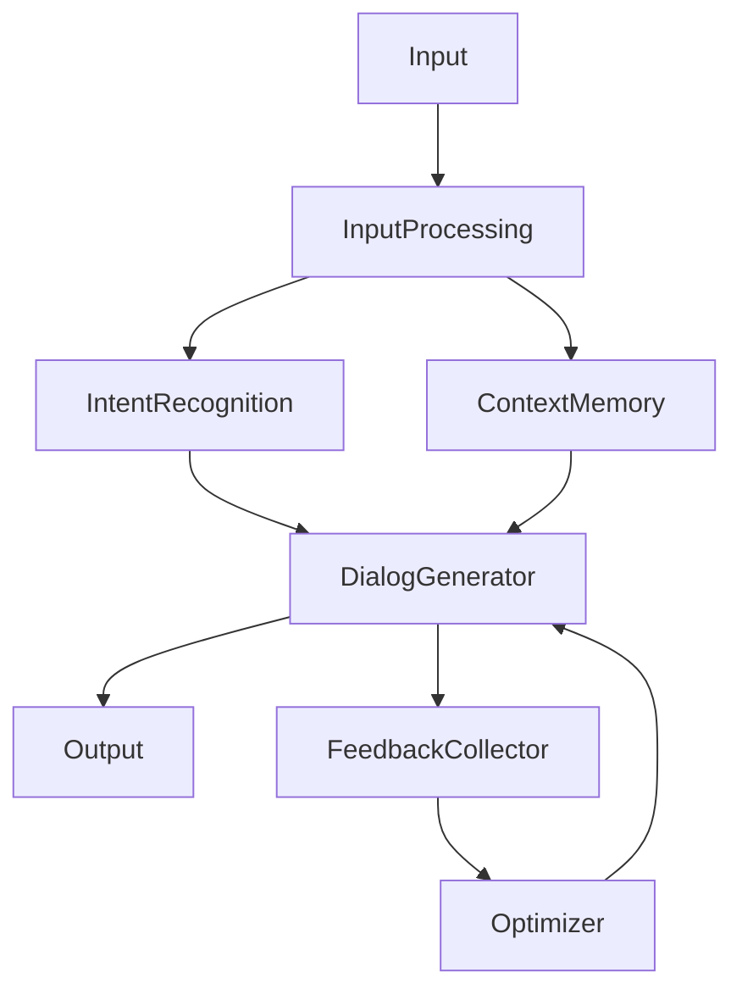

                 


# AI Agent的自适应对话生成系统

## 关键词：
AI Agent, 自适应对话生成, 对话系统, 自然语言处理, 机器学习, 深度学习

## 摘要：
本文详细探讨了AI Agent在自适应对话生成系统中的应用，从系统背景到核心算法，从架构设计到项目实现，全面解析了该系统的构建过程和实现细节。文章通过理论与实践相结合的方式，深入分析了自适应对话生成的关键技术，并通过实际案例展示了系统的应用场景和效果。通过本文的阅读，读者可以系统性地了解AI Agent在对话生成中的重要作用，并掌握构建类似系统的相关技术要点。

---

# 第一部分: 背景介绍

## 第1章: 问题背景与目标

### 1.1 问题背景
#### 1.1.1 对话生成系统的现状
当前，对话生成系统广泛应用于智能客服、虚拟助手、聊天机器人等领域。然而，现有的对话生成系统在适应不同用户需求、上下文理解和实时反馈等方面存在局限性。

#### 1.1.2 当前对话生成系统的局限性
- 固化的回复模板导致对话缺乏灵活性
- 缺乏上下文记忆能力，导致对话连贯性不足
- 对用户情感和意图的识别不够准确

#### 1.1.3 引入AI Agent的必要性
AI Agent作为智能体，能够通过感知和学习动态调整对话策略，从而实现更自然、更个性化的对话生成。

### 1.2 问题描述
#### 1.2.1 自适应对话生成的定义
自适应对话生成是指系统能够根据当前对话上下文、用户意图和实时反馈，动态调整生成的回复内容。

#### 1.2.2 自适应对话生成的核心目标
- 提供个性化对话体验
- 提高对话的准确性和相关性
- 实现动态上下文理解和实时反馈机制

#### 1.2.3 系统边界与外延
- 系统边界：仅关注对话生成过程，不涉及外部数据源的调用
- 系统外延：可扩展至多轮对话、情感分析和意图识别等高级功能

---

# 第二部分: 核心概念与联系

## 第2章: 核心概念原理

### 2.1 AI Agent的基本原理
AI Agent是一种智能体，能够通过感知环境、执行动作和学习优化来实现特定目标。在对话生成系统中，AI Agent的核心功能包括：

- **感知**：获取对话历史和上下文信息
- **推理**：分析用户意图和情感
- **决策**：生成合适的回复内容

### 2.2 对话生成的基本原理
对话生成系统通过自然语言处理技术，将输入的文本信息转化为符合语法规则和语义要求的输出文本。自适应对话生成系统在此基础上，增加了动态调整和优化的能力。

### 2.3 自适应对话生成的核心机制
- **上下文记忆**：通过记忆网络或注意力机制，记录和理解对话历史
- **意图识别**：基于用户输入和上下文信息，识别用户的真实需求
- **动态调整**：根据实时反馈，优化生成的回复内容

---

## 第3章: 系统架构与设计

### 3.1 系统功能设计
自适应对话生成系统主要包含以下几个功能模块：

- **输入处理模块**：接收用户输入并解析对话内容
- **上下文记忆模块**：记录对话历史和上下文信息
- **意图识别模块**：分析用户意图和情感倾向
- **回复生成模块**：基于上下文和意图生成回复内容
- **优化调整模块**：根据反馈优化回复质量

### 3.2 系统架构设计


### 3.3 接口设计
- **输入接口**：接收用户输入文本
- **输出接口**：返回生成的回复内容
- **反馈接口**：收集用户对回复的反馈信息

### 3.4 交互流程
1. 用户输入对话内容
2. 系统解析输入并提取关键信息
3. 系统根据上下文和意图生成回复
4. 用户对回复进行反馈
5. 系统根据反馈优化回复策略

---

# 第三部分: 算法原理与实现

## 第4章: 算法原理

### 4.1 基于Transformer的对话生成
- **模型结构**：编码器-解码器架构
- **注意力机制**：利用自注意力机制捕捉上下文信息
- **损失函数**：交叉熵损失函数

### 4.2 基于RNN的对话生成
- **模型结构**：循环神经网络
- **长短期记忆网络**：解决序列生成中的长序列问题

### 4.3 混合模型
- **结合Transformer和RNN的优势**：利用Transformer捕捉全局信息，结合RNN处理序列依赖性

---

## 第5章: 数学模型

### 5.1 损失函数
$$ L = -\sum_{i=1}^{n} \log p(y_i|x_i) $$

### 5.2 优化函数
$$ \theta = \theta - \eta \frac{\partial L}{\partial \theta} $$

### 5.3 注意力机制
$$ \alpha_i = \frac{\exp(s_i)}{\sum_{j} \exp(s_j)} $$

---

# 第四部分: 项目实战

## 第6章: 环境安装与代码实现

### 6.1 环境安装
```bash
pip install tensorflow
pip install numpy
pip install scikit-learn
pip install matplotlib
```

### 6.2 代码实现
```python
import tensorflow as tf
import numpy as np

# 定义模型
class DialogGenerator:
    def __init__(self):
        self.model = self.build_model()

    def build_model(self):
        # 定义模型结构
        pass

    def train(self, data):
        # 训练模型
        pass

    def generate_response(self, input_text):
        # 生成回复
        pass
```

### 6.3 实现解读
- **数据预处理**：对输入数据进行清洗和标注
- **模型训练**：利用训练数据优化模型参数
- **生成回复**：根据输入生成回复内容

---

## 第7章: 案例分析与总结

### 7.1 案例分析
#### 案例1：客服对话系统
- **场景**：用户咨询产品信息
- **对话生成**：系统根据上下文生成相关回复

#### 案例2：虚拟助手对话
- **场景**：用户查询天气信息
- **对话生成**：系统根据实时数据生成回复

### 7.2 总结
自适应对话生成系统通过引入AI Agent，显著提升了对话生成的准确性和相关性。本文通过理论与实践相结合的方式，详细解析了系统的构建过程和实现细节。

---

# 第五部分: 最佳实践与注意事项

## 第8章: 最佳实践

### 8.1 数据质量
- 确保训练数据的多样性和代表性
- 处理数据中的噪声和偏差

### 8.2 模型优化
- 定期更新模型参数
- 引入反馈机制优化回复质量

### 8.3 系统性能
- 优化系统响应时间
- 提高系统的容错能力

---

## 第9章: 注意事项

### 9.1 数据隐私
- 确保用户数据的安全性和隐私性
- 遵守相关法律法规

### 9.2 模型调优
- 定期监控模型性能
- 及时修复模型缺陷

---

## 第10章: 拓展阅读

### 10.1 推荐书籍
- 《Deep Learning》
- 《自然语言处理入门》

### 10.2 技术博客
- TensorFlow官方文档
- PyTorch官方文档

---

通过本文的系统性讲解，读者可以全面了解AI Agent在自适应对话生成系统中的应用，并掌握构建类似系统的相关技术要点。

