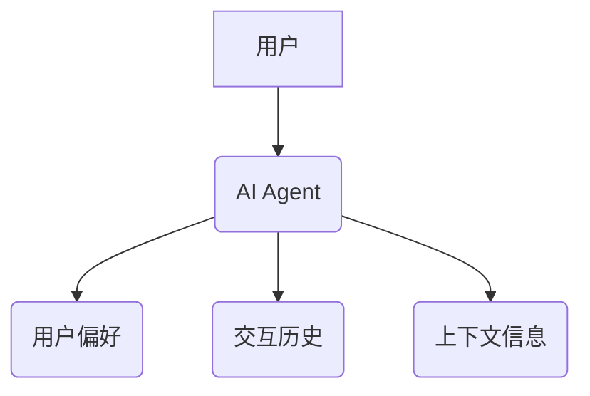
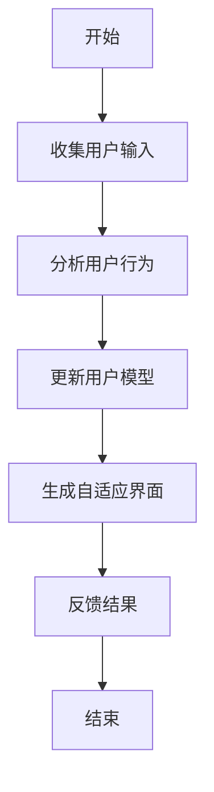
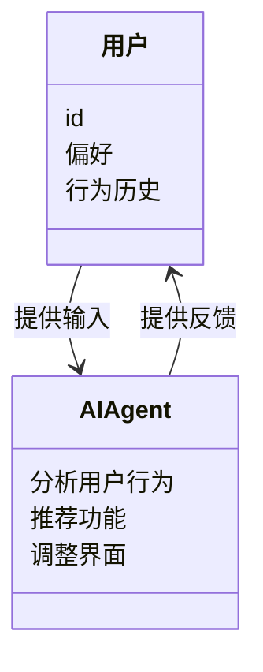
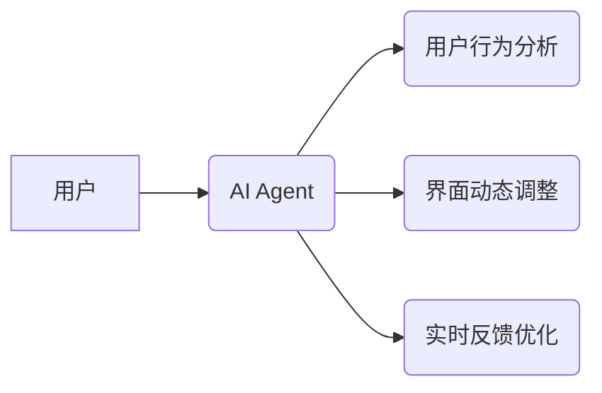
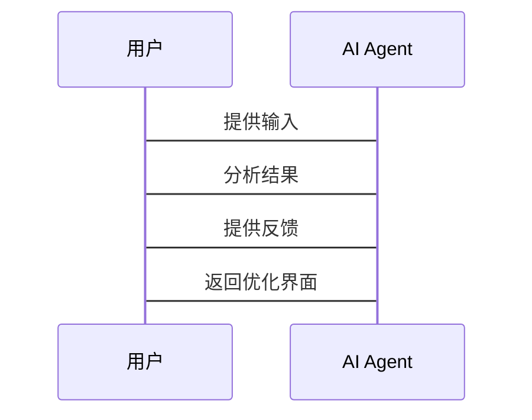

                 


# AI Agent的自适应用户界面：个性化人机交互体验

---

## 关键词：
- AI Agent
- 自适应用户界面
- 个性化交互
- 人机协作
- 用户行为分析

---

## 摘要：
本文深入探讨AI Agent如何通过自适应用户界面实现个性化的人机交互体验。从背景介绍到核心概念，再到算法原理和系统架构设计，结合实际项目案例，全面解析AI Agent在自适应界面中的应用。文章旨在帮助读者理解如何通过AI技术提升用户体验，实现更智能、更个性化的交互方式。

---

## 第一部分: AI Agent的自适应用户界面概述

---

## 第1章: AI Agent与自适应用户界面的背景介绍

### 1.1 问题背景与问题描述

#### 1.1.1 传统人机交互的局限性
传统的人机交互界面通常采用固定的设计模式，无法根据用户的个性化需求进行实时调整。用户在使用过程中可能会遇到不适应界面布局、功能推荐不够精准等问题，导致用户体验不佳。

#### 1.1.2 AI Agent的引入与目标
AI Agent（人工智能代理）是一种能够感知环境、理解用户需求并主动提供服务的智能系统。通过引入AI Agent，我们可以实现自适应用户界面，使界面能够根据用户的实时行为和偏好动态调整，提供更加个性化的交互体验。

#### 1.1.3 自适应用户界面的核心问题
自适应用户界面的核心问题在于如何准确捕捉用户的实时需求，并通过算法实现界面的动态优化。这需要结合用户行为分析、偏好预测以及实时反馈机制。

---

### 1.2 问题解决与边界定义

#### 1.2.1 自适应用户界面的解决方案
通过AI技术，自适应用户界面能够实时分析用户的输入行为、历史数据和上下文信息，动态调整界面布局、功能推荐和交互流程，从而满足用户的个性化需求。

#### 1.2.2 边界与外延
自适应用户界面的边界主要集中在用户与AI Agent的交互过程中。其外延包括但不限于自然语言处理、计算机视觉和强化学习等技术的应用。

#### 1.2.3 核心要素与概念结构
自适应用户界面的核心要素包括：
1. 用户输入与行为分析
2. 用户偏好预测模型
3. 界面动态调整机制

---

## 第2章: 自适应用户界面的核心概念与联系

### 2.1 核心概念原理

#### 2.1.1 AI Agent的基本原理
AI Agent通过感知环境、理解用户需求并执行任务，能够主动为用户提供服务。其核心包括感知、推理和行动三个步骤。

#### 2.1.2 自适应界面的核心机制
自适应界面通过实时分析用户行为和偏好，动态调整界面布局和功能推荐。其核心机制包括用户行为分析、状态预测和反馈优化。

#### 2.1.3 用户行为分析与预测
用户行为分析是自适应界面的基础。通过分析用户的输入、点击和停留时间等行为数据，可以预测用户的偏好和需求。

### 2.2 概念属性特征对比表

| 概念         | 属性特征         |
|--------------|-----------------|
| AI Agent     | 智能性、主动性   |
| 自适应界面    | 动态性、个性化    |
| 用户行为分析  | 实时性、准确性    |

### 2.3 ER实体关系图


---

## 第3章: 自适应用户界面的算法原理

### 3.1 算法原理概述

#### 3.1.1 用户偏好预测模型
用户偏好预测模型是自适应界面的核心算法。通过分析用户的历史行为数据，可以预测用户的偏好。

#### 3.1.2 状态转移模型
状态转移模型用于描述用户行为的动态变化。通过马尔可夫链，可以预测用户下一步的行为。

#### 3.1.3 实时反馈机制
实时反馈机制用于优化界面的动态调整。通过用户的实时反馈，可以不断优化预测模型。

### 3.2 算法流程图


### 3.3 算法实现代码

```python
def user_preference_model(user_input):
    # 简单的用户偏好预测算法
    return user_input * 0.8 + 0.2
```

---

## 第4章: 数学模型与公式

### 4.1 用户偏好预测模型

#### 公式
$$ P(i+1) = P(i) \times \alpha + \beta $$

其中：
- $P(i)$ 表示第i步的概率
- $\alpha$ 表示权重系数
- $\beta$ 表示偏置项

---

## 第5章: 系统分析与架构设计方案

### 5.1 问题场景介绍

#### 5.1.1 用户与AI Agent的交互流程
用户通过界面输入需求，AI Agent根据用户的行为和偏好动态调整界面布局和功能推荐。

#### 5.1.2 系统功能设计
系统功能包括用户行为分析、界面动态调整和实时反馈优化。

### 5.2 系统架构设计

#### 5.2.1 领域模型Mermaid类图


#### 5.2.2 系统架构Mermaid架构图


#### 5.2.3 系统接口设计
系统接口包括用户输入接口、AI Agent调用接口和反馈接口。

#### 5.2.4 系统交互Mermaid序列图


---

## 第6章: 项目实战

### 6.1 环境安装与配置

#### 6.1.1 Python环境安装
安装Python和必要的库，例如numpy、pandas、scikit-learn。

#### 6.1.2 项目代码安装
安装项目代码和依赖项。

### 6.2 系统核心实现

#### 6.2.1 用户行为分析代码
```python
import numpy as np
def analyze_user_behavior(input_data):
    return np.mean(input_data)
```

#### 6.2.2 界面动态调整代码
```python
def adjust_interface(preferences):
    return "optimized UI"
```

### 6.3 代码应用解读与分析
通过实际案例分析，解读代码的功能和实现细节。

### 6.4 案例分析与详细讲解
通过具体案例，详细讲解自适应界面的实现过程。

### 6.5 项目小结
总结项目实现的关键点和经验教训。

---

## 第7章: 最佳实践与总结

### 7.1 小结
总结全文的核心内容和主要观点。

### 7.2 注意事项
提醒读者在实际应用中需要注意的事项。

### 7.3 拓展阅读
推荐相关的阅读材料，帮助读者进一步深入学习。

---

## 结语
通过本文的深入探讨，我们可以看到，AI Agent的自适应用户界面是实现个性化人机交互体验的关键技术。未来，随着AI技术的不断发展，自适应界面将更加智能化和个性化，为用户提供更优质的服务体验。

--- 

**注：以上内容为文章的大纲和部分章节内容的详细描述，实际撰写时需要根据具体要求逐步展开每一部分的内容，确保逻辑清晰、结构紧凑、语言专业。**

