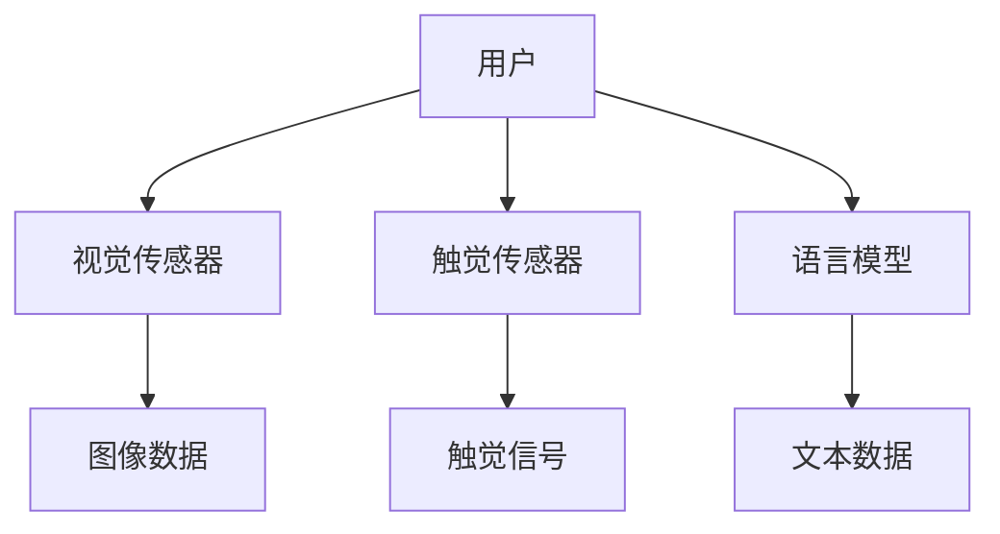
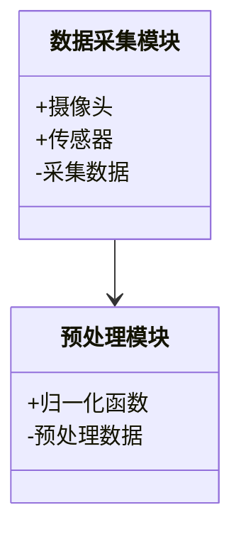
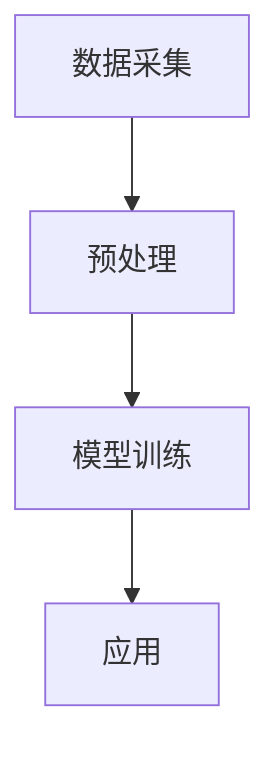

                 


---

# AI Agent的视觉-触觉-语言多模态学习

> 关键词：AI Agent，多模态学习，视觉，触觉，语言模型，深度学习，多模态数据融合

> 摘要：本文探讨了AI Agent在视觉、触觉和语言多模态数据学习中的应用，分析了多模态学习的核心概念、算法原理以及系统架构设计，并通过项目实战展示了如何实现多模态学习。文章旨在帮助读者理解多模态学习的重要性及其在AI Agent中的实际应用。

---

# 第一部分: AI Agent的多模态学习基础

## 第1章: 多模态学习与AI Agent概述

### 1.1 多模态学习的背景与意义

#### 1.1.1 多模态学习的定义与特点
多模态学习是指AI系统能够同时处理和利用多种数据类型（如视觉、触觉、语言）来提高学习效果和任务执行能力。其特点是信息互补性和任务增强性。

#### 1.1.2 AI Agent与多模态学习的关系
AI Agent需要在复杂的现实环境中执行任务，多模态学习帮助其更好地感知和交互。

#### 1.1.3 多模态学习在AI Agent中的应用价值
通过多模态学习，AI Agent能够处理更复杂的问题，如机器人操作或智能助手。

### 1.2 多模态数据的特征与挑战

#### 1.2.1 视觉、触觉、语言数据的特征分析
- 视觉数据：高维性，依赖光照和角度。
- 触觉数据：实时性，依赖传感器。
- 语言数据：语义性，依赖上下文。

#### 1.2.2 多模态数据融合的挑战
- 数据异构性：不同模态的数据格式和特征差异大。
- 模态间关联性低：如何有效关联不同模态的信息。
- 计算资源需求高：多模态数据处理需要大量计算资源。

#### 1.2.3 多模态学习的边界与外延
明确多模态学习的范围，如仅限于视觉、触觉、语言，还是包括其他模态。

### 1.3 本章小结
多模态学习对AI Agent的重要性，及其在复杂任务中的应用前景。

---

## 第2章: 多模态学习的核心概念与联系

### 2.1 多模态学习的核心概念

#### 2.1.1 数据表示方法
- 图像：二维矩阵表示。
- 文本：序列数据表示。
- 触觉：时间序列数据表示。

#### 2.1.2 模型组成
- 数据输入层：接收多种模态数据。
- 模态转换层：将一种模态数据转换为另一种模态。
- 融合层：将多模态数据进行融合。
- 输出层：生成最终结果。

#### 2.1.3 学习目标
通过多模态数据提高任务性能，如分类或生成。

### 2.2 数据特征对比

#### 2.2.1 表格对比
| 特征 | 视觉 | 触觉 | 语言 |
|------|------|------|------|
| 维度 | 高维 | 高维 | 序列 |
| 类型 | 图像 | 信号 | 文本 |
| 处理 | 图像处理 | 信号处理 | NLP处理 |

#### 2.2.2 实体关系图



---

## 第3章: 多模态学习的算法原理

### 3.1 算法分类

#### 3.1.1 模态转换模型
- 示例：CycleGAN用于图像到图像的转换。

#### 3.1.2 模态融合模型
- 示例：DAN（Deep Audio-Visual Network）用于多模态表示学习。

#### 3.1.3 联合学习模型
- 示例：对比学习模型，定义一个对比损失函数$L = \text{CE}(p, q)$。

### 3.2 主流算法

#### 3.2.1 多模态转换模型
- 使用CycleGAN进行图像到文本的转换。

#### 3.2.2 多模态融合模型
- 使用多模态表示学习，如DAN模型。

#### 3.2.3 对比学习模型
- 示例：$L = \text{CE}(p, q)$，其中$p$和$q$是概率分布。

### 3.3 数学模型与公式

#### 3.3.1 模态转换模型
$$ y = F(x) $$

#### 3.3.2 融合模型
$$ y = \sum_{i} \alpha_i x_i $$

#### 3.3.3 对比学习
$$ L = \text{CE}(p, q) $$

---

## 第4章: 系统分析与架构设计

### 4.1 系统构成

#### 4.1.1 问题场景
AI Agent需要同时处理视觉、触觉和语言信息，以完成特定任务。

#### 4.1.2 系统功能
- 数据采集：从传感器获取数据。
- 数据预处理：对数据进行归一化处理。
- 模型训练：训练多模态模型。
- 应用输出：生成结果。

#### 4.1.3 系统架构
- 模块化设计：数据采集模块、预处理模块、模型训练模块和应用模块。

### 4.2 Mermaid图

#### 4.2.1 领域模型类图


#### 4.2.2 系统架构图


### 4.3 接口设计

#### 4.3.1 接口定义
- RESTful API，定义输入和输出格式。

#### 4.3.2 接口实现
- Python函数，处理数据输入并调用模型进行预测。

#### 4.3.3 接口测试
- 使用Postman进行测试，确保接口正常工作。

---

## 第5章: 多模态学习的项目实战

### 5.1 环境安装与配置

#### 5.1.1 Python环境
安装Anaconda，选择Python版本。

#### 5.1.2 深度学习框架
安装TensorFlow或PyTorch。

#### 5.1.3 数据集
下载公开数据集，如ImageNet、MNIST、COCO等，并进行预处理。

### 5.2 核心实现

#### 5.2.1 数据预处理代码
```python
def preprocess_image(image):
    return image / 255.0
```

#### 5.2.2 模型构建代码
```python
class MultimodalModel(tf.keras.Model):
    def __init__(self):
        super(MultimodalModel, self).__init__()
        self.conv = tf.keras.layers.Conv2D(32, (3,3), activation='relu')
        self.dense = tf.keras.layers.Dense(10, activation='softmax')
```

#### 5.2.3 模型训练与评估代码
```python
def train_model(model, data, epochs=10):
    model.compile(optimizer='adam', loss='sparse_categorical_crossentropy', metrics=['accuracy'])
    model.fit(data['x_train'], data['y_train'], epochs=epochs, validation_data=(data['x_val'], data['y_val']))
    return model
```

### 5.3 案例分析

#### 5.3.1 案例选择
AI助手识别图像中的物体，并根据用户的语言描述进行操作。

#### 5.3.2 代码解读
详细解释每部分代码的功能，如数据加载、模型训练、结果输出。

#### 5.3.3 结果分析
分析模型在多模态任务中的表现，如准确率、F1分数等。

### 5.4 本章小结
总结项目实战的经验，强调多模态学习在实际应用中的效果和挑战。

---

# 总结

通过以上分析和实践，我们可以看到多模态学习在AI Agent中的重要性。结合视觉、触觉和语言数据，AI Agent能够更好地理解和交互，从而在复杂任务中表现出色。然而，多模态学习也面临着诸多挑战，如数据异构性和计算资源需求。未来的研究可以进一步优化算法，提高模型的泛化能力和性能。

