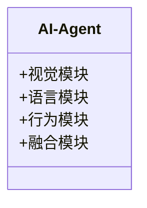

                 


# AI Agent的视觉-语言-行为三模态融合

## 关键词：AI Agent，视觉-语言-行为融合，多模态学习，跨模态交互，深度学习

## 摘要：
本文深入探讨了AI Agent在视觉、语言和行为三模态数据融合的关键技术。通过分析三模态数据的特征与关联性，结合多模态编码器、注意力机制和融合模型的原理，展示了如何实现高效且智能的AI Agent。文章从理论到实践，系统性地介绍了三模态融合的算法实现、系统架构设计和项目实战，为读者提供了全面的技术指导。

---

## 第1章: AI Agent的三模态融合背景与概念

### 1.1 AI Agent的基本概念
#### 1.1.1 AI Agent的定义与特点
AI Agent是一种智能体，能够感知环境、自主决策并执行任务。它具有以下特点：
- **自主性**：无需外部干预，自主完成任务。
- **反应性**：能够实时感知环境并做出反应。
- **学习能力**：通过数据和经验不断优化自身行为。

#### 1.1.2 多模态数据的定义与重要性
多模态数据指的是多种类型的数据，如视觉、语言和行为数据。三模态融合通过结合不同类型的数据，能够提高AI Agent的理解能力和决策水平。

#### 1.1.3 三模态融合的背景与意义
随着AI技术的发展，单一模态的数据处理已难以满足复杂场景的需求。通过融合视觉、语言和行为数据，AI Agent能够更好地理解环境、用户意图和行为模式，从而提供更智能的服务。

### 1.2 三模态融合的核心问题
#### 1.2.1 视觉、语言和行为模态的特征分析
- **视觉模态**：图像和视频数据，具有空间信息。
- **语言模态**：文本数据，具有语义信息。
- **行为模态**：时间序列数据，具有行为模式。

#### 1.2.2 三模态数据的关联性与挑战
- **关联性**：三模态数据之间存在语义和时序上的关联。
- **挑战**：数据异构性、模态间关联性弱、计算复杂度高。

#### 1.2.3 三模态融合的目标与应用场景
目标是通过融合三模态数据，提升AI Agent的感知、理解和决策能力。应用场景包括智能客服、自动驾驶、智能机器人等。

---

## 第2章: 视觉模态的核心概念与处理方法

### 2.1 视觉数据的特征与处理
#### 2.1.1 图像与视频数据的特征分析
- 图像数据具有空间信息，视频数据具有时序信息。
- 需要进行数据预处理，如归一化、增强等。

#### 2.1.2 视觉数据的预处理方法
- **归一化**：将图像数据归一化到固定范围内。
- **数据增强**：通过旋转、裁剪等方式增加数据多样性。

#### 2.1.3 基于深度学习的视觉特征提取
- **CNN**：广泛应用于图像特征提取。
- **注意力机制**：用于关注图像的重要区域。

### 2.2 视觉模态的关键技术
#### 2.2.1 卷积神经网络（CNN）在视觉处理中的应用
- **CNN结构**：由卷积层、池化层和全连接层组成。
- **案例**：在图像分类任务中，CNN能够提取图像的高层次特征。

#### 2.2.2 视觉注意力机制的原理与实现
- **注意力机制**：通过计算图像中各区域的重要性，聚焦关键区域。
- **实现方法**：基于位置的注意力和基于特征的注意力。

#### 2.2.3 多目标检测与跟踪技术
- **多目标检测**：同时检测多个目标。
- **目标跟踪**：通过时序信息跟踪目标位置。

---

## 第3章: 语言模态的核心概念与处理方法

### 3.1 自然语言处理的基本概念
#### 3.1.1 词嵌入与句子表示
- **词嵌入**：将词语映射为低维向量。
- **句子表示**：通过词嵌入和句法结构生成句子向量。

#### 3.1.2 基于Transformer的自然语言处理模型
- **Transformer结构**：由编码器和解码器组成。
- **案例**：BERT和GPT模型的应用。

#### 3.1.3 语言模型的可解释性与上下文理解
- **可解释性**：通过注意力权重分析模型决策过程。
- **上下文理解**：通过上下文信息生成连贯的文本。

### 3.2 语言模态的关键技术
#### 3.2.1 基于BERT的语言理解模型
- **BERT模型**：预训练的双向语言模型。
- **应用**：广泛应用于文本分类、问答系统等任务。

#### 3.2.2 语言生成模型（如GPT）
- **GPT模型**：基于Transformer的生成式模型。
- **应用**：文本生成、对话系统。

#### 3.2.3 多语言模型与跨语言处理
- **多语言模型**：支持多种语言的文本处理。
- **跨语言处理**：在不同语言之间进行信息转换。

---

## 第4章: 行为模态的核心概念与处理方法

### 4.1 行为数据的特征与表示
#### 4.1.1 行为数据的采集与预处理
- **数据采集**：通过传感器或摄像头采集行为数据。
- **预处理**：去噪、标准化等。

#### 4.1.2 基于时间序列的行为特征提取
- **时间序列分析**：通过滑动窗口提取特征。
- **时频分析**：通过FFT等方法分析信号的时频特性。

#### 4.1.3 行为数据的表示方法
- **表示方法**：将行为数据转换为向量形式。
- **案例**：在智能机器人中，行为数据用于动作识别。

### 4.2 行为模态的关键技术
#### 4.2.1 基于RNN的行为处理技术
- **RNN结构**：用于处理序列数据。
- **LSTM**：改进的RNN，适用于长序列数据。

#### 4.2.2 行为注意力机制
- **注意力机制**：用于关注行为序列中的关键部分。
- **实现方法**：基于位置的注意力和基于内容的注意力。

#### 4.2.3 多任务学习在行为处理中的应用
- **多任务学习**：同时处理多个相关任务。
- **案例**：在智能安防中，同时进行行为识别和异常检测。

---

## 第5章: 三模态融合的算法原理

### 5.1 多模态编码器的原理与实现
#### 5.1.1 多模态编码器的结构
- **编码器**：将多种模态的数据映射到同一空间。
- **融合方式**：通过加性或乘性的方式融合特征。

#### 5.1.2 多模态编码器的数学模型
- **公式**：$$ z = f(v, l, b) $$，其中$z$是融合向量，$v$是视觉特征，$l$是语言特征，$b$是行为特征。

### 5.2 注意力机制的原理与实现
#### 5.2.1 自注意力机制
- **公式**：$$ \alpha_i = \text{softmax}(Q_i K_i^T) $$，其中$\alpha_i$是注意力权重。

#### 5.2.2 跨模态注意力机制
- **公式**：$$ \beta_{ij} = \text{softmax}(Q_i K_j^T) $$，其中$\beta_{ij}$是跨模态注意力权重。

### 5.3 融合模型的原理与实现
#### 5.3.1 融合模型的数学模型
- **公式**：$$ y = g(z) $$，其中$y$是最终输出，$z$是融合向量。

#### 5.3.2 融合模型的实现
- **实现方法**：通过全连接层和非线性激活函数生成最终输出。

---

## 第6章: 系统架构与设计

### 6.1 系统功能设计
#### 6.1.1 领域模型设计
- **领域模型**：展示系统的主要功能模块。



#### 6.1.2 功能模块设计
- **视觉模块**：处理视觉数据，生成视觉特征。
- **语言模块**：处理语言数据，生成语言特征。
- **行为模块**：处理行为数据，生成行为特征。
- **融合模块**：将三模态特征融合，生成最终输出。

### 6.2 系统架构设计
#### 6.2.1 分层架构
- **数据采集层**：负责采集多模态数据。
- **数据处理层**：对数据进行预处理和特征提取。
- **融合层**：将三模态特征融合。
- **应用层**：根据融合结果执行任务。

#### 6.2.2 系统交互流程
- **流程图**：
  ```mermaid
  sequenceDiagram
      participant 用户
      participant AI-Agent
      participant 环境
      用户->AI-Agent: 发送指令
      AI-Agent->环境: 执行操作
      环境->AI-Agent: 返回反馈
      AI-Agent->用户: 确认结果
  ```

---

## 第7章: 项目实战

### 7.1 环境安装
- **Python**：安装Python 3.8及以上版本。
- **深度学习框架**：安装TensorFlow或PyTorch。
- **Numpy**：用于数值计算。

### 7.2 核心代码实现
#### 7.2.1 数据预处理代码
```python
import numpy as np

def preprocess_visual_data(image):
    # 图像归一化
    normalized_image = (image - np.mean(image)) / np.std(image)
    return normalized_image
```

#### 7.2.2 多模态编码器实现
```python
class MultimodalEncoder:
    def __init__(self, visual_dim, language_dim, behavior_dim):
        self.visual_dim = visual_dim
        self.language_dim = language_dim
        self.behavior_dim = behavior_dim

    def encode(self, visualFeat, languageFeat, behaviorFeat):
        # 融合特征
        fusedFeat = np.concatenate([visualFeat, languageFeat, behaviorFeat], axis=-1)
        return fusedFeat
```

### 7.3 项目实战案例分析
#### 7.3.1 案例分析
- **案例**：智能客服系统。
- **实现**：通过融合客户的视觉、语言和行为数据，提供更智能的客服服务。

#### 7.3.2 代码应用解读
- **代码解读**：详细说明每部分代码的功能和实现细节。
- **案例小结**：总结项目的实现过程和应用效果。

---

## 第8章: 最佳实践与总结

### 8.1 关键点总结
- **数据质量**：确保数据的多样性和代表性。
- **模型可解释性**：通过注意力机制分析模型决策过程。
- **计算资源**：合理配置计算资源，优化模型训练效率。

### 8.2 小结
本文详细探讨了AI Agent的视觉-语言-行为三模态融合的关键技术，从理论到实践，系统性地介绍了三模态融合的实现方法和应用场景。通过项目实战，读者可以深入了解三模态融合的技术细节，并将其应用于实际项目中。

### 8.3 注意事项
- **数据隐私**：注意数据的隐私保护，遵守相关法律法规。
- **模型优化**：通过模型压缩和量化技术优化模型性能。

### 8.4 拓展阅读
- **推荐书籍**：《Deep Learning》、《自然语言处理入门》。
- **推荐论文**：相关领域的顶会论文，如CVPR、ACL、ICML等。

---

通过本文的系统性介绍，读者可以全面了解AI Agent的视觉-语言-行为三模态融合技术，并能够将其应用于实际项目中。希望本文能为读者提供有价值的参考和指导。

