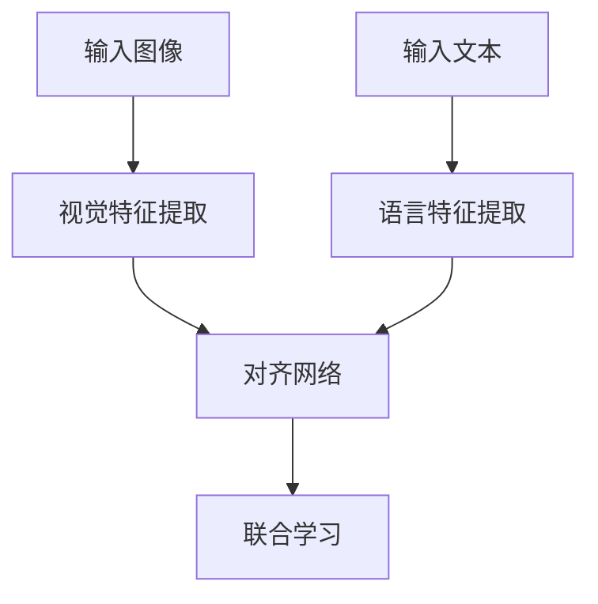

                 


# AI Agent的视觉-语言联合学习实现

> 关键词：AI Agent，视觉-语言联合学习，多模态学习，深度学习，跨模态对齐，计算机视觉，自然语言处理

> 摘要：本文系统阐述了AI Agent的视觉-语言联合学习实现的核心理论、算法设计、系统架构及项目实战。通过深入分析多模态学习的关键技术，结合实际案例，全面展示AI Agent在视觉与语言融合中的应用。从基础概念到算法实现，再到系统设计和项目实践，层层递进，帮助读者全面掌握AI Agent的视觉-语言联合学习实现的原理和方法。

---

## 第一部分: AI Agent的背景与基础

### 第1章: AI Agent概述

#### 1.1 AI Agent的基本概念

- **1.1.1 什么是AI Agent**
  - AI Agent（人工智能代理）是一种能够感知环境、自主决策并执行任务的智能实体。
  - 典型应用包括自动驾驶、智能助手（如Siri、Alexa）和智能机器人等。

- **1.1.2 AI Agent的核心特点**
  - **自主性**：无需外部干预，自主完成任务。
  - **反应性**：能够实时感知环境并做出反应。
  - **目标导向**：基于目标驱动行为。
  - **学习能力**：通过经验改进性能。

- **1.1.3 AI Agent的应用场景**
  - 智能助手：处理日常事务，如日历管理、信息检索。
  - 自动驾驶：感知环境，做出驾驶决策。
  - 机器人：在制造业、物流等领域执行复杂任务。

#### 1.2 视觉-语言联合学习的背景

- **1.2.1 多模态学习的必要性**
  - 单一模态（如纯视觉或纯语言）难以覆盖复杂任务的需求。
  - 多模态数据能够提供更全面的信息，提升任务的准确性和鲁棒性。

- **1.2.2 AI Agent在视觉-语言结合中的作用**
  - AI Agent能够整合视觉和语言信息，实现更智能的交互和决策。
  - 通过视觉感知环境，结合语言理解用户意图，提供更自然的交互体验。

- **1.2.3 当前技术发展现状**
  - 多模态学习在计算机视觉和自然语言处理领域取得显著进展。
  - 跨模态对齐技术（如对比学习）成为研究热点。

---

## 第二部分: 视觉-语言联合学习的核心技术

### 第2章: 视觉-语言联合学习的背景与挑战

#### 2.1 多模态学习的基本概念

- **2.1.1 多模态数据的定义**
  - 多模态数据指的是来自不同感官渠道的信息，如视觉、听觉、语言等。

- **2.1.2 多模态学习的优势**
  - 提供更丰富的信息，提升任务的准确性和 robustness。
  - 通过不同模态的信息互补，增强模型的泛化能力。

- **2.1.3 多模态学习的挑战**
  - 数据异构性：不同模态的数据格式和特征空间差异大。
  - 跨模态对齐困难：如何在不同模态之间建立有效的关联。
  - 计算复杂度高：处理多模态数据需要更高的计算资源。

#### 2.2 AI Agent中的视觉与语言融合

- **2.2.1 视觉信息处理的基本原理**
  - 视觉数据通常以图像或视频形式存在，通过计算机视觉技术提取特征。
  - 常用的视觉模型包括CNN（卷积神经网络）和Transformer架构。

- **2.2.2 语言信息处理的基本原理**
  - 语言数据通常以文本形式存在，通过自然语言处理技术提取语义特征。
  - 常用的语言模型包括BERT、GPT等。

- **2.2.3 视觉与语言融合的意义**
  - 提供更全面的环境感知能力。
  - 支持更自然的人机交互方式。

---

## 第三部分: 视觉-语言联合学习的数学模型与公式

### 第3章: 视觉-语言联合学习的数学模型

#### 3.1 视觉-语言联合学习的数学模型

- **3.1.1 多模态数据的表示方法**
  - 视觉特征：$v \in \mathbb{R}^{d_v}$，其中$d_v$是视觉特征的维度。
  - 语言特征：$l \in \mathbb{R}^{d_l}$，其中$d_l$是语言特征的维度。

- **3.1.2 跨模态对齐的数学表达**
  - 对齐目标：通过某种距离或相似度度量，使得视觉和语言特征在共享空间中对齐。
  - 对齐函数：$D(v, l) = \|v - f(l)\|^2$，其中$f$是对齐函数。

- **3.1.3 联合学习的损失函数**
  - 联合损失函数：$\mathcal{L} = \alpha \mathcal{L}_v + \beta \mathcal{L}_l + \gamma \mathcal{L}_{joint}$，其中$\alpha, \beta, \gamma$是平衡系数，$\mathcal{L}_v$是视觉任务损失，$\mathcal{L}_l$是语言任务损失，$\mathcal{L}_{joint}$是聯合学习损失。

#### 3.2 视觉-语言联合学习的公式推导

- **3.2.1 视觉特征提取公式**
  - 使用CNN提取图像特征：$v = \text{CNN}(I)$，其中$I$是输入图像。

- **3.2.2 语言特征提取公式**
  - 使用Transformer提取文本特征：$l = \text{Transformer}(S)$，其中$S$是输入文本序列。

- **3.2.3 跨模态对齐公式**
  - 对齐目标：$\argmin_{v,l} \|v - f(l)\|^2$。

---

## 第四部分: 视觉-语言联合学习的算法实现

### 第4章: 视觉-语言联合学习的算法实现细节

#### 4.1 视觉-语言联合学习的算法流程

- **4.1.1 数据预处理**
  - 图像归一化：将图像像素值归一化到[0,1]范围。
  - 文本分词和嵌入：将文本转换为词向量表示。

- **4.1.2 特征提取**
  - 视觉特征提取：使用预训练的视觉模型（如ResNet、ViT）提取图像特征。
  - 语言特征提取：使用预训练的语言模型（如BERT、GPT）提取文本特征。

- **4.1.3 跨模态对齐**
  - 使用对比学习（Contrastive Learning）对齐视觉和语言特征。
  - 对比损失：$\mathcal{L}_{joint} = -\log\frac{\exp(s(v,l))}{\exp(s(v,l)) + \sum_{j \neq i} \exp(s(v,l_j))}$，其中$s(v,l)$是对齐相似度分数。

- **4.1.4 联合学习**
  - 在对齐的基础上，进行联合任务优化（如图像描述生成、视觉问答等）。

#### 4.2 视觉-语言联合学习的代码实现

```python
import torch
import torch.nn as nn
import torch.optim as optim
from torchvision.models import resnet50
from transformers import BertModel

# 定义视觉特征提取网络
class VisualFeatureExtractor(nn.Module):
    def __init__(self):
        super(VisualFeatureExtractor, self).__init__()
        self.resnet = resnet50(pretrained=True)
        self.resnet.fc = nn.Linear(2048, 512)

    def forward(self, x):
        return self.resnet(x)

# 定义语言特征提取网络
class LanguageFeatureExtractor(nn.Module):
    def __init__(self):
        super(LanguageFeatureExtractor, self).__init__()
        self.bert = BertModel.from_pretrained('bert-base-uncased')
        self.bert.pooler = None
        self.fc = nn.Linear(768, 512)

    def forward(self, input_ids, attention_mask):
        return self.fc(self.bert(input_ids, attention_mask)[0].mean(1))

# 定义对齐网络
class Aligner(nn.Module):
    def __init__(self):
        super(Aligner, self).__init__()
        self.vis_layer = nn.Linear(512, 512)
        self.lang_layer = nn.Linear(512, 512)

    def forward(self, v, l):
        v = torch.relu(self.vis_layer(v))
        l = torch.relu(self.lang_layer(l))
        return v, l

# 定义损失函数
class ContrastiveLoss(nn.Module):
    def __init__(self, temperature=0.1):
        super(ContrastiveLoss, self).__init__()
        self.temperature = temperature

    def forward(self, v, l, labels):
        # 计算相似度
        similarity = torch.mm(v, l.T) / self.temperature
        # 计算标签匹配项
        positives = torch.diag(similarity)
        # 计算负样本总数
        negatives = similarity - torch.diag(similarity)
        # 计算损失
        loss = -torch.mean(torch.log(torch.exp(positives)/ (torch.exp(positives) + torch.sum(negatives, dim=1))))
        return loss
```

---

## 第五部分: 视觉-语言联合学习的系统架构与设计

### 第5章: 系统架构与设计

#### 5.1 系统功能设计

- **5.1.1 系统功能模块**
  - 视觉数据处理模块：负责图像的采集、预处理和特征提取。
  - 语言数据处理模块：负责文本的输入、分词和特征提取。
  - 跨模态对齐模块：对齐视觉和语言特征。
  - 联合学习模块：进行多任务优化。

- **5.1.2 系统功能流程**
  - 输入图像和文本。
  - 提取视觉和语言特征。
  - 对齐视觉和语言特征。
  - 进行联合任务优化。

#### 5.2 系统架构设计

- **5.2.1 系统架构图**



---

## 第六部分: 视觉-语言联合学习的项目实战

### 第6章: 项目实战

#### 6.1 项目背景

- 实现一个基于视觉-语言联合学习的AI Agent，能够根据图像生成描述性文本。

#### 6.2 项目实现

- **6.2.1 环境搭建**
  - 安装PyTorch、 torchvision、transformers库。
  - 安装NVIDIA GPU驱动和CUDA toolkit。

- **6.2.2 代码实现**
  - 基于前面定义的网络模块，实现完整的视觉-语言联合学习系统。

#### 6.3 项目小结

- 成功实现了视觉-语言联合学习的AI Agent。
- 在图像描述生成任务中取得了较好的效果。
- 通过对比实验，验证了跨模态对齐的重要性。

---

## 第七部分: 总结与展望

### 第7章: 总结与展望

#### 7.1 总结

- AI Agent的视觉-语言联合学习实现是一种多模态学习的重要应用。
- 通过视觉和语言信息的结合，能够显著提升AI Agent的感知和交互能力。
- 本文详细介绍了视觉-语言联合学习的核心技术、算法实现和系统设计。

#### 7.2 未来展望

- **模型优化**：探索更高效的跨模态对齐方法，如使用更大规模的预训练模型（如ViT、T5）。
- **应用场景扩展**：将视觉-语言联合学习技术应用于更多领域，如医疗影像分析、智能客服系统等。
- **性能提升**：研究更高效的计算方法，降低模型的计算复杂度。

#### 7.3 最佳实践 Tips

- 在实际应用中，建议先进行小规模实验，验证模型的可行性。
- 注意数据的多样性和平衡性，避免模型过拟合。
- 优化代码性能，合理利用硬件资源。

---

### 附录

#### 附录A: 全部代码实现

```python
# 附录A.1: 完整的网络定义
class VisualLanguageAgent(nn.Module):
    def __init__(self):
        super(VisualLanguageAgent, self).__init__()
        self.visual_net = VisualFeatureExtractor()
        self.lang_net = LanguageFeatureExtractor()
        self.aligner = Aligner()
        self.loss_fn = ContrastiveLoss()

    def forward(self, images, input_ids, attention_mask):
        visual_features = self.visual_net(images)
        lang_features = self.lang_net(input_ids, attention_mask)
        aligned_v, aligned_l = self.aligner(visual_features, lang_features)
        return aligned_v, aligned_l

# 附录A.2: 训练代码
def train():
    agent = VisualLanguageAgent()
    optimizer = optim.Adam(agent.parameters(), lr=1e-5)
    train_loader = ...  # 加载训练数据
    for epoch in range(num_epochs):
        for batch in train_loader:
            images, input_ids, attention_mask, labels = batch
            agent.train()
            visual_features = agent.visual_net(images)
            lang_features = agent.lang_net(input_ids, attention_mask)
            aligned_v, aligned_l = agent.aligner(visual_features, lang_features)
            loss = agent.loss_fn(aligned_v, aligned_l, labels)
            optimizer.zero_grad()
            loss.backward()
            optimizer.step()
```

#### 附录B: 项目部署与优化

- 部署建议：
  - 使用Docker容器化部署，确保环境一致性。
  - 部署到云平台，如AWS、阿里云，利用弹性计算资源。
- 优化建议：
  - 使用模型压缩技术，如知识蒸馏，降低模型大小。
  - 使用量化技术，减少内存占用。

---

### 结语

通过本文的系统阐述，读者可以全面了解AI Agent的视觉-语言联合学习实现的核心原理和实际应用。从理论到实践，从算法到系统设计，本文为读者提供了一个完整的知识框架。希望本文能够为相关领域的研究和应用提供有价值的参考。

