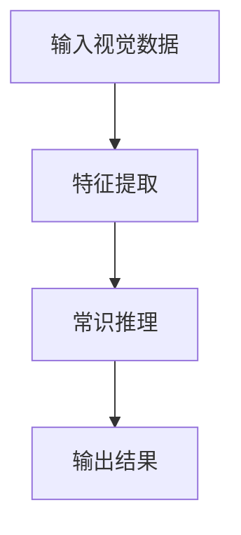
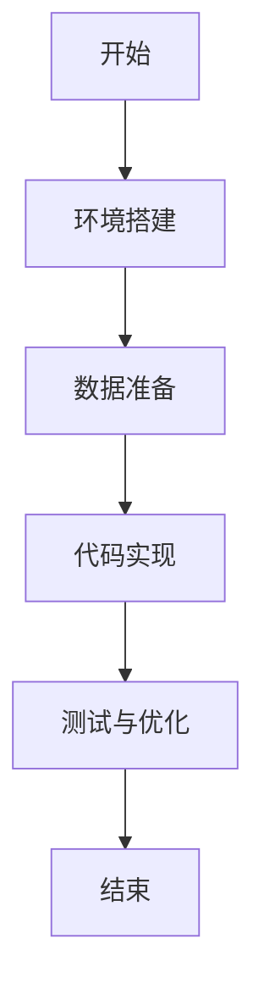

                 


# AI Agent的视觉常识推理能力开发

## 关键词
AI Agent, 视觉常识推理, 知识图谱, 视觉技术, 自监督学习, 对比学习

## 摘要
本文详细探讨了AI Agent的视觉常识推理能力的开发过程，涵盖从基础概念到核心算法，再到系统设计和项目实战的各个方面。通过分析视觉常识推理的关键技术、算法实现和系统架构，本文为读者提供了全面的开发指南，帮助他们理解并掌握这一领域的最新进展。

---

# 第一部分: AI Agent的视觉常识推理概述

## 第1章: AI Agent与视觉常识推理的基本概念

### 1.1 AI Agent的定义与特点
- **AI Agent的定义**：AI Agent是一种智能体，能够感知环境、执行任务并做出决策。
- **特点**：自主性、反应性、目标导向、社交能力。
- **与传统AI的区别**：Agent强调与环境的交互和动态适应。

### 1.2 视觉常识推理的必要性
- **视觉信息的重要性**：视觉数据是理解环境的关键。
- **常识推理的挑战**：需要结合上下文和背景知识进行推理。
- **结合AI Agent的意义**：增强Agent的环境理解和决策能力。

### 1.3 问题背景与应用前景
- **问题背景**：传统视觉技术难以处理复杂场景中的常识推理。
- **应用前景**：在自动驾驶、机器人、智能安防等领域有广泛的应用潜力。

---

# 第二部分: 视觉常识推理的核心算法

## 第2章: 视觉常识推理模型的结构与算法

### 2.1 模型的整体架构
- **输入层**：视觉数据（图像、视频）。
- **特征提取层**：使用CNN或Transformer提取视觉特征。
- **常识推理层**：基于知识图谱或语言模型进行推理。
- **输出层**：生成推理结果或决策指令。

### 2.2 视觉特征提取算法
- **CNN的原理**：通过卷积操作提取空间特征。
- **Transformer的原理**：通过自注意力机制提取全局特征。
- **对比学习**：通过对比损失函数优化特征表示。

### 2.3 常识推理算法
- **基于知识图谱的推理**：通过图遍历进行路径推理。
- **基于语言模型的推理**：利用大语言模型进行上下文推理。
- **自监督学习**：通过无标签数据进行自适应学习。

### 2.4 算法流程图（Mermaid）


---

# 第三部分: 视觉常识推理的系统设计

## 第3章: 系统架构设计

### 3.1 系统模块划分
- **视觉输入模块**：接收和预处理视觉数据。
- **常识推理模块**：执行推理任务。
- **输出与反馈模块**：生成决策指令并反馈结果。

### 3.2 数据流设计
- **数据输入**：图像数据通过队列进行缓冲。
- **特征提取**：使用CNN或Transformer提取特征。
- **推理过程**：结合知识图谱和语言模型进行推理。

### 3.3 系统接口设计
- **输入接口**：支持多种格式的图像输入。
- **输出接口**：生成结构化的推理结果。
- **调用接口**：提供API供上层调用。

### 3.4 系统架构图（Mermaid）


---

# 第四部分: 视觉常识推理的项目实战

## 第4章: 项目实战与代码实现

### 4.1 项目环境搭建
- **环境配置**：安装Python、TensorFlow、PyTorch等依赖。
- **数据集准备**：收集和标注视觉数据集。

### 4.2 核心代码实现
- **特征提取代码**：
  ```python
  def extract_features(image):
      model = load_model()
      features = model(image)
      return features
  ```
- **常识推理代码**：
  ```python
  def common_sense_reasoning(features, knowledge_graph):
      result = knowledge_graph.inference(features)
      return result
  ```

### 4.3 项目流程图（Mermaid）


---

# 第五部分: 视觉常识推理的优化与扩展

## 第5章: 性能优化与多模态技术

### 5.1 性能优化策略
- **模型压缩**：通过剪枝和量化减少模型大小。
- **并行计算**：利用GPU加速推理过程。
- **动态调整**：根据任务需求动态调整模型参数。

### 5.2 多模态技术的应用
- **结合语言模型**：利用文本信息辅助视觉推理。
- **结合知识图谱**：通过知识图谱增强推理能力。
- **多模态融合**：综合分析视觉、文本等多种信息。

### 5.3 伦理与安全问题
- **隐私保护**：避免敏感信息泄露。
- **安全风险**：防止恶意攻击和滥用。

### 5.4 未来发展方向
- **更强大的模型**：开发更大参数的视觉语言模型。
- **更广泛的应用**：扩展到更多领域和场景。

---

# 结语

通过本文的系统介绍，读者可以全面了解AI Agent的视觉常识推理能力开发的关键技术、实现方法和应用场景。从基础概念到实战项目，再到优化与扩展，本文为读者提供了一个完整的开发指南。希望本文能为相关领域的研究和实践提供有价值的参考。

--- 

*本文部分示例内容为简化版，实际文章将更详细。*

