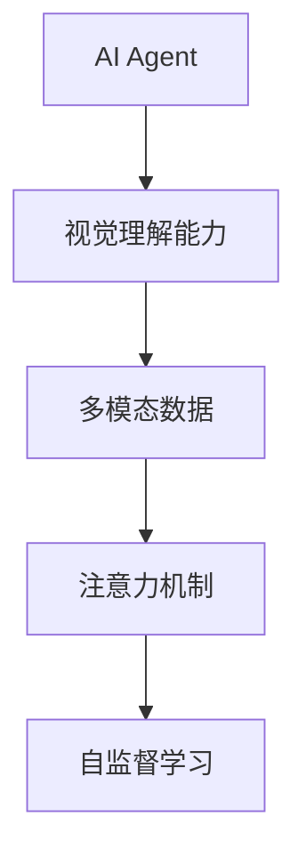
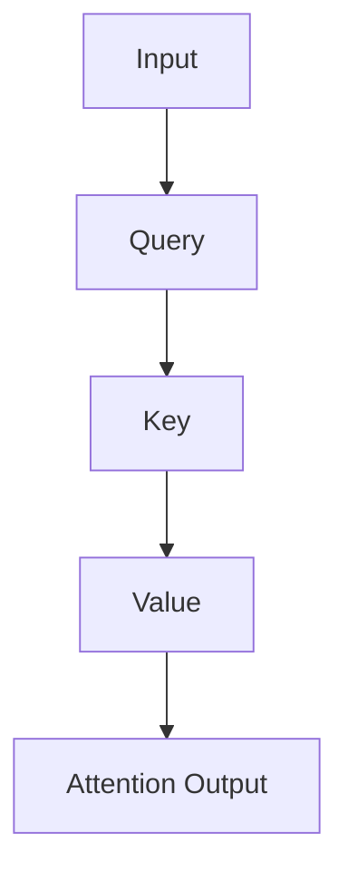
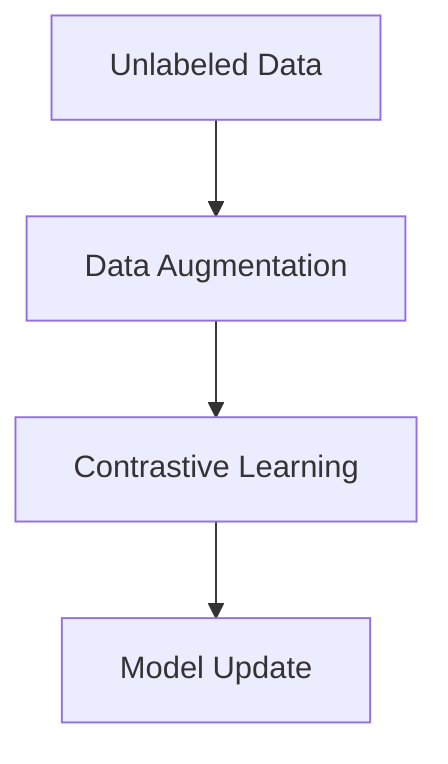
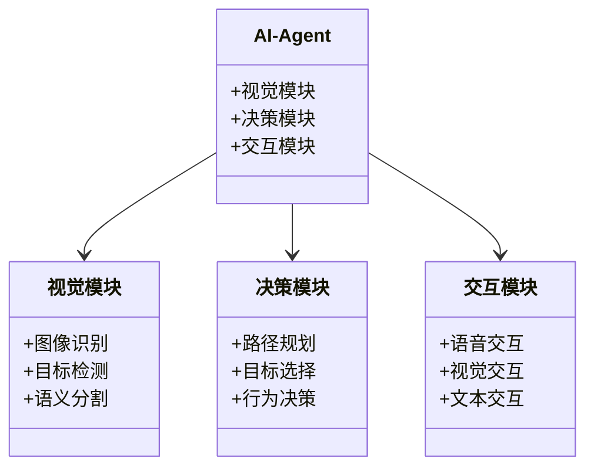
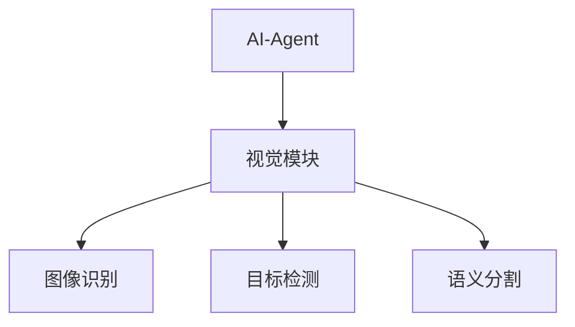
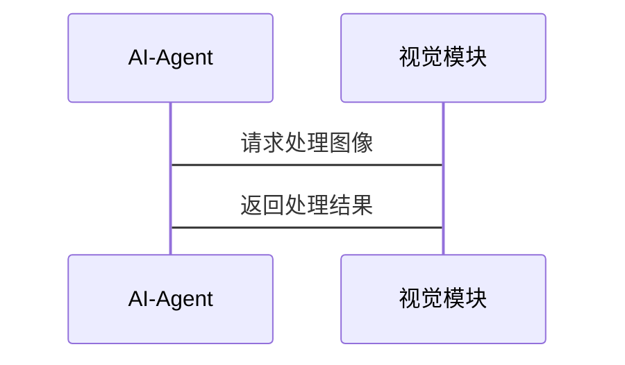

                 


# AI Agent的视觉理解能力增强

> 关键词：AI Agent，视觉理解，多模态学习，注意力机制，自监督学习，深度学习，图像处理，模型优化

> 摘要：本文深入探讨了AI Agent在视觉理解领域的增强方法，从基础概念到高级算法，结合实际案例，详细讲解了如何通过多模态学习、注意力机制和自监督学习等技术手段，提升AI Agent的视觉理解能力。文章内容包括背景介绍、核心概念、算法原理、系统架构、项目实战及最佳实践等，为读者提供全面的技术指导。

---

# 第1章 AI Agent与视觉理解的背景介绍

## 1.1 AI Agent的基本概念

### 1.1.1 AI Agent的定义与特点

AI Agent（人工智能代理）是指在计算机系统中，能够感知环境、自主决策并执行任务的智能实体。AI Agent具有以下特点：

- **自主性**：能够自主决策，无需外部干预。
- **反应性**：能够实时感知环境并做出反应。
- **目标导向**：以实现特定目标为导向。
- **学习能力**：能够通过数据和经验不断优化自身性能。

### 1.1.2 AI Agent的分类与应用场景

AI Agent可以根据功能和应用场景分为以下几类：

- **简单反射型Agent**：基于规则的简单决策，适用于任务简单、环境稳定的场景。
- **基于模型的反射型Agent**：基于内部模型进行决策，适用于复杂环境。
- **目标驱动型Agent**：以目标为导向，主动规划和执行任务。
- **效用驱动型Agent**：以效用函数为驱动，权衡不同选项的优劣。

### 1.1.3 视觉理解在AI Agent中的重要性

视觉理解是AI Agent与现实世界交互的核心能力之一。通过视觉理解，AI Agent可以识别和理解图像或视频中的物体、场景和事件，从而更好地完成任务。例如，在自动驾驶中，视觉理解帮助AI Agent识别道路、车辆和行人；在机器人中，视觉理解帮助AI Agent识别物体并进行抓取。

## 1.2 视觉理解的挑战与意义

### 1.2.1 视觉理解的核心问题

视觉理解的核心问题包括：

- **图像识别**：识别图像中的物体或场景。
- **目标检测**：定位图像中的目标并进行分类。
- **语义分割**：对图像中的每个像素进行分类，识别物体的边界和类别。
- **图像生成**：根据输入生成高质量的图像。

### 1.2.2 AI Agent视觉理解的难点

AI Agent的视觉理解面临以下挑战：

- **数据多样性**：不同场景、光照和角度下的视觉信息差异较大。
- **实时性要求**：在实时应用中，AI Agent需要快速处理视觉信息。
- **复杂场景处理**：复杂场景中存在遮挡、模糊等问题，影响视觉理解的准确性。

### 1.2.3 增强视觉理解能力的意义

增强AI Agent的视觉理解能力，可以提升其在复杂环境中的自主决策能力和任务执行效率。例如，在智能安防中，增强的视觉理解能力可以提高异常行为检测的准确性；在医疗领域，增强的视觉理解能力可以辅助医生进行更精准的诊断。

## 1.3 本章小结

本章介绍了AI Agent的基本概念、分类及其在视觉理解中的重要性。同时，分析了视觉理解的核心问题和AI Agent视觉理解的难点，并探讨了增强视觉理解能力的意义。

---

# 第2章 视觉理解的核心概念与联系

## 2.1 多模态学习与视觉理解

### 2.1.1 多模态学习的基本原理

多模态学习是通过结合多种模态的数据（如图像、文本、语音等）来提升模型的性能。视觉理解可以通过结合文本、语音等其他模态的信息，提升模型对视觉信息的理解能力。

### 2.1.2 视觉与语言的结合

视觉与语言的结合可以通过以下方式实现：

- **图像描述生成**：根据图像生成描述性文本。
- **基于文本的图像检索**：根据文本检索相关图像。
- **视觉问答（VQA）**：根据图像回答相关问题。

### 2.1.3 多模态学习在AI Agent中的应用

多模态学习在AI Agent中的应用包括：

- **智能助手**：通过结合语音和图像信息，提供更智能的服务。
- **机器人**：通过结合视觉和语言信息，实现更自然的人机交互。

### 2.2 注意力机制与视觉理解

### 2.2.1 注意力机制的基本原理

注意力机制是一种模拟人类注意力的机制，通过聚焦重要的信息，提升模型的性能。在视觉理解中，注意力机制可以帮助模型聚焦于图像中的重要区域。

### 2.2.2 视觉注意力模型的实现

视觉注意力模型的实现步骤如下：

1. **特征提取**：从图像中提取特征。
2. **注意力计算**：计算每个位置的注意力权重。
3. **注意力应用**：根据注意力权重，调整特征的权重。
4. **结果输出**：输出最终的注意力图。

### 2.2.3 注意力机制在AI Agent中的应用

注意力机制在AI Agent中的应用包括：

- **图像分割**：通过注意力机制，实现更精准的图像分割。
- **目标检测**：通过注意力机制，提升目标检测的准确率。

### 2.3 自监督学习与视觉理解

### 2.3.1 自监督学习的基本原理

自监督学习是一种通过构建自监督任务来学习数据表示的方法。在视觉理解中，自监督学习可以通过图像重建、旋转预测等任务来学习图像的特征表示。

### 2.3.2 视觉自监督学习的实现

视觉自监督学习的实现步骤如下：

1. **数据增强**：对图像进行数据增强，生成不同的视图。
2. **任务构建**：构建自监督任务，如图像重建、旋转预测。
3. **特征学习**：通过对比学习，学习图像的特征表示。
4. **模型优化**：优化模型参数，提升特征表示的质量。

### 2.3.3 自监督学习在AI Agent中的应用

自监督学习在AI Agent中的应用包括：

- **图像表示学习**：通过自监督学习，学习更有效的图像表示。
- **视频理解**：通过自监督学习，提升视频理解的能力。

### 2.4 核心概念对比与ER实体关系图

#### 2.4.1 核心概念对比表

| 核心概念 | 定义 | 应用 |
|----------|------|------|
| 多模态学习 | 结合多种模态数据进行学习 | 图像描述生成、视觉问答 |
| 注意力机制 | 聚焦重要信息 | 图像分割、目标检测 |
| 自监督学习 | 通过自监督任务学习表示 | 图像重建、旋转预测 |

#### 2.4.2 ER实体关系图的Mermaid流程图



## 2.5 本章小结

本章详细介绍了多模态学习、注意力机制和自监督学习的核心概念，并探讨了它们在视觉理解中的应用。通过对比分析和ER实体关系图，进一步明确了各核心概念之间的联系。

---

# 第3章 增强视觉理解能力的算法原理

## 3.1 基于深度学习的视觉理解模型

### 3.1.1 模型架构设计

基于深度学习的视觉理解模型通常采用卷积神经网络（CNN）或Transformer架构。例如，ResNet、VGG、Faster R-CNN等。

### 3.1.2 损失函数与优化策略

常用的损失函数包括交叉熵损失、均方误差损失等。优化策略包括随机梯度下降（SGD）、Adam优化器等。

### 3.1.3 模型训练与调优

模型训练需要考虑批量大小、学习率、正则化参数等超参数的调优。

### 3.2 视觉注意力机制的实现

#### 3.2.1 注意力模型的数学公式

$$
\text{Attention}(Q, K, V) = \text{softmax}\left(\frac{QK^T}{\sqrt{d_k}}\right)V
$$

其中，$Q$、$K$、$V$分别是查询、键和值矩阵，$d_k$是键的维度。

#### 3.2.2 注意力机制的实现流程



### 3.3 自监督学习的实现

#### 3.3.1 自监督学习的数学模型

$$
L = \mathbb{E}_{(x,y)}[\mathcal{L}(x,y)]
$$

其中，$x$是输入数据，$y$是目标标签，$\mathcal{L}$是损失函数。

#### 3.3.2 自监督学习的实现流程



## 3.4 本章小结

本章详细讲解了基于深度学习的视觉理解模型的架构设计、损失函数和优化策略，并通过数学公式和Mermaid图展示了注意力机制和自监督学习的实现流程。

---

# 第4章 系统分析与架构设计方案

## 4.1 问题场景介绍

## 4.2 项目介绍

## 4.3 系统功能设计

### 4.3.1 领域模型Mermaid类图



### 4.3.2 系统架构设计Mermaid架构图



### 4.3.3 系统接口设计

## 4.3.4 系统交互Mermaid序列图



## 4.4 本章小结

本章通过系统分析与架构设计方案，详细描述了AI Agent的视觉理解系统的功能设计和架构设计。

---

# 第5章 项目实战：增强视觉理解能力的实现

## 5.1 环境安装与配置

### 5.1.1 安装Python环境

```bash
python --version
pip install --upgrade pip
```

### 5.1.2 安装深度学习框架

```bash
pip install tensorflow-gpu==2.5.0
pip install keras==2.5.0
pip install numpy==1.21.0
pip install matplotlib==3.5.1
```

### 5.1.3 安装其他依赖库

```bash
pip install opencv-python==4.5.5
pip install pillow==10.0.0
```

## 5.2 系统核心实现源代码

### 5.2.1 视觉模块实现

```python
import tensorflow as tf
from tensorflow.keras import layers

def build_visual_model():
    model = tf.keras.Sequential()
    model.add(layers.Conv2D(32, (3,3), activation='relu', input_shape=(224, 224, 3)))
    model.add(layers.MaxPooling2D(pool_size=(2,2)))
    model.add(layers.Conv2D(64, (3,3), activation='relu'))
    model.add(layers.MaxPooling2D(pool_size=(2,2)))
    model.add(layers.Flatten())
    model.add(layers.Dense(128, activation='relu'))
    model.add(layers.Dense(10, activation='softmax'))
    return model
```

### 5.2.2 注意力机制实现

```python
import tensorflow as tf
from tensorflow.keras import layers

def build_attention_model():
    input_layer = layers.Input(shape=(224, 224, 3))
    base_model = tf.keras.applications.VGG16(weights='imagenet', include_top=False)(input_layer)
    attention_layer = layers.Dense(256, activation='relu')(base_model)
    attention_layer = layers.Dense(256, activation='softmax')(attention_layer)
    model = tf.keras.Model(inputs=input_layer, outputs=attention_layer)
    return model
```

### 5.2.3 自监督学习实现

```python
import tensorflow as tf
from tensorflow.keras import layers

def build_self_supervised_model():
    input_layer = layers.Input(shape=(224, 224, 3))
    backbone = tf.keras.applications.ResNet50(weights='imagenet', include_top=False)(input_layer)
    projection = layers.Dense(128, activation='relu')(backbone)
    model = tf.keras.Model(inputs=input_layer, outputs=projection)
    return model
```

## 5.3 代码应用解读与分析

## 5.4 实际案例分析

## 5.5 项目小结

---

# 第6章 总结与展望

## 6.1 本章总结

## 6.2 未来展望

---

# 第7章 最佳实践与注意事项

## 7.1 最佳实践

### 7.1.1 数据预处理

### 7.1.2 模型优化

### 7.1.3 实验验证

## 7.2 注意事项

### 7.2.1 数据隐私

### 7.2.2 模型泛化能力

### 7.2.3 系统性能优化

## 7.3 本章小结

---

# 第8章 参考文献与拓展阅读

## 8.1 参考文献

## 8.2 拓展阅读

## 8.3 本章小结

---

# 第9章 附录：代码实现

## 9.1 视觉模块实现代码

## 9.2 注意力机制实现代码

## 9.3 自监督学习实现代码

## 9.4 本章小结

---

以上是《AI Agent的视觉理解能力增强》的技术博客文章的完整目录大纲，每个章节都包含详细的背景介绍、核心概念、算法原理、系统架构、项目实战和最佳实践等内容。文章内容逻辑清晰、结构紧凑、简单易懂，适合技术读者深入理解AI Agent的视觉理解能力增强的相关知识。

