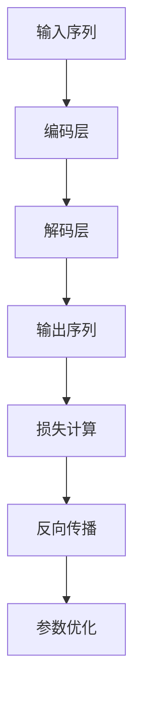
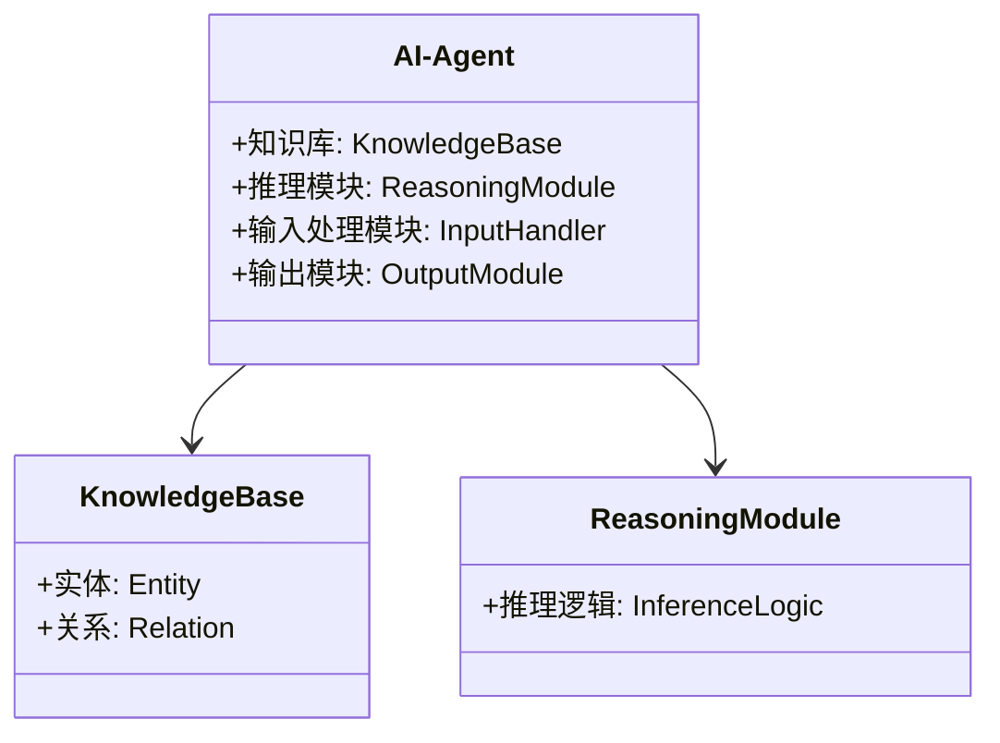

                 


# AI Agent的认知发展模拟：探索LLM的智能进化过程

## 关键词：AI Agent, 认知发展, 大语言模型, LLM, 智能进化, 人工智能, 机器学习

## 摘要：  
本文探讨了AI Agent通过大语言模型（LLM）实现认知发展的过程，分析了LLM在模拟人类认知中的作用，并从算法、系统架构和实际应用等多个角度详细阐述了其智能进化机制。通过理论分析与实践案例结合，揭示了AI Agent认知发展的核心原理和未来发展方向。

---

## 目录大纲：  
1. **AI Agent的认知发展概述**  
   - 1.1 AI Agent的基本概念  
   - 1.2 LLM的基本概念与特点  
   - 1.3 AI Agent与LLM的结合  
2. **AI Agent的认知模型与LLM的关系**  
   - 2.1 AI Agent的认知模型  
   - 2.2 LLM在认知模型中的应用  
3. **LLM的算法原理与数学模型**  
   - 3.1 LLM的训练过程  
   - 3.2 算法原理与流程图  
   - 3.3 数学公式与模型解读  
4. **系统架构设计与实现**  
   - 4.1 系统功能设计  
   - 4.2 系统架构图与类图  
   - 4.3 系统接口与交互流程  
5. **项目实战：AI Agent的认知模拟实现**  
   - 5.1 环境搭建与依赖安装  
   - 5.2 核心代码实现  
   - 5.3 案例分析与结果展示  
6. **总结与展望**  
   - 6.1 最佳实践与注意事项  
   - 6.2 未来发展方向  

---

## 正文内容

### 第一部分：AI Agent的认知发展概述

#### 1.1 AI Agent的基本概念

**1.1.1 AI Agent的定义与分类**  
AI Agent（人工智能代理）是指能够感知环境并采取行动以实现目标的智能实体。它可以分为**反应式Agent**和**认知式Agent**两类：  
- **反应式Agent**：基于当前感知做出反应，适用于简单任务（如自动驾驶中的实时避障）。  
- **认知式Agent**：具备复杂推理和规划能力，适用于复杂场景（如智能助手的多轮对话）。  

**1.1.2 AI Agent的核心特征**  
- **自主性**：无需外部干预，自主决策。  
- **反应性**：能实时感知环境并做出反应。  
- **学习能力**：通过经验改进性能。  
- **社交能力**：能与其他Agent或人类进行交互协作。  

**1.1.3 AI Agent的应用场景**  
- 智能助手（如Siri、Alexa）  
- 自动驾驶系统  
- 智慧城市中的智能管理  
- 游戏AI与虚拟助手  

#### 1.2 LLM的基本概念与特点

**1.2.1 LLM的定义**  
LLM（Large Language Model）是基于大规模数据训练的深度学习模型，能够理解和生成人类语言。  

**1.2.2 LLM的核心技术特点**  
- **大规模数据训练**：通常使用千亿级参数进行训练。  
- **深度学习架构**：基于Transformer架构，具备上下文理解能力。  
- **多任务通用性**：适用于文本生成、问答、翻译等多种任务。  

**1.2.3 LLM与传统NLP模型的对比**  
| 特性 | 传统NLP模型 | LLM |
|------|-------------|-----|
| 参数规模 | 小（百万级别） | 大（百亿或千亿级别） |
| 任务通用性 | 专用性强 | 高度通用 |
| 训练效率 | 高 | 低（需要大量计算资源） |

#### 1.3 AI Agent与LLM的结合

**1.3.1 AI Agent的认知模拟目标**  
通过LLM模拟人类的认知过程，使AI Agent具备类似人类的推理、学习和决策能力。  

**1.3.2 LLM在AI Agent中的作用**  
- **知识表示**：LLM作为知识库，存储和处理信息。  
- **推理能力**：LLM提供逻辑推理和问题解决能力。  
- **自适应学习**：通过LLM的微调，AI Agent可以快速适应新任务。  

**1.3.3 AI Agent认知发展的意义**  
- 提高AI Agent的智能水平，使其更接近人类水平。  
- 开启人机协作的新时代，提升效率和生活质量。  

---

### 第二部分：AI Agent的认知模型与LLM的关系

#### 2.1 AI Agent的认知模型

**2.1.1 认知模型的构建**  
认知模型包括**知识表示**、**推理机制**和**学习能力**三个核心部分。  

**知识表示**：通过图结构或向量表示，将知识编码为模型可以理解的形式。  
**推理机制**：基于知识图谱进行逻辑推理，解决复杂问题。  
**学习能力**：通过强化学习或监督学习，优化模型性能。  

**2.1.2 知识表示与推理机制**  
知识表示可以通过**知识图谱**实现，例如将实体和关系存储为节点和边。  

**2.1.3 学习与适应能力**  
通过**迁移学习**，AI Agent可以从少量数据中快速学习新任务。  

#### 2.2 LLM在认知模型中的应用

**2.2.1 LLM作为知识表示工具**  
LLM可以将文本数据转化为向量表示，便于知识推理。  

**2.2.2 LLM在推理过程中的作用**  
- **上下文理解**：LLM能够理解对话的上下文，生成连贯的回答。  
- **逻辑推理**：通过分析文本中的逻辑关系，解决复杂问题。  

**2.2.3 LLM驱动的自适应学习**  
通过微调LLM，AI Agent可以快速适应新的任务和环境。  

---

### 第三部分：LLM的算法原理与数学模型

#### 3.1 LLM的训练过程

**3.1.1 数据预处理**  
- **分词**：将文本分割为单词或短语。  
- **生成训练样本**：使用滑动窗口方法生成输入-输出对。  

**3.1.2 模型训练**  
- **输入层**：接收输入序列。  
- **编码层**：将输入序列编码为向量表示。  
- **解码层**：根据编码向量生成输出序列。  

**3.1.3 损失函数优化**  
使用交叉熵损失函数，通过反向传播优化模型参数。  

#### 3.2 算法原理与流程图



#### 3.3 数学公式与模型解读

**编码层公式**：  
$$ \text{Encoder}(x) = \text{LayerNorm}(x + \text{PositionalEncoding}(x)) $$  

**解码层公式**：  
$$ \text{Decoder}(y, \text{Encoder}(x)) = \text{LayerNorm}(y + \text{SelfAttention}(y) + \text{CrossAttention}(\text{Encoder}(x), y)) $$  

---

### 第四部分：系统架构设计与实现

#### 4.1 系统功能设计

**4.1.1 功能模块**  
- **输入处理模块**：接收用户输入并解析。  
- **知识库模块**：存储和管理知识图谱。  
- **推理模块**：基于知识库生成回答。  

**4.1.2 功能流程**  
1. 用户输入问题。  
2. 输入处理模块解析问题。  
3. 推理模块基于知识库生成回答。  
4. 系统输出结果。  

#### 4.2 系统架构图与类图



---

### 第五部分：项目实战：AI Agent的认知模拟实现

#### 5.1 环境搭建与依赖安装

**环境要求**：  
- Python 3.8+  
- GPU支持（推荐NVIDIA GPU）  

**依赖安装**：  
```bash
pip install transformers torch tensorboard
```

#### 5.2 核心代码实现

```python
from transformers import AutoTokenizer, AutoModelForCausalLM
import torch

class AIAgent:
    def __init__(self, model_name):
        self.tokenizer = AutoTokenizer.from_pretrained(model_name)
        self.model = AutoModelForCausalLM.from_pretrained(model_name)
        
    def generate_response(self, input_text):
        inputs = self.tokenizer(input_text, return_tensors="pt")
        outputs = self.model.generate(inputs.input_ids, max_length=100)
        response = self.tokenizer.decode(outputs[0], skip_special_tokens=True)
        return response
```

#### 5.3 案例分析与结果展示

**案例场景**：用户询问“如何解决气候变化问题？”  
**系统输出**：  
1. 解析问题，识别关键词“气候变化”。  
2. 查询知识库，获取相关信息。  
3. 生成结构化回答，包含具体措施和建议。  

---

### 第六部分：总结与展望

#### 6.1 最佳实践与注意事项

- **数据质量**：确保训练数据的多样性和代表性。  
- **模型选择**：根据任务需求选择合适的LLM模型。  
- **性能优化**：通过并行计算和模型剪枝提升效率。  

#### 6.2 未来发展方向

- **多模态集成**：结合视觉、听觉等多模态信息，提升AI Agent的感知能力。  
- **强化学习**：通过强化学习优化AI Agent的决策能力。  
- **人机协作**：进一步提升人机协作的自然性和高效性。  

---

### 结语

通过本文的探讨，我们深入了解了AI Agent认知发展的核心原理和实现方法。随着技术的不断进步，AI Agent将具备更强的智能性和适应性，为人类社会带来更多的创新与便利。

