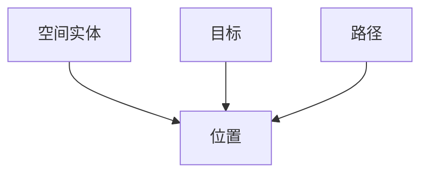
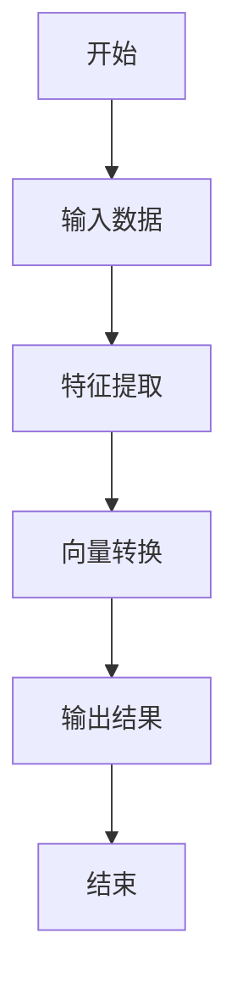
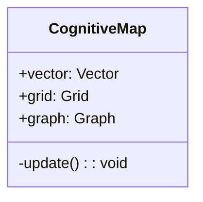
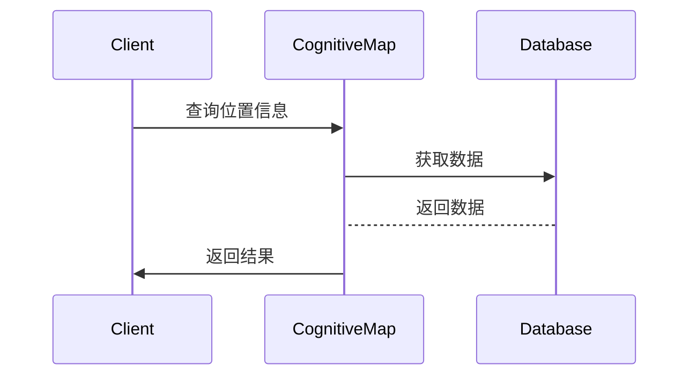

                 


# AI Agent的认知地图构建：空间信息的表示与利用

> 关键词：AI Agent, 认知地图, 空间信息, 表示方法, 算法原理, 系统架构, 项目实战

> 摘要：AI Agent的认知地图构建是人工智能领域的重要研究方向，主要探讨空间信息的表示与利用。本文系统地介绍了认知地图的基本概念、核心表示方法、算法原理、系统架构设计以及项目实战，为AI Agent在空间信息处理中的应用提供了理论基础和实践指导。

---

# 第1章: AI Agent认知地图的概述

## 1.1 认知地图的基本概念

### 1.1.1 认知地图的定义
认知地图是一种表示空间信息的模型，用于帮助AI Agent理解和导航环境。它将物理空间转换为可计算的数字表示，使AI能够进行推理和决策。

### 1.1.2 AI Agent与认知地图的关系
AI Agent通过认知地图感知环境、规划路径和执行任务。认知地图是AI Agent与物理世界交互的桥梁。

### 1.1.3 认知地图的核心要素
- **空间实体**：环境中的物体、区域和目标。
- **关系**：实体之间的空间关系，如距离、方向和连通性。
- **动态信息**：环境的动态变化，如移动物体和事件。

## 1.2 空间信息表示的重要性

### 1.2.1 空间信息的定义
空间信息描述了环境的几何结构和拓扑关系，是认知地图的核心内容。

### 1.2.2 空间信息在AI Agent中的作用
空间信息帮助AI Agent进行路径规划、目标识别和环境理解，是实现智能行为的基础。

### 1.2.3 空间信息表示的挑战
- **多样性**：环境复杂多变，信息表示需要灵活适应。
- **实时性**：动态环境要求快速更新和处理信息。
- **准确性**：确保表示的信息准确反映真实环境。

## 1.3 认知地图构建的背景与意义

### 1.3.1 当前AI Agent的发展现状
AI Agent在机器人、自动驾驶和智能助手等领域广泛应用，但其智能性受限于对空间信息的处理能力。

### 1.3.2 认知地图在AI Agent中的应用前景
认知地图技术将提升AI Agent的自主性和适应性，使其能够更好地处理复杂环境。

### 1.3.3 本章小结
认知地图是AI Agent理解环境的关键工具，其构建技术对提升AI能力至关重要。

---

# 第2章: 认知地图的表示方法

## 2.1 空间信息的表示方式

### 2.1.1 基于向量的表示方法
向量表示将空间信息编码为低维向量，便于计算和推理。

### 2.1.2 基于网格的表示方法
网格表示将空间划分为格子，每个格子存储特定信息，适合静态环境。

### 2.1.3 基于图结构的表示方法
图结构表示通过节点和边描述空间关系，适用于动态和复杂环境。

## 2.2 不同表示方法的对比

### 2.2.1 向量表示的优缺点
- **优点**：高效、易于计算。
- **缺点**：难以处理复杂拓扑关系。

### 2.2.2 网格表示的优缺点
- **优点**：简单、适合静态环境。
- **缺点**：计算量大，难以处理动态变化。

### 2.2.3 图结构表示的优缺点
- **优点**：适合动态和复杂环境，能处理复杂关系。
- **缺点**：计算复杂度高。

## 2.3 实体关系图与认知地图的联系

### 2.3.1 ER实体关系图的基本概念
ER图用于描述实体之间的关系，帮助理解空间结构。

### 2.3.2 认知地图与ER图的关系
认知地图中的空间实体和关系可以用ER图表示，便于建模和分析。

### 2.3.3 用Mermaid流程图展示认知地图的实体关系


---

# 第3章: 基于向量的表示方法

## 3.1 向量空间模型的原理

### 3.1.1 向量空间模型的定义
向量空间模型将空间信息表示为向量，便于计算和推理。

### 3.1.2 向量空间模型的数学公式
$$ \text{向量表示公式} $$

## 3.2 基于向量的算法实现

### 3.2.1 算法步骤
1. 数据输入与预处理
2. 特征提取
3. 向量转换
4. 输出结果

### 3.2.2 用Mermaid流程图展示算法步骤


## 3.3 向量表示的Python实现

### 3.3.1 环境安装
```bash
pip install numpy
```

### 3.3.2 核心代码实现
```python
import numpy as np

def vector_representation(data):
    features = extract_feature(data)
    vector = np.array(features)
    return vector
```

---

# 第4章: 系统分析与架构设计

## 4.1 问题场景介绍
系统需要处理动态环境中的空间信息，实现认知地图的构建与更新。

## 4.2 系统功能设计

### 4.2.1 领域模型类图


## 4.3 系统架构设计

### 4.3.1 分层架构


## 4.4 系统接口设计
- **输入接口**：接收传感器数据。
- **输出接口**：提供空间信息查询服务。

## 4.5 系统交互流程图


---

# 第5章: 项目实战

## 5.1 环境安装
```bash
pip install numpy matplotlib
```

## 5.2 核心代码实现

### 5.2.1 认知地图构建
```python
def build_cognitive_map(data):
    # 处理数据并构建认知地图
    return map_data
```

## 5.3 代码应用解读与分析
- 代码实现认知地图的构建与查询功能。
- 通过实际案例分析，展示如何应用这些技术解决问题。

## 5.4 项目小结
项目展示了认知地图构建的核心技术，并验证了其在实际应用中的有效性。

---

# 第6章: 最佳实践

## 6.1 小结
认知地图是AI Agent理解环境的关键工具，其构建技术对提升AI能力至关重要。

## 6.2 注意事项
- 数据质量影响认知地图的准确性。
- 算法选择需考虑环境动态性和计算效率。

## 6.3 拓展阅读
推荐相关领域的书籍和论文，供读者深入学习。

---

通过以上结构，我们可以系统地介绍AI Agent认知地图的构建方法，从理论到实践，帮助读者全面理解并掌握相关技术。

