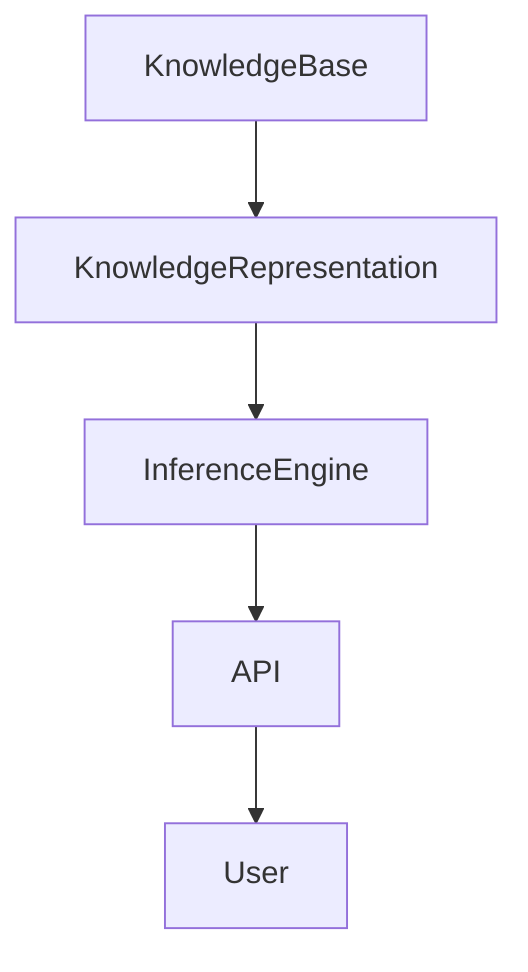

                 


# AI Agent的认知计算与推理框架

## 关键词：AI Agent、认知计算、推理框架、知识表示、概率推理、符号逻辑

## 摘要：本文系统地介绍了AI Agent的认知计算与推理框架，从基本概念到算法实现，再到系统架构设计，详细探讨了AI Agent在认知计算中的核心作用。文章首先介绍了AI Agent的基本概念和应用场景，然后深入分析了认知计算与推理框架的理论基础，包括符号逻辑和概率推理。接着，详细讲解了AI Agent的推理算法与实现，包括基于规则和概率的推理方法。最后，通过具体的项目实战案例，展示了AI Agent的认知计算与推理框架的实际应用，并提出了未来的发展方向。

---

# 第一部分: AI Agent的认知计算与推理框架基础

## 第1章: AI Agent的基本概念与背景

### 1.1 AI Agent的定义与特点

#### 1.1.1 AI Agent的定义
AI Agent（人工智能代理）是指能够感知环境、自主决策并采取行动以实现特定目标的智能实体。AI Agent可以是软件程序，也可以是嵌入在物理设备中的智能系统。其核心目标是通过与环境交互，完成用户指定的任务或目标。

#### 1.1.2 AI Agent的核心特点
- **自主性**：AI Agent能够自主决策，无需外部干预。
- **反应性**：能够实时感知环境变化并做出反应。
- **目标导向**：所有行为都围绕实现特定目标展开。
- **知识驱动**：依赖于知识库进行推理和决策。
- **适应性**：能够根据环境变化调整策略。

#### 1.1.3 AI Agent与传统AI的区别
传统AI主要关注特定任务的解决，而AI Agent则强调与环境的动态交互和自主决策。AI Agent更注重实时性、适应性和目标导向性。

---

### 1.2 认知计算与推理的基本概念

#### 1.2.1 认知计算的定义
认知计算是指模拟人类认知过程的计算方法，包括感知、推理、学习和决策等环节。认知计算的核心在于通过模拟人类思维方式，实现对复杂问题的解决。

#### 1.2.2 推理框架的定义与作用
推理框架是指用于构建和实现推理算法的框架，其作用是将知识表示、推理规则和推理引擎有机结合，形成一个完整的推理系统。推理框架是AI Agent实现认知计算的核心部分。

#### 1.2.3 AI Agent在认知计算中的角色
AI Agent作为认知计算的核心主体，负责感知环境、处理信息、进行推理，并根据推理结果采取行动。AI Agent通过推理框架实现对复杂问题的解决，从而完成特定任务。

---

### 1.3 AI Agent的应用场景与挑战

#### 1.3.1 AI Agent的主要应用场景
- **智能助手**：如 Siri、Alexa 等，帮助用户完成日常任务。
- **自动驾驶**：通过环境感知和决策推理实现自主驾驶。
- **智能客服**：通过对话交互解决用户问题。
- **机器人控制**：实现复杂环境中的自主操作。

#### 1.3.2 AI Agent面临的主要挑战
- **知识表示的复杂性**：如何有效地表示和管理复杂知识。
- **推理的效率与准确性**：如何在复杂环境中快速准确地进行推理。
- **多模态数据的处理**：如何整合和处理来自不同模态的数据。
- **动态环境的适应性**：如何在动态环境中实时调整策略。

#### 1.3.3 未来发展趋势与研究方向
- **强化学习的应用**：通过强化学习提升AI Agent的自主决策能力。
- **人机协作**：实现人与AI Agent之间的高效协作。
- **边缘计算的结合**：通过边缘计算提升AI Agent的实时性和响应速度。

---

## 第2章: AI Agent的认知模型与知识表示

### 2.1 认知模型的基本原理

#### 2.1.1 认知模型的定义与分类
认知模型是对人类认知过程的模拟，可以分为符号模型、联结模型和混合模型。

#### 2.1.2 知识表示的基本形式
知识表示是认知模型的核心部分，常见的表示形式包括：
- **符号表示**：通过符号逻辑表示知识。
- **语义网络**：通过节点和边表示知识之间的关系。
- **知识图谱**：通过图结构表示大规模知识。

#### 2.1.3 知识图谱与语义网络
知识图谱是一种图结构，由节点和边组成，节点表示实体，边表示实体之间的关系。语义网络是一种更通用的知识表示形式，可以表示更复杂的关系和语义。

---

#### 2.1.4 知识表示的优缺点对比

| 表示形式 | 优点 | 缺点 |
|----------|------|------|
| 符号逻辑 | 明确性高，易于推理 | 表达能力有限，难以处理模糊性 |
| 语义网络 | 表达能力强，易于扩展 | 复杂性高，推理效率低 |
| 知识图谱 | 大规模知识表示，易于查询 | 需要大量计算资源，推理复杂 |

---

### 2.2 符号逻辑与推理机制

#### 2.2.1 符号逻辑的基本原理
符号逻辑是基于逻辑规则的知识表示方法，通过命题逻辑和谓词逻辑表示知识。命题逻辑基于原子命题的真假值，谓词逻辑则通过谓词和个体表示更复杂的关系。

#### 2.2.2 推理规则的建立与应用
推理规则是符号逻辑的核心，通过谓词逻辑和命题逻辑的组合，可以建立复杂的推理规则。例如：
- 前提：如果下雨，则地湿。
- 结论：下雨了，所以地湿。

#### 2.2.3 知识库的构建与管理
知识库是符号逻辑推理的基础，通过将知识表示为符号逻辑的形式，可以方便地进行推理和验证。

---

### 2.3 概率推理与不确定性处理

#### 2.3.1 概率推理的基本概念
概率推理是基于概率论的推理方法，适用于处理不确定性问题。概率推理的核心是通过概率分布描述事件的可能性。

#### 2.3.2 贝叶斯网络的应用
贝叶斯网络是一种概率图模型，通过节点表示变量，边表示变量之间的依赖关系。贝叶斯网络可以有效地处理不确定性问题。

#### 2.3.3 不确定性知识的处理方法
不确定性知识的处理方法包括概率推理、模糊逻辑和粗糙集理论等。

---

## 第3章: AI Agent的推理算法与实现

### 3.1 推理算法概述

#### 3.1.1 前向推理与反向推理
- 前向推理：从已知事实出发，通过推理规则推导新的事实。
- 反向推理：从目标出发，逆向寻找支持目标的事实。

#### 3.1.2 确定性推理与非确定性推理
- 确定性推理：在确定性知识下进行推理。
- 非确定性推理：在不确定性知识下进行推理。

#### 3.1.3 基于规则的推理算法
基于规则的推理算法通过匹配事实和规则，推导出新的结论。例如：
- 规则：如果A且B，则C。
- 事实：A为真，B为真。
- 结论：C为真。

---

#### 3.1.4 基于规则的推理算法实现

```python
def forward_reasoning(knowledge_base, rules):
    inferred_facts = set()
    while True:
        has_inference = False
        for rule in rules:
            antecedent, consequent = rule
            if all(fact in knowledge_base for fact in antecedent):
                if consequent not in knowledge_base:
                    inferred_facts.add(consequent)
                    knowledge_base.add(consequent)
                    has_inference = True
        if not has_inference:
            break
    return inferred_facts
```

---

### 3.2 基于概率的推理算法

#### 3.2.1 贝叶斯推理算法
贝叶斯推理是基于贝叶斯定理的推理方法，用于计算条件概率。贝叶斯定理公式为：

$$ P(A|B) = \frac{P(B|A)P(A)}{P(B)} $$

---

#### 3.2.2 马尔可夫逻辑网络
马尔可夫逻辑网络是一种混合了逻辑和概率的推理模型，通过将逻辑规则和概率分布结合起来，实现复杂的推理。

---

#### 3.2.3 概率图模型的构建与应用
概率图模型通过图结构表示变量之间的依赖关系，可以用于处理复杂的不确定性问题。

---

### 3.3 知识图谱推理与语义理解

#### 3.3.1 知识图谱的构建与推理
知识图谱是一种图结构，通过节点和边表示实体和关系。知识图谱推理是通过图结构进行路径分析，推导出新的知识。

#### 3.3.2 语义理解的基本原理
语义理解是通过自然语言处理技术，理解文本的语义含义，并将其转化为可计算的形式。

#### 3.3.3 基于图的推理算法
基于图的推理算法通过遍历图结构，寻找路径和关联关系，推导出新的知识。

---

## 第4章: AI Agent的推理框架设计

### 4.1 推理框架的核心组件

#### 4.1.1 知识表示层
知识表示层负责将知识表示为符号逻辑或概率图模型等形式，为推理提供基础。

#### 4.1.2 推理引擎层
推理引擎层负责根据知识和推理规则，进行推理操作，生成新的事实或结论。

#### 4.1.3 应用接口层
应用接口层负责与外部系统交互，接收请求，调用推理引擎，返回结果。

---

### 4.2 推理引擎的设计与实现

#### 4.2.1 基于规则的推理引擎
基于规则的推理引擎通过匹配事实和规则，生成新的结论。例如：

```python
def apply_rules(facts, rules):
    inferred_facts = set()
    for rule in rules:
        antecedent, consequent = rule
        if all(fact in facts for fact in antecedent):
            inferred_facts.add(consequent)
    return inferred_facts
```

---

#### 4.2.2 基于概率的推理引擎
基于概率的推理引擎通过概率分布进行推理，例如贝叶斯网络推理。

---

#### 4.2.3 混合型推理引擎
混合型推理引擎结合了符号逻辑和概率推理的优点，适用于复杂场景。

---

### 4.3 推理框架的优化与扩展

#### 4.3.1 知识表示的优化方法
知识表示的优化方法包括使用更高效的知识表示形式，如压缩编码和索引技术。

#### 4.3.2 推理效率的提升策略
推理效率的提升策略包括优化推理规则，使用缓存技术，以及并行计算。

#### 4.3.3 知识库的扩展与更新
知识库的扩展与更新可以通过定期添加新知识和更新旧知识，保持知识库的最新性。

---

## 第5章: 项目实战——AI Agent的认知计算与推理框架实现

### 5.1 项目背景与目标
本项目旨在实现一个简单的AI Agent，具备基本的认知计算与推理能力，能够根据环境信息做出决策。

---

### 5.2 系统功能设计

#### 5.2.1 知识表示
使用符号逻辑表示知识，例如：
- 规则：如果下雨，则地湿。
- 事实：下雨了。

---

#### 5.2.2 推理引擎
实现基于规则的推理引擎，能够根据事实和规则生成结论。

---

#### 5.2.3 应用接口
提供简单的API接口，供外部调用推理功能。

---

### 5.3 系统架构设计

#### 5.3.1 系统功能模块
- 知识表示模块：负责知识的表示和存储。
- 推理引擎模块：负责根据知识和规则进行推理。
- 应用接口模块：负责与外部系统的交互。

---

#### 5.3.2 系统架构图



---

### 5.4 代码实现

#### 5.4.1 知识表示
```python
class KnowledgeBase:
    def __init__(self):
        self.facts = set()

    def add_fact(self, fact):
        self.facts.add(fact)

    def remove_fact(self, fact):
        self.facts.remove(fact)
```

---

#### 5.4.2 推理引擎
```python
class InferenceEngine:
    def __init__(self, rules):
        self.rules = rules

    def infer(self, knowledge_base):
        inferred_facts = set()
        while True:
            has_inference = False
            for rule in self.rules:
                antecedent, consequent = rule
                if all(fact in knowledge_base.facts for fact in antecedent):
                    if consequent not in knowledge_base.facts:
                        knowledge_base.add_fact(consequent)
                        inferred_facts.add(consequent)
                        has_inference = True
            if not has_inference:
                break
        return inferred_facts
```

---

#### 5.4.3 应用接口
```python
class API:
    def __init__(self, inference_engine, knowledge_base):
        self.inference_engine = inference_engine
        self.knowledge_base = knowledge_base

    def query(self, facts):
        self.knowledge_base.facts.update(facts)
        return self.inference_engine.infer(self.knowledge_base)
```

---

### 5.5 项目小结
通过本项目，我们实现了AI Agent的认知计算与推理框架，验证了推理算法的可行性，并为未来的优化和扩展提供了基础。

---

## 第6章: 总结与展望

### 6.1 总结
本文系统地介绍了AI Agent的认知计算与推理框架，从基本概念到算法实现，再到系统架构设计，详细探讨了AI Agent在认知计算中的核心作用。

---

### 6.2 未来展望
未来的研究方向包括强化学习的应用、人机协作、边缘计算的结合等。通过不断优化和创新，AI Agent的认知计算与推理框架将在更多领域得到广泛应用。

---

### 6.3 最佳实践 Tips

#### 6.3.1 知识表示的选择
根据具体场景选择合适的知识表示方法，如符号逻辑适用于确定性问题，概率图模型适用于不确定性问题。

#### 6.3.2 推理算法的优化
通过优化推理规则和知识表示，提升推理效率和准确性。

#### 6.3.3 系统架构的设计
合理设计系统架构，确保系统的可扩展性和可维护性。

---

## 参考文献
[此处列出相关参考文献]

---

通过以上思考和撰写，我们可以系统地完成《AI Agent的认知计算与推理框架》这篇文章。希望这篇文章能够为读者提供有价值的内容和启发。

