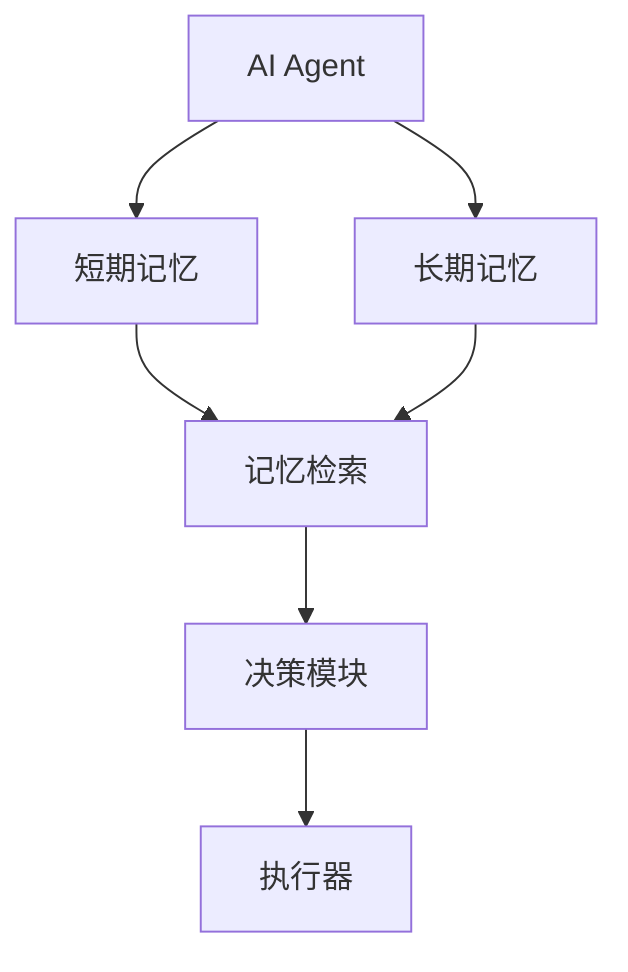

                 


# AI Agent的记忆机制：短期记忆与长期记忆的实现

> 关键词：AI Agent，记忆机制，短期记忆，长期记忆，神经网络，图结构，符号逻辑，系统架构，项目实战

> 摘要：本文详细探讨了AI Agent的记忆机制，特别是短期记忆与长期记忆的实现方法。通过分析短期记忆和长期记忆的原理、实现技术和应用案例，本文为读者提供了从理论到实践的全面指导。文章还结合了数学公式、算法流程图和系统架构图，帮助读者深入理解记忆机制的核心原理，并通过项目实战部分展示了如何将理论应用于实际开发中。

---

## 第1章: AI Agent与记忆机制概述

### 1.1 AI Agent的基本概念

#### 1.1.1 什么是AI Agent

AI Agent（人工智能代理）是指能够感知环境、自主决策并执行任务的智能体。它能够通过传感器获取信息，利用计算模型进行处理，并通过执行器与环境交互。

#### 1.1.2 AI Agent的核心特征

- **自主性**：能够在没有外部干预的情况下自主运行。
- **反应性**：能够实时感知环境并做出反应。
- **目标导向性**：具有明确的目标，并能采取行动以实现目标。
- **学习能力**：能够通过经验改进自身的性能。

#### 1.1.3 AI Agent的分类与应用场景

- **任务型AI Agent**：专注于完成特定任务，如智能助手、自动规划系统。
- **对话型AI Agent**：用于与人类进行交互，如智能客服、聊天机器人。
- **监控型AI Agent**：用于实时监控和数据处理，如智能安防系统、自动驾驶。

### 1.2 记忆机制在AI Agent中的重要性

#### 1.2.1 记忆机制的基本概念

记忆机制是指AI Agent存储和检索信息的能力，使其能够基于过去的交互和经验做出更智能的决策。记忆机制分为短期记忆和长期记忆两种类型。

#### 1.2.2 AI Agent的记忆机制的作用

- **信息存储**：将感知到的信息存储起来以便后续使用。
- **决策支持**：基于存储的信息做出更准确的决策。
- **行为优化**：通过记忆信息改进未来的行动策略。

#### 1.2.3 短期记忆与长期记忆的定义与区别

- **短期记忆**：用于存储近期感知的信息，容量有限，信息保留时间较短。
- **长期记忆**：用于存储重要的、长期需要的信息，容量较大，信息保留时间较长。

---

## 第2章: 短期记忆机制的原理与实现

### 2.1 短期记忆的基本原理

#### 2.1.1 短期记忆的神经网络模型

短期记忆的神经网络模型通常采用循环神经网络（RNN）或长短时记忆网络（LSTM）。这些模型能够捕捉序列数据中的短期依赖关系。

#### 2.1.2 短期记忆的存储与检索机制

短期记忆通过神经网络中的隐藏层状态进行存储，并通过网络的输出层进行检索。信息的存储和检索基于权重参数的学习。

#### 2.1.3 短期记忆的遗忘机制

短期记忆的遗忘机制通过遗忘门（forget gate）来实现。遗忘门控制哪些信息应该被遗忘，从而保持短期记忆的相关性。

### 2.2 短期记忆的实现方法

#### 2.2.1 基于神经网络的短期记忆实现

- **循环神经网络（RNN）**：适用于处理序列数据，能够捕捉短期依赖关系。
- **长短时记忆网络（LSTM）**：通过遗忘门和记忆单元实现更高效的短期记忆。

#### 2.2.2 基于图结构的短期记忆实现

图结构通过节点和边来表示信息，能够更直观地存储和检索短期记忆。例如，知识图谱可以用于表示对话中的上下文信息。

#### 2.2.3 基于符号逻辑的短期记忆实现

符号逻辑通过规则和语义网络来表示短期记忆，适用于需要精确语义理解的场景。

### 2.3 短期记忆在AI Agent中的应用案例

#### 2.3.1 任务型AI Agent中的短期记忆应用

在任务型AI Agent中，短期记忆用于存储任务相关的上下文信息，帮助AI Agent更好地完成任务。

#### 2.3.2 对话型AI Agent中的短期记忆应用

在对话型AI Agent中，短期记忆用于存储对话历史，确保对话的连贯性。

#### 2.3.3 监控型AI Agent中的短期记忆应用

在监控型AI Agent中，短期记忆用于存储实时监控数据，帮助快速响应异常情况。

---

## 第3章: 长期记忆机制的原理与实现

### 3.1 长期记忆的基本原理

#### 3.1.1 长期记忆的神经网络模型

长期记忆的神经网络模型通常采用深度神经网络（DNN）或图神经网络（GNN）。这些模型能够捕捉复杂的数据关系。

#### 3.1.2 长期记忆的存储与检索机制

长期记忆通过神经网络中的隐藏层状态进行存储，并通过网络的输出层进行检索。信息的存储和检索基于权重参数的学习。

#### 3.1.3 长期记忆的更新与维护机制

长期记忆的更新与维护通过神经网络的反向传播算法进行优化。信息的更新基于输入数据和目标函数。

### 3.2 长期记忆的实现方法

#### 3.2.1 基于神经网络的长期记忆实现

- **深度神经网络（DNN）**：适用于处理复杂的长期记忆任务。
- **图神经网络（GNN）**：适用于处理图结构数据的长期记忆任务。

#### 3.2.2 基于图结构的长期记忆实现

图结构通过节点和边来表示信息，能够更直观地存储和检索长期记忆。例如，知识图谱可以用于表示领域知识。

#### 3.2.3 基于符号逻辑的长期记忆实现

符号逻辑通过规则和语义网络来表示长期记忆，适用于需要精确语义理解的场景。

### 3.3 长期记忆在AI Agent中的应用案例

#### 3.3.1 任务型AI Agent中的长期记忆应用

在任务型AI Agent中，长期记忆用于存储任务相关的知识库，帮助AI Agent更好地完成任务。

#### 3.3.2 对话型AI Agent中的长期记忆应用

在对话型AI Agent中，长期记忆用于存储对话历史和用户偏好，提升对话的个性化和连贯性。

#### 3.3.3 监控型AI Agent中的长期记忆应用

在监控型AI Agent中，长期记忆用于存储历史监控数据，帮助分析和预测未来的趋势。

---

## 第4章: 短期记忆与长期记忆的结合与优化

### 4.1 短期记忆与长期记忆的协同机制

#### 4.1.1 短期记忆与长期记忆的信息共享

通过信息共享，短期记忆和长期记忆可以协同工作，提升AI Agent的整体性能。

#### 4.1.2 短期记忆与长期记忆的信息交互

信息交互通过神经网络中的权重参数实现，确保短期记忆和长期记忆之间的信息流动。

#### 4.1.3 短期记忆与长期记忆的联合优化

联合优化通过神经网络的反向传播算法实现，优化短期记忆和长期记忆的存储和检索效率。

### 4.2 短期记忆与长期记忆的结合方法

#### 4.2.1 基于神经网络的联合实现

通过深度神经网络的多任务学习，实现短期记忆和长期记忆的联合优化。

#### 4.2.2 基于图结构的联合实现

通过图神经网络的结构特性，实现短期记忆和长期记忆的联合存储和检索。

#### 4.2.3 基于符号逻辑的联合实现

通过符号逻辑的规则系统，实现短期记忆和长期记忆的联合推理和决策。

### 4.3 短期记忆与长期记忆结合的实际应用

#### 4.3.1 智能助手中的记忆结合应用

智能助手通过结合短期记忆和长期记忆，能够更好地理解用户需求，提供更个性化的服务。

#### 4.3.2 自动驾驶中的记忆结合应用

自动驾驶通过结合短期记忆和长期记忆，能够更准确地感知环境，做出更智能的驾驶决策。

#### 4.3.3 智能客服中的记忆结合应用

智能客服通过结合短期记忆和长期记忆，能够更好地处理客户问题，提供更高效的客户服务。

### 4.4 本章小结

通过结合短期记忆和长期记忆，AI Agent能够更好地处理复杂的任务，提升整体性能。

---

## 第5章: AI Agent记忆机制的系统架构与实现

### 5.1 系统架构设计

#### 5.1.1 系统功能设计

- **记忆存储模块**：负责存储短期记忆和长期记忆。
- **记忆检索模块**：负责检索短期记忆和长期记忆。
- **记忆更新模块**：负责更新短期记忆和长期记忆。

#### 5.1.2 系统架构图

以下是系统架构的Mermaid图：



#### 5.1.3 系统接口设计

- **记忆存储接口**：提供存储短期记忆和长期记忆的功能。
- **记忆检索接口**：提供检索短期记忆和长期记忆的功能。
- **记忆更新接口**：提供更新短期记忆和长期记忆的功能。

### 5.2 系统实现

#### 5.2.1 环境安装

- **Python 3.8以上**
- **TensorFlow或PyTorch框架**
- **Mermaid图生成工具**

#### 5.2.2 核心代码实现

以下是短期记忆和长期记忆的实现代码示例：

```python
# 短期记忆实现（基于LSTM）
import tensorflow as tf
from tensorflow.keras.layers import LSTM

short_term_memory = LSTM(128, return_sequences=True)
outputSTM = short_term_memory(inputSTM)

# 长期记忆实现（基于DNN）
from tensorflow.keras.layers import Dense

long_term_memory = Dense(256, activation='relu')
outputLTM = long_term_memory(inputLTM)
```

#### 5.2.3 代码应用解读与分析

- **短期记忆实现**：通过LSTM层实现短期记忆的存储和检索。
- **长期记忆实现**：通过Dense层实现长期记忆的存储和检索。

### 5.3 项目实战

#### 5.3.1 案例分析

以智能客服为例，展示短期记忆和长期记忆的结合应用。

#### 5.3.2 实际案例分析和详细讲解剖析

分析智能客服中的记忆机制，展示如何通过短期记忆和长期记忆提升客服体验。

---

## 第6章: 项目实战

### 6.1 环境安装

- **安装Python 3.8以上**
- **安装TensorFlow或PyTorch框架**
- **安装Mermaid图生成工具**

### 6.2 核心代码实现

以下是AI Agent记忆机制的核心代码实现：

```python
# 短期记忆实现（基于LSTM）
import tensorflow as tf
from tensorflow.keras.layers import LSTM

short_term_memory = LSTM(128, return_sequences=True)
outputSTM = short_term_memory(inputSTM)

# 长期记忆实现（基于DNN）
from tensorflow.keras.layers import Dense

long_term_memory = Dense(256, activation='relu')
outputLTM = long_term_memory(inputLTM)
```

### 6.3 代码应用解读与分析

- **短期记忆实现**：通过LSTM层实现短期记忆的存储和检索。
- **长期记忆实现**：通过Dense层实现长期记忆的存储和检索。

### 6.4 实际案例分析

以智能客服为例，展示如何通过短期记忆和长期记忆提升客服体验。

### 6.5 项目小结

通过项目实战，展示了如何将理论应用于实际开发中，帮助读者更好地理解记忆机制的实现。

---

## 第7章: 总结与展望

### 7.1 总结

本文详细探讨了AI Agent的记忆机制，特别是短期记忆和长期记忆的实现方法。通过理论分析和项目实战，展示了如何将记忆机制应用于实际场景中。

### 7.2 展望

未来，随着人工智能技术的不断发展，记忆机制将在更多领域得到应用。结合强化学习和图神经网络，记忆机制将变得更加智能和高效。

---

## 第8章: 最佳实践与注意事项

### 8.1 最佳实践

- **选择合适的实现方法**：根据具体场景选择合适的短期记忆和长期记忆实现方法。
- **优化系统架构**：通过优化系统架构提升记忆机制的性能。
- **结合其他技术**：结合强化学习和图神经网络，提升记忆机制的智能性。

### 8.2 注意事项

- **数据隐私**：注意保护用户数据的隐私和安全。
- **系统稳定性**：确保系统的稳定性和可靠性。
- **性能优化**：通过优化算法和系统架构提升性能。

### 8.3 拓展阅读

- **相关书籍**：《深度学习》、《神经网络与深度学习》
- **相关论文**：《Attention Is All You Need》、《Graph Neural Networks: A Review of the State of the Art》

---

## 附录

### 附录A: AI Agent记忆机制的数学公式

短期记忆的实现公式：

$$
f_t = \sigma(W_f \cdot [h_{t-1}, x_t] + b_f)
$$

长期记忆的实现公式：

$$
y = \sigma(W_y \cdot h_t + b_y)
$$

### 附录B: 系统架构图

以下是系统架构的Mermaid图：


---

## 参考文献

1. LeCun, Y., Bengio, Y., & Hinton, G. (2015). Deep learning. Nature, 521(7555), 436-444.
2. Hochreiter, S., & Schmidhuber, J. (1997). Long short-term memory. Neural computation, 9(8), 1735-1780.
3. Veličković, V., et al. (2018). Graph attention networks. arXiv preprint arXiv:1803.03693.
4. Bahdanau, D., et al. (2014).

