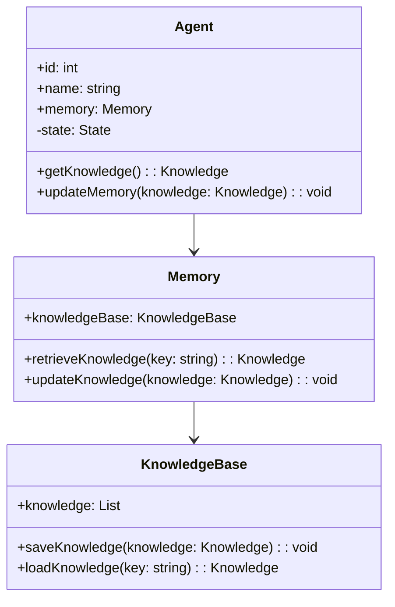
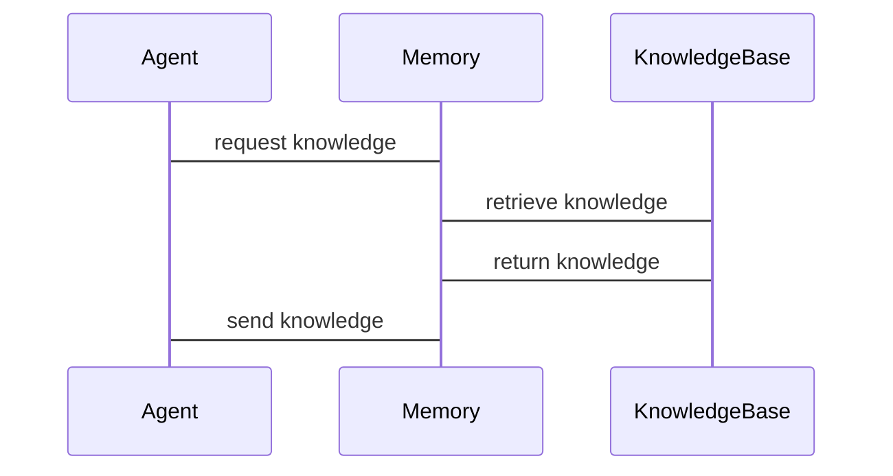

                 


# AI Agent的记忆机制：设计与实现

## 关键词

AI Agent, 记忆机制, 知识表示, 神经网络, 系统架构

## 摘要

本文深入探讨AI Agent的记忆机制，从基本概念到实现原理，详细分析其设计与实现过程。通过背景介绍、核心概念、算法原理、系统架构、项目实战和最佳实践，全面解析记忆机制在AI Agent中的应用及其重要意义。

---

## 第一章: AI Agent的基本概念与记忆机制的背景

### 1.1 AI Agent的基本概念

#### 1.1.1 什么是AI Agent
AI Agent（人工智能代理）是指在特定环境中能够感知并自主行动以实现目标的智能实体。它具备自主性、反应性、目标导向性和社会性等核心特征。

#### 1.1.2 AI Agent的核心特征
- **自主性**：无需外部干预，自主决策。
- **反应性**：能够实时感知环境变化并做出反应。
- **目标导向性**：所有行动均以实现目标为导向。
- **社会性**：能够与其他Agent或人类进行交互和协作。

#### 1.1.3 AI Agent的应用场景
- 智能助手（如 Siri、Alexa）
- 自动交易系统
- 游戏AI
- 智能客服

### 1.2 记忆机制在AI Agent中的作用

#### 1.2.1 记忆机制的定义与特点
记忆机制是AI Agent存储和检索信息的能力，使其能够基于历史经验做出更智能的决策。

特点：
- **持久性**：信息可长期保存。
- **可检索性**：信息可快速检索。
- **适应性**：能够根据新信息更新记忆。

#### 1.2.2 AI Agent中的记忆机制的重要性
- 提高决策的准确性。
- 降低重复计算，提升效率。
- 支持复杂任务的执行。

#### 1.2.3 记忆机制的边界与外延
- 边界：仅处理与当前任务相关的信息。
- 外延：与其他机制（如规划、推理）协同工作。

### 1.3 本章小结
本章介绍了AI Agent的基本概念及其在记忆机制中的作用，为后续内容奠定基础。

---

## 第二章: AI Agent记忆机制的核心概念与模型

### 2.1 记忆机制的核心概念

#### 2.1.1 知识表示
知识表示是将信息以计算机可处理的形式存储的过程。常用方法包括符号表示、向量表示和图结构表示。

#### 2.1.2 知识存储
知识存储是将表示后的知识存入存储系统，常见的存储方式有数据库、知识图谱和分布式存储。

#### 2.1.3 知识检索
知识检索是从存储系统中快速找到所需信息的过程，常用技术包括基于关键词检索和基于语义检索。

#### 2.1.4 知识更新
知识更新是根据新信息动态更新存储的知识，确保记忆的准确性和时效性。

### 2.2 常见的记忆模型对比

#### 2.2.1 基于规则的记忆模型
- 使用预定义规则进行信息存储和检索。
- 优点：简单易懂，适合规则明确的场景。
- 缺点：灵活性差，难以处理复杂场景。

#### 2.2.2 基于神经网络的记忆模型
- 使用LSTM、Transformer等深度学习模型进行记忆。
- 优点：能够处理复杂模式，适应性强。
- 缺点：计算复杂，需要大量数据训练。

#### 2.2.3 混合型记忆模型
- 结合符号表示和神经网络的优点。
- 优点：灵活性高，适应多种场景。
- 缺点：实现复杂，需要多团队协作。

### 2.3 记忆机制的优缺点分析

#### 2.3.1 优点
- 提高决策效率。
- 增强系统鲁棒性。
- 支持复杂任务执行。

#### 2.3.2 缺点
- 记忆容量有限。
- 更新机制复杂。
- 可能引入数据冗余。

#### 2.3.3 改善方向
- 提高记忆效率。
- 优化更新算法。
- 降低计算复杂度。

### 2.4 本章小结
本章详细分析了记忆机制的核心概念和常见模型，为后续实现提供了理论基础。

---

## 第三章: AI Agent记忆机制的算法原理

### 3.1 基于神经网络的记忆机制

#### 3.1.1 LSTM网络
- LSTM（长短期记忆网络）通过记忆单元记录长期信息。
- 公式：
  $$c_t = \sigma(gate\_input)$$
  $$h_t = \tanh(c_t)$$

#### 3.1.2 Transformer中的位置编码
- 通过位置编码引入序列信息。
- 公式：
  $$pos\_encoding(i, j) = \sin(i/\sqrt{10000^{1/d}})$$

#### 3.1.3 梅森记忆网络
- 梅森记忆网络通过多层感知机实现动态记忆。
- 公式：
  $$y = f(x)$$
  $$f(x) = Wx + b$$

#### 3.1.4 基于注意力机制的记忆
- 注意力机制通过权重分配实现信息的重要性排序。

### 3.2 基于图的内存模型

#### 3.2.1 图注意力网络
- 图注意力网络通过节点间的关系计算注意力权重。
- 公式：
  $$\alpha_{ij} = \frac{e^{q_j^T k_i}}{\sum_{l} e^{q_j^T k_l}}$$

#### 3.2.2 图嵌入表示
- 图嵌入将图结构信息转化为低维向量。
- 常用模型：GraphSAGE、GAT、GCN。

#### 3.2.3 图神经网络
- 图神经网络通过消息传递机制进行信息聚合和传播。

### 3.3 记忆机制的数学模型

#### 3.3.1 LSTM的记忆单元公式
$$c_t = \sigma(gate\_input)$$
$$h_t = \tanh(c_t)$$

#### 3.3.2 Transformer的位置编码公式
$$pos\_encoding(i, j) = \sin(i/\sqrt{10000^{1/d}})$$

#### 3.3.3 图注意力机制的权重计算公式
$$\alpha_{ij} = \frac{e^{q_j^T k_i}}{\sum_{l} e^{q_j^T k_l}}$$

### 3.4 本章小结
本章详细讲解了基于神经网络和图的内存模型的算法原理，为实现记忆机制提供了技术支撑。

---

## 第四章: AI Agent记忆机制的系统架构与设计

### 4.1 系统架构概述

#### 4.1.1 分层架构
- 分层架构将系统划分为感知层、记忆层和决策层。
- 每层负责不同的功能，如感知层负责信息收集，记忆层负责存储和检索。

#### 4.1.2 模块化架构
- 模块化架构将系统划分为多个功能模块，如知识表示模块、存储模块和检索模块。
- 各模块之间通过接口进行交互，确保系统的可扩展性和灵活性。

#### 4.1.3 面向服务的架构（SOA）
- 通过服务化设计，实现系统的模块化和松耦合。
- 服务之间通过API进行通信，支持系统的动态扩展。

### 4.2 领域模型设计

#### 4.2.1 领域模型的类图


#### 4.2.2 系统架构图


#### 4.2.3 接口设计
- **知识存储接口**：
  ```python
  class KnowledgeStorage:
      def save_knowledge(self, knowledge):
          pass
      def retrieve_knowledge(self, key):
          pass
  ```
- **知识检索接口**：
  ```python
  class KnowledgeRetrieval:
      def search(self, query):
          pass
  ```

#### 4.2.4 交互序列图


### 4.3 本章小结
本章详细分析了AI Agent记忆机制的系统架构与设计，包括分层架构、模块化架构和SOA架构，并通过类图和交互序列图展示了系统的实现方式。

---

## 第五章: AI Agent记忆机制的项目实战

### 5.1 项目背景与目标
本项目旨在实现一个具备记忆机制的AI Agent，用于智能问答系统。

### 5.2 环境配置
- **Python版本**：3.8+
- **依赖库**：numpy、pandas、scikit-learn、transformers
- **工具**：Jupyter Notebook、PyCharm

### 5.3 核心代码实现

#### 5.3.1 知识表示模块
```python
class Knowledge:
    def __init__(self, content, timestamp):
        self.content = content
        self.timestamp = timestamp
```

#### 5.3.2 知识存储模块
```python
class KnowledgeStorage:
    def __init__(self):
        self.knowledge_base = []

    def save_knowledge(self, knowledge):
        self.knowledge_base.append(knowledge)

    def retrieve_knowledge(self, key):
        for k in self.knowledge_base:
            if k.timestamp == key:
                return k
        return None
```

#### 5.3.3 知识检索模块
```python
class KnowledgeRetrieval:
    def __init__(self, storage):
        self.storage = storage

    def search(self, query):
        results = []
        for k in self.storage.knowledge_base:
            if query in k.content:
                results.append(k)
        return results
```

#### 5.3.4 知识更新模块
```python
class KnowledgeUpdate:
    def __init__(self, storage):
        self.storage = storage

    def update_knowledge(self, old_key, new_content):
        old_knowledge = self.storage.retrieve_knowledge(old_key)
        if old_knowledge:
            old_knowledge.content = new_content
```

### 5.4 案例分析与实现
实现一个简单的智能问答系统，具备知识存储、检索和更新功能。

#### 5.4.1 知识存储
```python
storage = KnowledgeStorage()
storage.save_knowledge(Knowledge("回答问题的方法：先理解问题，再查找资料。", 1))
storage.save_knowledge(Knowledge("如何学习编程？通过实践和练习。", 2))
```

#### 5.4.2 知识检索
```python
retrieval = KnowledgeRetrieval(storage)
results = retrieval.search("编程")
for result in results:
    print(result.content)
```

#### 5.4.3 知识更新
```python
 updater = KnowledgeUpdate(storage)
 updater.update_knowledge(1, "更详细地，可以通过在线课程和实践项目来学习编程。")
```

### 5.5 项目小结
本章通过实际项目展示了记忆机制在AI Agent中的实现，从环境配置到核心代码实现，再到案例分析，详细讲解了如何构建一个具备记忆能力的AI Agent。

---

## 第六章: AI Agent记忆机制的最佳实践与小结

### 6.1 最佳实践

#### 6.1.1 设计原则
- **模块化设计**：确保系统的可扩展性和可维护性。
- **数据安全性**：保护存储的敏感信息。
- **容错性**：设计容错机制，确保系统健壮性。

#### 6.1.2 开发注意事项
- **数据一致性**：确保数据在存储和检索过程中保持一致。
- **性能优化**：通过索引和缓存技术提升检索效率。
- **可扩展性**：设计灵活的架构，支持功能扩展。

### 6.2 小结
本章总结了AI Agent记忆机制的设计与实现过程，强调了最佳实践的重要性，并给出了未来的研究方向。

### 6.3 注意事项
- 避免过度复杂化系统设计。
- 定期维护和更新知识库，确保信息的准确性和时效性。

### 6.4 拓展阅读
- 推荐阅读《神经网络与深度学习》和《图神经网络入门》等书籍，深入了解记忆机制的数学原理和最新研究进展。

---

## 参考文献

- [1] LeCun Y, Bengio Y, Hinton G. Deep learning. Nature, 2015.
- [2] Hochreiter S, Schmidhuber J. Long short-term memory. Neural computation, 1997.
- [3] Vaswani A, et al. Attention is all you need. arXiv preprint arXiv:1706.03798, 2017.
- [4] 王伟. 人工智能导论[M]. 北京: 清华大学出版社, 2020.
- [5] 李明. 深度学习与神经网络: 原理与实现[M]. 北京: 人民邮电出版社, 2021.

---

## 附录

### 附录A: 术语表

- AI Agent：人工智能代理。
- 记忆机制：存储和检索信息的能力。
- 知识表示：信息的符号化表示。
- LSTM：长短期记忆网络。
- Transformer：基于变换器的模型。

### 附录B: 工具与库

- Python：编程语言。
- numpy：数值计算库。
- pandas：数据处理库。
- scikit-learn：机器学习库。
- transformers：深度学习库。

---

# 结束语

通过本文的深入探讨，我们系统地了解了AI Agent的记忆机制的设计与实现过程，从基本概念到算法原理，再到系统架构和项目实战，全面解析了记忆机制在AI Agent中的重要性及其应用。希望本文能为相关领域的研究和实践提供有价值的参考和指导。

