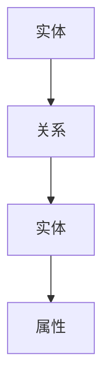
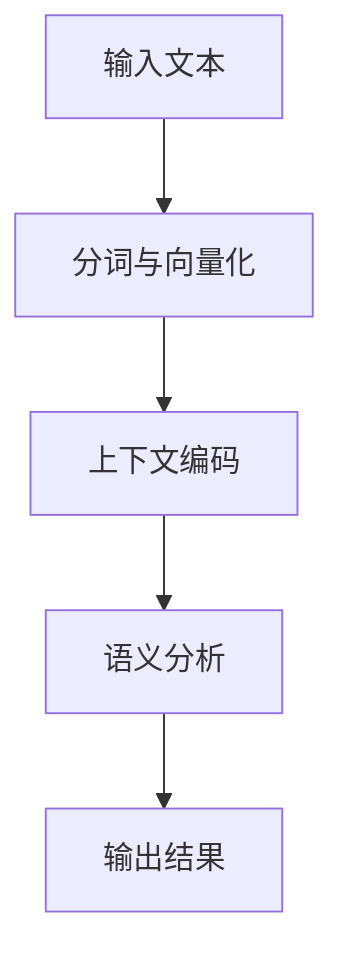
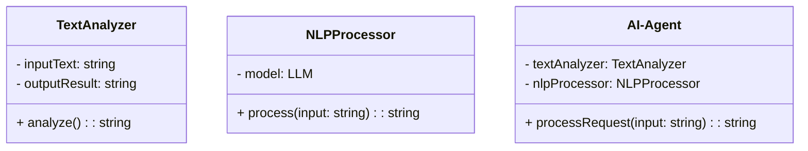
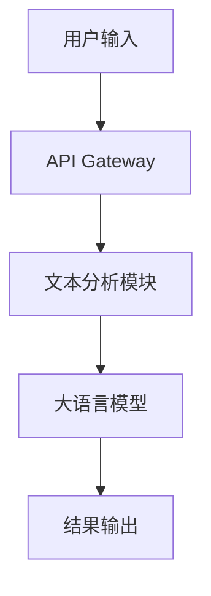
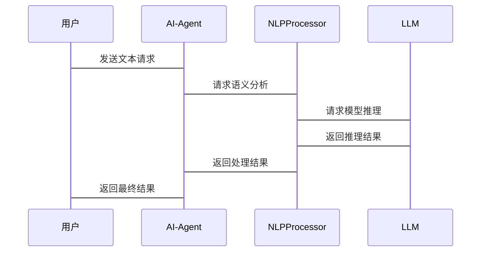

                 


# AI Agent的语义理解：提升LLM的深层文本分析

---

## 关键词：
AI Agent, 语义理解, LLM, 深层文本分析, 大语言模型

---

## 摘要：
本文深入探讨AI Agent的语义理解能力，分析如何通过提升大语言模型（LLM）的深层文本分析能力，实现更精准的语义理解。文章从背景、核心概念、算法原理、系统架构到项目实战，全面解析语义理解的关键技术，帮助读者掌握AI Agent在实际应用中的语义处理能力。

---

# 第一部分：AI Agent的语义理解基础

## 第1章：AI Agent与语义理解概述

### 1.1 AI Agent的基本概念
AI Agent（智能体）是指能够感知环境、自主决策并执行任务的智能实体。它通过与用户或环境交互，完成特定目标。语义理解是AI Agent的核心能力之一，决定了其能否准确理解用户意图。

#### 1.1.1 AI Agent的定义与特点
- **定义**：AI Agent是一个能够感知环境、执行任务并做出决策的智能系统。
- **特点**：
  - 智能性：基于输入数据做出决策。
  - 自主性：无需外部干预即可运行。
  - 交互性：与用户或环境进行实时交互。
  - 可扩展性：能够适应不同应用场景。

#### 1.1.2 语义理解在AI Agent中的作用
语义理解是AI Agent实现智能化交互的关键。通过理解用户输入的语义，AI Agent能够准确识别用户需求，提供更精准的服务。

#### 1.1.3 当前语义理解技术的发展现状
- **技术基础**：基于自然语言处理（NLP）和大语言模型（LLM）。
- **发展趋势**：从浅层理解向深层理解发展，结合上下文和领域知识提升准确性。

---

### 1.2 LLM与语义理解的关系
大语言模型（LLM）通过海量数据训练，具备强大的语义理解能力，是实现AI Agent语义理解的核心技术。

#### 1.2.1 LLM的基本原理
- **模型结构**：基于Transformer架构，通过自注意力机制捕捉文本中的语义信息。
- **训练方式**：采用自监督学习，从大量无标签数据中学习语言规律。

#### 1.2.2 LLM在语义理解中的优势
- **强大的上下文理解能力**：能够捕捉文本中的长距离依赖关系。
- **多语言支持**：LLM可以处理多种语言，适用于全球化场景。
- **动态适应性**：通过微调或提示工程技术，快速适应不同领域需求。

#### 1.2.3 LLM的局限性与改进方向
- **局限性**：
  - 对特定领域数据的依赖性较高。
  - 可能存在推理错误或理解偏差。
- **改进方向**：
  - 结合领域知识库优化语义理解。
  - 引入多模态数据提升理解能力。
  - 通过强化学习优化模型决策能力。

---

### 1.3 语义理解的核心问题
语义理解涉及多个层面，需要解决以下核心问题：

#### 1.3.1 文本理解的层次划分
- **词义理解**：识别文本中词语的语义含义。
- **句法分析**：分析句子的语法结构。
- **语义分析**：理解文本的整体含义和意图。

#### 1.3.2 语义理解的挑战与解决方案
- **挑战**：
  - 文本的模糊性和歧义性。
  - 上下文信息的缺失或不完整。
  - 不同领域术语的差异性。
- **解决方案**：
  - 结合领域知识库进行语义约束。
  - 引入上下文记忆机制。
  - 通过多任务学习提升模型鲁棒性。

#### 1.3.3 语义理解的评估指标
- **准确率**：模型对语义理解的正确性。
- **召回率**：模型识别的全面性。
- **F1值**：准确率和召回率的调和平均值。
- **困惑度（Perplexity）**：衡量模型对文本生成的预测能力。

---

## 1.4 本章小结
本章从AI Agent的基本概念出发，分析了语义理解在AI Agent中的重要作用，并探讨了大语言模型（LLM）在语义理解中的优势与挑战。通过理解这些内容，读者可以为后续深入分析语义理解的核心技术和系统实现打下基础。

---

## 第2章：语义理解的核心概念与联系

### 2.1 语义理解的核心概念
语义理解涉及多个核心概念，包括信息抽取、实体识别、关系抽取和上下文理解。

#### 2.1.1 信息抽取与实体识别
- **信息抽取**：从文本中提取关键信息，如人名、地名、时间等。
- **实体识别**：通过NLP技术，识别文本中的实体并分类。

#### 2.1.2 关系抽取与语义分析
- **关系抽取**：识别文本中的实体间关系，如“是”、“属于”、“导致”等。
- **语义分析**：通过语法分析和语义规则，理解文本的深层含义。

#### 2.1.3 上下文理解与推理
- **上下文理解**：结合上下文信息，理解文本的语境和背景知识。
- **推理能力**：基于已有信息进行逻辑推理，推断隐含含义。

---

### 2.2 核心概念的属性特征对比
通过对比分析，明确各核心概念的特征和作用。

#### 2.2.1 实体识别与关系抽取的对比分析
| 特性               | 实体识别                     | 关系抽取                     |
|--------------------|-----------------------------|-----------------------------|
| 目标               | 识别文本中的实体           | 识别实体间的关系           |
| 方法               | 基于模式匹配或统计模型       | 基于句法结构和语义规则       |
| 输出               | 实体标签（如人名、地名）     | 关系标签（如“属于”、“导致”）|

---

### 2.3 ER实体关系图架构
通过ER图展示实体与关系的架构，帮助理解语义理解的结构。



---

## 2.4 本章小结
本章详细分析了语义理解的核心概念，包括信息抽取、实体识别、关系抽取和上下文理解，并通过对比分析和ER图展示了这些概念的联系。这些内容为后续分析语义理解的算法实现奠定了基础。

---

## 第3章：LLM的语义理解算法原理

### 3.1 大语言模型的训练与优化
#### 3.1.1 基于Transformer的模型结构
- **模型结构**：Transformer由编码器和解码器组成，通过自注意力机制捕捉文本中的语义信息。
- **训练目标**：最小化预测概率的交叉熵损失。

$$\text{Loss} = -\sum_{i=1}^{n} \text{log} p(y_i|x_i)$$

---

#### 3.1.2 自监督学习与微调策略
- **自监督学习**：通过预测文本中的缺失部分，学习语言的分布规律。
- **微调策略**：在预训练模型的基础上，针对特定任务进行微调优化。

---

### 3.2 语义理解的算法流程
通过算法流程图展示语义理解的实现步骤。



---

### 3.3 数学模型与公式
#### 3.3.1 交叉熵损失函数
交叉熵损失函数用于衡量模型预测与真实标签的差异。

$$\text{Loss} = -\sum_{i=1}^{n} \text{log} p(y_i|x_i)$$

#### 3.3.2 注意力机制公式
注意力机制用于捕捉文本中的长距离依赖关系。

$$\text{Attention}(Q, K, V) = \text{softmax}\left(\frac{QK^T}{\sqrt{d_k}}\right)V$$

---

## 3.4 本章小结
本章详细分析了大语言模型（LLM）的训练与优化方法，以及语义理解的算法流程和数学模型。通过对这些内容的学习，读者可以理解语义理解技术的实现原理。

---

## 第4章：语义理解系统的架构设计

### 4.1 系统功能设计
#### 4.1.1 领域模型设计
通过类图展示系统的功能模块。



---

### 4.2 系统架构设计
通过架构图展示系统的整体结构。



---

## 4.3 系统接口设计
- **输入接口**：接收用户输入的文本数据。
- **输出接口**：返回语义理解后的结果。

---

### 4.4 系统交互设计
通过序列图展示系统交互流程。



---

## 4.5 本章小结
本章通过类图和序列图展示了语义理解系统的架构设计，明确了各模块的功能和交互流程。通过这一设计，可以实现高效的语义理解能力。

---

## 第5章：项目实战——医疗咨询系统的实现

### 5.1 项目介绍
医疗咨询系统是一个基于AI Agent的语义理解应用，能够帮助用户快速获取医疗信息。

---

### 5.2 环境配置
- **Python版本**：3.8+
- **框架选择**：使用Hugging Face的Transformers库。
- **模型选择**：使用预训练的GPT-3模型。

---

### 5.3 核心代码实现
```python
from transformers import AutoTokenizer, AutoModelForCausalLM
import torch

class MedicalConsultant:
    def __init__(self):
        self.tokenizer = AutoTokenizer.from_pretrained("gpt2")
        self.model = AutoModelForCausalLM.from_pretrained("gpt2")

    def analyze(self, input_text):
        inputs = self.tokenizer(input_text, return_tensors="pt")
        outputs = self.model.generate(inputs.input_ids, max_length=100)
        return self.tokenizer.decode(outputs[0], skip_special_tokens=True)

    def __call__(self, input_text):
        return self.analyze(input_text)

# 示例用法
consultant = MedicalConsultant()
print(consultant("我有持续性咳嗽，可能是什么问题？"))
```

---

### 5.4 功能解读
- **输入处理**：用户输入医疗相关问题。
- **模型调用**：通过预训练模型生成回答。
- **输出结果**：返回医疗建议或相关信息。

---

### 5.5 实际案例分析
通过具体案例分析，展示医疗咨询系统的实现效果。

---

## 5.6 本章小结
本章通过医疗咨询系统的实现，展示了语义理解技术在实际应用中的潜力。通过代码实现和案例分析，读者可以更好地理解语义理解技术的应用场景。

---

## 第6章：总结与展望

### 6.1 总结
本文从AI Agent的语义理解基础出发，详细分析了语义理解的核心概念、算法原理和系统架构，并通过项目实战展示了技术的应用。通过本文的学习，读者可以掌握语义理解的核心技术，并将其应用于实际场景。

---

### 6.2 未来展望
- **多模态语义理解**：结合图像、音频等多模态数据，提升语义理解能力。
- **领域自适应**：通过微调和迁移学习，提升模型在特定领域的适应能力。
- **实时语义理解**：优化模型推理速度，实现实时交互。

---

### 6.3 最佳实践 Tips
- **数据质量**：确保训练数据的多样性和代表性。
- **模型选择**：根据具体场景选择合适的模型和参数设置。
- **持续优化**：通过反馈机制不断优化模型性能。

---

## 6.4 注意事项
- **隐私保护**：在实际应用中，需注意用户数据的隐私保护。
- **模型可解释性**：确保模型的决策过程可解释，避免“黑箱”问题。

---

## 6.5 拓展阅读
- 推荐阅读《Deep Learning》（Ian Goodfellow等著）。
- 关注大语言模型领域的最新研究，如GPT-4、PaLM等。

---

## 本章小结
本文通过系统的分析和实践，展示了AI Agent的语义理解技术在实际应用中的潜力和实现方法。未来，随着技术的不断发展，语义理解能力将更加智能化和多样化。

---

## 结语
语义理解是AI Agent实现智能化交互的核心技术。通过本文的学习，读者可以掌握语义理解的核心概念和实现方法，并将其应用于实际场景中。希望本文能够为读者提供有价值的参考和启发。

---

# 结束语

---

感谢您的阅读！希望本文对您理解AI Agent的语义理解技术有所帮助。

