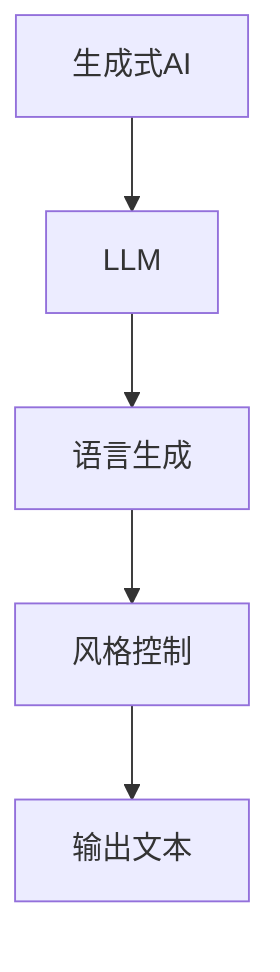
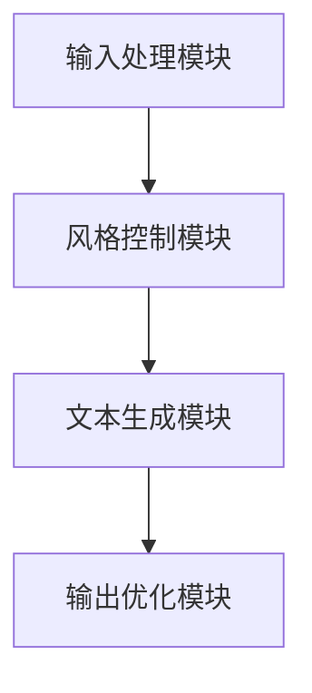
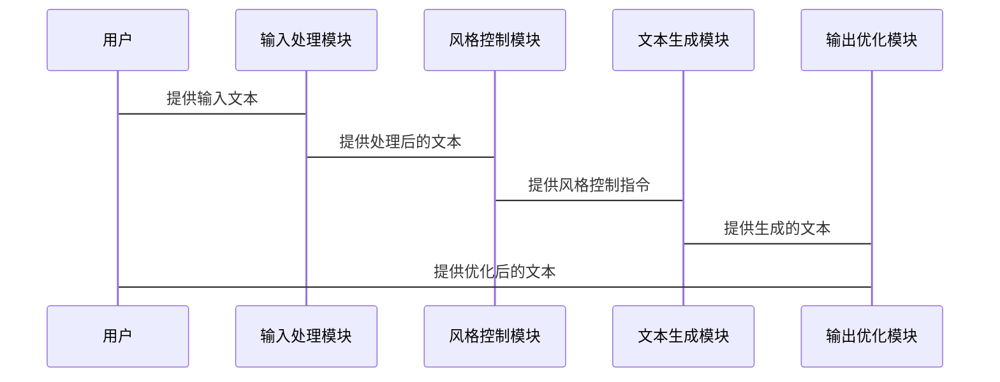

                 

# AI Agent的语言生成控制：精确调节LLM的输出风格

> 关键词：AI Agent, 语言生成控制, 大语言模型, LLM, 文本生成, 风格控制, 自然语言处理

> 摘要：本文将深入探讨AI Agent中语言生成控制的核心原理与实现方法，重点分析如何精确调节大语言模型（LLM）的输出风格。通过结合生成式AI的基本原理、风格控制的实现机制以及系统的架构设计，为读者提供一个全面而系统的理解框架。

---

## 目录大纲

### 第一部分: AI Agent与语言生成控制的背景与概念

#### 第1章: AI Agent与语言生成控制概述

##### 1.1 AI Agent的基本概念
###### 1.1.1 AI Agent的定义与特点
  - AI Agent的定义
  - 核心特点：智能性、自主性、反应性、社会性
  - AI Agent的应用场景

###### 1.1.2 AI Agent的核心功能与应用场景
  - 信息处理与决策
  - 自然语言理解与生成
  - 人机交互与用户服务

###### 1.1.3 语言生成在AI Agent中的重要性
  - 语言生成作为AI Agent输出能力的关键模块
  - 不同应用场景下语言风格的多样性需求

##### 1.2 大语言模型（LLM）的基本概念
###### 1.2.1 LLM的定义与技术特点
  - 大语言模型的定义
  - 基于Transformer的架构特点
  - 模型的训练目标与优化策略

###### 1.2.2 LLM在自然语言处理中的应用
  - 文本生成、问答系统、机器翻译等
  - LLM在AI Agent中的角色与作用

###### 1.2.3 LLM与AI Agent的结合
  - AI Agent作为LLM的“外壳”与“指挥官”
  - LLM为AI Agent提供强大的自然语言处理能力

##### 1.3 语言生成控制的背景与意义
###### 1.3.1 语言生成控制的定义
  - 什么是语言生成控制
  - 风格控制的定义与目标

###### 1.3.2 精确调节LLM输出风格的必要性
  - 不同场景下对语言风格的需求
  - 风格不一致可能导致的问题

###### 1.3.3 语言生成控制的应用场景与挑战
  - 客服系统中的语气调节
  - 教育领域的个性化教学
  - 金融领域的合规性要求

#### 1.4 本章小结
  - 总结本章的核心内容
  - 为后续章节奠定基础

---

### 第二部分: 语言生成控制的核心概念与联系

#### 第2章: 语言风格控制的原理与方法

##### 2.1 生成式AI的基本原理
###### 2.1.1 生成式AI的定义与分类
  - 基于规则的生成式AI
  - 统计模型与深度学习模型的生成式AI
  - 当前主流的大语言模型生成式AI

###### 2.1.2 基于LLM的生成式AI工作流程
  - 输入处理
  - 解码过程
  - 输出生成

###### 2.1.3 LLM生成文本的数学模型概述
  - Transformer模型的结构特点
  - 编码器-解码器架构
  - 注意力机制的作用

##### 2.2 语言风格控制的原理与方法
###### 2.2.1 语言风格的分类与特征
  - 风格的分类：正式、口语化、技术性、简洁等
  - 风格特征的提取与分析

###### 2.2.2 风格控制的实现机制
  - 基于指令的风格控制
  - 基于提示的风格控制
  - 基于参数调节的风格控制

###### 2.2.3 风格控制与生成质量的关系
  - 风格控制对生成质量的影响
  - 如何在风格控制与生成质量之间找到平衡点

##### 2.3 核心概念的ER实体关系图

#### 2.4 本章小结
  - 总结本章的核心内容
  - 为后续章节奠定基础

---

### 第三部分: 语言风格控制的算法原理

#### 第3章: 文本生成的算法流程

##### 3.1 文本生成的算法流程
###### 3.1.1 基于LLM的文本生成流程
  - 输入处理
  - 解码过程
  - 输出生成

###### 3.1.2 风格控制的插入点与实现方式
  - 在输入阶段进行风格控制
  - 在解码阶段进行风格控制
  - 在输出阶段进行风格控制

##### 3.2 风格控制的算法实现
###### 3.2.1 风格分类算法
  - 基于传统的机器学习算法
  - 基于深度学习的风格分类算法

###### 3.2.2 风格特征提取算法
  - 基于词袋模型的特征提取
  - 基于词嵌入模型的特征提取
  - 基于句嵌模型的特征提取

###### 3.2.3 风格调整算法
  - 基于规则的风格调整
  - 基于模型的风格调整
  - 基于对抗训练的风格调整

##### 3.3 算法的数学模型与公式
###### 3.3.1 概率分布模型
$$ P(y|x) = \text{softmax}(f(x)) $$

###### 3.3.2 损失函数
$$ \text{loss} = -\sum_{i=1}^{n} \log P(y_i|x) $$

#### 3.4 本章小结
  - 总结本章的核心内容
  - 为后续章节奠定基础

---

### 第四部分: 语言风格控制的系统架构设计

#### 第4章: 系统功能设计

##### 4.1 系统功能设计
###### 4.1.1 用户需求分析
  - 不同用户群体对语言风格的需求
  - 不同应用场景下的具体需求

###### 4.1.2 系统功能模块划分
  - 输入处理模块
  - 风格控制模块
  - 文本生成模块
  - 输出优化模块

###### 4.1.3 领域模型设计
  - 领域模型的定义与作用
  - 领域模型的设计原则
  - 领域模型的实现方式

#### 4.2 系统架构设计
##### 4.2.1 系统架构图

##### 4.2.2 系统接口设计
  - 输入接口设计
  - 输出接口设计
  - 模块间的接口设计

#### 4.3 系统交互设计
##### 4.3.1 系统交互流程
  - 用户输入处理流程
  - 风格控制流程
  - 文本生成与优化流程

##### 4.3.2 系统交互序列图

#### 4.4 本章小结
  - 总结本章的核心内容
  - 为后续章节奠定基础

---

### 第五部分: 项目实战

#### 第5章: 项目实战与案例分析

##### 5.1 项目环境安装
###### 5.1.1 开发环境要求
  - 操作系统要求
  - Python版本要求
  - 需要安装的库与工具

###### 5.1.2 环境搭建步骤
  - 安装Python
  - 安装必要的库（如TensorFlow、Keras等）
  - 下载预训练的LLM模型

##### 5.2 项目核心实现
###### 5.2.1 风格控制模块实现
  - 基于提示的风格控制代码示例
  - 基于参数调节的风格控制代码示例

###### 5.2.2 文本生成模块实现
  - 基于LLM的文本生成代码示例
  - 带风格控制的文本生成代码示例

###### 5.2.3 系统集成与优化
  - 系统的集成步骤
  - 系统的优化与调优

##### 5.3 项目案例分析
###### 5.3.1 案例背景
  - 案例的应用场景
  - 案例的目标与需求

###### 5.3.2 案例实现
  - 系统的实现步骤
  - 系统的运行结果与分析

###### 5.3.3 案例总结
  - 案例的成功经验
  - 案例的局限性与改进方向

#### 5.4 本章小结
  - 总结本章的核心内容
  - 总结项目的实现过程与经验教训

---

### 第六部分: 总结与展望

#### 第6章: 总结与展望

##### 6.1 总结
  - 回顾本书的核心内容
  - 总结语言生成控制的重要性和实现方法

##### 6.2 未来展望
  - 语言生成控制技术的发展趋势
  - 新的应用场景与挑战
  - 未来的研究方向与改进空间

#### 6.3 附录
##### 6.3.1 术语表
  - 核心术语的定义与解释

##### 6.3.2 参考文献
  - 本书参考的主要文献与资料

---

以上是《AI Agent的语言生成控制：精确调节LLM的输出风格》的完整目录大纲，涵盖了从基础概念到算法实现，再到系统设计和项目实战的各个方面，确保读者能够全面理解并掌握AI Agent的语言生成控制技术。

