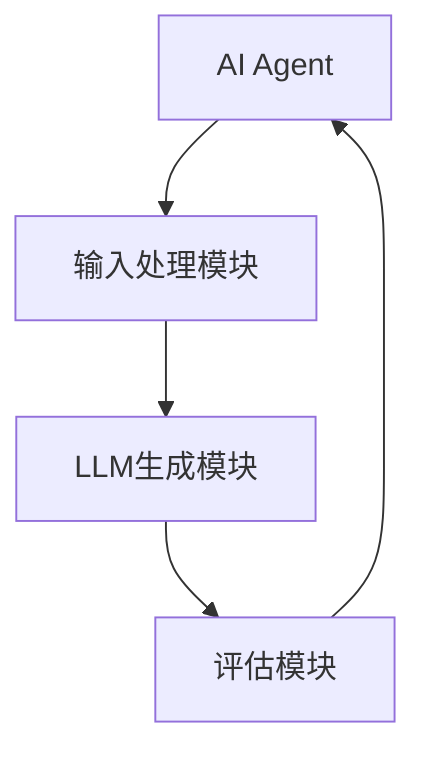

                 


# AI Agent的语言生成：提升LLM的文本创作质量

> 关键词：AI Agent, 大语言模型, LLM, 语言生成, 文本质量, 自然语言处理, 人工智能

> 摘要：本文深入探讨了AI Agent在语言生成中的应用，重点分析了如何通过优化大语言模型（LLM）来提升文本创作的质量。文章从背景介绍、核心概念、算法原理、系统架构到项目实战，层层递进，详细阐述了AI Agent与LLM的关系及其在语言生成中的协同工作模式，同时提供了丰富的数学模型和代码示例，帮助读者全面理解并掌握相关技术。

---

# 第1章 AI Agent与语言生成的背景

## 1.1 AI Agent的基本概念

### 1.1.1 AI Agent的定义
AI Agent（人工智能代理）是指能够感知环境并采取行动以实现目标的智能实体。它可以是一个软件程序，也可以是一个物理设备，通过与用户或环境交互，完成特定任务。

### 1.1.2 AI Agent的核心特征
- **自主性**：能够自主决策和行动。
- **反应性**：能够实时感知环境并做出反应。
- **目标导向性**：所有行动均以实现目标为导向。
- **社交能力**：能够与人类或其他系统进行有效交互。

### 1.1.3 AI Agent与传统程序的区别
| 特性 | AI Agent | 传统程序 |
|------|----------|----------|
| 决策能力 | 高 | 低 |
| 交互能力 | 高 | 低 |
| 自适应能力 | 高 | 低 |

---

## 1.2 大语言模型（LLM）的基本概念

### 1.2.1 LLM的定义
大语言模型（Large Language Model，LLM）是一种基于深度学习的自然语言处理模型，能够理解和生成人类语言文本。LLM通常基于Transformer架构，通过大量的训练数据进行预训练。

### 1.2.2 LLM的核心技术特点
- **基于Transformer架构**：利用自注意力机制处理长文本。
- **大规模预训练**：通过海量数据学习语言模式。
- **生成能力强**：能够生成高质量的自然语言文本。

### 1.2.3 LLM与AI Agent的关系
AI Agent可以通过调用LLM API来实现语言生成任务，而LLM则为AI Agent提供强大的文本生成能力。这种协同工作模式使得AI Agent能够更高效地完成复杂任务。

---

## 1.3 语言生成的背景与意义

### 1.3.1 语言生成的定义
语言生成是指通过计算机程序生成符合语法和语义的自然语言文本。它是自然语言处理的核心任务之一。

### 1.3.2 语言生成的应用场景
- **对话系统**：如智能客服、聊天机器人。
- **内容生成**：如新闻报道、技术文档生成。
- **创意写作**：如诗歌、小说创作。

### 1.3.3 提升LLM文本质量的重要性
高质量的语言生成能够提高用户体验、增强系统智能性和提升商业价值。优化LLM的文本质量是实现更智能AI Agent的关键。

---

## 1.4 本章小结
本章介绍了AI Agent和大语言模型的基本概念，并阐述了语言生成的重要性和应用场景。通过理解这些背景知识，我们可以更好地理解后续章节的核心内容。

---

# 第2章 AI Agent与LLM的核心概念

## 2.1 AI Agent的核心原理

### 2.1.1 AI Agent的决策机制
AI Agent通过感知环境信息，结合内部知识库和目标函数，选择最优行动方案。

### 2.1.2 AI Agent的交互方式
- **文本交互**：通过自然语言理解（NLU）和自然语言生成（NLG）实现对话。
- **命令交互**：通过接收指令并执行操作。

### 2.1.3 AI Agent的自我优化能力
通过强化学习等技术，AI Agent能够不断优化自身的决策策略和生成能力。

---

## 2.2 LLM的核心原理

### 2.2.1 LLM的训练机制
- **预训练**：基于大量无监督数据进行模式学习。
- **微调**：针对特定任务进行有监督训练。

### 2.2.2 LLM的生成机制
- **自回归生成**：逐词生成文本。
- **非自回归生成**：一次性生成完整文本。

### 2.2.3 LLM的评估机制
- **自动评估**：如BLEU、ROUGE等指标。
- **人工评估**：通过主观评价衡量生成文本的质量。

---

## 2.3 AI Agent与LLM的关系

### 2.3.1 AI Agent作为LLM的用户
AI Agent可以调用LLM API来生成文本内容，例如在对话系统中使用LLM进行回复生成。

### 2.3.2 LLM作为AI Agent的内部组件
AI Agent可以集成LLM作为其核心组件，例如在智能写作工具中，LLM负责生成草稿。

### 2.3.3 AI Agent与LLM的协同工作模式
AI Agent通过LLM生成语言内容，同时利用自身决策能力优化生成结果，实现更智能的语言生成。

---

## 2.4 本章小结
本章详细讲解了AI Agent与LLM的核心概念及其关系，为后续章节的理解奠定了基础。

---

# 第3章 LLM的算法原理与数学模型

## 3.1 Transformer模型的结构

### 3.1.1 自注意力机制
自注意力机制通过计算输入序列中每个位置的权重，生成位置相关的表示。

$$ \text{Attention}(Q, K, V) = \text{softmax}\left(\frac{QK^T}{\sqrt{d_k}}\right)V $$

其中，$Q$、$K$、$V$分别是查询、键和值矩阵。

### 3.1.2 前馈神经网络
Transformer的前馈网络由两个线性变换层组成，通常使用ReLU作为激活函数。

### 3.1.3 段落级别的并行计算
Transformer通过并行计算提升计算效率，特别是在处理长文本时表现出色。

---

## 3.2 LLM的训练过程

### 3.2.1 数据预处理
- **分词**：将文本分割为单词或短语。
- **序列截断**：将超长序列截断为固定长度。

### 3.2.2 损失函数计算
交叉熵损失函数用于衡量预测概率与真实标签的差异。

$$ \mathcal{L} = -\sum_{i=1}^{n} \sum_{j=1}^{m} y_{i,j} \log p(y_{i,j}|x_i) $$

其中，$x_i$是输入序列，$y_{i,j}$是目标概率分布。

### 3.2.3 参数优化
使用随机梯度下降（SGD）或Adam优化器更新模型参数。

---

## 3.3 LLM的生成过程

### 3.3.1 解码策略
- **贪心解码**：每次选择概率最高的词。
- **随机采样**：基于概率分布随机选择词。
- **Top-k采样**：从概率最高的k个词中随机选择。

### 3.3.2 模糊度控制
通过调整生成策略的多样性参数（如温度）来控制生成文本的模糊度。

$$ \text{Temperature} = 1.0 \Rightarrow \text{多样化生成} $$
$$ \text{Temperature} = 0.7 \Rightarrow \text{更确定生成} $$

### 3.3.3 前缀树搜索
通过构建前缀树结构，探索所有可能的生成路径，选择最优生成结果。

---

## 3.4 本章小结
本章从算法角度分析了LLM的结构和训练过程，并详细讲解了生成策略及其数学模型。

---

# 第4章 AI Agent的系统分析与架构设计

## 4.1 AI Agent的系统组成

### 4.1.1 输入处理模块
- 接收用户输入并解析需求。
- 转换输入格式为模型可接受的形式。

### 4.1.2 决策模块
- 根据输入生成多个候选响应。
- 通过评估机制选择最优响应。

## 4.2 系统架构设计



---

## 4.3 项目实战

### 4.3.1 环境安装
```bash
pip install transformers torch
```

### 4.3.2 核心代码实现
```python
from transformers import AutoTokenizer, AutoModelForCausalLM

tokenizer = AutoTokenizer.from_pretrained("gpt2")
model = AutoModelForCausalLM.from_pretrained("gpt2")

inputs = tokenizer("这是一个测试", return_tensors="np")
outputs = model.generate(**inputs, max_length=50)
print(tokenizer.decode(outputs[0], skip_special_tokens=True))
```

---

## 4.4 本章小结
本章通过系统架构设计和项目实战，展示了AI Agent在语言生成中的具体实现方式。

---

# 第5章 提升LLM文本质量的最佳实践

## 5.1 数据优化策略
- **数据清洗**：去除低质量数据。
- **数据增强**：通过数据扩展提升模型鲁棒性。

## 5.2 模型优化策略
- **调整生成参数**：如温度、Top-k参数。
- **微调模型**：针对特定任务进行微调。

## 5.3 系统优化策略
- **并行计算**：利用多GPU加速训练。
- **缓存机制**：优化生成过程中的数据访问效率。

---

## 5.4 本章小结
本章总结了提升LLM文本质量的各种策略，帮助读者在实际应用中优化生成效果。

---

# 结语

通过本文的详细讲解，我们了解了AI Agent在语言生成中的重要作用，以及如何通过优化LLM来提升文本质量。未来，随着技术的不断发展，AI Agent与LLM的结合将更加紧密，为语言生成领域带来更多的创新和突破。

--- 

感谢您的耐心阅读！如果对本文内容感兴趣，欢迎关注我的技术博客，获取更多深度技术解析。

