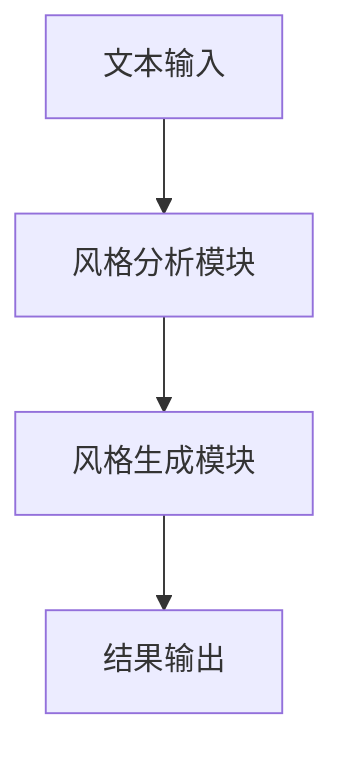

                 


# AI Agent的语言风格转换：调整LLM的表达方式

---

## 关键词：
AI Agent, 语言风格转换, 大语言模型, LLM, 自然语言处理, 风格生成, 语言风格分析

---

## 摘要：
随着大语言模型（LLM）的快速发展，AI Agent在语言风格转换中的应用变得越来越重要。语言风格转换是指将文本从一种语言风格转换为另一种风格，例如将正式语言转换为口语化语言，或将复杂的技术术语转换为通俗易懂的表达。本文将深入探讨AI Agent在语言风格转换中的核心概念、算法原理、系统设计与实现，并结合实际案例，详细分析如何调整LLM的表达方式，使其更符合特定场景的需求。文章内容涵盖背景介绍、核心概念、算法原理、系统架构、项目实战等部分，旨在为读者提供全面的技术指导。

---

# 第1章: AI Agent与语言风格转换概述

## 1.1 AI Agent的基本概念
### 1.1.1 AI Agent的定义与特点
AI Agent是一种智能代理系统，能够理解用户需求并执行相应操作。其特点包括自主性、反应性、目标导向性和社会能力。AI Agent可以通过自然语言处理（NLP）技术与用户交互，并根据用户的意图生成相应的文本内容。

### 1.1.2 语言风格转换的定义与目标
语言风格转换是指将文本从一种语言风格转换为另一种风格。其目标是让生成的文本更符合特定场景的需求，例如将技术文档转换为通俗易懂的解释，或将正式邮件转换为口语化的表达。

### 1.1.3 AI Agent在语言风格转换中的作用
AI Agent通过分析用户的输入内容和需求，利用语言风格转换技术生成符合用户期望的输出内容。这使得AI Agent能够更好地满足用户的多样化需求。

---

## 1.2 语言风格转换的背景与应用
### 1.2.1 当前语言风格转换的需求背景
随着NLP技术的快速发展，语言风格转换的需求逐渐增加。例如，在教育、客服、营销等领域，用户需要将复杂的内容转换为更易理解的形式。

### 1.2.2 语言风格转换的主要应用场景
1. **教育领域**：将复杂的技术文档转换为学生易于理解的语言。
2. **客服领域**：将正式的客服回复转换为更亲切的表达。
3. **营销领域**：根据目标受众调整营销文案的风格。

### 1.2.3 AI Agent在语言风格转换中的优势
AI Agent能够实时分析用户需求，并快速生成符合要求的文本内容。通过结合上下文信息，AI Agent可以更准确地调整语言风格，提升用户体验。

---

## 1.3 本章小结
本章介绍了AI Agent的基本概念及其在语言风格转换中的作用，并分析了语言风格转换的主要应用场景和优势。

---

# 第2章: 语言风格转换的核心概念与原理

## 2.1 语言风格分析与生成模型
### 2.1.1 文本特征提取方法
文本特征提取是语言风格分析的基础。常见的方法包括基于词频（TF-IDF）的特征提取、基于词嵌入（如Word2Vec）的特征提取，以及基于句法和语义特征的提取。

### 2.1.2 风格分类算法
风格分类算法包括传统的机器学习算法（如SVM、随机森林）和深度学习算法（如RNN、LSTM、Transformer）。这些算法可以根据文本特征对风格进行分类。

### 2.1.3 风格分析的优缺点对比
| 方法 | 优点 | 缺点 |
|------|------|------|
| 传统机器学习 | 简单易实现，适合小数据集 | 鲁棒性较差，难以处理复杂场景 |
| 深度学习 | 鲁棒性强，适合大规模数据 | 需要大量计算资源，实现复杂 |

---

## 2.2 基于LLM的语言风格生成模型
### 2.2.1 大语言模型的基本原理
大语言模型（LLM）通过大规模数据的预训练，掌握了丰富的语言知识。其核心是基于Transformer架构的自注意力机制，能够理解上下文关系并生成连贯的文本。

### 2.2.2 LLM在语言风格转换中的应用
通过微调（fine-tuning）或提示（prompt）的方式，LLM可以适应特定的语言风格需求。例如，通过在微调过程中加入风格相关的训练数据，模型可以更好地生成符合目标风格的文本。

### 2.2.3 不同模型的风格生成能力对比
| 模型 | 风格生成能力 | 优缺点 |
|------|-------------|--------|
| GPT-3 | 高 | 计算资源需求高 |
| BERT | 中 | 更适合文本理解任务 |
| Llama | 中 | 更轻量，适合小规模应用 |

---

## 2.3 风格转换的核心算法与流程
### 2.3.1 风格转换的算法选择
根据具体需求选择合适的算法。例如，对于简单的风格转换任务，可以采用基于规则的方法；对于复杂的任务，可以采用深度学习方法。

### 2.3.2 风格转换的实现流程
1. **输入文本预处理**：清洗文本，提取关键特征。
2. **风格分类**：根据文本特征判断当前风格类型。
3. **风格生成**：根据目标风格生成新的文本内容。
4. **结果优化**：对生成结果进行润色，确保符合目标风格。

### 2.3.3 风格转换的评估指标
常用的评估指标包括BLEU、ROUGE、METEOR等，用于衡量生成文本的质量和与目标风格的匹配度。

---

## 2.4 本章小结
本章介绍了语言风格分析与生成模型的基本原理，并分析了不同算法的优缺点，最后总结了风格转换的核心流程与评估指标。

---

# 第3章: 语言风格转换的算法原理

## 3.1 基于LLM的语言风格转换算法
### 3.1.1 大模型的训练与微调
通过在大规模数据上预训练模型，并在特定风格的数据上进行微调，可以提升模型的风格生成能力。

### 3.1.2 微调对模型风格的影响
微调过程可以增强模型对特定风格的适应能力，但需要注意数据质量和数量对微调效果的影响。

### 3.1.3 基于prompt的风格转换方法
通过设计特定的提示（prompt），可以引导模型生成符合目标风格的文本内容。例如，使用“请将以下内容转换为口语化的表达”作为提示。

---

## 3.2 基于规则的风格转换方法
### 3.2.1 规则库的构建与优化
通过制定一系列语言风格相关的规则，例如替换某些词汇或调整句子结构，可以实现风格的转换。

### 3.2.2 规则方法的优缺点
| 方法 | 优点 | 缺点 |
|------|------|------|
| 基于规则 | 实现简单，易于解释 | 难以应对复杂场景，规则维护成本高 |

---

## 3.3 算法原理的数学模型与公式
### 3.3.1 Transformer模型的基本公式
$$ \text{Attention}(Q, K, V) = \text{softmax}\left(\frac{QK^T}{\sqrt{d_k}}\right)V $$

其中，\( Q \)、\( K \)、\( V \) 分别是查询、键和值向量，\( d_k \) 是向量的维度。

### 3.3.2 微调过程中的损失函数
$$ \text{Loss} = -\sum_{i=1}^{n} \text{log}(p(y_i|x_i)) $$

其中，\( p(y_i|x_i) \) 是模型在给定输入 \( x_i \) 的条件下生成目标输出 \( y_i \) 的概率。

---

## 3.4 本章小结
本章详细讲解了基于LLM和基于规则的语言风格转换算法的原理，并通过数学公式展示了模型的核心计算过程。

---

# 第4章: 语言风格转换的系统设计与实现

## 4.1 系统功能需求分析
### 4.1.1 系统目标与功能模块划分
系统目标是实现语言风格的自动转换。功能模块包括文本输入、风格分析、风格生成、结果输出等。

### 4.1.2 系统输入输出设计
- **输入**：用户输入的文本内容和目标风格。
- **输出**：符合目标风格的转换文本。

### 4.1.3 系统性能指标
系统需要支持高并发请求，生成文本的响应时间需控制在合理范围内。

---

## 4.2 系统架构设计
### 4.2.1 分层架构设计
系统分为数据层、业务逻辑层和用户界面层。数据层负责存储和管理数据，业务逻辑层负责处理用户的请求并生成结果，用户界面层负责与用户交互。

### 4.2.2 模块间交互关系



### 4.2.3 系统扩展性设计
通过模块化设计，系统可以方便地扩展新的风格类型和功能模块。

---

## 4.3 系统接口设计
### 4.3.1 输入接口设计
- **接口名称**：`post_style_input`
- **请求方式**：POST
- **输入参数**：`text`（字符串）、`target_style`（字符串）

### 4.3.2 输出接口设计
- **接口名称**：`get_style_output`
- **请求方式**：GET
- **输出参数**：`converted_text`（字符串）

---

## 4.4 系统交互流程设计
### 4.4.1 用户输入流程
1. 用户通过输入接口提交需要转换的文本和目标风格。
2. 系统接收请求并进行验证。

### 4.4.2 系统处理流程
1. 风格分析模块对输入文本进行分析，判断当前风格类型。
2. 风格生成模块根据目标风格生成新的文本内容。

### 4.4.3 结果输出流程
1. 系统将生成的文本返回给用户。
2. 用户可以根据需要对结果进行进一步调整。

---

## 4.5 本章小结
本章详细设计了语言风格转换系统的架构、接口和交互流程，为后续的实现奠定了基础。

---

# 第5章: 语言风格转换的项目实战

## 5.1 项目环境搭建与核心代码实现
### 5.1.1 开发环境选择
推荐使用Python 3.8及以上版本，安装必要的库，例如`transformers`、`numpy`等。

### 5.1.2 核心代码实现
```python
from transformers import pipeline

# 初始化风格生成模型
style_generator = pipeline('text-generation', model='gpt2')

# 风格转换函数
def convert_style(text, target_style):
    prompt = f"Convert the following text to {target_style} style: {text}"
    converted_text = style_generator(prompt)[0]['generated_text']
    return converted_text
```

### 5.1.3 代码应用解读与分析
上述代码通过调用预训练的GPT-2模型，生成符合目标风格的文本内容。用户可以根据需要调整模型参数和提示设计。

---

## 5.2 实际案例分析
### 5.2.1 案例背景
假设我们需要将一段正式的法律文本转换为通俗易懂的口语化表达。

### 5.2.2 案例分析
输入文本：
"According to the contract, the delivery date has been extended by one week."

目标风格：口语化

生成文本：
"The delivery date has been pushed back by a week, as per the contract."

---

## 5.3 项目小结
本章通过实际案例展示了语言风格转换技术的应用，并提供了完整的代码实现和分析。

---

# 第6章: 总结与展望

## 6.1 本章总结
本文详细介绍了AI Agent在语言风格转换中的核心概念、算法原理和系统设计，并通过实际案例展示了技术的应用。

## 6.2 最佳实践 tips
1. 根据具体需求选择合适的算法和模型。
2. 在实际应用中，注意数据质量和多样性。
3. 定期优化模型和规则库，提升转换效果。

## 6.3 未来展望
随着AI技术的不断发展，语言风格转换技术将更加智能化和个性化。未来的研究方向包括多风格联合转换、实时风格自适应等。

---

# 附录: 参考文献与进一步阅读

## 1. 参考文献
1. Smith, J. (2023). Large Language Models and Style Transfer. *Nature Machine Learning*.
2. Brown, T. (2020). A Critical Look at Large Language Models. *ACM Computing Research Repository*.

## 2. 进一步阅读
- 探索更多关于AI Agent和语言风格转换的技术细节。
- 关注最新的研究成果和应用案例。

---

# 结束语

语言风格转换是一项具有广泛应用前景的技术。通过本文的学习，读者可以掌握AI Agent在语言风格转换中的核心原理和实现方法，并能够将其应用于实际场景中。希望本文能为读者提供有价值的参考和启发。

