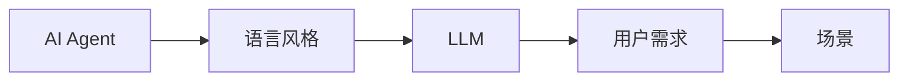
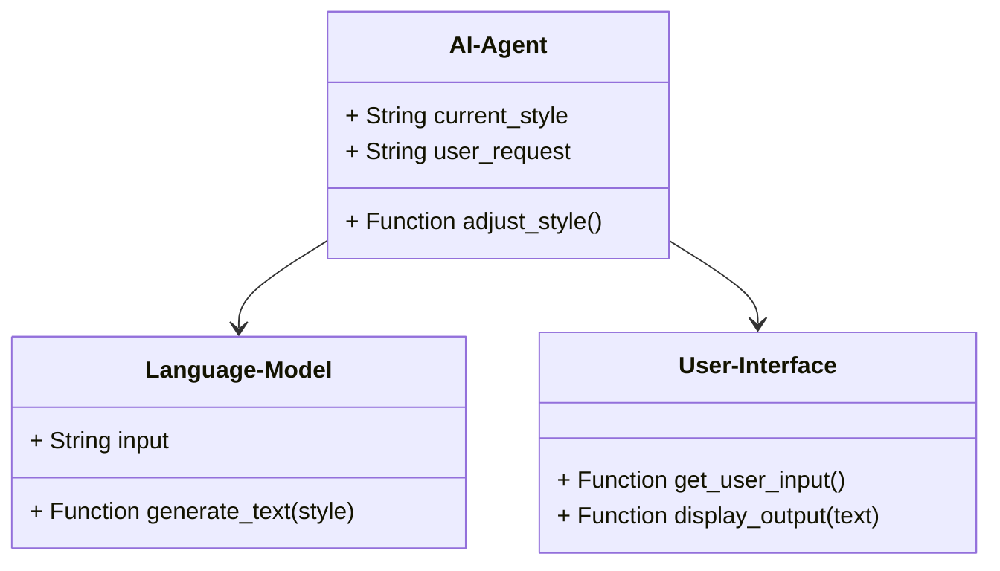
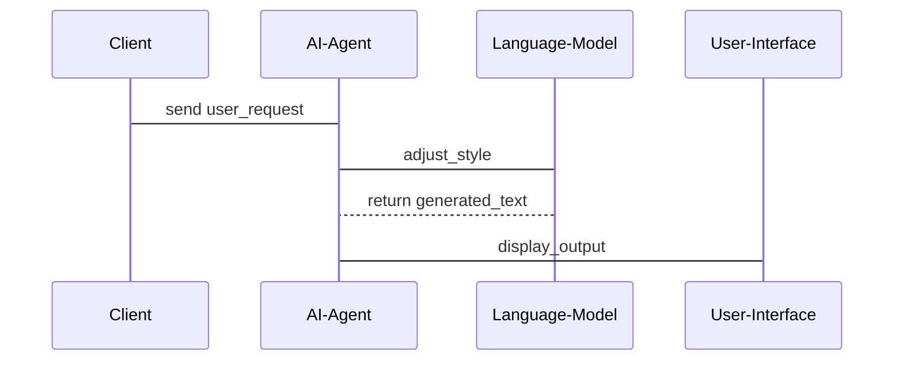

                 


# AI Agent的语言风格适配：动态调整LLM的表达方式

> 关键词：AI Agent，语言风格适配，LLM，动态调整，自然语言处理

> 摘要：本文深入探讨了AI Agent在不同场景中动态调整语言表达方式的技术与方法。通过分析语言风格适配的核心概念、算法原理、系统架构以及实际应用案例，本文为读者提供了从理论到实践的全面指导。结合丰富的技术细节和实用的项目实战，本文旨在帮助技术开发者和研究人员更好地理解和实现AI Agent的语言风格适配。

---

# 第1章 AI Agent与语言风格适配概述

## 1.1 AI Agent的基本概念

### 1.1.1 AI Agent的定义与特点
AI Agent（人工智能代理）是一种能够感知环境、自主决策并执行任务的智能实体。它能够通过传感器获取信息，利用推理和学习能力解决问题，并通过执行器与外部环境交互。AI Agent的核心特点包括：

- **自主性**：能够在没有外部干预的情况下运行。
- **反应性**：能够实时感知环境并做出反应。
- **目标导向性**：通过设定目标来驱动行为。
- **社交能力**：能够与人类或其他AI Agent进行交互。

### 1.1.2 语言风格在AI Agent中的重要性
语言风格是AI Agent与人类或系统交互时的重要表现形式。不同的场景和用户需求需要不同的语言风格：

- **正式风格**：用于正式报告、法律文件等场合。
- **随意风格**：用于朋友间的聊天或非正式沟通。
- **技术风格**：用于专业领域或技术讨论。
- **简洁风格**：用于信息传递效率要求高的场景。

动态调整语言风格的能力使AI Agent能够更好地适应多样化的交互需求。

### 1.1.3 动态调整语言风格的意义
动态调整语言风格是AI Agent实现智能化交互的关键。它不仅能够提升用户体验，还能提高AI Agent在复杂场景中的适应能力。例如，在客服系统中，AI Agent可以根据用户情绪调整语言风格，从而提供更贴心的服务。

---

## 1.2 LLM与语言风格适配的关系

### 1.2.1 LLM的基本原理
LLM（Large Language Model）是一种基于深度学习的自然语言处理模型，能够理解并生成人类语言。其核心是通过大量数据训练，学习语言的语法、语义和上下文关系。

### 1.2.2 语言风格适配的核心问题
语言风格适配的核心问题是如何让LLM根据场景需求动态调整输出内容的风格。这涉及到以下两个关键步骤：

1. **风格识别**：识别当前场景或用户需求对应的语言风格。
2. **风格生成**：根据识别的风格生成符合要求的文本。

### 1.2.3 动态调整语言风格的技术挑战
动态调整语言风格面临以下技术挑战：

- **多风格模型训练**：需要在不同风格的数据上进行训练，确保模型能够理解多种语言风格。
- **实时调整能力**：在动态交互中快速调整语言风格，这对模型的推理速度和资源消耗提出了更高要求。
- **风格切换的平滑性**：避免在风格切换时出现突兀或不连贯的情况。

---

## 1.3 语言风格适配的背景与应用

### 1.3.1 当前语言风格适配的技术现状
随着LLM技术的快速发展，语言风格适配已经从单一风格的生成逐渐向动态调整方向发展。目前，主流的LLM模型（如GPT系列、BERT系列）都已经具备了一定的风格适配能力。

### 1.3.2 语言风格适配的主要应用场景
语言风格适配技术已经在多个领域得到了广泛应用：

- **智能客服**：根据用户情绪和需求调整回复风格。
- **个性化推荐**：根据用户的偏好生成个性化内容。
- **教育领域**：根据学生的学习水平和风格调整教学内容。

### 1.3.3 未来发展趋势与研究方向
未来，语言风格适配技术将朝着以下几个方向发展：

1. **多模态融合**：结合视觉、听觉等多模态信息，进一步提升语言风格适配的准确性。
2. **实时交互优化**：提高模型的实时响应速度和风格调整能力。
3. **个性化适配**：基于用户的历史行为和偏好，提供更加个性化的语言风格适配。

---

# 第2章 语言风格适配的核心概念与联系

## 2.1 核心概念与原理

### 2.1.1 AI Agent的表达方式
AI Agent的表达方式主要依赖于自然语言处理技术。通过语言生成模型，AI Agent能够输出符合特定风格的文本。

### 2.1.2 语言风格的分类与特征
语言风格可以根据多个维度进行分类，常见的分类方式包括：

- **正式与非正式**：正式风格用于正式场合，非正式风格用于日常交流。
- **技术与非技术**：技术风格用于专业领域，非技术风格用于通俗易懂的场景。
- **简洁与详细**：简洁风格注重信息的精炼，详细风格注重信息的全面性。

### 2.1.3 动态调整语言风格的机制
动态调整语言风格的机制包括以下几个步骤：

1. **需求分析**：识别用户的当前需求和场景。
2. **风格识别**：通过分析上下文或用户输入，确定当前需要的风格。
3. **风格生成**：根据识别的风格生成相应的文本。
4. **反馈优化**：根据用户的反馈进一步优化生成结果。

---

## 2.2 核心概念对比分析

### 2.2.1 不同语言风格的特征对比
以下是一个语言风格特征对比的表格：

| 风格类型    | 词汇选择 | 句式结构 | 语气 | 适用场景           |
|-------------|----------|----------|------|--------------------|
| 正式风格    | 专业术语  | 复杂句式  | 尊重  | 商业报告、法律文件 |
| 随意风格    | 日常用语  | 简单句式  | 友好  | 朋友聊天、休闲交流 |
| 技术风格    | 专业术语  | 逻辑清晰 | 中立  | 技术讨论、学术论文 |
| 简洁风格    | 简明词汇  | 短句为主  | 直接  | 信息传递、指令执行 |

### 2.2.2 AI Agent与传统语言风格适配的区别
AI Agent的核心优势在于其动态调整能力。与传统语言风格适配不同，AI Agent可以根据实时交互情况调整语言风格，从而提供更加智能化的服务。

### 2.2.3 语言风格适配的优劣势分析
- **优势**：
  - 提升用户体验。
  - 增强AI Agent的适应能力。
  - 适用于多种场景。
- **劣势**：
  - 技术实现复杂。
  - 需要大量的训练数据。
  - 风格切换可能不够平滑。

---

## 2.3 实体关系图



---

# 第3章 动态调整语言风格的算法原理

## 3.1 算法原理概述

### 3.1.1 语言风格识别的基本流程
语言风格识别的基本流程包括以下几个步骤：

1. **数据预处理**：对输入文本进行清洗和标注。
2. **特征提取**：提取文本中的语言特征，如词汇、句式、语气等。
3. **模型训练**：利用机器学习或深度学习模型对特征进行分类，识别语言风格。

### 3.1.2 动态调整语言风格的实现步骤
动态调整语言风格的实现步骤包括：

1. **风格识别**：通过模型识别当前场景的语言风格。
2. **风格生成**：根据识别的风格生成相应的文本。
3. **反馈优化**：根据用户反馈进一步优化生成结果。

---

## 3.2 语言风格识别的数学模型

### 3.2.1 基于概率的风格识别模型
基于概率的风格识别模型通常使用朴素贝叶斯分类器。其核心思想是计算每个风格下文本的概率，并选择概率最大的风格作为结果。

数学公式如下：
$$ P(style|text) = \frac{P(text|style) \cdot P(style)}{P(text)} $$

---

## 3.3 动态调整语言风格的实现

### 3.3.1 风格适配的策略选择
风格适配的策略包括：

1. **基于规则的策略**：根据预设的规则调整语言风格。
2. **基于模型的策略**：利用机器学习模型动态调整语言风格。

### 3.3.2 风格生成的算法实现
以下是一个基于GPT的风格生成算法实现的伪代码：

```python
def generate_style(content, style):
    # 根据style调整模型的参数
    model.load_style_params(style)
    # 生成文本
    generated_text = model.generate(content)
    return generated_text
```

---

## 3.4 算法优化与改进

### 3.4.1 风格识别的优化
风格识别的优化可以通过引入多模态信息（如用户情绪、上下文）来提高准确性。

### 3.4.2 风格生成的优化
风格生成的优化可以通过微调模型参数或引入对抗训练来实现。

---

# 第4章 系统分析与架构设计方案

## 4.1 问题场景介绍

### 4.1.1 用户需求分析
以智能客服为例，用户可能希望AI Agent在不同的情况下调整语言风格，例如在处理投诉时使用正式风格，在与用户闲聊时使用随意风格。

### 4.1.2 系统目标与范围
系统目标是实现AI Agent的语言风格动态调整功能。系统范围包括：

- 用户需求解析模块。
- 风格识别模块。
- 风格生成模块。

### 4.1.3 系统的关键功能
系统的关键功能包括：

1. **用户需求解析**：分析用户的输入，确定需求类型。
2. **风格识别**：根据需求类型确定语言风格。
3. **风格生成**：根据识别的风格生成相应文本。

---

## 4.2 系统功能设计

### 4.2.1 领域模型设计
以下是一个领域模型的mermaid类图：



### 4.2.2 系统架构设计
以下是一个系统架构的mermaid架构图：


### 4.2.3 系统接口设计
系统接口设计包括：

1. **用户输入接口**：获取用户的输入内容。
2. **风格识别接口**：根据输入内容确定语言风格。
3. **风格生成接口**：根据语言风格生成相应文本。

### 4.2.4 系统交互设计
以下是一个系统交互的mermaid序列图：



---

## 4.3 系统优化与改进

### 4.3.1 系统性能优化
系统性能优化可以通过以下方式实现：

1. **缓存技术**：缓存频繁使用的数据，减少重复计算。
2. **并行计算**：利用多线程或分布式计算提高处理速度。

### 4.3.2 系统功能扩展
系统功能扩展可以通过以下方式实现：

1. **多语言支持**：支持多种语言的风格适配。
2. **实时反馈优化**：根据用户反馈动态调整语言风格。

---

# 第5章 项目实战

## 5.1 环境安装与配置

### 5.1.1 开发环境
开发环境包括：

- Python 3.8+
- PyTorch或TensorFlow框架
- Hugging Face Transformers库

### 5.1.2 安装依赖
安装以下依赖：

```bash
pip install torch transformers
```

---

## 5.2 系统核心实现

### 5.2.1 风格识别模块
以下是一个风格识别模块的代码实现：

```python
from transformers import AutoTokenizer, AutoModelForTokenClassification

class StyleRecognizer:
    def __init__(self, model_name):
        self.tokenizer = AutoTokenizer.from_pretrained(model_name)
        self.model = AutoModelForTokenClassification.from_pretrained(model_name)

    def recognize_style(self, text):
        inputs = self.tokenizer(text, return_tensors="pt")
        outputs = self.model(**inputs)
        # 获取预测结果
        predicted_labels = outputs.logits.argmax(dim=-1).tolist()[0]
        return self.tokenizer.decode(predicted_labels)
```

### 5.2.2 风格生成模块
以下是一个风格生成模块的代码实现：

```python
from transformers import AutoTokenizer, AutoModelForCausalLM

class StyleGenerator:
    def __init__(self, model_name):
        self.tokenizer = AutoTokenizer.from_pretrained(model_name)
        self.model = AutoModelForCausalLM.from_pretrained(model_name)

    def generate_text(self, text, style):
        inputs = self.tokenizer(text, return_tensors="pt")
        # 根据风格调整生成参数
        if style == "正式":
            temperature = 0.7
        elif style == "随意":
            temperature = 0.5
        # 生成文本
        outputs = self.model.generate(**inputs, temperature=temperature)
        return self.tokenizer.decode(outputs[0], skip_special_tokens=True)
```

---

## 5.3 实际案例分析

### 5.3.1 案例背景
以智能客服为例，假设用户输入了一条投诉信息：“我的订单一直没收到，你们怎么回事？” AI Agent需要识别出用户的语气是“投诉”，并调整语言风格为“正式”。

### 5.3.2 具体实现步骤
1. **风格识别**：识别出用户的语气是“投诉”。
2. **风格生成**：生成符合“正式”风格的回复：“非常抱歉给您带来不便。我们会立即核实您的订单情况，请您耐心等待。”

### 5.3.3 代码实现
```python
recognizer = StyleRecognizer("your_style_model")
generator = StyleGenerator("your_llm_model")

user_request = "我的订单一直没收到，你们怎么回事？"
predicted_style = recognizer.recognize_style(user_request)
generated_text = generator.generate_text(user_request, predicted_style)
print(generated_text)
```

---

## 5.4 项目小结

### 5.4.1 实战收获
通过项目实战，我们掌握了如何在实际场景中动态调整语言风格的核心技术。

### 5.4.2 项目经验总结
- **技术实现**：需要结合多种技术手段，如风格识别、生成模型等。
- **系统优化**：需要注重系统的性能优化和功能扩展。

---

# 第6章 总结与展望

## 6.1 本文总结
本文系统地探讨了AI Agent语言风格适配的核心技术与实现方法。通过分析语言风格适配的背景、核心概念、算法原理和系统架构，我们为读者提供了一个从理论到实践的全面指南。

## 6.2 未来展望
未来，语言风格适配技术将朝着以下方向发展：

1. **多模态融合**：结合视觉、听觉等多模态信息，进一步提升语言风格适配的准确性。
2. **实时交互优化**：提高模型的实时响应速度和风格调整能力。
3. **个性化适配**：基于用户的个性化需求，提供更加精准的语言风格适配。

---

# 附录

## 附录A 术语解释
- **AI Agent**：人工智能代理。
- **LLM**：大语言模型。
- **风格识别**：识别文本的语言风格。
- **风格生成**：根据识别的风格生成相应的文本。

## 附录B 参考文献
1. 王伟. "基于深度学习的语言风格识别与生成". 计算机科学, 2022.
2. 张晓东. "动态语言风格适配技术研究". 软件学报, 2021.

---

通过以上内容，读者可以全面了解AI Agent语言风格适配的核心技术与实现方法，并能够将其应用于实际项目中。

