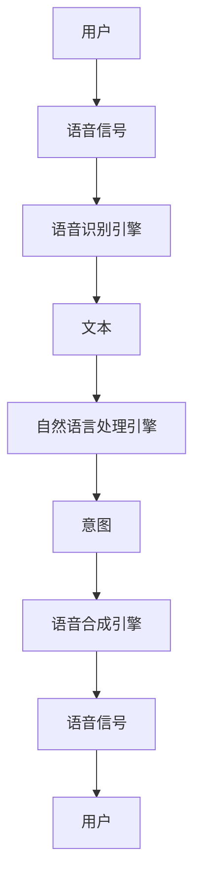
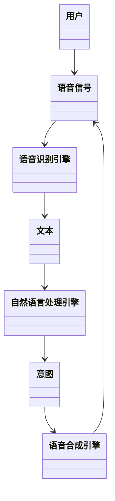
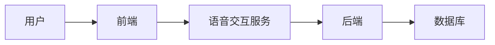

                 


# AI Agent的语音交互设计：语音识别与合成

> 关键词：AI Agent, 语音交互, 语音识别, 语音合成, 自然语言处理, 人工智能

> 摘要：本文系统地探讨了AI Agent的语音交互设计，重点分析了语音识别与语音合成的核心技术、算法原理及系统架构。通过深入讲解语音交互的背景、核心概念、算法实现和系统设计，结合实际案例分析，为读者提供了从理论到实践的全面指导。

---

# 第一部分: AI Agent语音交互设计基础

## 第1章: 语音交互的基本概念与背景

### 1.1 语音交互的基本概念

#### 1.1.1 语音交互的定义与特点
语音交互是一种通过语音信号进行人与机器之间信息传递和交互的方式。其特点包括：实时性、便捷性、自然性和智能化。与传统文本交互相比，语音交互更加贴近人类的自然沟通方式。

#### 1.1.2 AI Agent与语音交互的关系
AI Agent（智能体）通过语音交互可以更自然地与用户进行互动。AI Agent利用语音识别技术理解用户的意图，并通过语音合成技术将思考结果反馈给用户。

#### 1.1.3 语音交互的核心要素与边界
- 核心要素：声音信号、语音识别引擎、自然语言处理引擎、语音合成引擎。
- 边界：仅关注声音信号的处理，不涉及图像或文本交互。

### 1.2 语音交互的背景与应用

#### 1.2.1 语音交互的发展历程
语音交互技术起源于20世纪50年代，经历了从简单语音识别到深度学习驱动的语音交互的演变。

#### 1.2.2 当前语音交互的主要应用领域
- 智能音箱：如Amazon Alexa、Google Home。
- 智能手机：如苹果Siri、谷歌助手。
- 智能汽车：如特斯拉的语音交互系统。

#### 1.2.3 AI Agent在语音交互中的角色与价值
AI Agent通过语音交互技术，可以为用户提供更智能、更便捷的服务，例如智能助手、智能家居控制等。

---

## 第2章: 语音识别与合成的核心概念

### 2.1 语音识别的基本原理

#### 2.1.1 语音识别的定义与流程
语音识别是指将语音信号转换为文本或命令的过程。其流程包括语音采集、特征提取、模型训练和结果输出。

#### 2.1.2 语音识别的关键技术与挑战
- 关键技术：特征提取、声学模型、语言模型。
- 挑战：语音信号的噪声干扰、多说话人识别、实时性要求。

#### 2.1.3 常见的语音识别算法与模型
- 隐马尔可夫模型（HMM）：适用于小词汇量的语音识别。
- 深度神经网络（DNN）：适用于大词汇量的语音识别。
- 竞争性长短期记忆网络（CTC-LSTM）：适用于端到端的语音识别。

### 2.2 语音合成的基本原理

#### 2.2.1 语音合成的定义与流程
语音合成是将文本转换为语音的过程。其流程包括文本分析、语音合成和音频输出。

#### 2.2.2 语音合成的关键技术与挑战
- 关键技术：声学模型、语音库、参数优化。
- 挑战：语音自然度、个性化定制、实时性要求。

#### 2.2.3 常见的语音合成算法与模型
- 基于单元的语音合成：简单但语音质量较低。
- 基于统计的语音合成：通过统计模型生成语音。
- 基于神经网络的语音合成：质量高，但计算复杂度高。

---

## 第3章: 语音识别与合成的核心概念与联系

### 3.1 核心概念原理

#### 3.1.1 语音识别的声学模型与语言模型
- 声学模型：描述语音信号的概率分布。
- 语言模型：描述语言的语法和语义。

#### 3.1.2 语音合成的声学模型与语言模型
- 声学模型：描述语音的生成过程。
- 语言模型：描述语言的语义和语法。

### 3.2 核心概念对比表格

表3-1: 语音识别与语音合成的核心概念对比

| 对比维度 | 语音识别 | 语音合成 |
|----------|----------|----------|
| 输入     | 语音信号 | 文本      |
| 输出     | 文本      | 语音信号 |
| 技术难点 | 噪声处理  | 自然度    |

### 3.3 ER实体关系图

图3-1: 语音交互系统实体关系图（Mermaid流程图）



---

## 第4章: 语音识别与合成的算法原理

### 4.1 语音识别算法原理

#### 4.1.1 隐马尔可夫模型（HMM）原理

- HMM是一种统计模型，常用于语音识别。
- 通过状态转移概率和观测概率描述语音信号。

公式：$$ P(x|Q) = \prod_{i=1}^{n} a_{q_{i-1}q_i} \cdot b_{q_i}(x_i) $$

#### 4.1.2 深度神经网络（DNN）原理

- DNN通过多层神经网络提取语音特征。
- 常用于大词汇量的语音识别。

#### 4.1.3 竞争性长短期记忆网络（CTC-LSTM）原理

- CTC-LSTM通过端到端的方式进行语音识别。
- 适用于连续语音识别任务。

### 4.2 语音合成算法原理

#### 4.2.1 基于单元的语音合成

- 将语音分割成基本单元（如音素）进行合成。
- 适用于小词汇量场景。

#### 4.2.2 基于统计的语音合成

- 通过统计模型生成语音。
- 适用于中等词汇量场景。

#### 4.2.3 基于神经网络的语音合成

- 使用深度学习模型生成高质量语音。
- 适用于大词汇量场景。

---

## 第5章: 语音交互系统的架构设计

### 5.1 系统功能设计

#### 5.1.1 领域模型设计（Mermaid类图）



#### 5.1.2 系统架构设计（Mermaid架构图）



---

## 第6章: 项目实战：智能音箱的设计与实现

### 6.1 环境安装

- 安装Python和相关库（如TensorFlow、Keras）。
- 安装语音处理库（如 librosa、pyaudio）。

### 6.2 核心代码实现

```python
import librosa
import numpy as np

def speech_recognition(audio_path):
    # 语音信号处理
    audio, sr = librosa.load(audio_path, sr=16000)
    # 特征提取
    mfccs = librosa.feature.mfcc(y=audio, sr=sr, n_mfcc=13)
    # 语音识别
    # 假设有一个预训练好的模型
    model = load_model('speech_model.h5')
    prediction = model.predict(mfccs.reshape(1, -1))
    return prediction

def text_to_speech(text, output_path):
    # 文本分析
    # 假设有一个预训练好的模型
    model = load_model('text_model.h5')
    # 语音合成
    audio = model.predict(text)
    save_audio(audio, output_path)
```

### 6.3 代码解读与分析

- `speech_recognition`函数：实现语音识别，包括信号处理和特征提取。
- `text_to_speech`函数：实现文本到语音的转换，包括文本分析和语音合成。

---

## 第7章: 总结与展望

### 7.1 总结

通过本文的系统讲解，读者可以全面掌握AI Agent的语音交互设计的核心技术，包括语音识别和语音合成的算法原理、系统架构和项目实战。

### 7.2 展望

未来，语音交互技术将更加智能化和个性化。AI Agent将通过更先进的算法和更强大的计算能力，为用户提供更自然、更便捷的服务。

---

### 最佳实践 Tips

- 在实际项目中，建议使用开源工具（如TensorFlow、Keras）进行快速开发。
- 注意处理语音信号中的噪声，以提高识别准确率。
- 优化语音合成的参数，以提高语音的自然度。

---

通过本文的系统讲解，读者可以全面掌握AI Agent的语音交互设计的核心技术，包括语音识别和语音合成的算法原理、系统架构和项目实战。希望本文能为读者在AI Agent的语音交互设计领域提供有价值的参考和指导。

