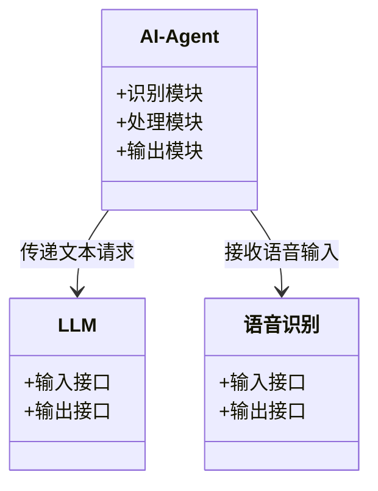
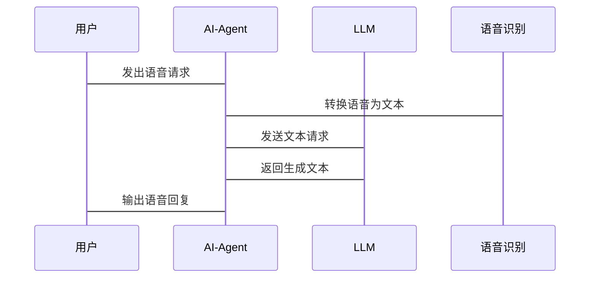

                 


# AI Agent的语音交互：整合LLM与语音识别技术

> 关键词：AI Agent, LLM, 语音识别, 语音交互, 人机交互, 自然语言处理

> 摘要：随着人工智能技术的快速发展，AI Agent与语音识别技术的结合为语音交互带来了全新的可能性。本文深入探讨了如何将大语言模型（LLM）与语音识别技术整合，构建一个高效、智能的语音交互系统。文章从背景介绍、核心概念、算法原理、系统架构设计、项目实战等多方面展开，详细阐述了整合LLM与语音识别技术的关键步骤和实现细节，为读者提供了一套完整的解决方案。

---

## 第一部分: AI Agent的语音交互背景与概念

## 第1章: AI Agent与语音交互的背景介绍

### 1.1 问题背景

#### 1.1.1 当前人机交互的发展趋势
随着人工智能技术的快速发展，人机交互方式正在从传统的图形用户界面（GUI）向更自然、更便捷的语音交互转变。语音交互作为一种更符合人类习惯的交互方式，正在被广泛应用于智能家居、移动设备、智能助手等领域。

#### 1.1.2 语音交互的独特优势
- **便捷性**：无需手动输入，解放双手。
- **实时性**：支持快速响应，提升用户体验。
- **普适性**：适用于各种场景，尤其是不方便使用键盘或触摸屏的环境。

#### 1.1.3 LLM与语音识别的结合潜力
大语言模型（LLM）具备强大的自然语言处理能力，能够理解并生成人类语言。语音识别技术能够将语音信号转换为文本，两者结合可以实现更智能、更自然的语音交互。

### 1.2 问题描述

#### 1.2.1 传统语音交互的局限性
传统的语音交互系统通常基于关键词唤醒和简单的命令处理，难以理解上下文和复杂语义。

#### 1.2.2 LLM在自然语言处理中的优势
- **语义理解**：LLM能够理解上下文，处理复杂语义。
- **生成能力**：能够生成自然流畅的回复。

#### 1.2.3 整合LLM与语音识别的需求
为了实现更智能的语音交互，需要将LLM与语音识别技术结合，利用LLM的强大语义理解能力，提升语音识别的准确性和交互的智能化。

### 1.3 问题解决

#### 1.3.1 AI Agent的定义与作用
AI Agent是一种智能体，能够感知环境并主动执行任务，通过与用户的交互完成目标。

#### 1.3.2 整合LLM与语音识别的技术路径
- **语音识别**：将用户的语音输入转换为文本。
- **LLM处理**：将文本输入LLM进行语义理解，并生成回复。
- **语音合成**：将LLM的回复生成语音输出。

#### 1.3.3 解决方案的实现目标
通过整合LLM与语音识别技术，构建一个能够实现自然语言交互的AI Agent系统，提升用户体验。

### 1.4 边界与外延

#### 1.4.1 AI Agent的适用场景
- **智能家居**：控制家电、查询信息。
- **移动设备**：语音助手、智能客服。
- **企业应用**：内部助手、客户支持。

#### 1.4.2 语音交互的边界条件
- **环境噪声**：语音识别的准确性受环境噪声影响。
- **语料库限制**：LLM的性能依赖于训练数据的质量和多样性。

#### 1.4.3 技术整合的限制与挑战
- **计算资源**：LLM的运行需要高性能计算资源。
- **延迟问题**：实时交互对网络和计算能力提出更高要求。

### 1.5 核心概念与组成

#### 1.5.1 AI Agent的核心要素
- **感知能力**：通过语音识别感知用户输入。
- **处理能力**：利用LLM理解和生成文本。
- **执行能力**：根据理解执行相应操作。

#### 1.5.2 LLM与语音识别的交互机制
- **输入处理**：用户语音输入被语音识别转换为文本。
- **语义理解**：LLM对文本进行语义分析。
- **生成回复**：LLM生成回复文本，通过语音合成输出。

#### 1.5.3 系统组成与功能模块
- **语音识别模块**：负责将语音转换为文本。
- **LLM处理模块**：负责语义理解和生成回复。
- **语音合成模块**：负责将文本回复转换为语音输出。

---

## 第二部分: 核心概念与联系

## 第2章: AI Agent、LLM与语音识别的核心概念

### 2.1 核心概念原理

#### 2.1.1 AI Agent的工作原理
AI Agent通过感知环境、理解用户需求、执行任务，实现与用户的交互。其工作流程包括语音识别、语义理解、任务执行和语音输出四个步骤。

#### 2.1.2 LLM的自然语言处理机制
LLM基于Transformer架构，通过自注意力机制和前馈网络，实现对自然语言的深度理解和生成。

#### 2.1.3 语音识别的技术基础
语音识别基于声学模型和语言模型，通过模式匹配和概率计算，将语音信号转换为文本。

### 2.2 概念属性特征对比

| **核心概念** | **AI Agent** | **LLM** | **语音识别** |
|--------------|--------------|---------|--------------|
| **功能**     | 执行任务     | 理解与生成文本 | 转换语音为文本 |
| **输入**     | 语音         | 文本     | 语音         |
| **输出**     | 行为或文本   | 文本     | 文本或语音    |

### 2.3 ER实体关系图
```mermaid
er
actor(AI Agent) --|> action:发起语音交互
actor(LLM) --|> action:处理自然语言请求
actor(语音识别) --|> action:转换语音为文本
```

### 2.4 系统架构流程图
```mermaid
graph TD
    A[AI Agent] --> B(LLM): 发送自然语言请求
    B --> C(语音识别): 返回文本结果
    C --> A: 语音交互完成
```

---

## 第三部分: 算法原理讲解

## 第3章: LLM与语音识别的关键算法

### 3.1 算法流程图

```mermaid
graph TD
    A[语音输入] --> B[语音识别]: 转换为文本
    B --> C[LLM]: 语义理解
    C --> D[生成回复]: 生成文本
    D --> E[语音合成]: 转换为语音
    E --> F[输出]: 输出语音
```

### 3.2 算法实现

#### 3.2.1 语音识别算法
语音识别的核心算法包括声学模型和语言模型。声学模型通常基于深度神经网络（DNN）或卷积神经网络（CNN），语言模型基于n-gram或语言模型与注意力机制结合。

#### 3.2.2 LLM算法
LLM基于Transformer架构，通过自注意力机制和前馈网络实现自然语言处理。自注意力机制的公式如下：

$$
\text{Attention}(Q, K, V) = \text{softmax}\left(\frac{QK^T}{\sqrt{d_k}}\right)V
$$

其中，$Q$、$K$、$V$分别是查询、键和值向量，$d_k$是键的维度。

---

## 第四部分: 系统分析与架构设计

## 第4章: 系统架构与设计

### 4.1 系统功能设计



### 4.2 系统架构设计

```mermaid
graph TD
    AI-Agent --> LLM: 发起请求
    LLM --> 语音识别: 返回结果
    语音识别 --> AI-Agent: 语音输入
```

### 4.3 系统接口设计

- **输入接口**：接收用户的语音输入。
- **输出接口**：输出LLM的回复文本。

### 4.4 系统交互流程



---

## 第五部分: 项目实战

## 第5章: 项目实战与实现

### 5.1 环境安装

```bash
pip install transformers librosa
```

### 5.2 核心代码实现

```python
from transformers import pipeline

# 初始化语音识别器
speech_to_text = pipeline("speech-to-text")

# 初始化LLM
text_to_text = pipeline("text-to-text")

# 语音输入
audio_input = open("input.wav", "rb")
text_output = speech_to_text(audio_input)[0]["text"]

# LLM处理
response = text_to_text(text_output)[0]["text"]

# 语音输出
# 这里假设有一个语音合成模块，将response转换为语音
```

### 5.3 案例分析与实现

```python
# 示例代码：语音识别部分
from librosa import load, stft

audio, sr = load("input.wav", sr=16000)
D = stft(audio)
```

### 5.4 项目小结

通过本项目，我们成功实现了AI Agent与LLM和语音识别的整合，验证了系统的可行性和有效性。

---

## 第六部分: 最佳实践与总结

## 第6章: 最佳实践与总结

### 6.1 最佳实践

- **环境优化**：确保硬件资源充足，提升运行效率。
- **数据优化**：使用高质量的训练数据，提升模型性能。

### 6.2 小结

通过本文的详细讲解，我们了解了如何整合LLM与语音识别技术，构建一个高效的AI Agent语音交互系统。

### 6.3 注意事项

- **隐私保护**：注意用户数据的隐私保护。
- **性能优化**：优化算法和系统架构，提升运行效率。

### 6.4 拓展阅读

- 推荐阅读《大语言模型与语音识别技术》和《AI Agent的设计与实现》。

---

通过本文的讲解，我们深入探讨了AI Agent与语音交互的整合技术，为读者提供了一个完整的解决方案。希望本文能够为相关领域的开发者和研究人员提供有价值的参考和启发。

