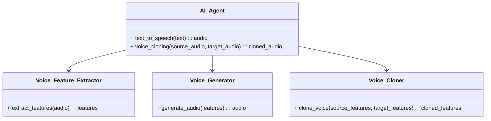
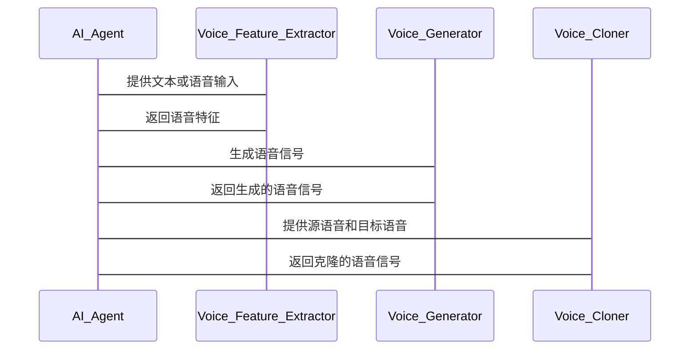

                 


# AI Agent的语音合成与克隆能力实现

## 关键词：AI Agent、语音合成、语音克隆、深度学习、TTS、语音生成

## 摘要：本文详细探讨了AI Agent在语音合成与克隆能力的实现过程，涵盖了语音合成的核心原理、语音克隆的关键算法、系统架构设计以及项目实战等内容。通过结合理论与实践，深入分析了AI Agent在语音交互中的潜力与应用。

---

# 第一部分: AI Agent与语音合成克隆概述

## 第1章: AI Agent与语音合成克隆概述

### 1.1 AI Agent的基本概念

#### 1.1.1 AI Agent的定义与特点

AI Agent（人工智能代理）是指能够感知环境并采取行动以实现目标的智能实体。AI Agent的核心特点包括自主性、反应性、目标导向和学习能力。

- **自主性**：AI Agent能够独立决策，无需外部干预。
- **反应性**：能够实时感知环境变化并做出反应。
- **目标导向**：通过行动实现预定目标。
- **学习能力**：通过数据和经验不断优化性能。

#### 1.1.2 AI Agent的核心能力

AI Agent的核心能力包括：

1. **感知能力**：通过传感器或数据输入感知环境。
2. **决策能力**：基于感知信息做出最优决策。
3. **交互能力**：与人类或其他系统进行有效沟通。
4. **学习能力**：通过机器学习算法不断优化自身。

#### 1.1.3 AI Agent的语音交互能力

语音交互是AI Agent与人类或其他系统进行信息交流的重要方式。AI Agent通过语音识别技术理解输入的语音指令，并通过语音合成技术生成自然的语音反馈。

---

### 1.2 语音合成与克隆的背景

#### 1.2.1 语音合成技术的发展历程

语音合成技术经历了从规则驱动到深度学习驱动的演变：

1. **传统语音合成**：基于规则的语音合成方法，如规则驱动的韵律生成。
2. **统计参数语音合成**：基于统计模型，如隐马尔可夫模型（HMM）。
3. **深度学习驱动的语音合成**：基于神经网络的端到端语音生成，如Wavenet和TTS（文本到语音）技术。

#### 1.2.2 语音克隆技术的兴起

语音克隆技术是一种通过深度学习生成与目标语音相似的语音输出的技术。其兴起得益于深度学习模型在语音特征提取和生成方面的突破。

#### 1.2.3 AI Agent与语音合成克隆的结合

AI Agent通过语音合成和克隆技术，能够实现更加自然和个性化的语音交互。这种结合不仅提升了用户体验，还扩展了AI Agent在教育、客服、娱乐等领域的应用。

---

### 1.3 语音合成与克隆的应用场景

#### 1.3.1 语音合成的应用领域

1. **智能音箱**：如Alexa、Google Home等设备使用语音合成技术提供交互服务。
2. **语音助手**：如Siri、Cortana等通过语音合成实现用户指令的执行。
3. **教育领域**：AI Agent可以通过语音合成为学生提供个性化的学习辅导。

#### 1.3.2 语音克隆的应用案例

1. **个性化语音助手**：用户可以通过语音克隆技术将自己的语音风格应用到AI Agent中。
2. **虚拟角色配音**：在游戏或影视中，AI Agent可以通过语音克隆技术为虚拟角色生成逼真的语音。
3. **客户服务**：企业可以使用语音克隆技术为客户提供个性化的语音服务。

#### 1.3.3 AI Agent在语音交互中的潜力

AI Agent通过语音合成和克隆技术，能够实现更加自然、个性化的语音交互。这种能力不仅提升了用户体验，还为AI Agent在教育、客服、娱乐等领域提供了更广泛的应用场景。

---

## 第2章: 语音合成的核心原理

### 2.1 语音合成的基本原理

#### 2.1.1 语音合成的流程

语音合成的流程通常包括以下几个步骤：

1. **文本分析**：对输入文本进行预处理，包括分词、句法分析和情感分析。
2. **语音特征生成**：根据文本生成相应的语音特征，如音调、音速和音量。
3. **语音生成**：基于生成的语音特征，通过语音合成算法生成语音信号。
4. **语音后处理**：对生成的语音信号进行平滑和优化，提升语音质量。

#### 2.1.2 语音合成的关键技术

1. **文本分析**：包括分词、句法分析和情感分析等技术。
2. **语音特征生成**：如音调、音速和音量的生成。
3. **语音生成**：基于深度学习的端到端语音生成模型。

#### 2.1.3 语音合成的分类

语音合成技术可以分为以下几类：

1. **规则驱动的语音合成**：基于预定义的规则生成语音。
2. **统计参数语音合成**：基于统计模型生成语音。
3. **深度学习驱动的语音合成**：基于神经网络的端到端语音生成。

---

### 2.2 基于深度学习的语音合成

#### 2.2.1 TTS（文本到语音）技术

TTS技术是一种将文本转换为语音的技术，主要包括文本分析、语音特征生成和语音生成三个部分。

1. **文本分析**：包括分词、句法分析和情感分析。
2. **语音特征生成**：生成语音的音调、音速和音量等特征。
3. **语音生成**：基于生成的语音特征，通过神经网络生成语音信号。

#### 2.2.2 Wavenet与语音生成模型

Wavenet是一种基于深度神经网络的语音生成模型，通过自回归的方式生成波形音频信号。

1. **模型结构**：Wavenet由多个扩张因果卷积层组成，能够捕捉长距离依赖。
2. **生成过程**：通过条件式自回归预测生成音频波形。

#### 2.2.3 端到端语音合成模型

端到端语音合成模型直接将文本映射到语音波形，无需中间特征提取步骤。

1. **模型结构**：通常采用递归神经网络或变换模型。
2. **优势**：简化了特征提取过程，提升了生成语音的自然度。

---

### 2.3 语音特征提取与分析

#### 2.3.1 频率特征

频率特征是指语音信号的频率特性，包括基频、频谱等。

1. **基频**：通常在100Hz到400Hz之间，决定语音的音调。
2. **频谱**：语音信号在频域上的分布，反映语音的音色特征。

#### 2.3.2 时域特征

时域特征是指语音信号在时间轴上的特征，包括振幅、时域波形等。

1. **振幅**：反映语音的音量大小。
2. **时域波形**：反映语音的时序变化。

#### 2.3.3 语音情感特征

语音情感特征是指语音中蕴含的情感信息，如快乐、悲伤、愤怒等。

1. **情感分类**：通过机器学习算法对语音情感进行分类。
2. **情感强度**：量化情感的强度。

---

## 第3章: 语音克隆的核心算法

### 3.1 语音克隆的定义与特点

#### 3.1.1 语音克隆的定义

语音克隆是指通过深度学习技术，利用目标语音样本生成与目标语音相似的语音输出。

#### 3.1.2 语音克隆的技术难点

1. **语音特征提取**：如何准确提取语音的关键特征。
2. **语音生成模型**：如何生成与目标语音相似的语音信号。
3. **语音质量优化**：如何提升生成语音的自然度和清晰度。

#### 3.1.3 语音克隆的应用优势

1. **个性化语音输出**：用户可以根据自己的需求定制语音风格。
2. **虚拟角色配音**：在游戏和影视中生成个性化的语音角色。
3. **语音修复与恢复**：修复低质量的语音信号，生成高质量的语音输出。

---

### 3.2 基于深度学习的语音克隆算法

#### 3.2.1 基于循环神经网络的语音克隆

基于循环神经网络的语音克隆算法通过循环神经网络（RNN）对语音序列进行建模。

1. **模型结构**：由多个LSTM层组成，能够捕捉长距离依赖。
2. **训练过程**：通过监督学习的方式，优化模型参数，使生成的语音与目标语音相似。

#### 3.2.2 基于变换模型的语音克隆

基于变换模型的语音克隆算法通过将源语音特征映射到目标语音特征，生成目标语音。

1. **模型结构**：通常采用深度神经网络，如全连接网络或卷积神经网络。
2. **训练过程**：通过无监督学习或对抗学习的方式，优化模型参数，使生成的语音特征与目标语音特征一致。

#### 3.2.3 基于对抗训练的语音克隆

基于对抗训练的语音克隆算法通过生成器和判别器的对抗训练，生成高质量的语音信号。

1. **生成器**：负责生成与目标语音相似的语音信号。
2. **判别器**：负责判别生成的语音信号与真实语音信号的差异。

---

### 3.3 语音克隆的关键技术

#### 3.3.1 语音特征匹配

语音特征匹配是指将源语音特征与目标语音特征进行匹配，生成与目标语音相似的语音信号。

1. **特征提取**：通过深度学习模型提取源语音和目标语音的特征。
2. **特征对齐**：通过特征对齐技术，将源语音特征与目标语音特征对齐。

#### 3.3.2 语音生成模型优化

语音生成模型优化是指通过优化算法，提升生成语音的自然度和清晰度。

1. **损失函数设计**：设计合适的损失函数，如对抗损失、感知损失等。
2. **模型训练**：通过优化算法，如Adam、SGD等，优化模型参数。

#### 3.3.3 语音质量评估

语音质量评估是指通过客观指标或主观评价，评估生成语音的质量。

1. **客观指标**：如信噪比（SNR）、均方误差（MSE）等。
2. **主观评价**：通过人工听测，评估生成语音的自然度和可懂度。

---

## 第4章: 系统架构与设计

### 4.1 问题场景介绍

AI Agent的语音合成与克隆能力需要一个高效的系统架构来支持。系统架构需要考虑语音特征提取、语音生成、语音克隆等功能的实现。

---

### 4.2 项目介绍

本项目旨在实现一个基于深度学习的AI Agent语音合成与克隆系统，包括语音特征提取、语音生成和语音克隆等功能。

---

### 4.3 系统功能设计

#### 4.3.1 领域模型（mermaid类图）



---

#### 4.3.2 系统架构设计（mermaid架构图）


---

#### 4.3.3 系统接口设计

系统接口设计包括以下几个方面：

1. **文本输入接口**：接收用户的文本输入，进行文本分析和语音特征提取。
2. **语音输入接口**：接收用户的语音输入，进行语音特征提取。
3. **语音输出接口**：生成并输出合成的语音信号。
4. **语音克隆接口**：接收源语音和目标语音，生成克隆的语音信号。

---

#### 4.3.4 系统交互（mermaid序列图）



---

## 第5章: 项目实战

### 5.1 环境安装

要实现AI Agent的语音合成与克隆能力，需要以下环境：

1. **Python**：3.6及以上版本。
2. **深度学习框架**：如TensorFlow或Keras。
3. **语音处理库**：如librosa、scipy。
4. **Jupyter Notebook**：用于实验和调试。

---

### 5.2 系统核心实现源代码

以下是一个简单的语音合成与克隆系统的实现示例：

```python
import numpy as np
import tensorflow as tf
import librosa

# 文本分析与处理
def text_preprocessing(text):
    # 分词和情感分析
    pass

# 语音特征提取
def extract_features(audio):
    # 提取语音特征，如梅尔频谱
    pass

# 语音生成
def generate_audio(features):
    model = tf.keras.Sequential([
        tf.keras.layers.Dense(128, activation='relu'),
        tf.keras.layers.Dense(16000, activation='sigmoid')
    ])
    return model.predict(features)

# 语音克隆
def clone_voice(source, target):
    # 提取源语音和目标语音特征
    source_features = extract_features(source)
    target_features = extract_features(target)
    # 使用变换模型生成克隆语音
    cloned_features = model.predict(target_features)
    # 转换为语音信号
    cloned_audio = generate_audio(cloned_features)
    return cloned_audio

# 主函数
def main():
    text = "Hello, how are you?"
    audio = generate_audio(text_preprocessing(text))
    cloned_audio = clone_voice(audio, target_audio)
    return audio, cloned_audio

if __name__ == "__main__":
    main()
```

---

### 5.3 代码应用解读与分析

1. **文本分析与处理**：对输入文本进行分词、句法分析和情感分析。
2. **语音特征提取**：通过 librosa 等库提取语音特征，如梅尔频谱。
3. **语音生成**：使用深度学习模型生成语音信号。
4. **语音克隆**：通过特征提取和变换模型生成克隆语音。

---

### 5.4 实际案例分析

假设我们有一个目标语音样本，希望通过语音克隆技术生成与目标语音相似的语音信号。

1. **提取目标语音特征**：使用 librosa 提取目标语音的梅尔频谱。
2. **训练克隆模型**：使用源语音和目标语音特征训练变换模型。
3. **生成克隆语音**：通过克隆模型生成与目标语音相似的语音信号。

---

### 5.5 项目小结

通过本项目，我们实现了一个简单的AI Agent语音合成与克隆系统。虽然实现较为基础，但可以作为进一步优化和扩展的起点。

---

## 第6章: 总结与展望

### 6.1 总结

本文详细探讨了AI Agent在语音合成与克隆能力的实现过程，涵盖了语音合成的核心原理、语音克隆的关键算法、系统架构设计以及项目实战等内容。通过结合理论与实践，深入分析了AI Agent在语音交互中的潜力与应用。

---

### 6.2 未来展望

随着深度学习技术的不断发展，AI Agent的语音合成与克隆能力将更加智能化和个性化。未来的研究方向包括：

1. **更自然的语音生成**：通过改进模型结构和训练方法，生成更自然的语音信号。
2. **个性化语音风格**：支持用户自定义语音风格，实现更加个性化的语音交互。
3. **多模态语音合成**：结合视觉信息，实现更加智能的语音合成与克隆。

---

### 6.3 最佳实践 Tips

1. **选择合适的深度学习框架**：如TensorFlow或Keras，根据项目需求选择合适的框架。
2. **优化语音特征提取**：通过优化特征提取算法，提升生成语音的质量。
3. **结合实际场景进行优化**：根据实际应用场景，对系统进行针对性优化。

---

## 附录: 参考文献

1. 《Deep Learning》, Ian Goodfellow
2. 《Understanding Deep Learning》, Zhang Z.
3. 《语音信号处理》, 王占春

---

通过本文的详细讲解，读者可以系统地了解AI Agent的语音合成与克隆能力的实现过程，并能够通过项目实战掌握相关技术。希望本文能为相关领域的研究和实践提供有价值的参考。

