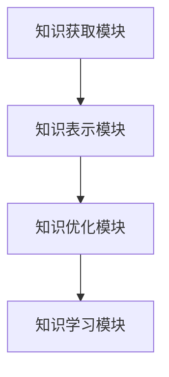
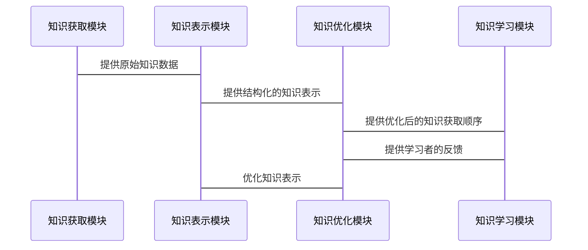

                 


# AI Agent的课程学习：优化知识获取的顺序和策略

## 关键词：AI Agent、课程学习、知识表示、学习策略、优化算法、系统架构

## 摘要：AI Agent通过优化知识获取的顺序和策略，能够更高效地进行学习和决策。本文将从AI Agent的基本概念、知识表示与学习策略、优化算法原理、系统架构设计、项目实战案例等多个方面进行详细讲解，结合理论与实践，帮助读者全面理解AI Agent的课程学习优化方法。

---

# 目录

## 第1章: AI Agent与课程学习概述

### 1.1 AI Agent的基本概念
#### 1.1.1 AI Agent的定义与特点
- 定义：AI Agent是具有感知、推理和行动能力的智能体。
- 特点：自主性、反应性、目标导向、学习能力。

#### 1.1.2 课程学习的基本概念
- 课程学习的定义：通过优化知识获取顺序和策略，提高学习效率和效果。
- 课程学习的核心问题：知识的表示与关联、学习顺序的优化。

#### 1.1.3 AI Agent与课程学习的结合
- AI Agent在课程学习中的角色：知识管理、学习路径规划、自适应学习。

### 1.2 AI Agent的知识表示
#### 1.2.1 知识表示的定义与方法
- 知识表示的定义：将知识以结构化或语义化的形式表示出来。
- 知识表示的方法：符号表示、向量表示、图表示。

#### 1.2.2 知识图谱与表示学习
- 知识图谱的定义：将知识以图结构表示，节点表示实体，边表示关系。
- 表示学习的目标：将知识图谱中的节点表示为低维向量，便于计算和推理。

#### 1.2.3 知识表示的优缺点对比
- 符号表示的优点：清晰、可解释性强；缺点：难以处理复杂关系。
- 向量表示的优点：适用于机器学习模型；缺点：可解释性差。
- 图表示的优点：能够表示复杂的语义关系；缺点：计算复杂度高。

### 1.3 课程学习的优化目标
#### 1.3.1 优化目标的定义
- 知识获取效率最大化：在有限时间内获取最有价值的知识。
- 知识理解深度最大化：通过优化顺序，使知识之间相互关联，提高理解深度。
- 学习策略的可调整性：根据学习者的反馈，动态调整知识获取顺序和策略。

#### 1.3.2 知识获取顺序的优化
- 优先级排序：根据知识的重要性、相关性和学习者的认知特点，确定知识获取的优先级。
- 动态调整：在学习过程中，根据反馈信息动态调整知识获取顺序。

#### 1.3.3 知识策略的优化
- 基于规则的策略：根据预先定义的规则，制定知识获取策略。
- 基于数据的策略：通过数据分析，找到最优的知识获取路径。
- 基于模型的策略：利用机器学习模型预测最佳的知识获取顺序。

### 1.4 本章小结
- 本章介绍了AI Agent的基本概念、知识表示方法以及课程学习的优化目标，为后续章节奠定了基础。

---

## 第2章: AI Agent的知识表示与学习策略

### 2.1 知识表示的核心要素
#### 2.1.1 知识的结构化表示
- 知识的结构化表示方法：层次化结构、树状结构、图状结构。
- 示例：将一本书的知识点按照章节和小节进行结构化表示。

#### 2.1.2 知识的语义表示
- 语义表示的目标：将知识的含义以可计算的方式表示出来。
- 常见的语义表示方法：词向量、句向量、段落向量。

#### 2.1.3 知识的关联性分析
- 知识关联性分析的定义：分析不同知识点之间的关联性，构建知识网络。
- 知识关联性分析的方法：基于统计的方法、基于语义的方法、基于图论的方法。

### 2.2 学习策略的分类
#### 2.2.1 基于规则的学习策略
- 规则的定义：根据预先定义的规则，制定知识获取策略。
- 示例：优先学习基础知识点，然后再学习高级知识点。

#### 2.2.2 基于数据的学习策略
- 数据驱动的策略：通过数据分析，找到最优的知识获取路径。
- 示例：根据学习者的学习情况，动态调整知识获取顺序。

#### 2.2.3 基于模型的学习策略
- 模型驱动的策略：利用机器学习模型预测最佳的知识获取顺序。
- 示例：使用强化学习模型，根据学习者的反馈，动态调整知识获取策略。

### 2.3 知识获取顺序的优化方法
#### 2.3.1 基于优先级的知识排序
- 优先级排序的方法：根据知识的重要性、相关性和学习者的认知特点，确定知识获取的优先级。
- 示例：将知识点的重要性作为优先级排序的依据。

#### 2.3.2 基于反馈的知识调整
- 反馈的定义：根据学习者的反馈，动态调整知识获取顺序。
- 示例：学习者对某个知识点的掌握程度较高时，可以适当延后学习相关知识点。

#### 2.3.3 基于目标的知识路径规划
- 知识路径规划的定义：根据学习目标，制定最优的知识获取路径。
- 示例：为了达到某个学习目标，优先学习与该目标相关的知识点。

### 2.4 本章小结
- 本章详细讲解了知识表示的核心要素以及学习策略的分类，重点介绍了知识获取顺序的优化方法。

---

## 第3章: AI Agent的知识优化算法原理

### 3.1 知识优化的核心算法
#### 3.1.1 贪心算法
- 贪心算法的定义：每次选择当前最优的解决方案，最终达到全局最优。
- 示例：在知识获取顺序优化中，优先选择当前最有价值的知识点。

#### 3.1.2 强化学习算法
- 强化学习算法的定义：通过试错学习，找到最优的行动策略。
- 示例：在知识获取顺序优化中，根据学习者的反馈，动态调整知识获取策略。

#### 3.1.3 进化算法
- 进化算法的定义：通过模拟生物进化过程，找到最优的解决方案。
- 示例：在知识获取顺序优化中，通过基因重组和变异，找到最优的知识获取路径。

### 3.2 算法原理的数学模型
#### 3.2.1 贪心算法的数学模型
- 目标函数：$$ \text{目标函数} = \sum_{i=1}^{n} w_i x_i $$
- 其中，$w_i$ 是知识点 $i$ 的权重，$x_i$ 是知识点 $i$ 的优先级。

#### 3.2.2 强化学习算法的数学模型
- 奖励函数：$$ R(s, a) = r + \gamma \max_{a'} Q(s', a') $$
- 其中，$s$ 是当前状态，$a$ 是动作，$r$ 是即时奖励，$\gamma$ 是折扣因子，$Q(s', a')$ 是下一状态的动作价值。

#### 3.2.3 进化算法的数学模型
-适应度函数：$$ f(x) = \sum_{i=1}^{m} w_i x_i $$
- 其中，$x_i$ 是知识点 $i$ 的适应度值，$w_i$ 是知识点 $i$ 的权重。

### 3.3 算法实现的Python代码示例
#### 3.3.1 贪心算法的Python实现
```python
def greedy_algorithm(weights, values):
    total = 0
    for w, v in zip(weights, values):
        total += w * v
    return total
```

#### 3.3.2 强化学习算法的Python实现
```python
import numpy as np

def reinforce_algorithm(states, actions, rewards, gamma=0.9):
    value = np.zeros(len(states))
    for i in range(len(states)):
        for j in range(len(actions)):
            next_state = states[(i + j) % len(states)]
            value[i] += rewards[i][j] + gamma * value[next_state]
    return value
```

#### 3.3.3 进化算法的Python实现
```python
import random

def evolve_algorithm(population, fitness, mutation_rate=0.1):
    for i in range(len(population)):
        if random.random() < mutation_rate:
            population[i] = mutate(population[i])
    return population
```

### 3.4 本章小结
- 本章详细讲解了知识优化的核心算法，包括贪心算法、强化学习算法和进化算法，并给出了具体的Python实现代码。

---

## 第4章: AI Agent的知识优化系统架构

### 4.1 系统功能设计
#### 4.1.1 知识获取模块
- 功能：从多种数据源获取知识，如书籍、网页、视频等。
- 输入：学习目标、学习者的背景知识。
- 输出：结构化的知识表示。

#### 4.1.2 知识表示模块
- 功能：将获取的知识转化为可计算的表示形式，如向量、图结构等。
- 输入：原始知识数据。
- 输出：结构化的知识表示。

#### 4.1.3 知识优化模块
- 功能：根据学习目标和学习者的反馈，优化知识获取顺序和策略。
- 输入：知识表示、学习目标、学习者反馈。
- 输出：优化后的知识获取顺序。

#### 4.1.4 知识学习模块
- 功能：根据优化后的知识获取顺序，指导学习者进行学习。
- 输入：优化后的知识获取顺序。
- 输出：学习者的知识掌握情况。

### 4.2 系统架构设计
#### 4.2.1 系统架构的定义
- 系统架构：模块化的系统设计，各模块协同工作，完成知识优化的任务。

#### 4.2.2 系统架构的mermaid图


### 4.3 系统接口设计
#### 4.3.1 知识获取模块接口
- 输入接口：学习目标、学习者背景知识。
- 输出接口：结构化的知识表示。

#### 4.3.2 知识优化模块接口
- 输入接口：知识表示、学习目标、学习者反馈。
- 输出接口：优化后的知识获取顺序。

### 4.4 系统交互的mermaid序列图


### 4.5 本章小结
- 本章详细讲解了AI Agent的知识优化系统的功能设计和架构设计，并给出了系统的mermaid图和接口设计。

---

## 第5章: 项目实战——个性化学习路径优化

### 5.1 项目背景与目标
- 项目背景：个性化学习路径优化是课程学习的重要应用之一。
- 项目目标：根据学习者的背景和学习目标，制定个性化的知识获取顺序。

### 5.2 环境安装与配置
#### 5.2.1 系统环境
- 操作系统：Linux/Windows/MacOS
- Python版本：3.6+

#### 5.2.2 工具安装
- Python库：numpy, pandas, scikit-learn, matplotlib
- 其他工具：Jupyter Notebook, VS Code

### 5.3 核心实现代码
#### 5.3.1 知识表示代码
```python
import numpy as np

def knowledge_representation(knowledge_data):
    # 将知识数据转化为向量表示
    vectors = []
    for data in knowledge_data:
        vector = []
        for feature in data:
            vector.append(feature)
        vectors.append(vector)
    return vectors
```

#### 5.3.2 知识优化代码
```python
def knowledge_optimization(vectors, learning_objective):
    # 根据学习目标优化知识获取顺序
    optimized_order = []
    for i in range(len(vectors)):
        # 计算每个知识点与学习目标的相关性
        relevance = np.dot(vectors[i], learning_objective)
        optimized_order.append((i, relevance))
    # 按相关性排序
    optimized_order.sort(key=lambda x: -x[1])
    # 提取排序后的索引
    optimized_order = [x[0] for x in optimized_order]
    return optimized_order
```

#### 5.3.3 学习路径生成代码
```python
def learning_path(optimized_order, knowledge_data):
    # 根据优化后的顺序生成学习路径
    path = []
    for idx in optimized_order:
        path.append(knowledge_data[idx])
    return path
```

### 5.4 项目案例分析
#### 5.4.1 案例背景
- 学习者：一名大学生，目标是学习机器学习。
- 知识点：线性代数、概率统计、机器学习算法、深度学习。

#### 5.4.2 知识表示与优化
- 知识点向量化表示：将每个知识点表示为一个向量。
- 知识优化：根据学习目标，优化知识获取顺序。

#### 5.4.3 学习路径生成
- 优化后的顺序：概率统计 → 线性代数 → 机器学习算法 → 深度学习。

### 5.5 项目小结
- 本项目通过个性化学习路径优化，帮助学习者更高效地掌握知识。

---

## 第6章: 总结与展望

### 6.1 本章总结
- 本文详细讲解了AI Agent的课程学习优化方法，包括知识表示、学习策略、优化算法和系统架构设计。

### 6.2 未来展望
- 知识优化的深度学习方法：结合深度学习模型，进一步提高知识优化的效率和效果。
- 多模态知识表示：将文本、图像、视频等多种模态的知识进行融合，提高知识表示的丰富性。
- 个性化学习的进一步优化：根据学习者的认知特点和学习风格，制定更加个性化的学习路径。

### 6.3 最佳实践 tips
- 在实际应用中，建议结合具体场景选择合适的知识表示方法和优化算法。
- 定期评估和优化学习策略，以适应学习者的反馈和知识环境的变化。

### 6.4 本章小结
- 本章总结了全文的主要内容，并展望了未来的研究方向，同时给出了实际应用中的最佳实践建议。

---

# 结语

通过本篇文章的详细讲解，读者可以全面理解AI Agent的课程学习优化方法，包括知识表示、学习策略、优化算法和系统架构设计。希望本文能够为AI Agent的课程学习研究和应用提供有价值的参考。

--- 

**附录**

- 附录A: 常见的优化算法对比表
- 附录B: 系统架构的详细设计文档
- 附录C: 项目实现的完整代码

